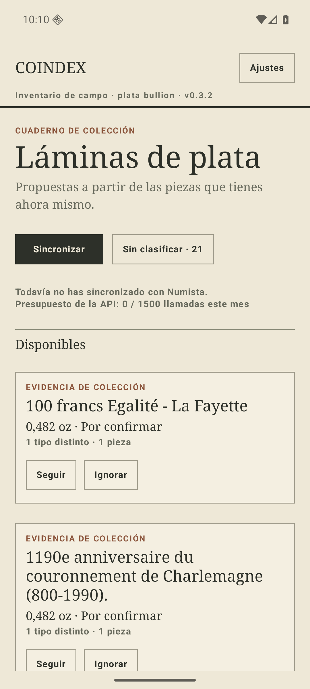
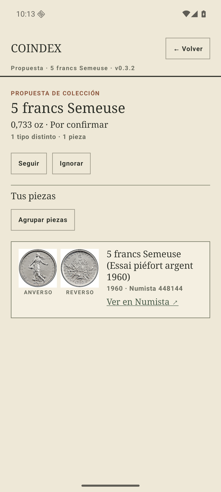
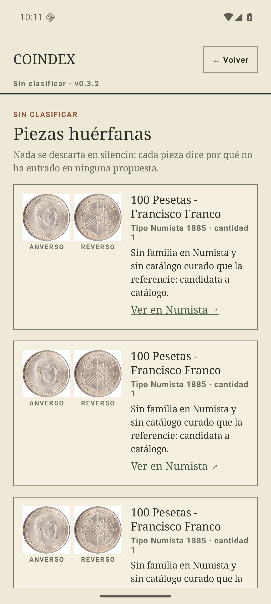
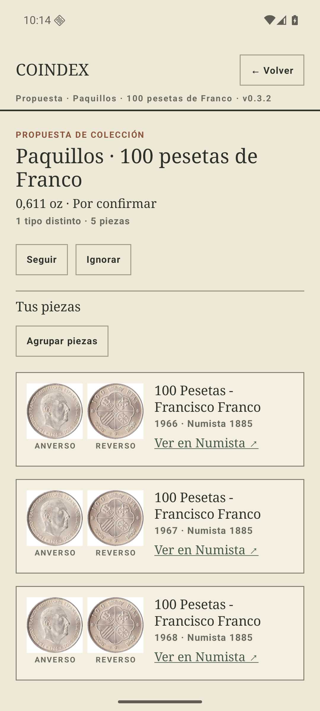
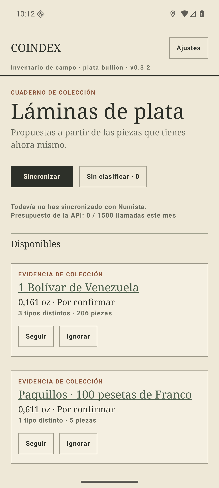
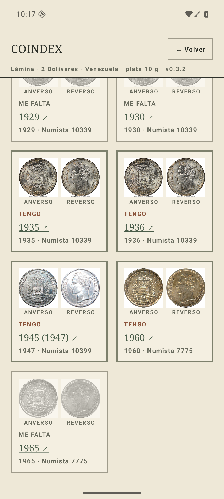
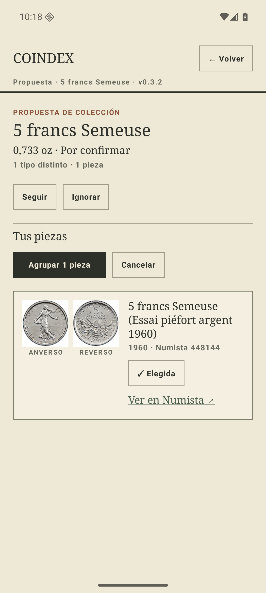
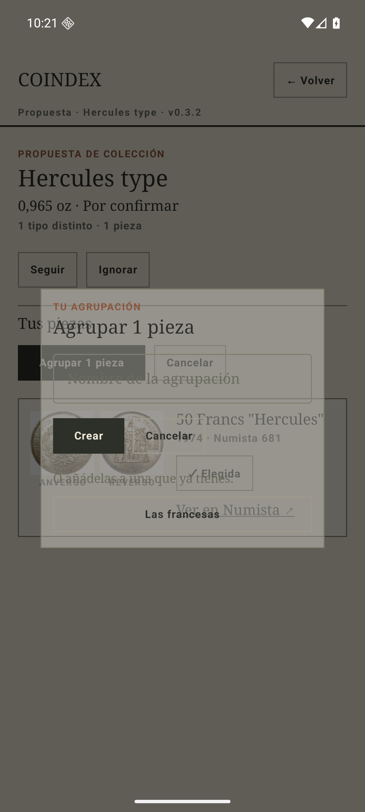
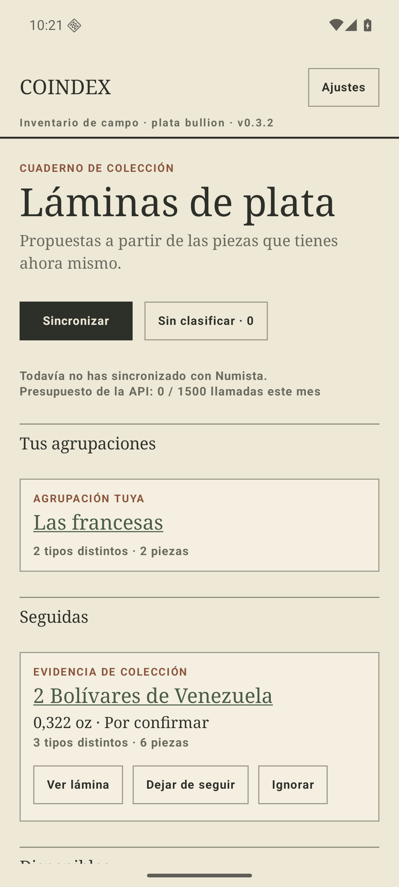
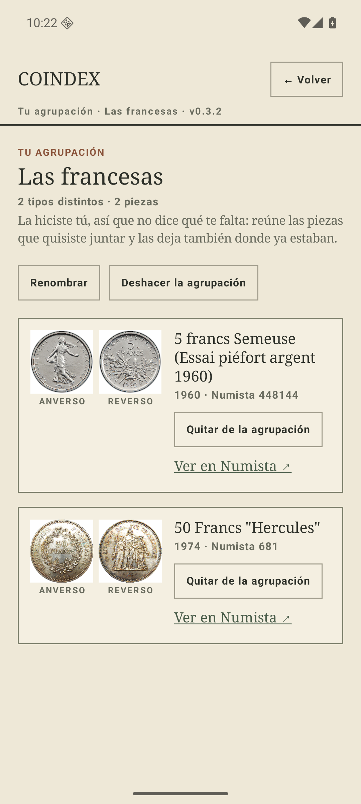

# Agrupaciones que faltaban y ventanas que no se abrían · 30 jul 2026

Lo que pidió el coleccionista tras usar la v0.3.2, literal: que los paquillos «se agrupen y
aparezcan los 5», que se agrupen «las monedas de Venezuela… medios reales y dos bolívares», un
«botón para agrupaciones custom», y un bug: «sigue habiendo ventanas que no se abren, casi todas
las francesas».

Las tres peticiones son el mismo hueco: **81 de los 608 tipos cacheados no tienen `series` en
Numista**, así que no hay familia por la que agruparlos y viven en «Sin clasificar» para
siempre. Ahí estaban el N#1885 (los paquillos) y toda la plata venezolana de curso legal menos
los 5 bolívares. El razonamiento y la escalera de precedencia están en
[ADR 0013](../adr/0013-curated-groupings.md).

Todas las capturas son del AVD `coindex-ux` con un inventario de humo de 32 filas sembrado por
SQL, sin gastar una sola llamada de la API.

## 1. El bug: títulos que no abrían nada

El título de una tarjeta solo era pulsable si existía un catálogo curado para su variante
exacta. Sin catálogo era un `Text` muerto. Cada moneda francesa tiene su propia `series`
(«Hercules type», «French regions», «100 francs Egalité - La Fayette») y ninguna tiene catálogo:
tarjetas idénticas a las demás que no hacían nada. Comprobado pulsando el título en la v0.3.2 —
la captura de después de pulsar es **byte a byte idéntica** a la de antes.

Ahora el título abre siempre la propuesta, y la propuesta enseña las piezas que tienes.

| Antes: la francesa no abre nada | Después: su ventana |
| --- | --- |
|  |  |

La lámina y la fuente en Numista dejan de colgar del título: la lámina baja a ser una acción de
la tarjeta («Ver lámina», solo cuando de verdad se puede abrir) y la fuente vive dentro de la
ventana. El título ya no tiene dos destinos posibles según lo que exista.

## 2. Los paquillos, con los cinco

`data/groupings/espana-100-pesetas-franco.json` les da familia, y la ventana lista las filas.
Antes las cinco eran indistinguibles («Tipo Numista 1885 · cantidad 1», cinco veces); ahora cada
una dice su año, que es lo único que las diferencia.

| Antes: huérfanas e iguales | Después: los cinco años |
| --- | --- |
|  |  |

**Esta captura es también una pregunta abierta.** Numista indexa el año de *acuñación*, no el de
la moneda (el N#10398 está fechado 1945 y Numista lo data en 1947), y que una fila de paquillo
lleve la estrella como año no está verificado contra datos reales: en esta captura los años son
los del inventario de humo. La primera captura del teléfono de su padre lo resuelve, y de ahí
depende que un date run de las cinco estrellas sea honesto o sea mentira.

## 3. Venezuela, una tarjeta por denominación de plata

Cuatro agrupaciones —medios (¼ Bs + 25 cts), reales (50 cts), 1 bolívar— y un catálogo date-run
para los 2 bolívares, que es su proyecto de cierre. Con el inventario de humo, «Sin clasificar»
baja de 21 a **0**.

| Antes | Después |
| --- | --- |
|  |  |

Los 2 bolívares son 25 emisiones repartidas en tres tipos (N#10339 con 22 años, N#10399 y
N#7775), todos de 10 g, así que comparten variante y caben en una sola lámina. El hueco de 1965
—el que persigue— sale en gris al final:



Las de granel no llevan date run a propósito: 102 monedas en una fila llevan **un** año, y un
date run sobre ellas diría «te faltan cinco años» teniéndolos. Por eso los medios, los reales y
el 1 bolívar solo agrupan.

## 4. El botón: agrupaciones propias

Desde «Sin clasificar» y desde cualquier propuesta: «Agrupar piezas» → elegir → ponerle nombre,
o añadirlas a una que ya tengas. Se guardan en el teléfono y son **vista extra**: la pieza sigue
donde estaba.

| Elegir piezas | Nombrarla o añadirla |
| --- | --- |
|  |  |

| En el índice, tras reiniciar en frío | Su ventana |
| --- | --- |
|  |  |

Las dos francesas agrupadas siguen apareciendo además en sus propias propuestas: agrupar no mueve
nada de sitio.

## 5. La migración, probada sobre datos reales

Las agrupaciones propias necesitan dos tablas nuevas, así que la base sube a la versión 2. La
prueba no es un test: se instaló el **APK publicado** (`build/release/coindex-7.apk`, base v1),
se sembró el inventario, y encima se instaló el release nuevo.

```
PRAGMA user_version → 2
SELECT COUNT(*) FROM collected_items → 32     (las mismas 32)
SELECT COUNT(*) FROM type_meta       → 608    (las mismas 608)
sqlite_master → own_groupings, own_grouping_members
```

Nada de `fallbackToDestructiveMigration`: al otro lado hay una colección que costó presupuesto
de API y un cache de fichas que no se vuelve a pedir nunca. `MigrationSqlTest` compara además el
SQL escrito a mano con el que Room exporta de las entidades, que es la forma en que estas
migraciones se rompen.

## Lo que no está aquí

- **El árbol** (tronco país → ramas por curso legal y conmemorativas) que se le ocurrió a su
  padre: es idea, no petición, y queda fuera. Cuando se decida es barato: `TypeMetaEntity.raw`
  ya guarda `object_type.name` («Monedas circulantes normales», «Monedas no circulantes»,
  «Medallas conmemorativas»), `category` e `issuer.name` en español, así que no cuesta ni una
  llamada.
- El P2 (#8) sigue pendiente.
- Los 333 bolívares a granel siguen sin concepto de «lote».
