# La mancha y el eje: dos ejes del cuaderno, no dos pantallas

La respuesta del [#315](https://github.com/jenarvaezg/coindex/issues/315), decidida el 8 de agosto de
2026 sobre prototipos en HTML a tamaño de móvil real (411 × 914 dp, los del Pixel 7 del
[#296](https://github.com/jenarvaezg/coindex/issues/296)), con las dos colecciones reales corridas
por el dominio de verdad — `Curation.assemble` y `buildCollectionCatalogAlbum` sobre las capturas del
5 de agosto, no un cruce de JSON a mano.

**La colección entera de una vez no es una pantalla nueva: es el cuaderno con otro eje.** La mancha
de países y el eje de años son dos órdenes de la misma hoja de álbum, elegidos en el estante plegado
que la app ya tiene (ADR 0021 §1). **El primer nivel no crece**: la barra de jerarquías sigue siendo
dos mitades de una raya, «Colecciones · 69» y «Monedas · 192».

## Antes de dibujar: tres premisas del ticket estaban mal

El ticket decía «1177 casillas en 73 catálogos; al padre le faltan 815 (69 %) y tiene 16 láminas
completas». Medido con el dominio:

| | catálogos suyos | casillas medibles | tiene | le faltan | láminas a n/n |
| --- | ---: | ---: | ---: | ---: | ---: |
| **padre** | 49 | **678** | 164 (24 %) | **514** | **6** |
| **Jose** | 43 | **804** | 55 (7 %) | **749** | **0** |

La estantería entera son **1170** casillas medibles en 74 catálogos, más 10 anunciadas. El **815** era
la cifra de Jose y no la del padre, y las **16 completas no son de ninguno de los dos**: es el error
de cruzar catálogos sin la regla de año de `memberMatches`, el mismo que ya había dado 14 en vez de 6.

**La asimetría rusa que el ticket temía es de Jose, no del padre.** `russie` son 276 casillas de las
que tiene 3, y sus tres láminas rusas aportan **273 huecos: el 36 %** de sus 749. El padre no tiene
ni un catálogo ruso; sus cuatro mayores son Capitales de provincia (51), Onza Libertad (43), Silver
Eagle (39) y Kookaburra (36), y **ninguno pasa del 10 %**. En piezas es al revés: **356 de las 574
del padre son venezolanas (62 %)** y **210 son del año 1960** — el 37 % de todo lo que tiene.

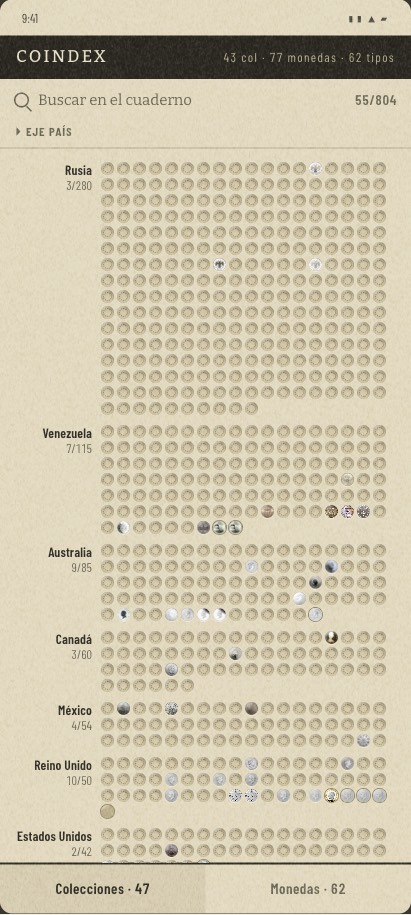

## Lo que se elige

### El orden es el del índice, no uno nuevo

La hoja se ordena **por cociente**, que es literalmente `indexOrder()` de `CollectionIndex.kt`
(ADR 0021 §6: `tiene cociente ↓, cociente ↓, denominador ↓, nombre ↑`). No hay una segunda regla de
orden en la app.

Ordenar por tamaño de lámina abría la hoja por la mayor deuda —Rusia 3/280 en la de Jose, un muro de
280 huecos vacíos antes de la primera moneda—. Por cociente, la del padre abre por **Italia 2/2 en
herrumbre** y sigue por Portugal 36/54: lo primero que se ve es lo que ha terminado. Es el mismo
hallazgo del [#304](https://github.com/jenarvaezg/coindex/issues/304) — revela, no reprocha.

### Los tres ejes, y por qué son tres y no tres pantallas

| eje | qué es una celda | casillas de una vez | pantallas | palabras |
| --- | --- | ---: | ---: | ---: |
| **por lámina** (Colecciones de hoy) | una colección | 12 láminas | 5,40 | 31 |
| **por país** | una casilla | **390** (422 con el estante plegado) | 2,25 (1,99) | 15 |
| **por año** | un año | 112 celdas | 1,62 | **3** |

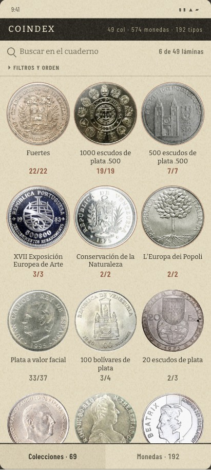
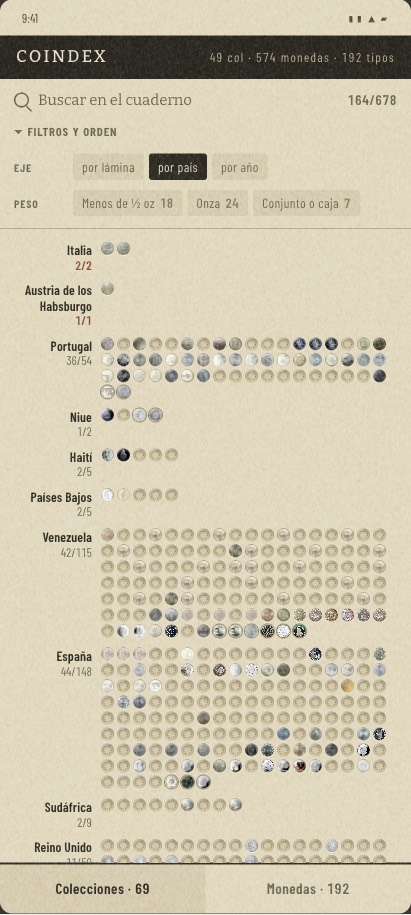
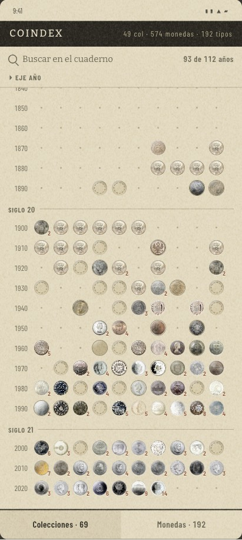

El eje por defecto es **por lámina**, que es la pantalla de hoy: la app sigue abriéndose igual y
nadie tiene que aprender nada. El estante nace plegado, y cerrarlo paga en sitio — 32 casillas más y
un cuarto de pantalla menos. Plegado nombra el eje sólo cuando no es el de siempre, que es la regla
que `shelfSummary` ya aplica al orden; abierto no lo nombra, porque la pestañita está a la vista.

**Y el estante no lleva botón de «cerrar»**: la fila entera es el control, así que la palabra era un
segundo mando para lo mismo. Una cadena menos de las 176 que censó el
[#297](https://github.com/jenarvaezg/coindex/issues/297).

### El eje por año tiene tres estados, no dos

Moneda si tiene algo de ese año, **hueco fantasma** si alguna lámina nombra ese año y no lo tiene, y
**cartón desnudo** si nadie lo nombra y no tiene nada. El tercer estado es lo que enseña la forma de
una colección sin una palabra: los **62 años seguidos sin nada que buscar** del padre (1813→1876) se
ven como cartón, y sus 1780 y 1790 son dos monedas solas en lo alto de la hoja.

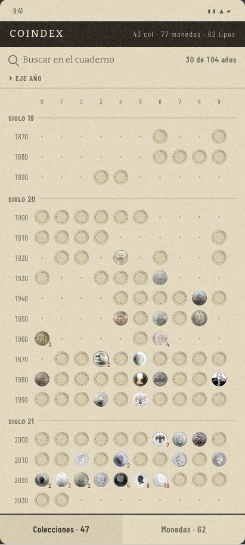

La hoja de Jose cabe entera en **1,14 pantallas** y se lee de un vistazo: tiene algo en 30 de sus 104
años. La del padre mide 1,62 y tiene algo en **93 de 112**.

### Una moneda que ninguna casilla reclama es una moneda, no una nota al pie

En un eje de países **toda pieza tiene país**, así que no hay banda aparte: la pieza que ninguna
casilla reclama es una moneda más en el bloque de su emisor, con el aro entintado y sin cartón
hundido detrás — porque no hay casilla que llenar—, y el rótulo da **un número sin denominador**:
«Francia 9». Es el reparto del ADR 0021 §3 que el índice ya hace con las tarjetas sin cociente, y
cuesta cero palabras de titulillo.

Son **58 filas en 28 emisores** en el caso del padre y 13 en 7 en el de Jose. Los emisores de una o
dos monedas van en **renglón corrido** y no en bloque: dos columnas de rótulos alineados a la derecha
mezclaban la lectura en columnas con la lectura en filas de arriba, y costaban 40 dp por moneda.

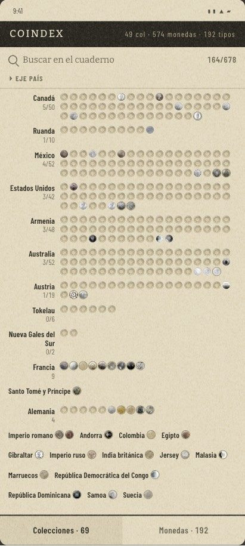

### Y el año con el que se coloca una pieza no es el que casa con la casilla

**Para casar con la casilla, el año grabado en la moneda; para colocarla en el eje, el gregoriano.**
`CollectedItem.recordedYear` prefiere `issueYear`, que es lo correcto para lo primero y erróneo para
lo segundo: el ½ Dirham de Marruecos dice **1316 (hégira) y se acuñó en 1899**, y los 50 Qirsh de
Egipto dicen **1375 y son de 1956**. Sin corregirlo el eje se estiraba de 247 a **711 años** para
colocar dos monedas en el siglo XIV. El dominio ya lleva los dos campos, `issueYear` y
`gregorianYear`; no hace falta mecanismo nuevo, sólo leer el que toca.

### La casilla vive en el país de su miembro

No en el del catálogo, que es sólo el valor por omisión (#170). Al arreglarlo aparecen **dos emisores
que no estaban**: **Nueva Gales del Sur 0/2** y **Tokelau 0/6**, de «Historia del real» —que tiene
miembros de `new_south_wales` y `autriche-habsbourg`— y de «Equilibrium» —Niue y Tokelau—. El padre
pasa de 36 a **37 emisores**.

## Lo que se descarta, y por qué

| | por qué se cae |
| --- | --- |
| **El mapa del mundo** | De los 37 emisores del padre puede colorear **15**. Siete no tienen polígono a esa escala (Tokelau, Niue, Samoa, Andorra, Gibraltar, Jersey, Santo Tomé), cinco no son países de hoy (Imperio romano, Imperio ruso, India británica, Habsburgo, Alemania pre-1945) y el resto sólo tiene piezas, sin porcentaje que pintar. Necesita **81 palabras** para explicar lo que no puede decir: es la pantalla más hablada de las siete. **Tokelau lo remata: tiene lámina y cociente —0/6— y no tiene polígono.** |
| **Los mapitas por país** | El eje país más una silueta de 56 dp por emisor, que dice lo mismo que el rótulo. Con esos 56 dp caben cinco filas de huecos: 336 casillas contra 440. Es el accesorio que se quita antes de salir de casa. |
| **La fenología por lámina** (barras) | 95 palabras y los nombres cortados a «XVII Exposición…». Y su información —en qué décadas vive cada serie— ya está en la lámina. |
| **La tira de años con roturas** | 2,31 pantallas y 58 palabras, porque «10 años sin nada que buscar» se repite veinte veces y cada rotura gasta una fila entera. Los rótulos de dos cifras («80», «91», «13») son ambiguos entre siglos. |
| **La tabla de países** | Una pantalla, 26 palabras y **cero monedas**: el cuadro de mandos que prohíbe `spec.md §0.4`, en ropa de papel. Sirvió de control: prueba que los datos caben en una pantalla, y que lo que la hoja añade es ver monedas en vez de porcentajes. |
| **Llamar «láminas» al cubo de Colecciones** | **20 de las 69 tarjetas del índice del padre no tienen lámina que abrir** (`plateCatalogId` nulo): «100 francs Egalité», «5 francs Semeuse», «Alemanas de plata de ley»… En la de Jose son 4 de 47. El nombre prometería una lámina al 29 % de sus tarjetas, y el glosario de `CONTEXT.md` reserva *plate* para la lámina **de un catálogo**. |
| **Una tercera celda en la barra** | La barra de jerarquías son **dos** celdas con su recuento, no cuatro cubos: `HierarchyBar` sólo cruza Colecciones ↔ Monedas, Ajustes cuelga de la cabecera y **el cuaderno no es un destino sino la exportación**. Una tercera celda tendría que traer su propio recuento, y el de la hoja son casillas —«El mundo · 678»—, que es otro grano que las tarjetas y los tipos. Y hubo que ponerle un nombre: el único que servía, «tu colección», competía con «Colecciones». Si una pantalla necesita un nombre que pelea con el que ya hay, no es una pantalla. |

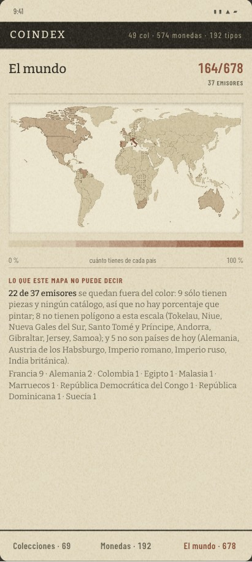
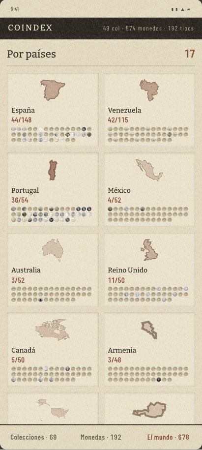
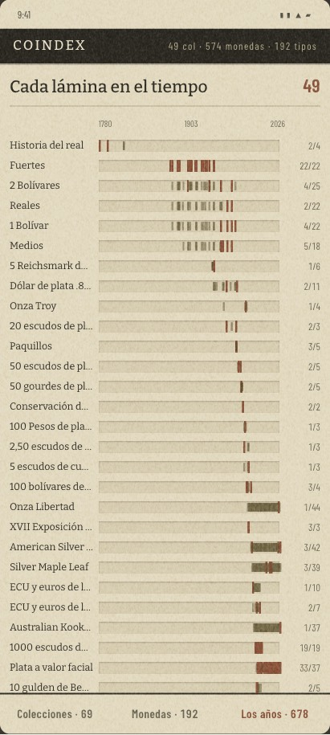
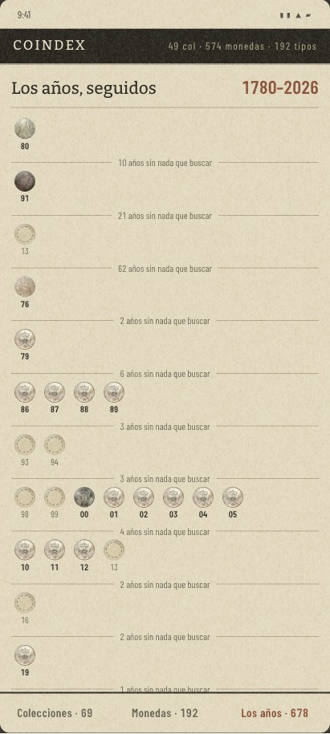
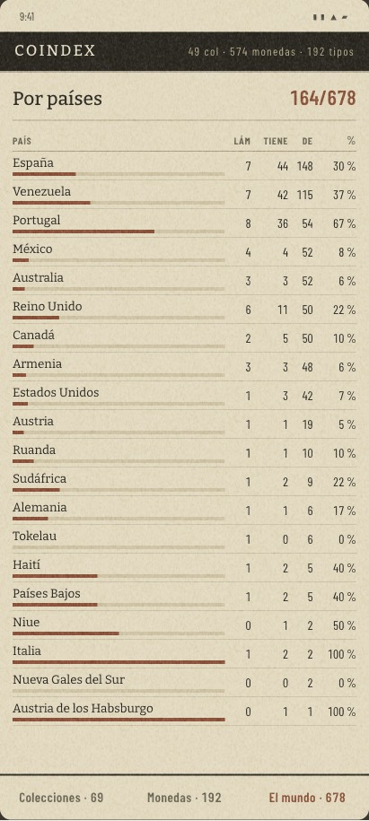

## Los cabos que deja

- **El ADR 0021 no se enmienda por esto.** El primer nivel no crece: la hoja es Colecciones con el
  eje puesto. Lo que sí gana el estante es una faceta —el eje—, y eso es §1, no §2.
- **Corrección de esta misma sesión**: las primeras capturas dibujaban un pie de cuatro cubos
  —«colecciones · monedas · cuaderno · ajustes»— que **la app no tiene**. Están rehechas con
  `HierarchyBar`. El cuaderno impreso no se toca: sigue siendo la exportación del índice
  («Exportar N láminas», #228), que el [#305](https://github.com/jenarvaezg/coindex/issues/305) bajó
  a la regleta.
  [#317](https://github.com/jenarvaezg/coindex/issues/317) recibe este argumento con el dibujo
  delante.
- **Los dos años de una pieza** —el grabado y el gregoriano— piden una línea en la especificación,
  porque hoy `recordedYear` es el único que la interfaz lee.
- **«Cuaderno» ya es dos cosas**: el cubo del PDF impreso y la palabra con la que la app se llama a
  sí misma, escrita en el buscador («Buscar en el cuaderno»). Decidido el 8 de agosto: **se queda
  así**, no se renombra.
- **Esto no se ha visto en un teléfono**, igual que el #300: la primera sesión de implementación
  empieza confirmándolo en el AVD, y el hueco de 13 px es el parámetro a verificar a 420 dpi.
- **La rejilla del padre gasta seis décadas en blanco** (1800–1860, sólo cartón). Se deja a
  propósito: el vacío es la forma de su colección. Comprimirlo es un parámetro, no esta decisión.
