# La mancha y el eje: dos ejes del cuaderno

Respuesta del [#315](https://github.com/jenarvaezg/coindex/issues/315), decidida el 8 de agosto de
2026 sobre prototipos en HTML a tamaño de móvil real (411 × 914 dp, los del Pixel 7 del
[#296](https://github.com/jenarvaezg/coindex/issues/296)), con las dos colecciones reales pasadas por
el dominio (`Curation.assemble` y `buildCollectionCatalogAlbum` sobre las capturas del 5 de agosto).

Ver la colección entera de una vez es el cuaderno con otro eje, no una pantalla nueva. La mancha de
países y el eje de años son dos órdenes de la misma hoja de álbum, elegidos en el estante plegado
que la app ya tiene (ADR 0021 §1). El primer nivel no crece: la barra de jerarquías sigue siendo
dos mitades, «Colecciones · 69» y «Monedas · 192».

## Tres premisas del ticket estaban mal

El ticket decía «1177 casillas en 73 catálogos; al padre le faltan 815 (69 %) y tiene 16 láminas
completas». Medido con el dominio:

| | catálogos suyos | casillas medibles | tiene | le faltan | láminas a n/n |
| --- | ---: | ---: | ---: | ---: | ---: |
| **padre** | 49 | **678** | 164 (24 %) | **514** | **6** |
| **Jose** | 43 | **804** | 55 (7 %) | **749** | **0** |

La estantería entera son 1170 casillas medibles en 74 catálogos, más 10 anunciadas. Las 815 eran de
Jose, no del padre, y las 16 completas no son de ninguno: salen de cruzar catálogos sin la regla de
año de `memberMatches`, el mismo error que ya había dado 14 en vez de 6.

La asimetría rusa que temía el ticket es de Jose: `russie` son 276 casillas de las que tiene 3, y
sus tres láminas rusas aportan 273 huecos, el 36 % de sus 749. El padre no tiene catálogos rusos;
sus cuatro mayores son Capitales de provincia (51), Onza Libertad (43), Silver Eagle (39) y
Kookaburra (36), y ninguno pasa del 10 %. En piezas es al revés: 356 de las 574 del padre son
venezolanas (62 %) y 210 son de 1960, el 37 % de todo lo que tiene.

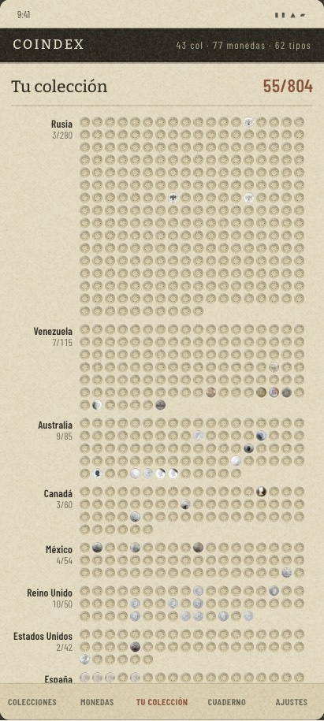

## Lo que se elige

### El orden es el del índice

La hoja se ordena por cociente con `indexOrder()` de `CollectionIndex.kt` (ADR 0021 §6: `tiene
cociente ↓, cociente ↓, denominador ↓, nombre ↑`). No hay una segunda regla de orden en la app.

Ordenar por tamaño de lámina abría la hoja por la mayor deuda: en la de Jose, Rusia 3/280, un muro
de 280 huecos vacíos antes de la primera moneda. Por cociente, la del padre abre por Italia 2/2 en
herrumbre y sigue por Portugal 36/54: lo primero que se ve es lo terminado, como en el
[#304](https://github.com/jenarvaezg/coindex/issues/304).

### Los tres ejes

| eje | qué es una celda | casillas de una vez | pantallas | palabras |
| --- | --- | ---: | ---: | ---: |
| **por lámina** (Colecciones de hoy) | una colección | 12 láminas | 5,40 | 31 |
| **por país** | una casilla | **390** (422 con el estante plegado) | 2,25 (1,99) | 15 |
| **por año** | un año | 112 celdas | 1,62 | **3** |

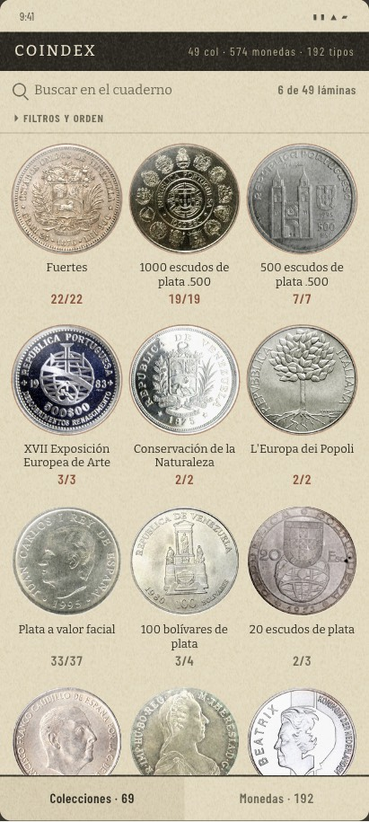
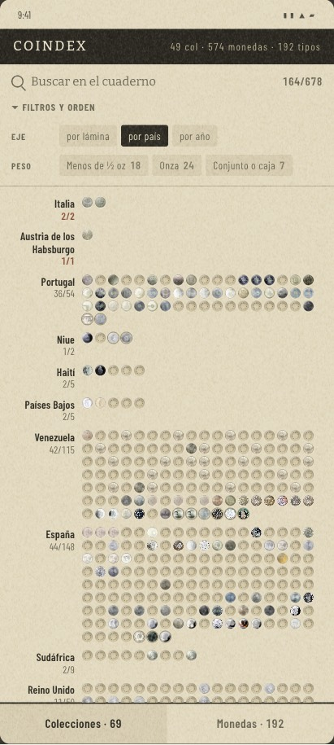
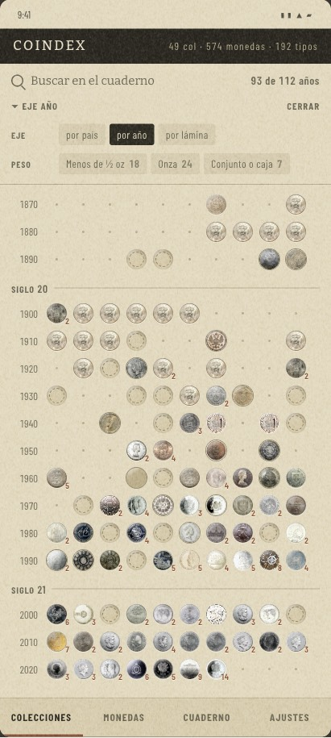

El eje por defecto es por lámina, la pantalla de hoy: la app se abre igual que antes. El estante
nace plegado, y plegado gana 32 casillas y un cuarto de pantalla. Plegado, nombra el eje sólo cuando
no es el de siempre, la misma regla que `shelfSummary` aplica al orden; abierto no lo nombra,
porque la pestañita está a la vista.

El estante no lleva botón de «cerrar»: la fila entera es el control. Es una cadena menos de las
176 que censó el [#297](https://github.com/jenarvaezg/coindex/issues/297).

### El eje por año tiene tres estados

Moneda si tiene algo de ese año; hueco fantasma si alguna lámina nombra ese año y no lo tiene;
cartón desnudo si nadie lo nombra y no tiene nada. El tercero es el que dibuja la forma de la
colección: los 62 años seguidos del padre sin nada que buscar (1813→1876) se ven como cartón, y sus
1780 y 1790 quedan como dos monedas solas en lo alto de la hoja.

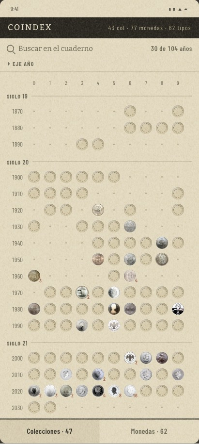

La hoja de Jose cabe en 1,14 pantallas y tiene algo en 30 de sus 104 años. La del padre mide 1,62
y tiene algo en 93 de 112.

### Una moneda que ninguna casilla reclama va en el bloque de su emisor

En un eje de países toda pieza tiene país, así que no hay banda aparte: la pieza que ninguna
casilla reclama es una moneda más en el bloque de su emisor, con el aro entintado y sin cartón
hundido detrás, y el rótulo da un número sin denominador: «Francia 9». Es el reparto del ADR 0021
§3 que el índice ya hace con las tarjetas sin cociente, y no necesita titulillo.

Son 58 filas en 28 emisores en el caso del padre y 13 en 7 en el de Jose. Los emisores de una o dos
monedas van en renglón corrido: en bloque, dos columnas de rótulos alineados a la derecha mezclaban
la lectura por columnas con la de filas de arriba, y costaban 40 dp por moneda.

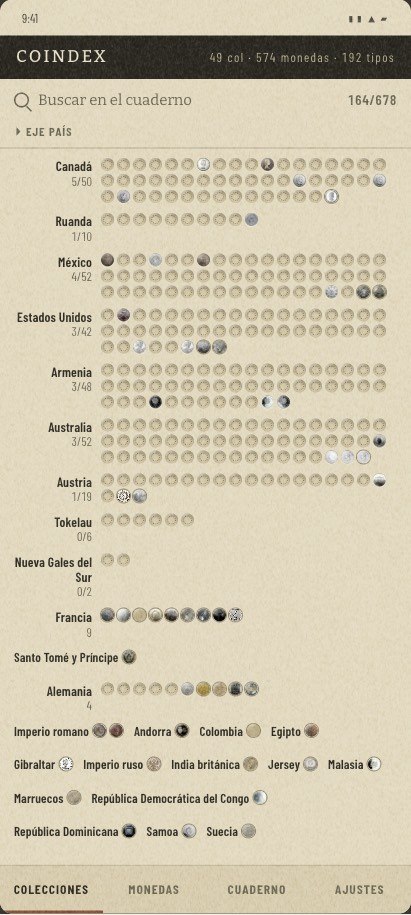

### Dos años por pieza: el grabado casa con la casilla, el gregoriano coloca en el eje

`CollectedItem.recordedYear` prefiere `issueYear`, que sirve para casar con la casilla pero no para
colocar la pieza en el eje: el ½ Dirham de Marruecos dice 1316 (hégira) y se acuñó en 1899, y los
50 Qirsh de Egipto dicen 1375 y son de 1956. Con el año grabado el eje pasaba de 247 a 711 años para
colocar dos monedas en el siglo XIV. El dominio ya tiene `issueYear` y `gregorianYear`; basta con
leer el que toca.

### La casilla vive en el país de su miembro

No en el del catálogo, que es sólo el valor por omisión (#170). Con esto aparecen dos emisores
nuevos: Nueva Gales del Sur 0/2, de «Historia del real» (con miembros de `new_south_wales` y
`autriche-habsbourg`), y Tokelau 0/6, de «Equilibrium» (Niue y Tokelau). El padre pasa de 36 a 37
emisores.

## Lo que se descarta

| | por qué se cae |
| --- | --- |
| **El mapa del mundo** | De los 37 emisores del padre puede colorear 15. Siete no tienen polígono a esa escala (Tokelau, Niue, Samoa, Andorra, Gibraltar, Jersey, Santo Tomé), cinco no son países de hoy (Imperio romano, Imperio ruso, India británica, Habsburgo, Alemania pre-1945) y el resto sólo tiene piezas, sin porcentaje que pintar. Necesita 81 palabras para explicar lo que no puede pintar, la pantalla con más texto de las siete. Tokelau tiene lámina y cociente (0/6) y no tiene polígono. |
| **Los mapitas por país** | El eje país más una silueta de 56 dp por emisor que dice lo mismo que el rótulo. En esos 56 dp caben cinco filas de huecos: 336 casillas contra 440. |
| **La fenología por lámina** (barras) | 95 palabras y los nombres cortados a «XVII Exposición…». Lo que enseña, en qué décadas vive cada serie, ya está en la lámina. |
| **La tira de años con roturas** | 2,31 pantallas y 58 palabras, porque «10 años sin nada que buscar» se repite veinte veces y cada rotura gasta una fila. Los rótulos de dos cifras («80», «91», «13») son ambiguos entre siglos. |
| **La tabla de países** | Una pantalla, 26 palabras y ninguna moneda: el cuadro de mandos que prohíbe `spec.md §0.4`. Sirvió de control: los datos caben en una pantalla, y lo que añade la hoja es ver monedas en vez de porcentajes. |
| **Llamar «láminas» al cubo de Colecciones** | 20 de las 69 tarjetas del índice del padre no tienen lámina que abrir (`plateCatalogId` nulo): «100 francs Egalité», «5 francs Semeuse», «Alemanas de plata de ley»… En el de Jose son 4 de 47. El nombre prometería una lámina al 29 % de sus tarjetas, y `CONTEXT.md` reserva *plate* para la lámina de un catálogo. |
| **Una tercera celda en la barra** | La barra de jerarquías son dos celdas con su recuento: `HierarchyBar` sólo cruza Colecciones ↔ Monedas, Ajustes cuelga de la cabecera y el cuaderno es la exportación, no un destino. Una tercera celda necesitaría su propio recuento, y el de la hoja son casillas («El mundo · 678»), otro grano que tarjetas y tipos. Además el único nombre que servía, «tu colección», competía con «Colecciones». |

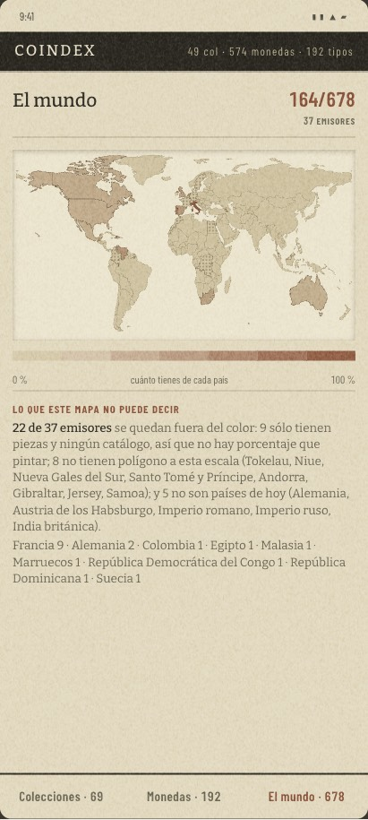
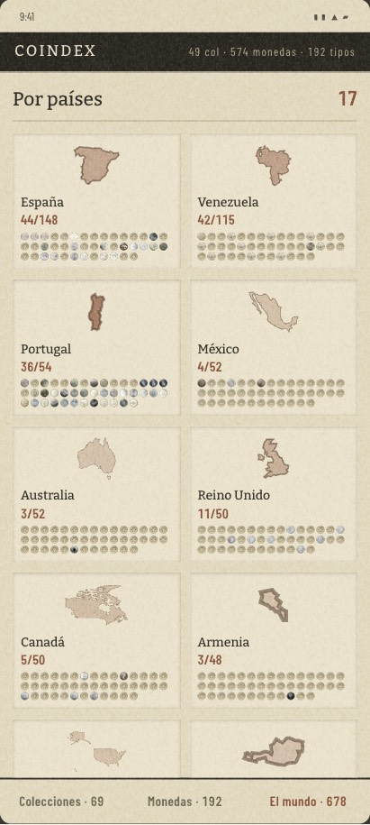
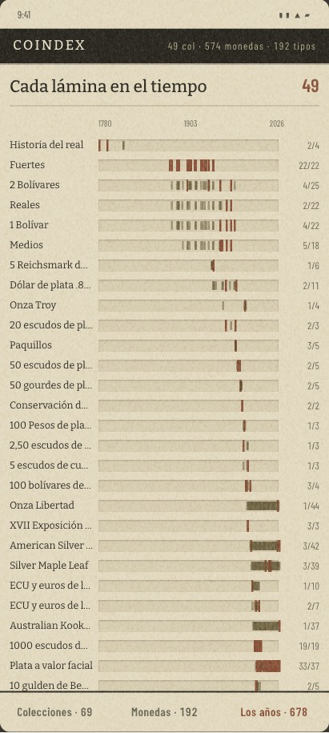
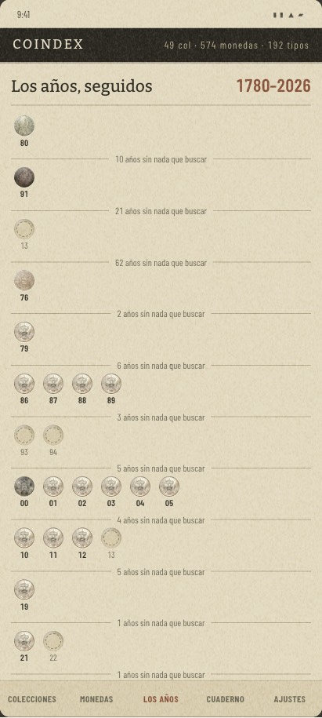
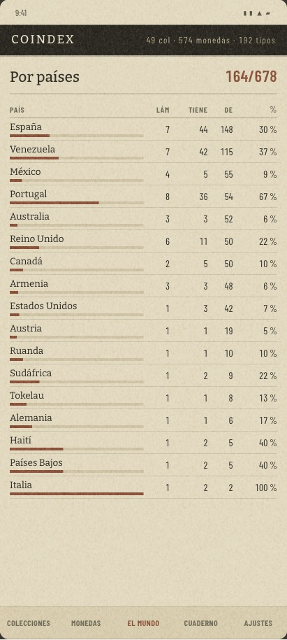

## Los cabos que deja

- **El ADR 0021 no se enmienda por esto.** El primer nivel no crece: la hoja es Colecciones con el
  eje puesto. El estante gana una faceta, el eje, y eso es §1, no §2.
- **Las capturas usan `HierarchyBar`.** El cuaderno impreso sigue siendo la exportación del índice
  («Exportar N láminas», #228), que el [#305](https://github.com/jenarvaezg/coindex/issues/305) bajó
  a la regleta. El argumento contra un destino nuevo pasa al
  [#317](https://github.com/jenarvaezg/coindex/issues/317).
- **Los dos años de una pieza** (el grabado y el gregoriano) piden una línea en la especificación,
  porque hoy `recordedYear` es el único que la interfaz lee.
- **«Cuaderno» nombra dos cosas**: el PDF impreso y la app misma en el buscador («Buscar en el
  cuaderno»). Decidido el 8 de agosto: se queda así.
- **No se ha visto en un teléfono**, igual que el #300: la implementación empieza confirmándolo en
  el AVD, y el parámetro a verificar a 420 dpi es el hueco de 13 px.
- **La rejilla del padre gasta seis décadas en blanco** (1800–1860, sólo cartón). Se deja así: el
  vacío es la forma de su colección. Comprimirlo sería un parámetro aparte.
