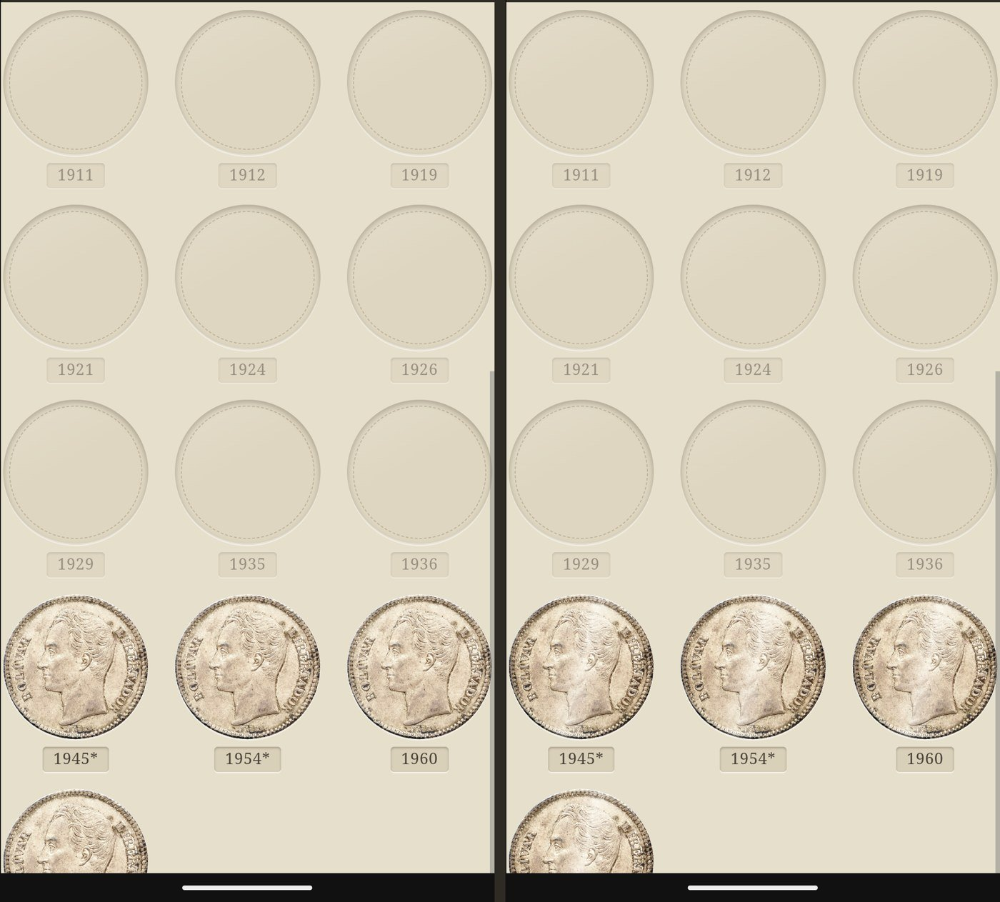
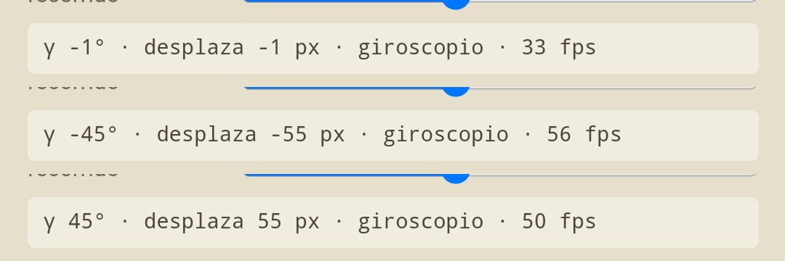
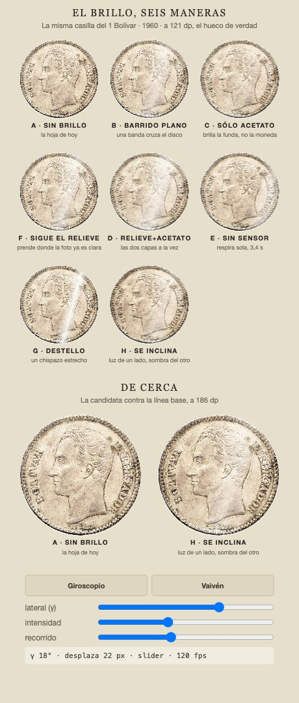
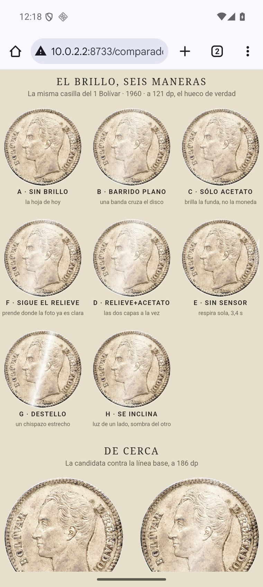

# El brillo metálico: la moneda se inclina bajo una lámpara fija

La respuesta del [#303](https://github.com/jenarvaezg/coindex/issues/303), decidida el 8 de agosto de
2026 sobre un prototipo en HTML a tamaño de móvil real (411 × 914 dp), servido dentro del emulador
`coindex-ux` (Pixel 7) para juzgarlo a 1:1 en dp y no en el Mac, con la lámina de verdad del
**1 Bolívar del padre — 4 de 22** y la fotografía de Numista de N#10338.

**La moneda brilla como metal, y el brillo es luz *y* sombra: la superficie se inclina, no se
ilumina.** Vale allí donde haya una moneda dentro de un hueco —la lámina y el índice del
[#300](https://github.com/jenarvaezg/coindex/issues/300)—, y el cartón vacío nunca brilla.

El ticket abría con tres bordes duros y uno que podía matarlo. **Los cuatro se cayeron al medirlos**,
y lo que quedó en pie fue una decisión de gusto, que la tomó Jose delante del vídeo.

## Lo que se elige

### H · «se inclina»: un gradiente de luz y sombra, desplazado por el acelerómetro

Sobre la fotografía, dentro del recorte circular del hueco, un gradiente lineal a 105° que va
**negro → transparente → blanco → transparente → negro**, en `BlendMode.Softlight`, desplazado a lo
largo del eje según cuánto esté inclinado el móvil.

| | valor del prototipo |
| --- | ---: |
| recorrido del brillo | ±55 dp sobre un hueco de 121 dp (±45 % del diámetro) |
| inclinación que lo satura | ±45° laterales |
| intensidad | la del vídeo, **a la mitad** en la implementación |
| duración | ninguna: sigue al sensor, no se anima |

Lo que gana no es luz: es que la moneda deja de ser un recorte plano pegado en un agujero. La sombra
del lado contrario es la mitad del efecto, y es la mitad que ninguna de las otras siete variantes
tenía.

### Dónde brilla: donde haya una moneda

Regla única, no una lista de pantallas: **toda fotografía de moneda dentro de un hueco brilla**, esté
en la lámina por años o en el índice de colecciones. El **hueco vacío no brilla nunca** — es cartón,
y el cartón no es metal. Un test puede defender exactamente eso, que es lo que se le pide a una regla
en este mapa.

### El reposo tiene estado, y por eso el PNG sí lo lleva

Con el móvil plano sobre la mesa la componente lateral es cero, y el gradiente se queda **centrado**:
luz en el centro del disco, sombra en los dos bordes. Eso **no es «sin efecto»**, es una pose — la de
una hoja bajo una lámpara cenital.

Que el reposo sea una pose definida resuelve el borde que el ticket temía. `SheetExport` compone la
hoja fuera de pantalla, igual que hace con `printed_side` (#302), así que **el PNG exportado sale con
el brillo en reposo**. Lo que no llega al papel es el *movimiento*, no el *efecto*: la nota del #17
—que el padre enseña sus láminas como PNG— queda cubierta, y no hace falta ninguna excepción en la
exportación.

## Los tres bordes duros del ticket, medidos

### 1 · `minSdk` 29 contra AGSL: no hace falta shader, así que no hace falta fallback

El ticket daba por hecho que esto pedía `RuntimeShader` (API 33+) y que había que elegir un fallback
para 29–32. **El móvil del padre es Android 13+**, así que el fallback ya no tenía usuario; pero es
que además **el efecto elegido no necesita AGSL**. H es un gradiente lineal con un modo de fusión, no
un cálculo por píxel: `drawWithContent { drawContent(); drawRect(brush, blendMode = Softlight) }`.

`BlendMode.Softlight` se apoya en `android.graphics.BlendMode`, que es **API 29** — justo el `minSdk`
de la app. Y si en la implementación diera guerra contra la capa, el camino de retirada no baja de
nivel: dos gradientes en modo normal (uno blanco con alfa, otro negro con alfa) dan lo mismo en
cualquier API.

**No hay decisión de fallback que tomar**, y el efecto no impone piso de versión a nadie.

### 2 · El tinte por metal: no hay variedad, y el efecto no la usaría

La pregunta era cuántos tintes hay, quién los declara y qué pasa con la lámina de metal mezclado.
Se responde dos veces, y las dos con un no:

- **No hay variedad que teñir.** De los 188 tipos del padre que tienen ficha en la caché sembrada,
  **183 son plata (97,3 %)**; de sus 231 filas de inventario, 222. **Cero oro.** El resto son dos de
  cuproníquel, uno de bronce, uno de bronce de aluminio y uno bimetálico.
- **No hay láminas de metal mezclado, por construcción.** El ADR 0018 mete el metal dentro de la
  clave de variante, así que dos metales nunca comparten catálogo. De los 74 catálogos, 71 declaran
  metal —68 `silver`, 2 `cupronickel`, 1 `other`— y los 3 que no lo declaran son sets: **los tres son
  de plata 835 y 925**.
- **Y H no tiñe.** Es blanco y negro sobre la foto: el color lo pone la fotografía. El efecto **no
  necesita leer `Metal`**, así que el ADR 0018 no sube a la capa de interfaz por esta puerta.

### 3 · El sensor: basta el acelerómetro, y el móvil en la mesa se queda en reposo

Medido dentro del emulador, moviendo el sensor virtual con `adb emu sensor set acceleration`: con
sólo la componente de gravedad, el ángulo lateral recorre el rango entero de −45° a +45° y la página
lo recibe como `deviceorientation`.

- **`TYPE_ACCELEROMETER` es suficiente.** No hace falta giroscopio ni vector de rotación: lo que se
  quiere es hacia dónde cae la gravedad, no cuánto gira.
- **Con el móvil apoyado en la mesa** —que es como se mira una lámina larga— la componente lateral es
  cero y la hoja se queda en la pose de reposo. El efecto no reclama que nadie mueva nada: es una
  propina para quien tiene el teléfono en la mano.
- **El sensor se registra sólo mientras hay huecos con moneda en pantalla y la app está en primer
  plano**, y se desregistra en `onPause`. `SENSOR_DELAY_UI` basta y sobra.
- **El consumo no se ha medido aquí y no se finge**: el acelerómetro es el sensor barato del
  teléfono, pero el número real es de la implementación. Lo que este ticket fija es el techo — nunca
  despierto fuera de primer plano.

## Lo que se descarta, y por qué

Ocho tratamientos sobre la misma casilla, todos con la misma inclinación.

| | por qué se cae |
| --- | --- |
| **A · sin brillo** | Es la línea base: la hoja de hoy. Se cae porque hay algo mejor, no porque esté mal. |
| **B · barrido plano** | A 121 dp es **indistinguible de A**. Sólo añade luz, y sumar blanco sobre una foto ya clara no da metal: da veladura. |
| **C · sólo el acetato** | Mueve el reflejo de la funda y deja la moneda quieta. Honesto como física de álbum, invisible como efecto. |
| **D · relieve + acetato** | Dos capas para el resultado de una. El acetato no aporta nada que la capa de la moneda no haga mejor. |
| **E · sin sensor, respira sola** | Se mueve **sin que nadie mueva el móvil**: una hoja de cartón inquieta. Era el fallback candidato, y al no hacer falta fallback se queda sin excusa. |
| **F · sigue el relieve de la foto** | La idea era enmascarar el brillo por la luminancia de la fotografía, para que prendiera donde hay relieve. No funciona: la luminancia de una foto de plata es alta **en todas partes**, así que la máscara no discrimina y el resultado vuelve a ser veladura. Un mapa de alturas lo haría, y eso es el relieve que el #15 descartó. |
| **G · destello estrecho** | El más visible de los ocho, y por eso el más tentador. Se lee como **un arañazo o un reflejo en el acetato**, no como la superficie de la moneda: la raya no respeta ni el canto ni el busto. |

## Lo que hay que saber antes de implementarlo

- **La fotografía ya trae su luz cocida**, desde arriba a la izquierda, y es fija. El brillo que se
  mueve convive con ella pero no la sustituye: por eso la intensidad va a la mitad de la del vídeo, y
  por eso la sombra importa tanto como la luz. Pasarse de intensidad devuelve la veladura de B.
- **A 121 dp el efecto es sutil, y a 186 dp es evidente.** Es una decisión tomada con los ojos, no un
  umbral medido: en el vídeo de cerca la diferencia es de otra categoría que en la rejilla. Si al
  implementarlo en Compose la lámina se queda corta, lo que se sube es la intensidad, no el tamaño
  del hueco.
- **Se decidió en HTML dentro del emulador, no en Compose.** El `BlendMode` de Android y el
  `soft-light` de CSS no son el mismo cálculo, así que el calibrado fino —intensidad, ancho de banda,
  recorrido— se confirma en el AVD en la primera sesión de implementación. Es un parámetro, no la
  decisión, igual que el rebaje de la chapa del #302.
- **El brillo va sobre la moneda, así que gira con ella.** La capa vive dentro del mismo
  `graphicsLayer` que el `rotationY` del #302: cuando la moneda se voltea, su luz se voltea con ella.
- **Coste de dibujo**: un `drawRect` por casilla con moneda, dentro del recorte que ya existe. En la
  lámina son 13,74 casillas por pantalla y en el índice 11,04 colecciones — y en la colección del
  padre, **de 22 casillas del 1 Bolívar sólo 4 tienen moneda**, así que el coste real es bastante
  menor que el número de huecos.

## Los vídeos

- [`brillo-303/lamina-los-seis.mp4`](brillo-303/lamina-los-seis.mp4) — la lámina de 22 casillas
  balanceándose sola a ±40°, ciclando A → H → G → B → F → E → A, 3,6 s cada uno.
- [`brillo-303/de-cerca-a-vs-h.mp4`](brillo-303/de-cerca-a-vs-h.mp4) — A contra H a 186 dp.

Grabados en el emulador, que dibuja por software a 25–33 fps; un móvil real va muy por encima. La
fluidez de los vídeos **no** es la del efecto.

