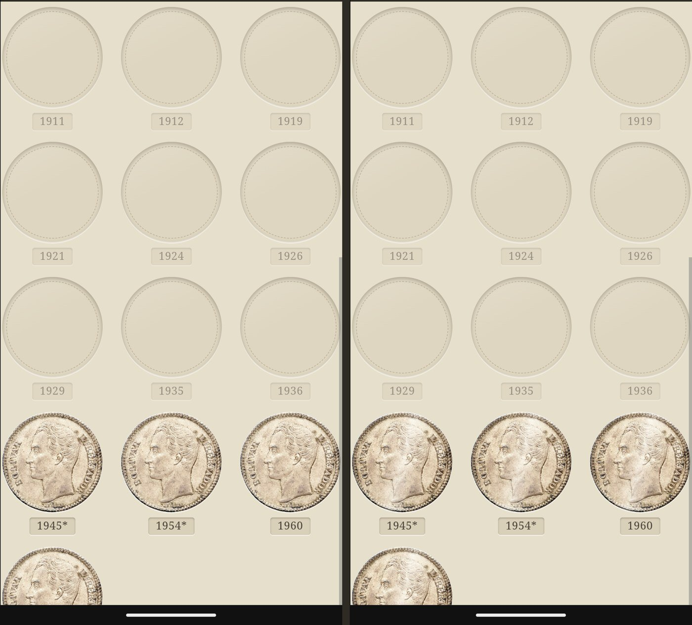
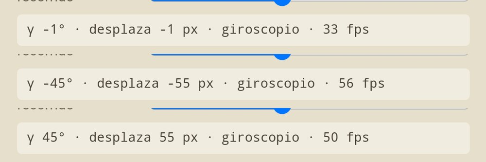
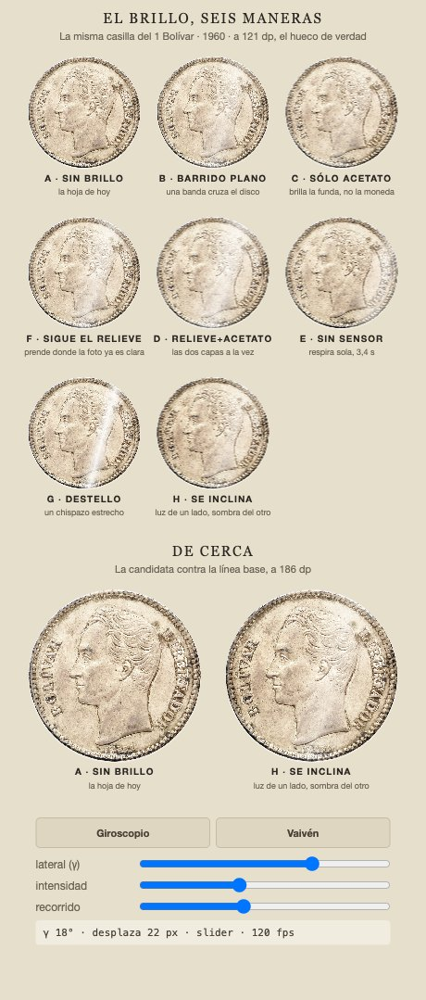
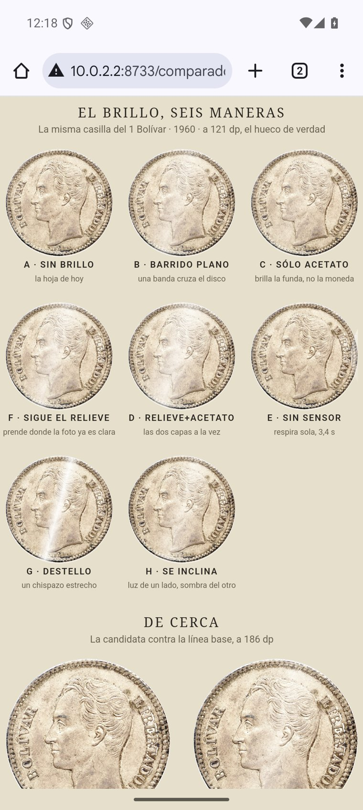

# El brillo metálico: la moneda se inclina bajo una lámpara fija

Respuesta del [#303](https://github.com/jenarvaezg/coindex/issues/303), decidida el 8 de agosto de
2026 sobre un prototipo en HTML a tamaño de móvil real (411 × 914 dp), servido dentro del emulador
`coindex-ux` (Pixel 7) para juzgarlo a 1:1 en dp, con la lámina del 1 Bolívar del padre (4 de 22) y
la fotografía de Numista de N#10338.

La moneda brilla como metal, con luz y sombra: la que se inclina es la superficie, la lámpara está
fija. Vale en cualquier sitio donde haya una moneda dentro de un hueco (la lámina y el índice del
[#300](https://github.com/jenarvaezg/coindex/issues/300)); el cartón vacío nunca brilla.

Los riesgos técnicos que planteaba el ticket desaparecieron al medirlos, y la elección final fue de
gusto: la tomó Jose viendo el vídeo.

## Lo que se elige

### H · «se inclina»: luz y sombra desplazadas por el acelerómetro

Sobre la fotografía, dentro del recorte circular del hueco, un gradiente lineal a 105° que va
negro → transparente → blanco → transparente → negro, en `BlendMode.Softlight`, desplazado a lo
largo del eje según la inclinación del móvil.

| | valor del prototipo |
| --- | ---: |
| recorrido del brillo | ±55 dp sobre un hueco de 121 dp (±45 % del diámetro) |
| inclinación que lo satura | ±45° laterales |
| intensidad | la del vídeo, **a la mitad** en la implementación |
| duración | ninguna: sigue al sensor, no se anima |

La moneda deja de parecer un recorte plano pegado en un agujero. La mitad del efecto es la sombra
del lado contrario, que ninguna de las otras siete variantes tenía.

### Dónde brilla: toda moneda dentro de un hueco

Toda fotografía de moneda dentro de un hueco brilla, en la lámina o en el índice; el hueco vacío
no brilla nunca. Es una regla única, sin lista de pantallas, y un test puede fijarla.

### El reposo es una pose, y el PNG la lleva

Con el móvil plano sobre la mesa la componente lateral es cero y el gradiente queda centrado: luz
en el centro del disco y sombra en los dos bordes, como una hoja bajo una lámpara cenital.

`SheetExport` compone la hoja fuera de pantalla, igual que con `printed_side` (#302), así que el PNG
exportado sale con el brillo en reposo. Al papel no llega el movimiento, pero sí el efecto: la nota
del #17 (el padre enseña sus láminas como PNG) queda cubierta sin excepciones en la exportación.

## Los tres bordes duros del ticket, medidos

### 1 · `minSdk` 29 contra AGSL: no hace falta shader ni fallback

El ticket suponía `RuntimeShader` (API 33+) y un fallback para 29–32. El móvil del padre es Android
13+, y además H no necesita AGSL: es un gradiente lineal con un modo de fusión, no un cálculo por
píxel: `drawWithContent { drawContent(); drawRect(brush, blendMode = Softlight) }`.

`BlendMode.Softlight` se apoya en `android.graphics.BlendMode`, API 29, que es el `minSdk` de la
app. Si diera problemas con la capa, la alternativa funciona en cualquier API: dos gradientes en
modo normal, uno blanco y otro negro con alfa. El efecto no impone versión mínima.

### 2 · El tinte por metal: no hay variedad que teñir, y H no la usaría

- **No hay variedad.** De los 188 tipos del padre con ficha en la caché sembrada, 183 son plata
  (97,3 %); de sus 231 filas de inventario, 222. Ningún oro; el resto son dos de cuproníquel, uno de
  bronce, uno de bronce de aluminio y uno bimetálico.
- **No hay láminas de metal mezclado**, por construcción: el ADR 0018 mete el metal en la clave de
  variante, así que dos metales nunca comparten catálogo. De los 74 catálogos, 71 declaran metal
  (68 `silver`, 2 `cupronickel`, 1 `other`) y los 3 que no lo declaran son sets de plata 835 y 925.
- **H no tiñe.** Es blanco y negro sobre la foto, y el color lo pone la fotografía. No necesita leer
  `Metal`, así que el ADR 0018 no llega a la capa de interfaz por aquí.

### 3 · El sensor: basta el acelerómetro

Medido en el emulador moviendo el sensor virtual con `adb emu sensor set acceleration`: con sólo la
componente de gravedad, el ángulo lateral recorre de −45° a +45° y la página lo recibe como
`deviceorientation`.

- `TYPE_ACCELEROMETER` basta: interesa hacia dónde cae la gravedad, no cuánto gira el móvil. No
  hace falta giroscopio ni vector de rotación.
- Con el móvil apoyado en la mesa, que es como se mira una lámina larga, la hoja se queda en la pose
  de reposo. El efecto es un extra para quien tiene el teléfono en la mano.
- El sensor se registra sólo mientras hay huecos con moneda en pantalla y la app está en primer
  plano, y se desregistra en `onPause`. `SENSOR_DELAY_UI` basta.
- El consumo no se midió aquí; se mide en la implementación. Lo que se fija es el techo: nunca
  despierto fuera de primer plano.

## Lo que se descarta

Ocho tratamientos sobre la misma casilla, con la misma inclinación.

| | por qué se cae |
| --- | --- |
| **A · sin brillo** | La línea base, la hoja de hoy. Se cae porque hay algo mejor. |
| **B · barrido plano** | A 121 dp no se distingue de A. Sólo añade luz, y blanco sobre una foto ya clara da veladura, no metal. |
| **C · sólo el acetato** | Mueve el reflejo de la funda y deja la moneda quieta: correcto como física de álbum, invisible como efecto. |
| **D · relieve + acetato** | Dos capas para el resultado de una; el acetato no añade nada que la capa de la moneda no haga mejor. |
| **E · sin sensor, respira sola** | Se mueve sin que nadie mueva el móvil. Era el candidato a fallback, y no hace falta fallback. |
| **F · sigue el relieve de la foto** | Enmascarar el brillo por la luminancia de la foto no discrimina: una foto de plata tiene luminancia alta en todas partes, y vuelve la veladura. Haría falta un mapa de alturas, que es el relieve que el #15 descartó. |
| **G · destello estrecho** | El más visible de los ocho, pero se lee como un arañazo o un reflejo en el acetato: la raya no respeta ni el canto ni el busto. |

## Para implementarlo

- **La fotografía trae su propia luz**, fija, desde arriba a la izquierda. El brillo convive con
  ella: por eso la intensidad va a la mitad de la del vídeo y la sombra pesa tanto como la luz. Con
  más intensidad vuelve la veladura de B.
- **A 121 dp el efecto es sutil y a 186 dp, evidente.** Es un juicio visual, no un umbral medido.
  Si en Compose la lámina se queda corta, se sube la intensidad, no el tamaño del hueco.
- **Se decidió en HTML dentro del emulador.** El `BlendMode` de Android y el `soft-light` de CSS no
  calculan igual, así que intensidad, ancho de banda y recorrido se calibran en el AVD al
  implementar. Son parámetros, como el rebaje de la chapa del #302.
- **El brillo gira con la moneda**: la capa vive dentro del mismo `graphicsLayer` que el
  `rotationY` del #302.
- **Coste de dibujo**: un `drawRect` por casilla con moneda, dentro del recorte que ya existe. Son
  13,74 casillas por pantalla en la lámina y 11,04 colecciones en el índice, y sólo pintan las que
  tienen moneda (4 de 22 en el 1 Bolívar del padre).

## Los vídeos

- [`brillo-303/lamina-los-seis.mp4`](brillo-303/lamina-los-seis.mp4) — la lámina de 22 casillas
  balanceándose sola a ±40°, ciclando A → H → G → B → F → E → A, 3,6 s cada uno.
- [`brillo-303/de-cerca-a-vs-h.mp4`](brillo-303/de-cerca-a-vs-h.mp4) — A contra H a 186 dp.

Grabados en el emulador, que dibuja por software a 25–33 fps; un móvil real va muy por encima, así
que la fluidez de los vídeos no es la del efecto.

