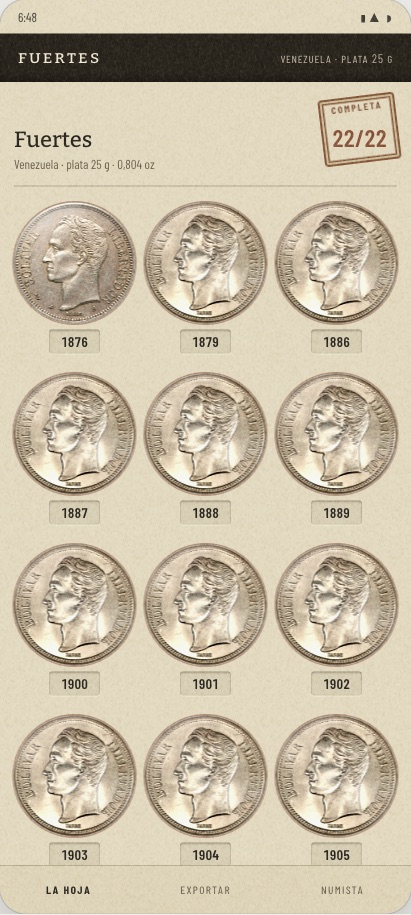
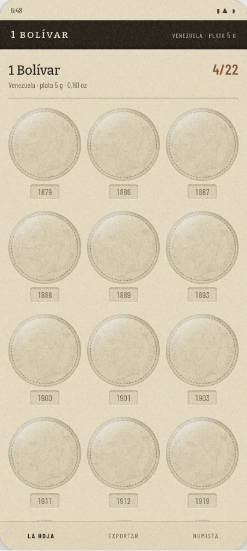
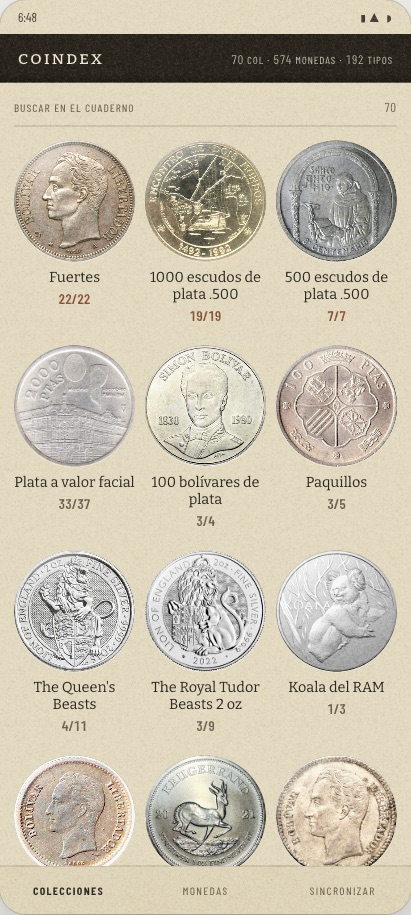
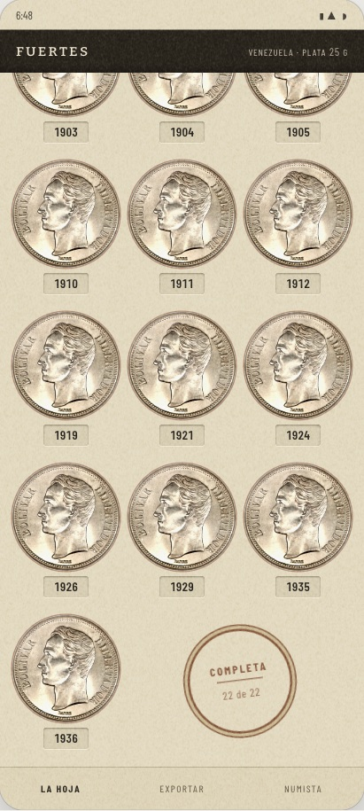
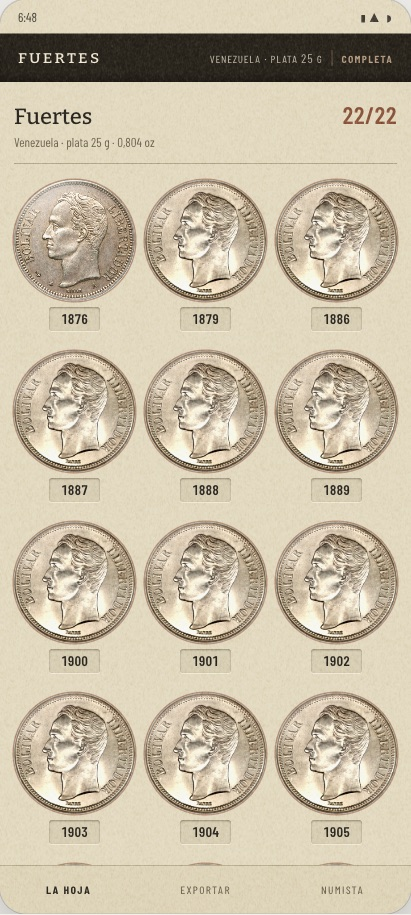
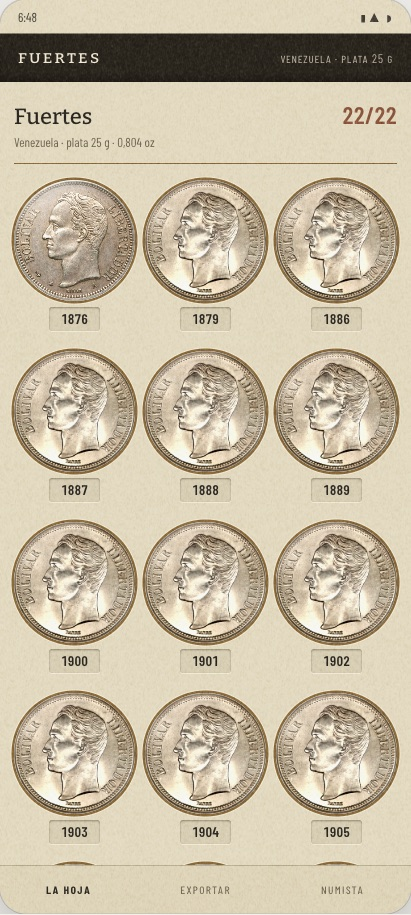

# La ceremonia: el sello es un estado, y la moneda viaja a su casilla

La respuesta del [#304](https://github.com/jenarvaezg/coindex/issues/304), decidida el 8 de agosto de
2026 sobre un prototipo en HTML a tamaño de móvil real (411 × 914 dp, los del Pixel 7 con los que
midió el [#296](https://github.com/jenarvaezg/coindex/issues/296)), con la **lámina completa de
verdad del padre** —los Fuertes de Venezuela, 22 de 22, de 1876 a 1936— y el índice del
[#300](https://github.com/jenarvaezg/coindex/issues/300).

**El sello de completado no es una medalla: es cómo está dibujada una hoja llena.** Y la transición
del índice a la lámina es la moneda de la tarjeta viajando a **su** casilla, no a la primera.

## Lo que cambió la pregunta antes de dibujar nada

El ticket daba por hecho que completar una lámina es un acontecimiento. Se midió, y no lo es —
todavía.

**Las seis láminas completas del padre lo están desde el día en que curamos su catálogo.** Las seis,
entre el 30 de julio y el 6 de agosto de 2026:

| lámina | catálogo creado |
| --- | --- |
| Fuertes · 22/22 | 1 ago 2026 (#87) |
| 1000 escudos de plata .500 · 19/19 | 31 jul 2026 (#42) |
| 500 escudos de plata .500 · 7/7 | 30 jul 2026 |
| Portugal 1983 · Exposición Europea de Arte · 3/3 | 30 jul 2026 |
| Venezuela 1975 · Conservación · 2/2 | 4 ago 2026 (#156) |
| Italia 2003 · Europa dei Popoli · 2/2 | 6 ago 2026 (#255) |

**El padre no ha completado una lámina dentro de Coindex en su vida.** Se las hemos completado
nosotros, con monedas que él ya tenía en casa desde hace años. Eso decide el tono de todo el ticket:
la ceremonia **no felicita, revela** — le enseña algo suyo que no sabía.

Y completar **caduca**. `issuedMembers()` (`CollectionCatalogAlbum.kt:60`) deja los miembros
`announced` fuera del divisor, así que un date run abierto se lee `19 de 19` hoy y `19 de 20` el día
que el curador convierta el año anunciado en casilla real. **33 de los 74 catálogos son
`series_status: open`**, y son justo el bullion anual que el padre sigue comprando. Ninguna de sus
seis completas es una de ellas —las seis son cerradas—, pero la primera que lo sea perderá el sello
sin que él pierda nada.

> Corrección de una medida propia: una primera cuenta dio catorce completas y cinco de ellas
> abiertas. Estaba mal — el emparejamiento ignoraba el año, y `memberMatches`
> (`CollectionCatalog.kt:147`) exige `item.recordedYear == member.year` en un date run. Rehecha, da
> **exactamente las 6 que midió el #296** sobre el móvil.

## Lo que se elige

### El sello es un estado, no una medalla

Se lee del inventario como el troquel: la lámina que está completa lo enseña, y la que deja de
estarlo deja de enseñarlo, sin drama y sin retirar nada. **El borde que el ticket temía —«cuándo se
considera que acaba de completarse», que no se dispare en cada arranque ni cincuenta veces al
sincronizar— se evapora**: no hay acontecimiento que recordar.

Un álbum de papel tampoco tiene logros. Tiene huecos llenos y huecos vacíos.

### Se estampa al abrir la hoja, y nunca al sincronizar

El sello **se pone delante de ti** la primera vez que abres esa lámina estando completa, en vez de
estar ya puesto. El disparador es **mirar**, no la red: sincronizar cien veces no estampa nada si no
abres la hoja. Cuesta un bit por catálogo en `NamedValues` —«ya te lo enseñé»—, que es
`SharedPreferences` y no una tabla.

Se acepta la consecuencia: **el estampado sólo lo ve quien entra**. Si el padre completa una lámina
y no la abre en seis meses, el sello espera seis meses. Un álbum de papel también espera.

### Sólo en la hoja

El índice no cambia: la tarjeta ya marca las completas con el cociente en óxido, que lo decidió el
#300. Y sobre todo, **una tarjeta del índice no se abre nunca**: poner el sello ahí obligaría a
disparar la ceremonia al hacer scroll —once a la vez, y otra vez al volver— o a inventar un segundo
disparador sólo para el índice.

### El sello de caucho, sobre el cociente

Una estampa de tinta óxido girada 5,5°, en `multiply`, **encima del `22/22` de la cabecera**. El
cociente entra pálido y la tinta lo fija.

Cae ahí y no al pie por una razón medida: **la ceremonia se dispara al abrir la hoja, y al abrirla
estás arriba.** El pie de los Fuertes está a **706 px de scroll**, así que un sello al pie se estampa
fuera de pantalla y cuando bajas ya está puesto — que es la variante «no hacer nada» con un dibujo
más.

Y no añade **ni una palabra ni una cifra** a la hoja: se come el dato que ya estaba, en vez de
repetirlo abajo. Mide **84 × 76 dp** y deja **122 dp de holgura** hasta donde acaba el título
«Fuertes».

El sello cuelga del `n/n` y no de la lámina: el 1 Bolívar 4/22 entra con sus dieciocho fantasmas y su
cociente pelado.

### La moneda viaja, y acaba en su casilla

Del índice a la lámina va un **elemento compartido**: la moneda de la tarjeta vuela a su casilla y la
rejilla entra detrás. Funciona porque el #300 dejó el mismo objeto a los dos lados —en el índice una
colección ya *es* un hueco troquelado con su moneda dentro, y en la lámina también—, así que no hay
que inventar nada: ya lo era. `SharedTransitionLayout`, estable en el BOM `2026.06.01`.

**La condición es que acabe en la casilla que le toca**, y eso obliga a enmendar una regla del #300 y
a inventar un comportamiento:

- **La foto de la tarjeta es la primera emisión que el padre *tiene*, no la primera del catálogo.**
  La regla del #300 era la primera del catálogo, y eso hace que el índice enseñe monedas que él no
  tiene: la tarjeta del 1 Bolívar luce el de **1879**, que en su lámina es un fantasma. Con la regla
  vieja la moneda volaría a todo color hasta un hueco vacío para apagarse allí.
- **La hoja se abre por donde cae la moneda.** Si su casilla está bajo el pliegue —los cuatro
  Bolívares del padre son 1945 a 1965, las casillas 19 a 22 de 22— la lámina se abre ya desplazada
  hasta ella, o el aterrizaje ocurre fuera de pantalla.

Las dos reglas **no chocan con el sello**, y no por suerte: en una lámina completa la primera casilla
que tiene *es* la primera, así que la hoja se abre arriba y el estampado cae a la vista. El único
caso que baja es el de una lámina incompleta, que no tiene sello que enseñar.

## Lo que se descarta, y por qué

| | por qué se cae |
| --- | --- |
| **Que el sello sea un hecho y no un estado** («completada el 3 de agosto») | Habría que **retirárselo** al primer date run abierto que se complete, y obliga a decidir qué pasa con las seis que ya están completas el día que se instale. Además mete en una guía de campo la palabra del cuadro de mandos que prohíbe `spec.md §0.4`. |
| **Que la app salga al paso al sincronizar** | Mentiría en el caso que más va a ocurrir: anunciar «has completado la Filarmónica» el año que la hoja está a punto de crecer. Y es el cuadro de mandos otra vez. |
| **B· al pie · el sello en el hueco que sobra** |  Cabe sin quitarle el sitio a ninguna moneda —22 casillas en tres columnas dejan dos huecos libres— pero **se estampa a 706 px de scroll**, fuera de pantalla. Y con 21 casillas no sobra ninguno y se hace su propia fila de 118 dp. |
| **C · el canto lo dice** |  No toca el papel, que es su virtud, pero **es prosa**: añade una palabra donde el #300 acababa de quitar novecientas noventa y cuatro. Y el canto es el sitio de menos peso visual de la pantalla. |
| **D · el cartón se cierra** (los 22 aros de latón en cascada) |  Es la más bonita y la que mejor sobreviviría al PNG —no es un objeto pegado, es cómo está dibujado el cartón—, pero **a nadie le han enseñado que el latón significa completa**: es la única cuyo enunciado se puede sencillamente no leer. |
| **E · la etiqueta engomada** | El #300 descartó la sombra de hoja precisamente por no querer cosas flotando, y esta es una cosa flotando. Además necesita *dos* datos —la palabra y el tramo de años—, así que crece con la prosa. |
| **A · nada** | Con el #300 una hoja llena ya parece otra cosa, y por eso se dibujó como control y no como paja. Pero una hoja llena y una a la que le faltan dos se parecen mucho, y la que le faltan dos **no** está completa. |
| **3 · la hoja se abre** (la tarjeta crece hasta la pantalla) | Serviría para los tres destinos, pero **dice menos**: crecer es una transición de app, y el #300 fue a por objeto. Y escalar una foto de 121 dp a pantalla completa se ve blanda. |

## Los cabos que deja

- **La palabra del sello, cuando la serie es abierta.** El prototipo dibujó «al día» en vez de
  «completa» para una lámina de serie abierta, y **es lo único que este ticket no llegó a
  pronunciar**. Se cierra por defecto en **una sola palabra, «completa»**: el caso no existe hoy
  —ninguna de las seis es abierta— y una segunda palabra es vocabulario nuevo que habría que
  explicar. El [#308](https://github.com/jenarvaezg/coindex/issues/308) puede darle la vuelta al
  escribir el ADR, que es donde toca.
- **Las tarjetas que no abren lámina.** `CardDestination` tiene tres clases —`Plate`, `Pieces` y
  `Box`— y sólo la primera aterriza en una hoja de huecos. En las otras dos la moneda no tiene dónde
  caer. Qué transición llevan es asunto de la lista de efectos
  ([#307](https://github.com/jenarvaezg/coindex/issues/307)).
- **El sello y un título largo.** El marco girado deja 122 dp de holgura con «Fuertes». Con un título
  de Numista de dos líneas se le mete dentro, y eso lo decide el
  [#319](https://github.com/jenarvaezg/coindex/issues/319).
- **Se decidió en HTML, no en el emulador**, igual que el #300, el #302 y el #303. La primera sesión
  de implementación empieza confirmándolo en el AVD: los 300 ms del estampado y el `multiply` de la
  tinta sobre el papel con grano se leen distinto a 420 dpi. Son parámetros, no la decisión.
