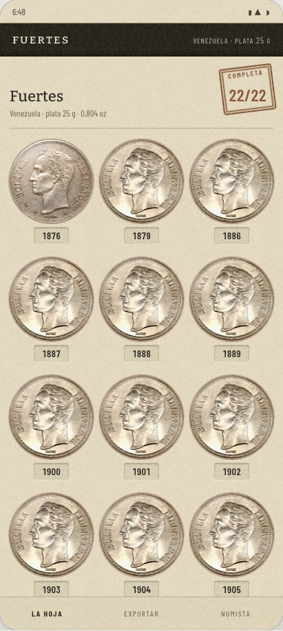
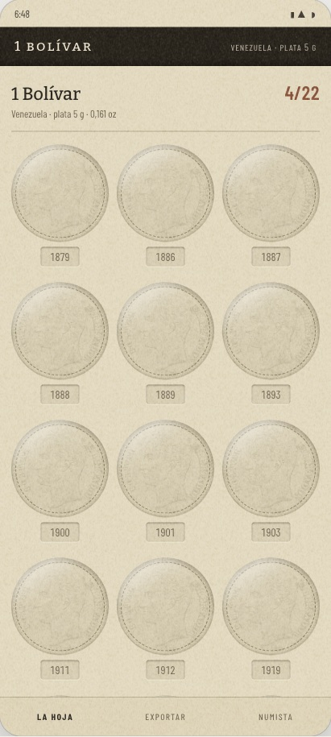
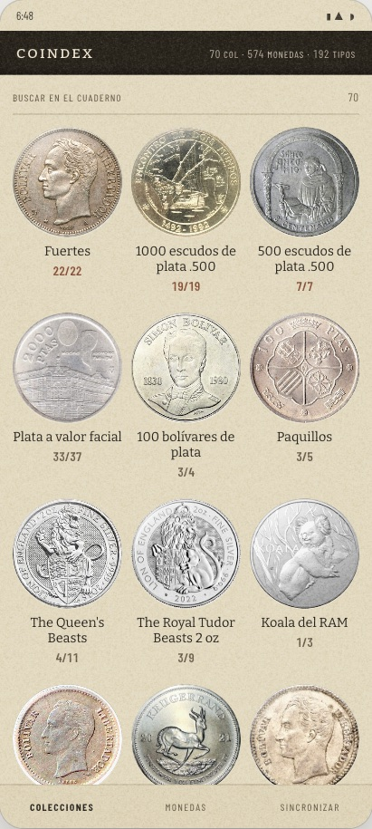
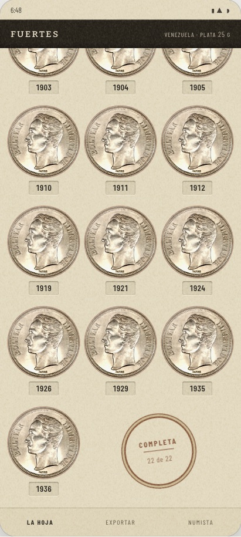
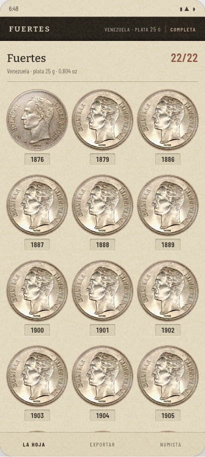
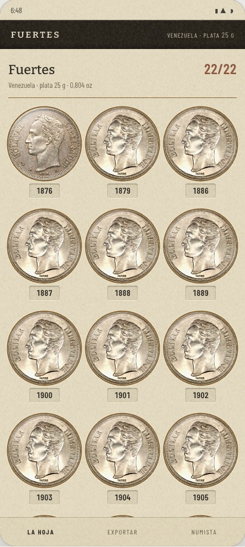

# La ceremonia: el sello es un estado, y la moneda viaja a su casilla

Respuesta del [#304](https://github.com/jenarvaezg/coindex/issues/304), decidida el 8 de agosto de
2026 sobre un prototipo en HTML a tamaño de móvil real (411 × 914 dp, los del Pixel 7 del
[#296](https://github.com/jenarvaezg/coindex/issues/296)), con la lámina completa del padre de los
Fuertes de Venezuela (22 de 22, de 1876 a 1936) y el índice del
[#300](https://github.com/jenarvaezg/coindex/issues/300).

El sello de completado forma parte del dibujo de una hoja llena; no es una medalla. La transición
del índice a la lámina lleva la moneda de la tarjeta a su casilla, no a la primera.

## Completar todavía no es un acontecimiento

El ticket daba por hecho que completar una lámina es un acontecimiento. Las seis láminas completas
del padre lo están desde el día en que se curó su catálogo, entre el 30 de julio y el 6 de agosto de
2026:

| lámina | catálogo creado |
| --- | --- |
| Fuertes · 22/22 | 1 ago 2026 (#87) |
| 1000 escudos de plata .500 · 19/19 | 31 jul 2026 (#42) |
| 500 escudos de plata .500 · 7/7 | 30 jul 2026 |
| Portugal 1983 · Exposición Europea de Arte · 3/3 | 30 jul 2026 |
| Venezuela 1975 · Conservación · 2/2 | 4 ago 2026 (#156) |
| Italia 2003 · Europa dei Popoli · 2/2 | 6 ago 2026 (#255) |

El padre no ha completado ninguna lámina dentro de Coindex: se completaron al curar catálogos de
monedas que ya tenía. Por eso la ceremonia no felicita: le enseña algo suyo que no sabía.

Además, completar caduca. `issuedMembers()` (`CollectionCatalogAlbum.kt:60`) deja los miembros
`announced` fuera del divisor, así que un date run abierto se lee `19 de 19` hoy y `19 de 20` el día
que el curador convierte el año anunciado en casilla. 33 de los 74 catálogos son
`series_status: open`, justo el bullion anual que el padre sigue comprando. Sus seis completas son
cerradas, pero la primera abierta que se complete perderá el sello sin que él pierda nada.

> Una primera cuenta dio catorce completas, cinco de ellas abiertas, porque ignoraba el año:
> `memberMatches` (`CollectionCatalog.kt:147`) exige `item.recordedYear == member.year` en un date
> run. Rehecha, da las 6 que midió el #296 en el móvil.

## Lo que se elige

### El sello es un estado

Se lee del inventario, como el troquel: la lámina completa lo enseña y la que deja de estarlo deja
de enseñarlo. El problema que temía el ticket (decidir cuándo una lámina «acaba de completarse» sin
dispararse en cada arranque ni al sincronizar) desaparece, porque no hay acontecimiento que
recordar. Un álbum de papel tampoco tiene logros.

### Se estampa al abrir la hoja, nunca al sincronizar

La primera vez que se abre una lámina completa, el sello se estampa delante; después ya está
puesto. El disparador es abrir la hoja, no la red: sincronizar no estampa nada si no se abre. Cuesta
un bit por catálogo en `NamedValues` («ya te lo enseñé»), que es `SharedPreferences` y no una tabla.

Consecuencia aceptada: el estampado sólo lo ve quien entra. Si el padre completa una lámina y no la
abre en seis meses, el sello espera seis meses.

### Sólo en la hoja

El índice no cambia: la tarjeta ya marca las completas con el cociente en óxido (#300). Una tarjeta
del índice no se abre, así que un sello ahí obligaría a dispararlo al hacer scroll (once a la vez, y
otra vez al volver) o a inventar otro disparador sólo para el índice.

### El sello de caucho, sobre el cociente

Una estampa de tinta óxido girada 5,5°, en `multiply`, encima del `22/22` de la cabecera. El
cociente entra pálido y la tinta lo fija.

Va arriba y no al pie porque la ceremonia se dispara al abrir la hoja, y al abrirla estás arriba:
el pie de los Fuertes está a 706 px de scroll, y un sello al pie se estamparía fuera de pantalla. No
añade palabras ni cifras: se superpone al dato que ya estaba. Mide 84 × 76 dp y deja 122 dp de
holgura hasta donde acaba el título «Fuertes».

El sello depende del `n/n`: el 1 Bolívar 4/22 entra con sus dieciocho fantasmas y el cociente sin
sello.

### La moneda viaja a su casilla

Del índice a la lámina va un elemento compartido: la moneda de la tarjeta vuela a su casilla y la
rejilla entra detrás. Funciona porque desde el #300 el objeto es el mismo a los dos lados, un hueco
troquelado con su moneda dentro. `SharedTransitionLayout`, estable en el BOM `2026.06.01`.

Para que aterrice en la casilla que le toca hacen falta dos reglas:

- **La foto de la tarjeta es la primera emisión que el padre tiene**, no la primera del catálogo.
  Esto enmienda la regla del #300, con la que el índice enseñaba monedas que él no tiene: la tarjeta
  del 1 Bolívar lucía el de 1879, que en su lámina es un fantasma, y la moneda habría volado a todo
  color hasta un hueco vacío.
- **La hoja se abre por donde cae la moneda.** Si su casilla está bajo el pliegue (los cuatro
  Bolívares del padre son 1945 a 1965, las casillas 19 a 22 de 22), la lámina se abre desplazada
  hasta ella; si no, el aterrizaje ocurre fuera de pantalla.

Las dos reglas no chocan con el sello: en una lámina completa la primera casilla que tiene es la
primera, así que la hoja se abre arriba y el estampado cae a la vista. Sólo se abre desplazada una
lámina incompleta, que no lleva sello.

## Lo que se descarta

| | por qué se cae |
| --- | --- |
| **Que el sello sea un hecho y no un estado** («completada el 3 de agosto») | Habría que retirarlo cuando un date run abierto crezca, y decidir qué pasa con las seis ya completas el día que se instale. Además es vocabulario del cuadro de mandos que prohíbe `spec.md §0.4`. |
| **Que la app avise al sincronizar** | Fallaría en el caso más frecuente: anunciar «has completado la Filarmónica» el año que la hoja está a punto de crecer. Y es otra vez el cuadro de mandos. |
| **B · al pie · el sello en el hueco que sobra** |  Cabe sin quitar sitio a ninguna moneda (22 casillas en tres columnas dejan dos huecos libres), pero se estampa a 706 px de scroll, fuera de pantalla. Con 21 casillas no sobra ningún hueco y necesita su propia fila de 118 dp. |
| **C · el canto lo dice** |  No toca el papel, pero es texto: añade una palabra donde el #300 acababa de quitar 994, y en el sitio de menos peso visual de la pantalla. |
| **D · el cartón se cierra** (los 22 aros de latón en cascada) |  La más bonita y la que mejor sobreviviría al PNG, porque es el dibujo del cartón y no un objeto añadido. Pero nada enseña que el latón signifique «completa», así que se puede pasar por alto. |
| **E · la etiqueta engomada** | Un objeto flotando, lo mismo que el #300 descartó con la sombra de hoja. Además necesita dos datos, la palabra y el tramo de años, así que crece con la prosa. |
| **A · nada** | Con el #300 una hoja llena ya se distingue, y por eso se dibujó como control. Pero se parece mucho a una a la que le faltan dos, y esa no está completa. |
| **3 · la hoja se abre** (la tarjeta crece hasta la pantalla) | Serviría para los tres destinos, pero es una transición genérica de app, y escalar una foto de 121 dp a pantalla completa se ve blanda. |

## Los cabos que deja

- **La palabra del sello en una serie abierta.** El prototipo dibujó «al día» en vez de «completa»
  para una lámina de serie abierta, y el ticket no lo decidió. Por defecto, una sola palabra,
  «completa»: el caso no existe hoy (ninguna de las seis es abierta) y una segunda palabra habría
  que explicarla. El [#308](https://github.com/jenarvaezg/coindex/issues/308) puede cambiarlo al
  escribir el ADR.
- **Las tarjetas que no abren lámina.** `CardDestination` tiene tres clases (`Plate`, `Pieces` y
  `Box`) y sólo la primera aterriza en una hoja de huecos. La transición de las otras dos es de la
  lista de efectos ([#307](https://github.com/jenarvaezg/coindex/issues/307)).
- **El sello y un título largo.** Con «Fuertes» quedan 122 dp de holgura; un título de Numista de
  dos líneas queda bajo el sello. Lo decide el
  [#319](https://github.com/jenarvaezg/coindex/issues/319).
- **Se decidió en HTML, no en el emulador**, como el #300, el #302 y el #303. La implementación
  empieza confirmándolo en el AVD: los 300 ms del estampado y el `multiply` de la tinta sobre el
  papel con grano se ven distinto a 420 dpi. Son parámetros, no la decisión.
