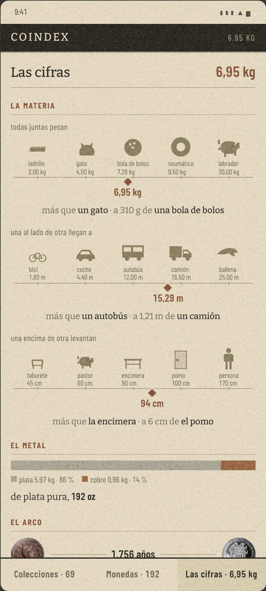
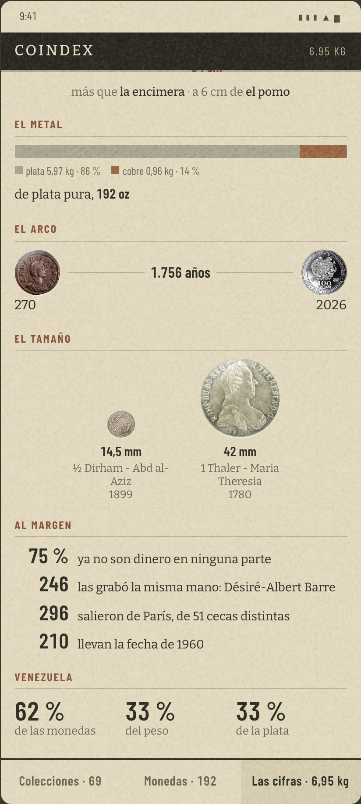
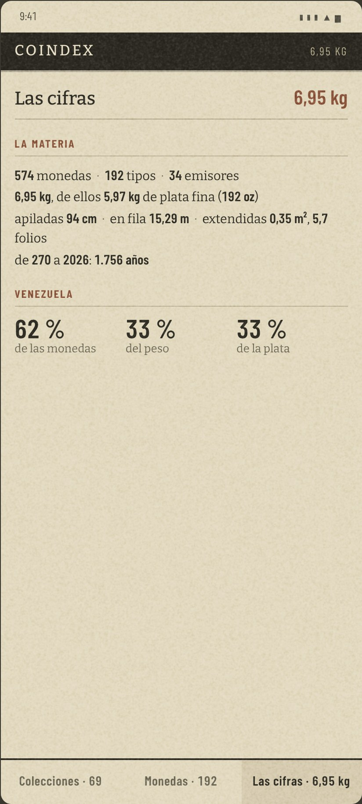
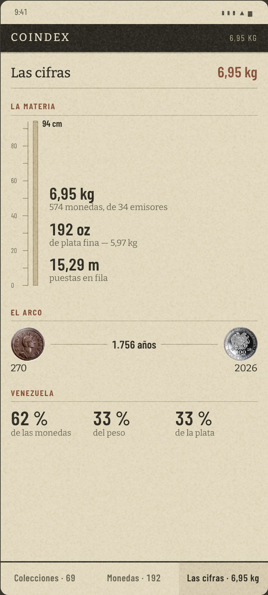
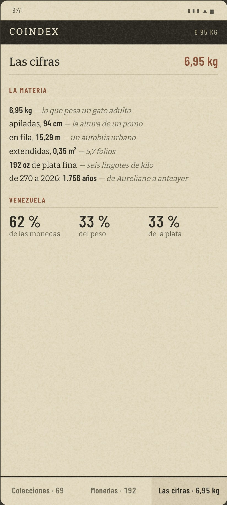
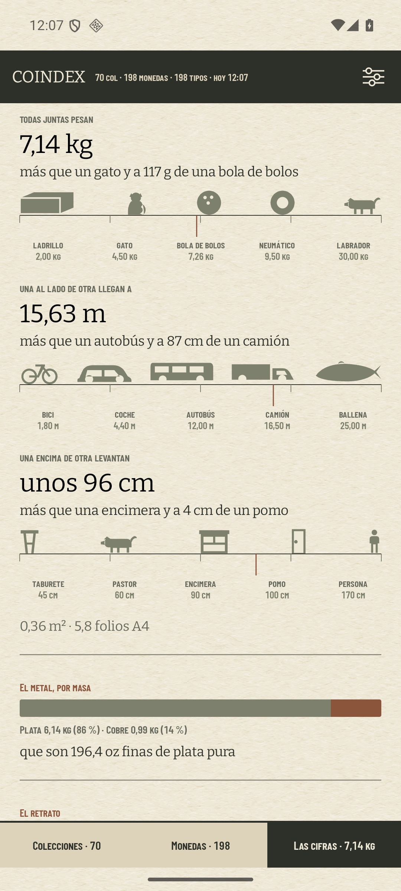

# Las cifras: la página se dibuja como una escalera de referentes, y el dinero abre

La respuesta del [#326](https://github.com/jenarvaezg/coindex/issues/326), decidida el 8 de agosto de
2026 sobre un prototipo en HTML a 411 × 914 dp con el papel del
[#300](https://github.com/jenarvaezg/coindex/issues/300) —Bitter y Barlow Condensed, fibra fina,
hueco troquelado— y con la colección real del padre corrida por el dominio: **574 monedas, 192 tipos,
34 emisores**.

**Los importes en euros no están en este documento, y las capturas del repositorio llevan el dinero
apagado.** Este repositorio es público. Los importes y las capturas con dinero viven en
`/private/tmp/coindex-privado/cifras-326.txt`.

## La forma que se elige

Una hoja de **1,9 pantallas** con seis bloques y sin estante, en este orden:

| bloque | qué lleva |
| --- | --- |
| **el valor** | el importe, de dónde sale y el sello del spot con su hora |
| **la materia** | tres escaleras de siluetas: peso, fila y pila |
| **el metal** | una barra por masa, no por moneda |
| **el arco** | la más vieja y la más nueva, unidas por los años que las separan |
| **el tamaño** | la más pequeña y la más grande, dibujadas a la misma escala |
| **al margen** | cuatro cifras que la colección no sabe que tiene (cinco desde el #491) |

## La escalera: una cifra física no significa nada sola

Es la decisión que ordena todo lo demás, y **no salió del dibujo sino del coleccionista**: la
comparación no es un adorno de la cifra, **es la cifra**. «6,95 kg» no dice nada; «más que un gato y a
310 g de una bola de bolos» sí.

Cada magnitud es una **escalera de cinco referentes** con la colección puesta entre dos de ellos:

- **todas juntas pesan** — ladrillo 2 kg · gato 4,5 · **bola de bolos 7,26** · neumático 9,5 · labrador 30
- **una al lado de otra llegan a** — bici 1,8 m · coche 4,4 · **autobús 12** · camión 16,5 · ballena 25
- **una encima de otra levantan** — taburete 45 cm · pastor 60 · **encimera 90** · pomo 100 · persona 170

Tres cosas que la escalera obliga a decidir:

- **La escala es ordinal, no métrica.** Los cinco referentes van equiespaciados y la colección se
  interpola entre sus dos vecinos. Se probó logarítmica primero y amontonaba tres rótulos encima del
  cuarto: la bola de bolos y el neumático se pisaban, y el camión desaparecía bajo la marca. Por eso
  mismo **no lleva zoom**: hacer zoom sobre una escala ordinal no significa nada, y volverla métrica
  devuelve los solapes.
- **La escalera tiene que decir qué mide.** Sin el rótulo —«una al lado de otra llegan a»— las dos de
  abajo son dos rayas con bichos encima. Son cinco palabras que **no son mobiliario sino el enunciado
  de la cifra**, y por eso pasan el listón del [#305](https://github.com/jenarvaezg/coindex/issues/305).
- **La marca cuelga por debajo de la raya.** Encima pisaba el rótulo del referente más cercano
  siempre que la colección caía cerca de uno, que es justo cuando la escalera está diciendo algo.

Y trae gratis lo que ningún número suelto da: **el siguiente referente tira hacia delante**. La
colección avanza por una escalera fija, así que a medida que entran monedas se ve qué acaba de superar
y qué tiene a un palmo. Es el *revela, no reprocha* del [#304](https://github.com/jenarvaezg/coindex/issues/304)
aplicado a la materia.

## El dinero abre la página

El importe va arriba del todo, antes que la materia. Quien entra a «Las cifras» viene a ver lo que
vale, y ponerlo debajo es cortesía mal entendida.

No contradice al [#316](https://github.com/jenarvaezg/coindex/issues/316), que quitó el dinero de la
barra de jerarquías: lo que allí se rechazó fue **un importe que cambia solo en una barra permanente**
—un ticker de bolsillo—, y aquí el número está en la página que has abierto a propósito. El recuento
de la celda sigue siendo el peso.

Debajo del importe, dos cosas y ninguna más: **de dónde sale** («el mayor de tres precios en cada
moneda: el catálogo de Numista, lo que pagaste o su plata») y **el sello del spot con su hora**, que es
lo que impide leerlo como una cotización.

## El metal se reparte por masa, no por moneda

Salió de un malentendido que resultó ser el hallazgo: la barra de tres colores bajo el importe se leyó
como **«tanto de plata, tanto de cobre, tanto de oro»** cuando decía de dónde salía el precio de cada
moneda. Una barra que se lee como otra cosa está fallando, así que se fue.

Y la que se pedía —el reparto por metal— resultó tener contenido, pero **sólo si se cuenta por masa**:

| | por moneda | por masa |
| --- | ---: | ---: |
| **padre** | 565 de 574 son de plata (98 %) | **plata 5,975 kg (86 %) · cobre 963 g (14 %)** |
| **Jose** | — | plata 2,058 kg (95 %) · cobre 104 g (5 %) |

Contar monedas daba una barra de un solo color. Contar masa dice que **casi un kilo de la colección no
es plata**, porque una moneda de plata .835 es un 16,5 % de cobre. Ninguna de las dos colecciones tiene
oro hoy, así que la barra es plata contra cobre — y crece sola el día que entre otro metal, que era
exactamente lo que se pedía de ella.

## Las cifras «al margen»

Estas no las pidió nadie: salen de buscar qué más hay en la ficha de Numista que ya está dentro del
APK. Las cuatro están medidas sobre las 574 monedas del padre.

| cifra | de dónde sale |
| --- | --- |
| **75 % ya no son dinero en ninguna parte** | `demonetization.is_demonetized`, presente en el 98 % de sus tipos |
| **246 las grabó la misma mano: Désiré-Albert Barre** | `engravers` y `designers` de las dos caras; el 43 % de la colección, todas venezolanas (1 Bolívar, 50 Céntimos, 5 Bolívares) |
| **296 salieron de París, de 51 cecas distintas** | `mints`; 292 de esas 296 son bolívares — Venezuela acuñaba en Francia |
| **210 llevan la fecha de 1960** | un solo año es el 37 % de todo |

> **Ampliado el 14 de agosto de 2026 ([#491](https://github.com/jenarvaezg/coindex/issues/491)): son
> cinco, y la quinta es de otra clase.** «40 % están sin circular o casi» sale de `grade`, que está en
> el 100 % de sus filas — y es la única de las cinco que **no** sale de la ficha de Numista sino de su
> propia mecanografía: la colección sí sabe que la tiene. Se cuenta por piezas como las otras cuatro, y
> eso la invierte: por filas son 178 de 229 (78 %) y por piezas 227 de 572 (40 %), porque sus siete
> bultos venezolanos son 298 piezas en `f`. Las dos son ciertas y sólo una comparte denominador con el
> resto de la página.

Y **el tamaño**, que es un dibujo y no una cifra: la más pequeña y la más grande **a la misma escala**,
un ½ dirham de 14,5 mm de 1899 contra un tálero de María Teresa de 42 mm de 1780. Es lo que hace una
guía de campo de verdad y sale gratis: `size` está en el **100 %** de los tipos.

Se midieron dos más y se descartaron por flojas: la **racha de años seguidos** son sólo 17 (2010-2026),
y el reparto **por siglos** es «el 76 % del XX», que no sorprende a nadie.

## Lo que se descarta

| | por qué se cae |
| --- | --- |
| **La torre de 94 cm a escala** | Era la apuesta de la casa: la colección como un solo objeto, dibujada a escala honesta. Y la escala honesta la mata — 574 monedas de 26,6 mm apiladas son **una aguja de 8 px de ancho** que gasta 250 px de la primera pantalla y deja media pantalla en blanco. No se entiende sin leer la regla. |
| **La comparación en texto** («pesa como un gato adulto») | La idea era buena y la forma no: el coleccionista quería figuritas, no cursiva. Es la misma información convertida en prosa, que es lo que este mapa vino a podar. |
| **El colofón sin dibujo** | Cabe entera en 1,11 pantallas y no tiene una sola imagen. Se lee como una tabla, que es el cuadro de mandos entrando por la puerta de atrás. |
| **La banda de fuentes del precio** | Se leyó como el metal. Ver arriba. |
| **La banda por ley de plata** | .835 el 57 %, .925 el 17 %, .900 el 10 %… Tiene reparto, pero responde a una pregunta que nadie hace: la que importa es cuánta plata hay, y ésa es la de masa. |
| **«92 monedas —el 16 %— son la mitad de ese valor»** | Verdadera y opaca. Nadie sabe qué hacer con ella. |
| **«A una casilla»: el coste de cerrar cada lámina** | **No vive en esta página.** Es lo que falta, no lo que hay, y el rótulo mentía: de las 14 láminas a tiro, sólo dos están a una casilla. Su sitio es la cabecera de la lámina, donde el #316 ya lo había puesto. El dato **no se pierde**: se consultó hueco a hueco a Numista y **13 de las 14 tienen precio (93 %)** — está en el anexo privado. |
| **Zoom en las escaleras** | Ver arriba: la escala es ordinal. |

## Lo que la medición corrigió del #316

Al recalcular las cifras desde el volcado del dominio aparecieron dos cosas que el informe del #316 no
decía bien:

- **El arco de 1.756 años sólo existe si las piezas sin año heredan el de su tipo.** 23 filas no traen
  año —los escudos portugueses sin fecha de emisión y el denario romano— y sin esa regla el arco se
  queda en **246 años (1780-2026)**. Es el mismo cabo que el #315 dejó abierto sobre los dos años de una
  pieza, y ahora tiene una tercera lectura que la reescritura de `spec.md` tiene que recoger.
- **Venezuela es también el 30 % del valor**, no sólo el 62 % de las piezas y el 33 % del peso. Los tres
  números juntos siguen diciendo lo mismo, y el tercero lo remata: son muchas monedas pequeñas.

## Lo que hereda la implementación

- **Las siluetas hay que dibujarlas y mantenerlas.** Son catorce en el prototipo (ladrillo, gato, bola
  de bolos, neumático, perro, bici, coche, autobús, camión, ballena, taburete, encimera, pomo, persona)
  y están hechas a mano en SVG. No son un asset que se pueda descargar: son parte de la identidad.
- **La escalera se queda corta por arriba.** El día que la colección pase de la ballena o del labrador
  hay que ampliar la lista de referentes. La escalera es un dato de la app, no del usuario.
- **El interruptor del dinero es de la exportación y sólo de ella** (#228, ADR 0021 §13). En la página
  no hay nada que apagar. Y apagarlo **no es esconder la sección del importe**: hay cifras derivadas que
  también son dinero — el prototipo dejaba escapar «Venezuela · 30 % del valor» con el dinero apagado, y
  con él apagado esa casilla enseña la plata.
- **Nada de esto se ha visto en un teléfono.** Se decidió en HTML, como el #300 y el #315. La primera
  sesión de implementación empieza confirmándolo en el AVD.

## Lo que el teléfono corrigió, tres días después

El [#398](https://github.com/jenarvaezg/coindex/issues/398) es lo que respondió a la última línea de
arriba, y lo abrió el coleccionista viendo la v1.2.0 en su móvil: *«el diseño se ve regular, el texto es
poco claro; lo de plata de hoy no queda claro… aparte de eso en general guay»*. Cinco cosas, ninguna
estructural — los seis bloques y su orden aguantan.

- **El sello del spot decía `PLATA DE HOY` y se leía como el rótulo del bloque siguiente.** Iba en las
  mismas versalitas y el mismo rust que `EL VALOR` o `LA MATERIA`, y pegado al filete de cierre. Ahora
  dice **`plata: 56,06 €/oz · hoy 11:02`**, en gris, y va **arriba, contra el importe** en lugar de al
  final del bloque: la explicación del método cierra, y lo que toca el filete es prosa serif que no puede
  confundirse con un encabezado. La hora es la que este mapa pedía —«el sello del spot con su hora»— y
  nunca había llegado; el precio estaba en `SilverSpot` al lado de la fecha, sin enseñarse. Un sello sin
  cifra no impide leer el total como una cotización, que es todo su trabajo (ADR 0028 §5).
- **Los días eran días transcurridos y no de calendario.** Un spot leído ayer a las 23:00 y mirado a las
  08:00 daba nueve horas, que son cero días, que se anunciaban como «hoy». Invisible mientras la línea no
  llevaba hora; una contradicción en cuanto la lleva.
- **La escalera había perdido las magnitudes de sus referentes.** El prototipo ponía `ladrillo 2,00 kg`
  bajo cada silueta y la implementación dejó sólo `LADRILLO`. Sin el número, los cinco nombres son un
  orden que hay que creerse: nada dice por qué el ladrillo va antes del gato, y la marca sólo se puede
  contrastar con el equiespaciado de las marquitas, que es ordinal a propósito y no dice nada de
  distancias. Es la decisión que ordena la página entera y era la que había quedado más muda.
- **«La materia» decía el peso dos veces.** La línea de resumen abría con `7,14 kg` y la primera escalera
  lo repetía tres líneas más abajo en cuerpo de display. Se queda con el censo —`580 piezas de 35
  emisores`— y las onzas finas se van al bloque del metal, que es donde este mapa las tenía.
- **Y allí resultaron ser la misma cifra dos veces.** Bajo `PLATA 6,14 KG (86 %)`, el «de plata pura,
  196,4 oz finas» del prototipo se lee como un dato nuevo cuando es esa misma plata pesada en la unidad
  del bullion. Dicho como conversión —**«que son 196,4 oz finas de plata pura»**— deja de haber nada que
  reconciliar. Esto no lo vio el HTML: en el prototipo las dos líneas estaban separadas por la barra y
  media pantalla de contexto.

Queda una cosa sin tocar, y es del orden de la nomenclatura y no de esta página: la barra dice
`198 monedas` y «la materia» dice `580 piezas`. Son dos granos de verdad —tipos poseídos y ejemplares—
pero nada en pantalla lo explica.
