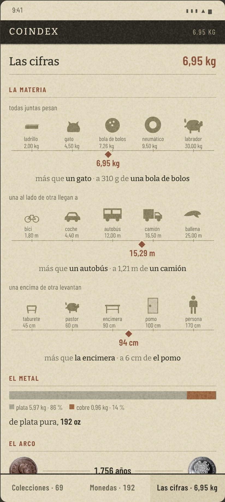
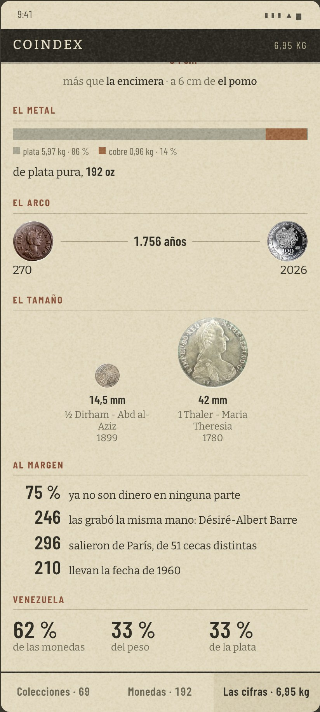
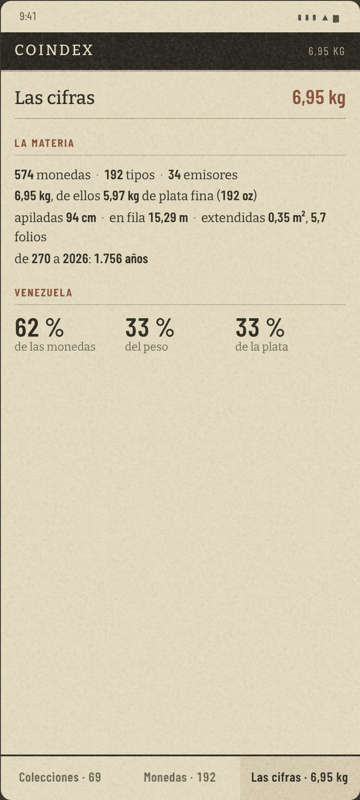
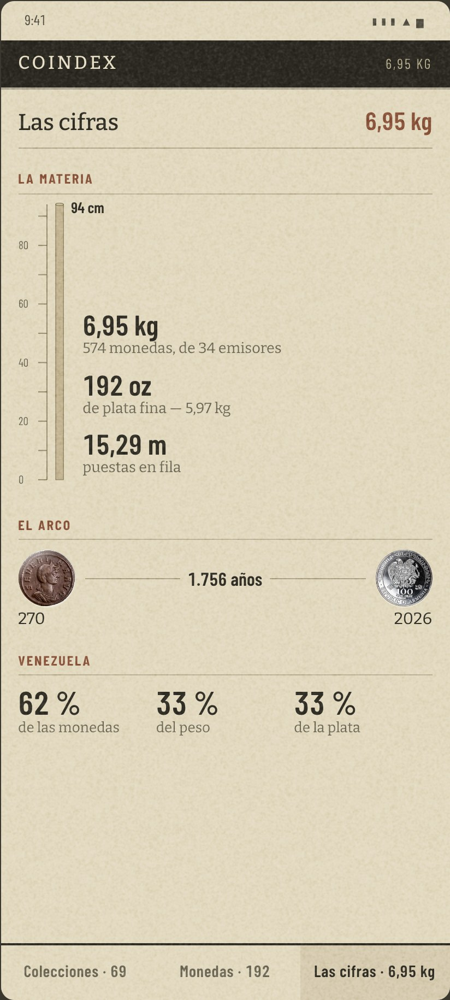
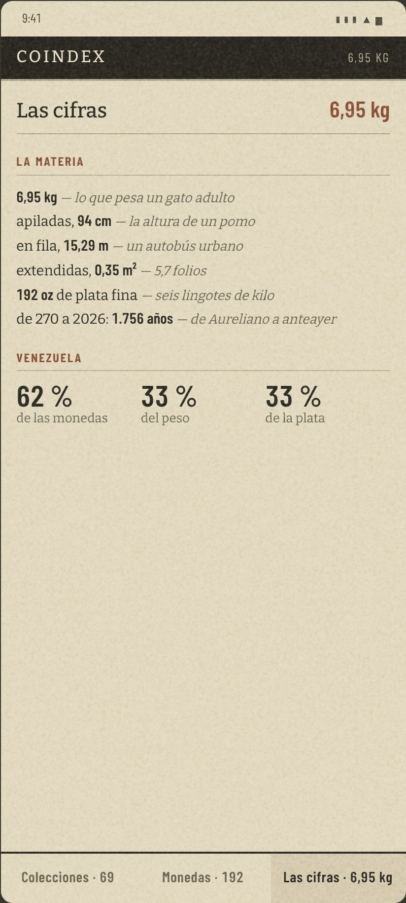
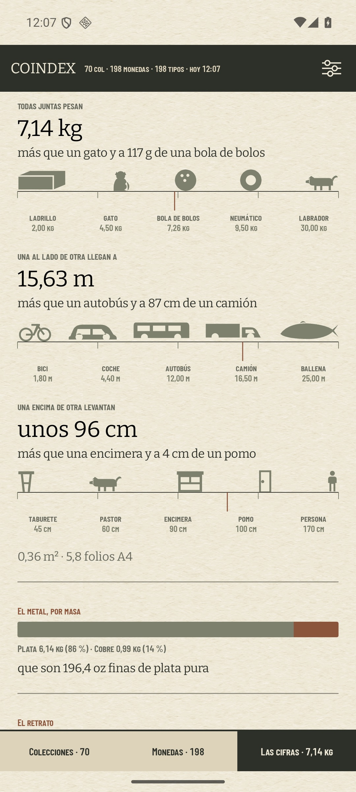

# Las cifras: la página es una escalera de referentes, y el dinero abre

Respuesta del [#326](https://github.com/jenarvaezg/coindex/issues/326), decidida el 8 de agosto de
2026 sobre un prototipo en HTML a 411 × 914 dp con el papel del
[#300](https://github.com/jenarvaezg/coindex/issues/300) (Bitter y Barlow Condensed, fibra fina,
hueco troquelado) y la colección real del padre pasada por el dominio: 574 monedas, 192 tipos,
34 emisores.

Los importes en euros no están en este documento y las capturas del repositorio llevan el dinero
apagado, porque el repositorio es público. Los importes y las capturas con dinero viven en
`/private/tmp/coindex-privado/cifras-326.txt`.

## La forma que se elige

Una hoja de 1,9 pantallas con seis bloques y sin estante, en este orden:

| bloque | qué lleva |
| --- | --- |
| **el valor** | el importe, de dónde sale y el sello del spot con su hora |
| **la materia** | tres escaleras de siluetas: peso, fila y pila |
| **el metal** | una barra por masa, no por moneda |
| **el arco** | la más vieja y la más nueva, unidas por los años que las separan |
| **el tamaño** | la más pequeña y la más grande, dibujadas a la misma escala |
| **al margen** | cuatro cifras que la colección no sabe que tiene |

## La escalera: una cifra física necesita con qué compararla

Es la decisión que ordena el resto, y vino del coleccionista: la comparación es la cifra. «6,95 kg»
no dice nada; «más que un gato y a 310 g de una bola de bolos» sí.

Cada magnitud es una escalera de cinco referentes con la colección colocada entre dos de ellos:

- **todas juntas pesan** — ladrillo 2 kg · gato 4,5 · **bola de bolos 7,26** · neumático 9,5 · labrador 30
- **una al lado de otra llegan a** — bici 1,8 m · coche 4,4 · **autobús 12** · camión 16,5 · ballena 25
- **una encima de otra levantan** — taburete 45 cm · pastor 60 · **encimera 90** · pomo 100 · persona 170

Tres decisiones que impone la escalera:

- **La escala es ordinal, no métrica.** Los cinco referentes van equiespaciados y la colección se
  interpola entre sus dos vecinos. Con escala logarítmica se amontonaban tres rótulos encima del
  cuarto: la bola de bolos y el neumático se pisaban, y el camión desaparecía bajo la marca. Por lo
  mismo no lleva zoom: sobre una escala ordinal no significa nada, y volverla métrica devuelve los
  solapes.
- **La escalera dice qué mide.** Sin el rótulo («una al lado de otra llegan a») las dos de abajo son
  dos rayas con bichos encima. Esas cinco palabras son el enunciado de la cifra, no mobiliario, y
  por eso pasan el listón del [#305](https://github.com/jenarvaezg/coindex/issues/305).
- **La marca cuelga por debajo de la raya.** Encima pisaba el rótulo del referente más cercano cada
  vez que la colección caía cerca de uno, que es cuando la escalera dice algo.

Además, el siguiente referente tira hacia delante: la escalera es fija, así que según entran monedas
se ve qué se acaba de superar y qué queda cerca. Es el *revela, no reprocha* del
[#304](https://github.com/jenarvaezg/coindex/issues/304) aplicado a la materia.

## El dinero abre la página

El importe va arriba del todo, antes que la materia: quien entra en «Las cifras» viene a ver lo que
vale.

No contradice al [#316](https://github.com/jenarvaezg/coindex/issues/316), que quitó el dinero de la
barra de jerarquías: allí se rechazó un importe que cambia solo en una barra permanente, y aquí el
número está en una página que se abre a propósito. El recuento de la celda sigue siendo el peso.

Debajo del importe, sólo dos cosas: de dónde sale («el mayor de tres precios en cada moneda: el
catálogo de Numista, lo que pagaste o su plata») y el sello del spot con su hora, para que no se lea
como una cotización.

## El metal se reparte por masa, no por moneda

La barra de tres colores bajo el importe, que decía de dónde salía el precio de cada moneda, se
leyó como «tanto de plata, tanto de cobre, tanto de oro», así que se quitó. El reparto por metal que
sí se pedía sólo tiene contenido contado por masa:

| | por moneda | por masa |
| --- | ---: | ---: |
| **padre** | 565 de 574 son de plata (98 %) | **plata 5,975 kg (86 %) · cobre 963 g (14 %)** |
| **Jose** | — | plata 2,058 kg (95 %) · cobre 104 g (5 %) |

Por moneda, la barra es de un solo color. Por masa dice que casi un kilo de la colección no es
plata, porque una moneda de plata .835 lleva un 16,5 % de cobre. Ninguna de las dos colecciones
tiene oro hoy, así que la barra es plata contra cobre, y crece sola el día que entre otro metal.

## Las cuatro cifras «al margen»

Salen de buscar qué más hay en la ficha de Numista que ya viaja en el APK. Medidas sobre las 574
monedas del padre:

| cifra | de dónde sale |
| --- | --- |
| **75 % ya no son dinero en ninguna parte** | `demonetization.is_demonetized`, presente en el 98 % de sus tipos |
| **246 las grabó la misma mano: Désiré-Albert Barre** | `engravers` y `designers` de las dos caras; el 43 % de la colección, todas venezolanas (1 Bolívar, 50 Céntimos, 5 Bolívares) |
| **296 salieron de París, de 51 cecas distintas** | `mints`; 292 de esas 296 son bolívares — Venezuela acuñaba en Francia |
| **210 llevan la fecha de 1960** | un solo año es el 37 % de todo |

Y el tamaño, que es un dibujo y no una cifra: la más pequeña y la más grande a la misma escala, un
½ dirham de 14,5 mm de 1899 contra un tálero de María Teresa de 42 mm de 1780. `size` está en el
100 % de los tipos.

Se midieron dos más y se descartaron por flojas: la racha de años seguidos son sólo 17 (2010-2026),
y el reparto por siglos es «el 76 % del XX».

## Lo que se descarta

| | por qué se cae |
| --- | --- |
| **La torre de 94 cm a escala** | La colección como un solo objeto, a escala real. A esa escala, 574 monedas de 26,6 mm apiladas son una aguja de 8 px de ancho que gasta 250 px de la primera pantalla y deja media pantalla en blanco; no se entiende sin leer la regla. |
| **La comparación en texto** («pesa como un gato adulto») | La misma información en prosa; el coleccionista quería figuras. |
| **El colofón sin dibujo** | Cabe en 1,11 pantallas sin una sola imagen y se lee como una tabla, es decir, como un cuadro de mandos. |
| **La banda de fuentes del precio** | Se leyó como el metal (ver arriba). |
| **La banda por ley de plata** | .835 el 57 %, .925 el 17 %, .900 el 10 %… Responde a una pregunta que nadie hace: la que importa es cuánta plata hay, y esa es la de masa. |
| **«92 monedas —el 16 %— son la mitad de ese valor»** | Cierta, pero no sugiere nada que hacer. |
| **«A una casilla»: el coste de cerrar cada lámina** | No va en esta página: es lo que falta, no lo que hay, y el rótulo era falso (de las 14 láminas a tiro, sólo dos están a una casilla). Su sitio es la cabecera de la lámina, donde ya lo había puesto el #316. Se consultó a Numista hueco a hueco y 13 de las 14 tienen precio (93 %); el detalle está en el anexo privado. |
| **Zoom en las escaleras** | La escala es ordinal (ver arriba). |

## Lo que la medición corrigió del #316

Al recalcular las cifras desde el volcado del dominio:

- **El arco de 1.756 años sólo existe si las piezas sin año heredan el de su tipo.** 23 filas no
  traen año (los escudos portugueses sin fecha de emisión y el denario romano), y sin esa regla el
  arco se queda en 246 años (1780-2026). Es el mismo cabo que el #315 dejó sobre los dos años de una
  pieza, con una tercera lectura que la reescritura de `spec.md` tiene que recoger.
- **Venezuela es también el 30 % del valor**, además del 62 % de las piezas y el 33 % del peso.

## Lo que hereda la implementación

- **Las siluetas hay que dibujarlas y mantenerlas.** Son catorce en el prototipo (ladrillo, gato,
  bola de bolos, neumático, perro, bici, coche, autobús, camión, ballena, taburete, encimera, pomo,
  persona), hechas a mano en SVG. No son un asset que se pueda descargar: son parte de la identidad.
- **La escalera se queda corta por arriba.** El día que la colección pase de la ballena o del
  labrador hay que ampliar los referentes, que son un dato de la app, no del usuario.
- **El interruptor del dinero es sólo de la exportación** (#228, ADR 0021 §13); en la página no hay
  nada que apagar. Apagarlo no es sólo esconder la sección del importe: hay cifras derivadas que
  también son dinero. El prototipo dejaba ver «Venezuela · 30 % del valor» con el dinero apagado;
  apagado, esa casilla enseña la plata.
- **Nada de esto se ha visto en un teléfono.** Se decidió en HTML, como el #300 y el #315; la
  implementación empieza confirmándolo en el AVD.

## Lo que el teléfono corrigió, tres días después

El [#398](https://github.com/jenarvaezg/coindex/issues/398) lo abrió el coleccionista viendo la
v1.2.0 en su móvil: *«el diseño se ve regular, el texto es poco claro; lo de plata de hoy no queda
claro… aparte de eso en general guay»*. Cinco cambios, ninguno estructural: los seis bloques y su
orden se mantienen.

- **El sello del spot decía `PLATA DE HOY` y se leía como el rótulo del bloque siguiente**: iba en
  las mismas versalitas y el mismo rust que `EL VALOR` o `LA MATERIA`, pegado al filete de cierre.
  Ahora dice `plata: 56,06 €/oz · hoy 11:02`, en gris, y va arriba, junto al importe; lo que toca el
  filete es la explicación del método, en serif, que no se confunde con un encabezado. La hora la
  pedía este documento y no se había implementado, y el precio estaba en `SilverSpot` junto a la
  fecha sin enseñarse. Sin la cifra, el sello no evita que el total se lea como una cotización
  (ADR 0028 §5).
- **Los días eran días transcurridos, no de calendario.** Un spot leído ayer a las 23:00 y mirado a
  las 08:00 daba nueve horas, cero días, «hoy». No se notaba mientras la línea no llevaba hora.
- **La escalera había perdido las magnitudes de sus referentes.** El prototipo ponía
  `ladrillo 2,00 kg` bajo cada silueta y la implementación dejó sólo `LADRILLO`. Sin el número, el
  orden de los referentes hay que creérselo, y la marca sólo se contrasta con el equiespaciado de
  las marquitas, que es ordinal a propósito y no dice nada de distancias.
- **«La materia» decía el peso dos veces.** La línea de resumen abría con `7,14 kg` y la primera
  escalera lo repetía tres líneas más abajo en cuerpo de display. Se queda con el censo
  (`580 piezas de 35 emisores`) y las onzas finas pasan al bloque del metal.
- **Y allí eran la misma cifra dos veces.** Bajo `PLATA 6,14 KG (86 %)`, el «de plata pura,
  196,4 oz finas» del prototipo parecía un dato nuevo cuando es esa misma plata en la unidad del
  bullion. Dicho como conversión, «que son 196,4 oz finas de plata pura», no hay nada que
  reconciliar. En el prototipo las dos líneas estaban separadas por la barra y media pantalla, y no
  se notaba.

Queda sin tocar una cuestión de nomenclatura que no es de esta página: la barra dice `198 monedas`
y «la materia» dice `580 piezas`. Son dos granos reales (tipos poseídos y ejemplares), pero nada en
pantalla lo explica.
