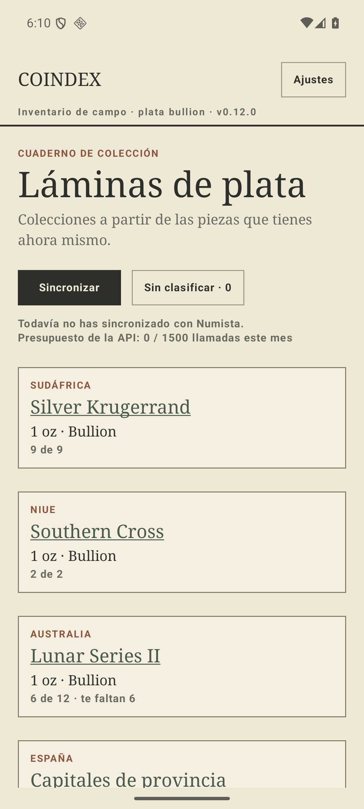
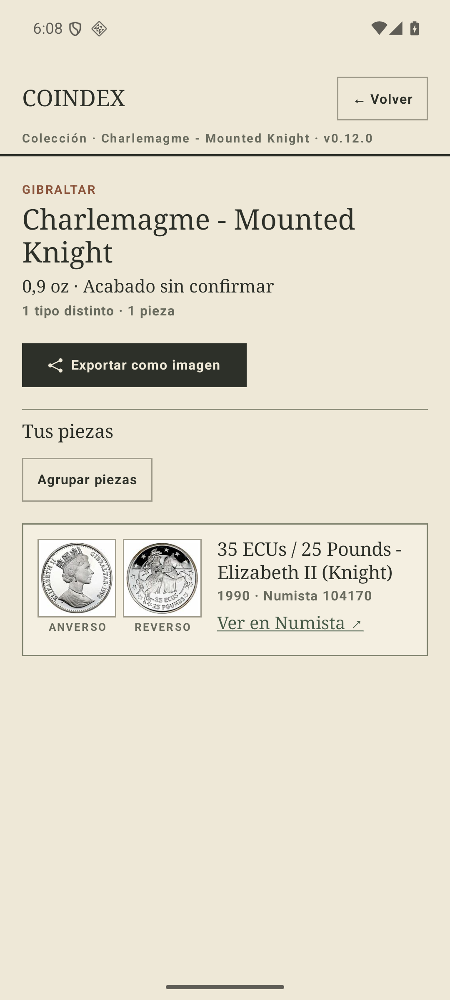
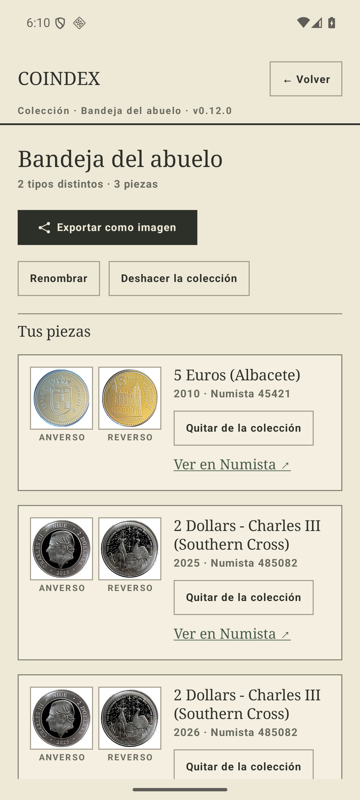
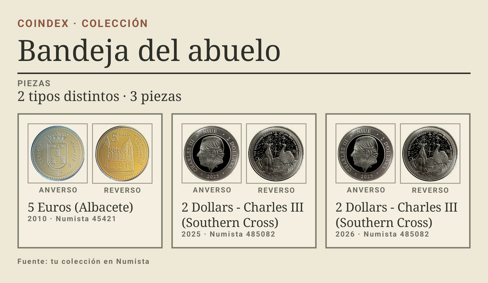

# Una tarjeta, un destino — corriendo (#167)

Capturas de la app con el ADR 0021 §9 implementado, tomadas en el AVD `coindex-ux` sobre la v0.12.0.

| | |
| --- | --- |
| **1 · El índice** | Ninguna tarjeta lleva ya «Ver lámina»: sólo el título abre, y las tarjetas encogen. «Silver Krugerrand» abre su lámina de un toque. |
| **2 · Una tarjeta sin lista de emisiones** | Gibraltar, una sola pieza. Eyebrow de país, no de especie; el recuento es el de la tarjeta; «Exportar como imagen» y «Agrupar piezas». |
| **3 · Una caja propia** | «Bandeja del abuelo», dos países, sin eyebrow. Es la misma pantalla que la 2 con el mantenimiento: renombrar, deshacer y quitar por fila. Sin «Agrupar piezas», que nunca tuvo. |
| **4 · La hoja exportada** | `coindex-bandeja-del-abuelo.png`, 1680×975. Dice «COLECCIÓN» donde una lámina dice «CATÁLOGO CURADO», y no tiene casillas vacías: una caja no puede tener huecos (ADR 0020). |

