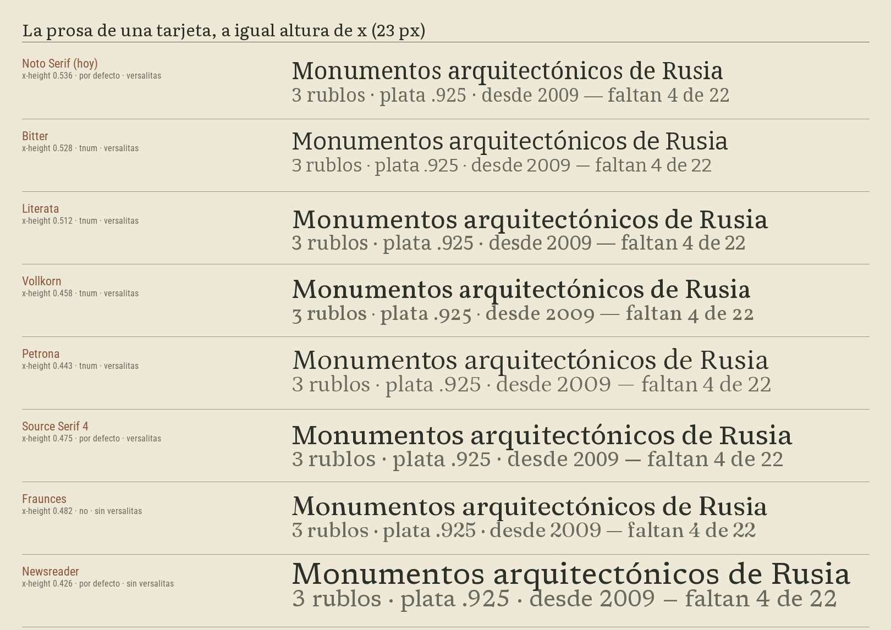
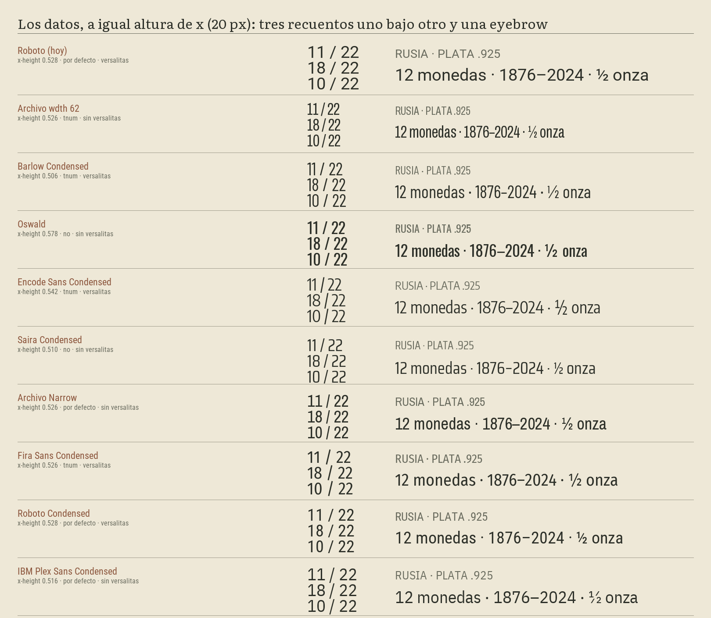

# Dos fuentes dentro del APK: cuáles, con qué licencia y a qué coste

La mesa puesta para el [#300 · La hoja](https://github.com/jenarvaezg/coindex/issues/300), dentro
del mapa [#278 · Forma y densidad](https://github.com/jenarvaezg/coindex/issues/278). Medido el 7
de agosto de 2026 sobre la v0.16.0.

Este informe **no elige**: mide once candidatas, descarta las que no sirven por un motivo
comprobable y deja las finalistas listas para verse en el emulador. Lo que sí decide son dos cosas
que no necesitan un prototipo para resolverse: **no subsetear** y **no dejar tres símbolos
sueltos en manos de la fuente del sistema**.

## El número que descarga la pregunta del peso

El `coindex-24.apk` de la v0.16.0 pesa **30,86 MB**, y el padre se lo descarga entero en cada
actualización (ADR 0011). Sus tres `classes.dex` suman 28,3 MB sin comprimir y la caché de fichas
sembrada, 3,1 MB.

El par de fuentes más caro que se ha medido añade **1,03 MB**; el más barato, **192 KB**. Es decir,
entre un **0,6 %** y un **3,4 %** del APK.

**El peso no es el criterio de esta decisión.** Lo que decide es cuánto aprieta la condensada y si
los recuentos se alinean; el coste en bytes cabe en el ruido de una versión.

## Cómo se ha medido

- **fontTools 4.61.1** sobre los TTF descargados del repositorio `google/fonts` (rama `main`), que
  es el canal de distribución de todas las candidatas menos ninguna: no se ha usado ningún
  recopilatorio de terceros. El script está en
  [`medir.py`](fuentes-empaquetadas-298/medir.py) y vuelve a bajarlo todo desde cero.
- **El ancho va normalizado por la altura de x**, no en ems. Comparar ems miente: una fuente
  estrecha con la x pequeña se ve pequeña y hay que subirla de cuerpo hasta que ocupa lo mismo. La
  columna `datos/x` es el ancho de la cadena `12 monedas · 1876–2024` dividido por la altura de x,
  y **cuanto menor, más aprieta a igual tamaño percibido**.
- **El peso es el del fichero comprimido con deflate**, que es como `aapt2` mete un `.ttf` en el
  APK — no el tamaño en disco, que es entre un 50 % y un 100 % mayor.
- **Las fuentes variables se han instanciado** en la posición en la que se usarían (`opsz=10` para
  las serif con eje óptico, `wdth=62` para Archivo) antes de medirlas. El master por defecto de
  Archivo es `wdth=100`, que no es condensado en absoluto.
- **El repertorio son 116 glifos**: todos los literales de cadena de la capa `ui/` (sin KDoc ni
  comentarios) más los campos de `data/` que llegan a pantalla (`title`, `short_name`, `name`,
  `series`, `label`). Se ha excluido a propósito lo que la app **no** pinta: `lettering` no se lee
  en ningún `.kt`, así que el cirílico, el árabe, el armenio y el chino de las leyendas de anverso y
  reverso no son un requisito de cobertura. `issuing_entity` tampoco se lee.

## Los cuatro glifos que casi ninguna fuente tiene, y ya hoy fallan

De los 116 glifos del repertorio, cuatro se salen del latín de cualquier fuente de texto:

| glifo | dónde | quién lo tiene |
| --- | --- | --- |
| `←` | `CoindexApp.kt:491` — «← Volver» | ninguna candidata, tampoco Noto Serif ni Roboto |
| `✓` | `PieceSelection.kt:78` — «✓ Elegida» | ninguna candidata, tampoco Noto Serif ni Roboto |
| `↗` | `FieldGuide.kt:170` — el enlace que abre Numista | ninguna candidata, tampoco Noto Serif ni Roboto |
| `С` | título del tipo 52234 de Numista y su miembro en `architectural-monuments-russia-3-roubles.json` | las que traen cirílico: Literata, Bitter, Vollkorn, Source Serif 4, Fira Sans Condensed, Oswald, Roboto Condensed |

Las dos filas dicen cosas distintas.

**Las tres flechas y el visto ya se pintan hoy con una fuente que no es la de la app**: ni el Noto
Serif ni el Roboto del sistema los tienen, así que Android los resuelve por *fallback* con Noto
Sans Symbols. Es decir, **tres de los pocos símbolos de la interfaz son ya un cuerpo extraño**, con
otro grosor y otro eje óptico, y empaquetar fuentes propias no lo empeora: lo delata. Son
candidatos exactos a lo que el mapa llama convertir prosa en forma — un icono vectorial en vez de
un carácter de texto. Va a la lista de efectos del
[#307](https://github.com/jenarvaezg/coindex/issues/307), no a este ticket.

**La `С` es una errata de Numista**: en `3 Roubles (Naval Сathedral of Saint Nicholas in
Kronstadt)`, la primera letra de *Cathedral* es una **С cirílica** (U+0421) tecleada en un título
en inglés. Ninguna fuente lo va a arreglar y ninguna candidata debería ser elegida por cubrirla.
Se corrige en Numista: [#314](https://github.com/jenarvaezg/coindex/issues/314).

## Las serif: la prosa de la guía de campo

| serif | zip | zip subseteada | prosa/x | contra hoy | x-height | versalitas | tabulares | faltan |
| --- | ---: | ---: | ---: | ---: | ---: | --- | --- | --- |
| **Noto Serif** — lo que hay hoy | 1075 KB | 437 KB | 44,4 | — | 0,536 | sí | por defecto | `←↗✓` |
| **Bitter** | **147 KB** | 82 KB | **44,5** | **+0 %** | 0,528 | sí | `tnum` | `↗✓` |
| **Vollkorn** | 256 KB | 124 KB | 47,6 | +7 % | 0,458 | sí | `tnum` | `✓` |
| **Literata** | 500 KB | 294 KB | 48,5 | +9 % | 0,512 | sí | `tnum` | `↗✓` |
| **Petrona** | 106 KB | 88 KB | 48,8 | +10 % | 0,443 | sí | `tnum` | `С↗✓` |
| **Fraunces** | 240 KB | 219 KB | 48,8 | +10 % | 0,482 | no | **no** | `С←↗✓` |
| **Source Serif 4** | 539 KB | 292 KB | 52,2 | +18 % | 0,475 | sí | por defecto | **—** |
| **Newsreader** | 261 KB | 236 KB | 56,5 | **+27 %** | 0,426 | no | por defecto | `С←↗✓` |



Lo que sale de la tabla:

- **Bitter es la única que no cuesta espacio.** Empata con el Noto Serif de hoy —44,5 contra
  44,4— y es la más barata de las grandes por un factor de tres. En un mapa cuya moneda es cuántas
  tarjetas caben, una serif con carácter que no ensancha el párrafo es un regalo.
- **Newsreader cuesta un 27 % de ancho de párrafo** frente a hoy, y Source Serif 4 un 18 %, por su
  x pequeña: para verse igual de grandes hay que subirlas de cuerpo, y entonces ocupan más. Son las
  que el prototipo tiene que justificar contra el espacio que se llevan — y la x de Newsreader, a
  los 2,2 mm que mide la tipografía más pequeña del cuaderno impreso, es la apuesta más arriesgada
  de la tabla.
- **Source Serif 4 es la única que cubre el repertorio entero**, incluida la `С` de la errata. No
  es un argumento para elegirla: la `С` se arregla en Numista, no en la tipografía.
- **Las tabulares no son problema en ninguna serif** salvo Fraunces, y en la serif casi da igual:
  los recuentos los pinta la condensada.
- **Petrona pesa 106 KB** y es la más barata de todas, pero comparte con Vollkorn y Newsreader la
  x pequeña. Barata no es lo mismo que densa.

## Las condensadas: los datos

| condensada | zip | zip subseteada | datos/x | contra hoy | x-height | versalitas | tabulares | faltan |
| --- | ---: | ---: | ---: | ---: | ---: | --- | --- | --- |
| **Roboto** — lo que hay hoy | 274 KB | 130 KB | 21,6 | — | 0,528 | sí | por defecto | `←↗✓` |
| **Archivo, eje `wdth` 62** | 248 KB | 194 KB | **14,2** | **−34 %** | 0,526 | no | `tnum` | `С↗✓` |
| **Barlow Condensed** | **48 KB** | 38 KB | 15,9 | **−26 %** | 0,506 | sí | `tnum` | `С←↗✓` |
| **Oswald** | 89 KB | 49 KB | 15,9 | −26 % | 0,578 | no | **no** | `←↗✓` |
| **Encode Sans Condensed** | 72 KB | 54 KB | 16,8 | −22 % | 0,542 | sí | `tnum` | `С↗✓` |
| **Saira Condensed** | 45 KB | 32 KB | 16,9 | −22 % | 0,510 | no | **no** | `С↗✓` |
| **Archivo Narrow** | 45 KB | 34 KB | 17,7 | −18 % | 0,526 | no | por defecto | `С↗✓` |
| **Fira Sans Condensed** | 204 KB | 106 KB | 18,4 | −15 % | 0,526 | sí | `tnum` | `↗✓` |
| **Roboto Condensed** | 208 KB | 103 KB | 19,1 | −12 % | 0,528 | sí | por defecto | `←↗✓` |
| **IBM Plex Sans Condensed** | 49 KB | 38 KB | 20,6 | −5 % | 0,516 | no | por defecto | `С` |



En la imagen, los tres recuentos uno bajo otro son la prueba de las cifras tabulares: donde la
barra `/` baila de una línea a la siguiente, los dígitos son proporcionales.

**Tres descartes que no necesitan una opinión:**

- **Oswald** y **Saira Condensed** tienen los dígitos proporcionales —diez y nueve anchos
  distintos— **y no tienen `tnum`**. No hay forma de alinear un recuento con ellas. En una app que
  es toda recuentos, es fatal. Fuera.
- **IBM Plex Sans Condensed no es una condensada de verdad**: aprieta un 5 % frente al Roboto que
  ya está en el teléfono. Su nombre promete lo que su dibujo no da. Fuera.

**Y una comprobación que sí se ha hecho, no supuesto:** en las siete que declaran `tnum`, se ha
resuelto la sustitución en el `GSUB` y se ha verificado que los diez dígitos acaban en glifos del
mismo ancho. Funciona en las siete. En Roboto Condensed, Archivo Narrow, IBM Plex y las dos serif
«por defecto», el `tnum` aparece incompleto porque **los dígitos ya son tabulares de fábrica** y la
feature sólo sirve para volver desde `pnum`.

Lo que queda:

- **Archivo con el eje `wdth` a 62 es la que más aprieta con diferencia**: −34 % de ancho, con la
  misma x-height que Roboto. Es un fichero variable con dos ejes, así que un solo `.ttf` da todos
  los anchos y todos los pesos, y el ancho se puede afinar en el emulador sin cambiar de fichero.
  Cuesta 248 KB y no tiene versalitas.
- **Barlow Condensed da un −26 % por 48 KB**, y sí tiene versalitas. Es la mejor relación de la
  tabla. Su pega: los dígitos no son tabulares por defecto, hay que pedir `tnum` en cada estilo
  que pinte un número, y un olvido se ve como un recuento que baila al scrollear.
- **Archivo Narrow es el término medio sin trampas**: −18 %, tabular de fábrica, 45 KB.

## Las versalitas no son un adorno: hoy están fingidas

`Theme.kt` dice, en su KDoc, «a condensed sans in small caps for data», pero lo que hace es poner
`FontWeight.Bold`, subir el `letterSpacing` a 0,8–1,4 sp y escribir el texto en mayúsculas. Eso no
son versalitas: son mayúsculas espaciadas, que gritan más y ocupan más.

De las candidatas condensadas, **sólo Barlow Condensed, Encode Sans Condensed, Fira Sans Condensed
y Roboto Condensed tienen `smcp`**. Archivo, Archivo Narrow, Oswald, Saira e IBM Plex, no. Si la
eyebrow de la tarjeta ha de ser versalita de verdad —y son 58 tarjetas × una eyebrow cada una— eso
recorta la lista a cuatro. Es una decisión de la hoja, no de este ticket, pero conviene entrar al
prototipo sabiendo que la elección de la condensada y la de la eyebrow son la misma elección.

## Cuántos cortes hacen falta

Medido en el código, no estimado: **la app usa hoy dos cortes**. `FontFamily.Serif` siempre en
`FontWeight.Normal` (diez usos) y `FontFamily.SansSerif` siempre en `Bold` (siete usos, todos
eyebrows y rótulos). **`FontStyle` no aparece ni una vez en `ui/`: no hay una sola itálica en la
app**, ni en la pantalla ni en el cuaderno impreso.

Con fuentes variables, «cortes» deja de significar «ficheros»: un `.ttf` variable da todos los
pesos. Pero **Compose no interpola los pesos por su cuenta** —lo dice la documentación de
Android—, así que cada peso se declara a mano con su `FontVariation.Settings`. Los ficheros son
uno; las entradas de la `FontFamily`, tantas como pesos se usen.

El mínimo defendible, entonces:

| escenario | ficheros | qué cubre |
| --- | ---: | --- |
| **Lo que la app usa hoy** | 2 | serif en un peso, condensada en dos (dato y eyebrow) |
| **Con itálica en la serif** | 3 | lo anterior más los nombres científicos que pide una guía de campo |

La itálica es la que hay que justificar: **duplica el coste de la serif** (Literata pasa de 500 KB
a 1,03 MB con su itálica) y hoy no se usa en ningún sitio. Si el prototipo de la hoja no encuentra
para qué, no entra.

## El coste, combinación a combinación

Sobre los 30,86 MB del APK de la v0.16.0:

| combinación | ficheros | zip | % del APK |
| --- | ---: | ---: | ---: |
| Bitter + Archivo Narrow | 2 | **192 KB** | **0,64 %** |
| Bitter + Barlow Condensed (Regular + SemiBold) | 3 | 245 KB | 0,81 % |
| Petrona + Encode Sans Condensed (Regular + SemiBold) | 3 | 250 KB | 0,83 % |
| Bitter + Bitter Italic + Archivo Narrow | 3 | 338 KB | 1,12 % |
| Vollkorn + Barlow Condensed (Regular + SemiBold) | 3 | 354 KB | 1,18 % |
| Literata + Archivo Narrow | 2 | 545 KB | 1,81 % |
| Literata + Archivo (eje `wdth`) | 2 | 748 KB | 2,48 % |
| Source Serif 4 + Archivo (eje `wdth`) | 2 | 786 KB | 2,61 % |
| Literata + Literata Italic + Archivo Narrow | 3 | 1,03 MB | 3,43 % |

Barlow y Encode son estáticas: cada peso es un fichero. Las demás son variables y un fichero cubre
todos los pesos.

## No subsetear

Cuatro candidatas llevan **nombre reservado** en su OFL: Bitter («Bitter Pro»), Encode Sans,
Saira e IBM Plex («Plex»). Las otras siete —Literata, Vollkorn, Petrona, Source Serif 4,
Newsreader, Fraunces, Archivo, Archivo Narrow, Barlow, Oswald, Roboto Condensed, Fira Sans— no
reservan ninguno. **Las once están bajo SIL Open Font License 1.1**, que permite empaquetar y
redistribuir dentro de un APK sideloadeado sin más condición que acompañar la licencia (ADR 0011);
ninguna candidata se ha caído por su licencia.

Subsetear a latín ahorra 206 KB en Literata y 65 KB en Bitter: un 0,67 % y un 0,21 % del APK. A
cambio, subsetear es **crear una versión modificada**, y con un nombre reservado eso
obliga a renombrar la tabla `name` del fichero —un script propio y una fuente que ya no se llama
como se llama— para no incumplir la cláusula.

**Recomendación: empaquetar el `.ttf` tal como se publica.** El ahorro no paga ni el script ni la
duda legal, y de paso la app se queda cubierta para el cirílico y el griego que Numista pueda
escupir en un título mañana.

## Lo que la OFL sí obliga, y hoy no está

La licencia exige que su texto y el copyright acompañen a la fuente redistribuida. **Coindex no
tiene hoy ninguna pantalla de licencias**: no aparece la palabra en toda la capa `ui/`. Y la deuda
no la estrena la tipografía — Coil 3.5.0, OkHttp 5.3.2 y Ktor ya viajan dentro del APK bajo Apache
2.0.

Empaquetar dos fuentes obliga a saldarla: hace falta **una entrada en Ajustes con los avisos**. Es
prosa nueva en la pantalla que el [#305](https://github.com/jenarvaezg/coindex/issues/305) está
podando, así que conviene que la poda la vea venir: son avisos legales, no son mobiliario
recortable, y su sitio natural es una pantalla secundaria a la que se entra queriendo.

## Lo que hace falta en `Theme.kt`

Una `FontFamily` por hueco, con el peso declarado a mano, y `FontFamily.Serif`/`SansSerif`
sustituidas en los diecisiete sitios donde se nombran: nueve en `Theme.kt` y ocho en
`NotebookSheet.kt`, que es el único otro fichero que declara tipografía.

```kotlin
private val fieldSerif = FontFamily(
    Font(R.font.bitter, variationSettings = FontVariation.Settings(FontVariation.weight(400))),
)
```

Y en cada estilo que pinte un número, si la condensada no es tabular de fábrica:

```kotlin
labelMedium = TextStyle(fontFamily = fieldCondensed, fontFeatureSettings = "tnum, smcp", …)
```

Las fuentes variables piden API 26 y `minSdk` es 29, así que no hace falta guardarraíl de versión.
Los ficheros van en `app/src/main/res/font/`, que **hoy no existe**.

## Lo que este ticket no decide

- **Cuál de las dos parejas se queda.** Se ve en el emulador, en el prototipo de la hoja
  ([#300](https://github.com/jenarvaezg/coindex/issues/300)), con la colección real y el cuaderno
  impreso a 300 dpi al lado.
- **Si hay itálica.** Depende de si la hoja encuentra para qué.
- **Si `←`, `✓` y `↗` se vuelven iconos.** Va a la lista de efectos
  ([#307](https://github.com/jenarvaezg/coindex/issues/307)).
