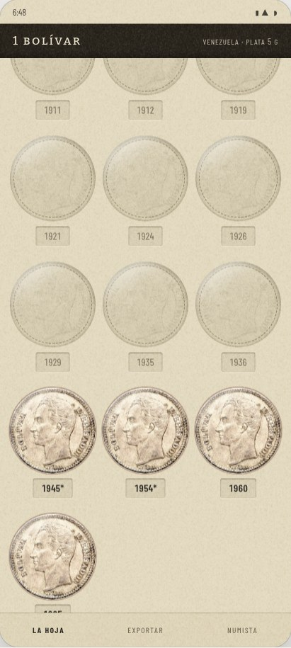
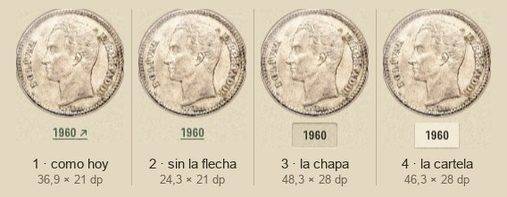
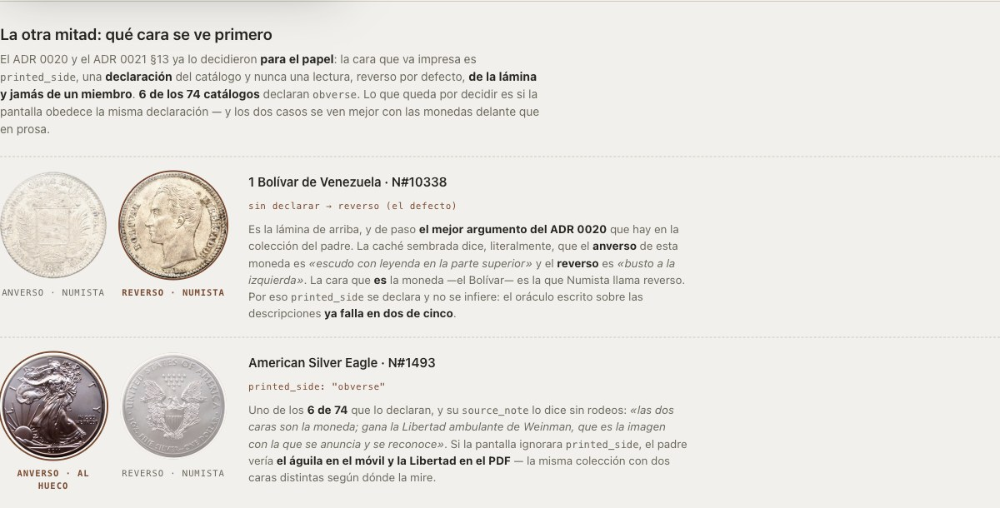
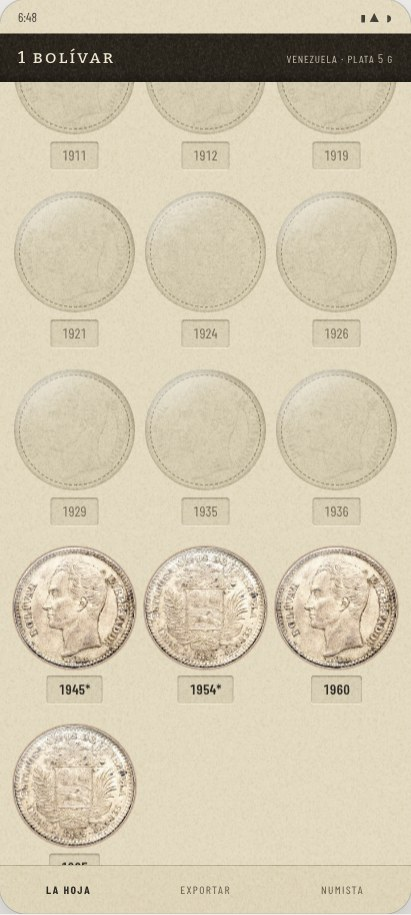

# El giro anverso↔reverso: la moneda gira en su hueco

La respuesta del [#302](https://github.com/jenarvaezg/coindex/issues/302), decidida el 7 de agosto
de 2026 sobre un prototipo en HTML a tamaño de móvil real (411 × 914 dp, los del Pixel 7 con los que
midió el [#296](https://github.com/jenarvaezg/coindex/issues/296)), con la lámina de verdad del
**1 Bolívar del padre — 4 de 22** y las dos caras de sus fotos de Numista.

**La moneda gira dentro del hueco, y el año que hay debajo es una chapa hundida en el cartón que
sigue llevando a Numista.**

El [#300](https://github.com/jenarvaezg/coindex/issues/300) decidió que la lámina es una hoja de
álbum, y con eso resolvió el troquel y el fantasma — pero agravó lo que quedaba: hoy la casilla
enseña las dos caras lado a lado (`CoinSides`, `PlateScreen.kt:177`) y **un hueco enseña una**.

## Lo que se elige

### El gesto: toque en el hueco, la moneda se voltea

`graphicsLayer { rotationY; cameraDistance }` sobre la imagen, con las dos caras y `backface`, 420
ms. El cartón, la sombra interior y el reflejo del acetato **no se mueven**: lo que gira es la
moneda, no la casilla.

**Dos objetivos por casilla y no uno.** El hueco gira; el año, debajo, sale a Numista. Sin
pulsaciones largas y sin menús. El cuerpo del hueco estaba libre —hoy sólo el título es tocable,
`PlateScreen.kt:193`—, así que el conflicto que el ticket anticipaba no existía.

### El rótulo: la chapa hundida

Un rebaje en el cartón —sombra interior y filo claro abajo—, **el mismo lenguaje que el troquel**.
Ni color, ni subrayado, ni flecha: el año se toca porque *parece* una pieza aparte hundida en la
hoja. Es afordancia convertida en forma, que es lo que este mapa vino a hacer.

| | objetivo dibujado | casillas en pantalla |
| --- | ---: | ---: |
| 1 · como hoy (`ExternalLink`) | 36,9 × 21 dp | 13,74 |
| 2 · subrayado sin flecha | 24,3 × 21 dp | 13,74 |
| **3 · la chapa hundida** | **48,3 × 28 dp** | **13,20** |
| 4 · la cartela pegada | 46,3 × 28 dp | 13,20 |
| *el hueco, para comparar* | *121 × 121 dp* | |

La chapa cuesta **7 dp por casilla**, que son 0,54 casillas de 13,74 — un 3,9 %. A cambio es la
única de las cuatro **cuyo dibujo llega a los 48 dp** de ancho que pide Android, es decir la única
que no miente sobre dónde se puede apretar.

**Ninguna de las cuatro llega a 48 dp de alto**, así que el año necesita área de toque por encima de
su tinta (`minimumInteractiveComponentSize`) gane la que gane. Con la chapa la mentira es de 20 dp;
con el subrayado pelado, de 27.

### Qué cara se ve primero: `printed_side`, la misma que el papel

La pantalla obedece la declaración del catálogo, igual que el cuaderno: `printed_side` del ADR 0020,
reverso por defecto, **de la lámina y jamás de un miembro**. Seis de los 74 catálogos declaran
`obverse`.

El propio 1 Bolívar es el mejor argumento del ADR 0020 que hay en la colección del padre: la caché
sembrada dice que el **anverso** de N#10338 es *«escudo con leyenda en la parte superior»* y el
**reverso** es *«busto a la izquierda»*. La cara que **es** la moneda —el Bolívar— es la que Numista
llama reverso.

### El PNG y el cuaderno: la cara de reposo, por construcción

`SheetExport` compone la hoja **fuera de pantalla**, así que el PNG no hereda el estado del giro:
sale `printed_side` aunque haya tres huecos vueltos. **No hay decisión que tomar y no se fuerza
ninguna**: el papel del ADR 0020 y la pantalla en reposo son la misma cara, y el giro es una cosa
que sólo existe mientras el dedo está encima.

## Lo que no costaba lo que parecía

- **La segunda cara no cuesta ni una descarga.** El ADR 0024 ya precarga **las dos caras de todos
  los tipos del índice** — 1.658 fotografías, 29,8 MB, una vez en la vida del teléfono. Y de los 916
  tipos de la caché sembrada, **los 916 traen las dos**. No hay decisión de prefetch en este ticket.
- **El dibujo.** Una capa por casilla mientras dura la animación, y 22 casillas que durante ese
  tiempo no comparten bitmap. Sólo mientras gira.

## Lo que se descarta, y por qué

| | por qué se cae |
| --- | --- |
| **A · sin giro** | Rompe una promesa ya escrita: el ADR 0021 §13 dice que «el anverso sigue a un toque». Con esto deja de estarlo dentro de la app — el toque te saca a un navegador. |
| **C · disolvencia** | No se lee como una moneda dada la vuelta sino como una foto sustituida, así que obliga a imprimir `anverso`/`reverso` bajo cada hueco: las 24 palabras por pantalla de rejilla que el #300 acababa de quitar. **Devuelve prosa donde el mapa vino a podarla.** |
| **D · voltear la hoja entera** | Es el gesto físicamente honesto —en un álbum no giras una moneda, giras la hoja— y la única variante que podría exportar un PNG de anversos. Se cae porque una hoja real, al voltearla, **invierte el orden de las columnas**, y mantenerlos en su sitio es hacer trampa; invertirlos de verdad haría bailar la rejilla de un date run. Y para comparar las dos caras de *una* moneda hay que voltear las veintidós. |
| **E · mantener para ver** | Un gesto que no se ve: nada en la hoja anuncia que se puede mantener pulsado. Y se va justo cuando sueltas para hacer la captura. |
| **Abrir una ficha del tipo** | No hay tal pantalla: la ficha de hoy es *una línea* dentro de una tarjeta (`FichaBrought`, `PieceCard.kt:67` y `CoinsScreen.kt:336`), no un destino. Inventarla es asunto del [#317](https://github.com/jenarvaezg/coindex/issues/317) y del ADR 0021. |
| **1 · el rótulo con «↗»** | El #298 midió que ni Bitter ni Barlow traen ese glifo: serían **22 flechas en la tipografía del sistema** sobre una hoja de papel. |
| **4 · la cartela pegada** | Veintidós rectángulos claros flotando sobre el cartón, y el #300 descartó la sombra de hoja precisamente por no querer cosas flotando. |

## Lo que se acepta a sabiendas

**B deja la lámina en estados mezclados** — tres vueltas y diecinueve no —, que es justo lo que una
hoja de cartón no puede estar. Es la objeción de álbum contra B, y se asume con los ojos abiertos:
el giro es momentáneo, la hoja vuelve sola a `printed_side` en cuanto se recompone, y el PNG nunca
sale mezclado.

## Los cabos que deja

- **El rótulo de Monedas no es un año.** La chapa se midió alrededor de cuatro cifras. En Monedas
  debajo del hueco va un título de Numista de dos líneas que corta, y una chapa alrededor de eso es
  otra forma. Qué se lee ahí lo decide el
  [#319](https://github.com/jenarvaezg/coindex/issues/319); **cómo se dibuja lo hereda de aquí**.
- **El área de toque hay que pagarla aparte.** Ninguna de las cuatro llega a 48 dp de alto.
- **Se decidió en HTML, no en el emulador**, igual que el #300. El vuelco a 420 ms y el rebaje de la
  chapa se leen distinto a 420 dpi: la primera sesión de implementación empieza confirmándolo en el
  AVD, y si el rebaje no se distingue a 1:1 se ajusta sin reabrir este ticket — es un parámetro, no
  la decisión.
