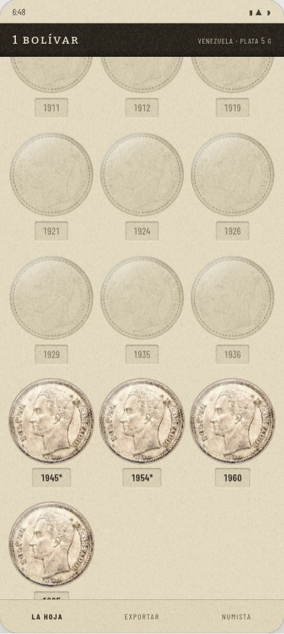
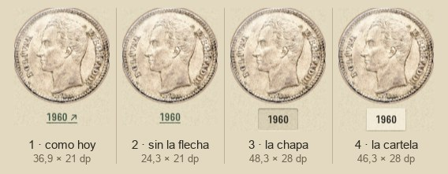
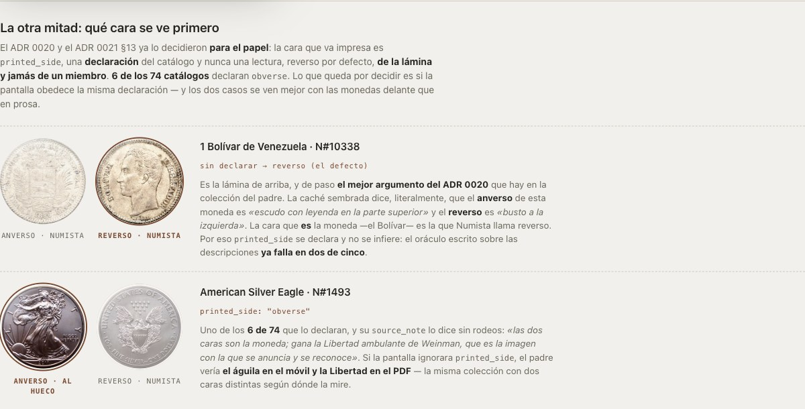
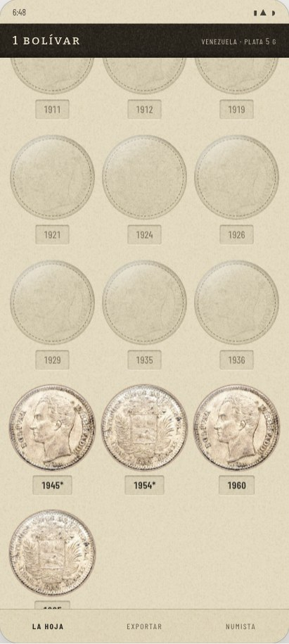

# El giro anverso↔reverso: la moneda gira en su hueco

Respuesta del [#302](https://github.com/jenarvaezg/coindex/issues/302), decidida el 7 de agosto
de 2026 sobre un prototipo en HTML a tamaño de móvil real (411 × 914 dp, los del Pixel 7 del
[#296](https://github.com/jenarvaezg/coindex/issues/296)), con la lámina del 1 Bolívar del padre
(4 de 22) y las dos caras de sus fotos de Numista.

La moneda gira dentro del hueco, y el año de debajo es una chapa hundida en el cartón que lleva a
Numista.

El [#300](https://github.com/jenarvaezg/coindex/issues/300) convirtió la lámina en una hoja de
álbum. La casilla enseñaba las dos caras lado a lado (`CoinSides`, `PlateScreen.kt:177`); un hueco
enseña una.

## Lo que se elige

### El gesto: tocar el hueco voltea la moneda

`graphicsLayer { rotationY; cameraDistance }` sobre la imagen, con las dos caras y `backface`,
420 ms. El cartón, la sombra interior y el reflejo del acetato no se mueven: gira la moneda, no la
casilla.

Dos objetivos por casilla: el hueco gira y el año, debajo, abre Numista. Sin pulsaciones largas ni
menús. El cuerpo del hueco estaba libre (sólo el título era tocable, `PlateScreen.kt:193`), así que
el conflicto que temía el ticket no existía.

### El rótulo: la chapa hundida

Un rebaje en el cartón (sombra interior y filo claro abajo), el mismo lenguaje que el troquel. Sin
color, subrayado ni flecha: el año se toca porque parece una pieza aparte hundida en la hoja.

| | objetivo dibujado | casillas en pantalla |
| --- | ---: | ---: |
| 1 · como hoy (`ExternalLink`) | 36,9 × 21 dp | 13,74 |
| 2 · subrayado sin flecha | 24,3 × 21 dp | 13,74 |
| **3 · la chapa hundida** | **48,3 × 28 dp** | **13,20** |
| 4 · la cartela pegada | 46,3 × 28 dp | 13,20 |
| *el hueco, para comparar* | *121 × 121 dp* | |

La chapa cuesta 7 dp por casilla: 0,54 casillas de 13,74, un 3,9 %. A cambio es la única de las
cuatro cuyo dibujo llega a los 48 dp de ancho que pide Android, así que a lo ancho el área tocable
coincide con lo que se ve.

Ninguna llega a 48 dp de alto, así que el año necesita área de toque por encima de su tinta
(`minimumInteractiveComponentSize`) gane la que gane. Con la chapa faltan 20 dp; con el subrayado,
27.

### Qué cara se ve primero: `printed_side`, la misma que en el papel

La pantalla obedece la declaración del catálogo, igual que el cuaderno: `printed_side` del ADR 0020,
reverso por defecto, declarado por lámina y nunca por miembro. Seis de los 74 catálogos declaran
`obverse`.

El propio 1 Bolívar ilustra el ADR 0020: según la caché sembrada, el anverso de N#10338 es *«escudo
con leyenda en la parte superior»* y el reverso, *«busto a la izquierda»*. La cara que identifica la
moneda, el Bolívar, es la que Numista llama reverso.

### El PNG y el cuaderno salen con la cara de reposo

`SheetExport` compone la hoja fuera de pantalla, así que el PNG no hereda el giro: sale
`printed_side` aunque haya tres huecos vueltos. El papel del ADR 0020 y la pantalla en reposo
enseñan la misma cara; el giro sólo existe mientras el dedo está encima.

## El coste

- **La segunda cara no cuesta descargas.** El ADR 0024 ya precarga las dos caras de todos los tipos
  del índice (1.658 fotografías, 29,8 MB, una sola vez). Los 916 tipos de la caché sembrada traen
  las dos.
- **El dibujo.** Una capa por casilla mientras dura la animación, y durante ese tiempo las 22
  casillas no comparten bitmap.

## Lo que se descarta

| | por qué se cae |
| --- | --- |
| **A · sin giro** | Incumple el ADR 0021 §13, que dice que «el anverso sigue a un toque»: el toque sacaría a un navegador. |
| **C · disolvencia** | Se lee como una foto sustituida, no como una moneda dada la vuelta, y obliga a imprimir `anverso`/`reverso` bajo cada hueco: las 24 palabras por pantalla de rejilla que el #300 acababa de quitar. |
| **D · voltear la hoja entera** | Es el gesto de un álbum real y la única variante que podría exportar un PNG de anversos. Pero una hoja volteada invierte el orden de las columnas: mantenerlas en su sitio es trampa, e invertirlas desordena la rejilla de un date run. Y para comparar las dos caras de una moneda hay que voltear las veintidós. |
| **E · mantener para ver** | Nada en la hoja anuncia el gesto, y la cara se va al soltar para hacer la captura. |
| **Abrir una ficha del tipo** | No existe esa pantalla: la ficha de hoy es una línea dentro de una tarjeta (`FichaBrought`, `PieceCard.kt:67` y `CoinsScreen.kt:336`). Crearla es asunto del [#317](https://github.com/jenarvaezg/coindex/issues/317) y del ADR 0021. |
| **1 · el rótulo con «↗»** | Ni Bitter ni Barlow traen ese glifo (#298): serían 22 flechas en la tipografía del sistema sobre una hoja de papel. |
| **4 · la cartela pegada** | Veintidós rectángulos claros flotando sobre el cartón; el #300 descartó la sombra de hoja por lo mismo. |

## Lo que se acepta

B deja la lámina en estados mezclados (tres monedas vueltas y diecinueve no), algo que una hoja de
cartón no puede tener. Se acepta porque el giro es momentáneo, la hoja vuelve a `printed_side` al
recomponerse y el PNG nunca sale mezclado.

## Los cabos que deja

- **El rótulo de Monedas no es un año.** La chapa se midió alrededor de cuatro cifras; en Monedas,
  debajo del hueco va un título de Numista de dos líneas que corta, y una chapa alrededor de eso es
  otra forma. Qué se lee ahí lo decide el
  [#319](https://github.com/jenarvaezg/coindex/issues/319); cómo se dibuja se hereda de aquí.
- **El área de toque se paga aparte**: ninguna variante llega a 48 dp de alto.
- **Se decidió en HTML, no en el emulador**, igual que el #300. El vuelco de 420 ms y el rebaje de
  la chapa se ven distinto a 420 dpi: la implementación empieza confirmándolo en el AVD, y si el
  rebaje no se distingue a 1:1 se ajusta sin reabrir este ticket.
