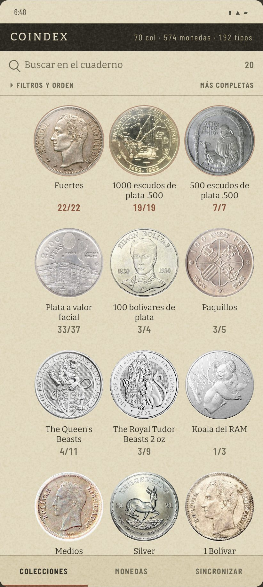
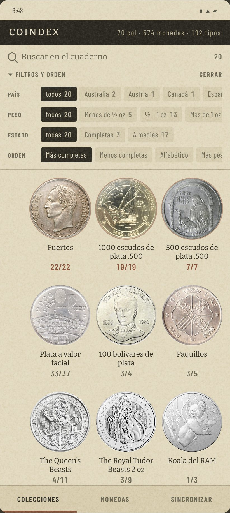
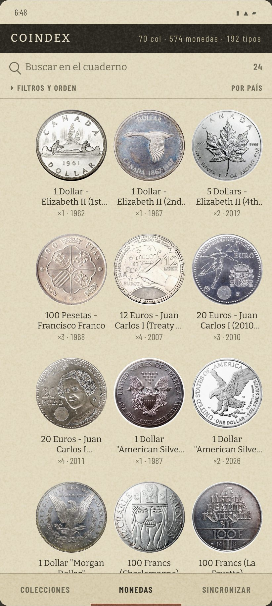
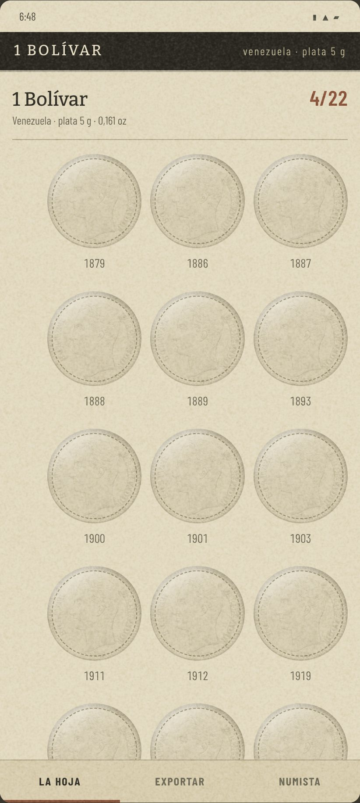
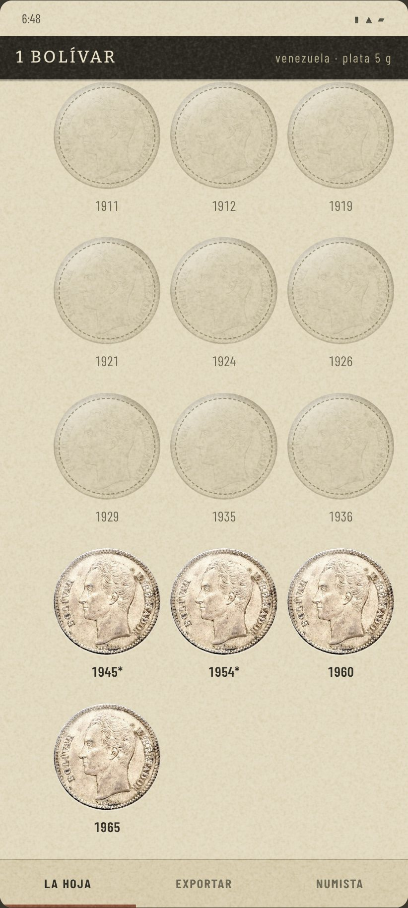

# La hoja: la identidad elegida

La respuesta del [#300](https://github.com/jenarvaezg/coindex/issues/300), decidida el 7 de agosto
de 2026 sobre prototipos en HTML a tamaño de móvil real (411 × 914 dp, los del Pixel 7 con los que
midió el [#296](https://github.com/jenarvaezg/coindex/issues/296)), con el índice, las monedas y una
lámina de la colección del padre.

**Coindex deja de ser un listado y pasa a ser una hoja de álbum de monedas.**

## Cómo se decidió, y en qué se saltó al mapa

El ticket pedía un prototipo en Compose sobre el emulador. Se hizo en HTML porque iterar sobre la
forma en Kotlin cuesta una sesión por variante, y aquí hicieron falta **siete**: tres de papel y
letra que se descartaron enteras, y cuatro de estructura. Las fuentes son las once que midió el
[#298](https://github.com/jenarvaezg/coindex/issues/298), empaquetadas de verdad como woff2; las
fotos son las de la caché de tipos que ya viaja en el APK.

**La consecuencia hay que decirla clara: esta decisión no se ha visto en un teléfono.** El grano y
el brillo del acetato se leen distinto a 420 dpi, y el mapa dice que se decide sobre capturas del
emulador. La primera sesión de implementación empieza confirmándolo en el AVD `coindex-ux`, y si el
grano no se distingue a 1:1, se retira sin volver a abrir este ticket: es un parámetro, no la
decisión.

## Lo que se elige

### La estructura: el cartón de álbum

Una colección no es una tarjeta con cuatro líneas: es un **hueco troquelado** con su moneda dentro.
La lámina es la misma hoja pero por años, con el diseño en fantasma donde falta la pieza. El
progreso deja de leerse y se ve.

| | tarjeta de hoy | hueco de álbum |
| --- | ---: | ---: |
| Colecciones visibles al entrar | **2,07** | **11,04** |
| Fotos de moneda en el índice | 0 | una por colección |
| Líneas de texto por entrada | 4 | 2 |

La cabecera de 1120 px desaparece. El nombre del cuaderno y los tres recuentos —«70 col · 574
monedas · 192 tipos»— se juntan en el **canto cosido** del álbum, lo que de paso resuelve lo que el
#296 llamó *tres números para «cuánto tengo» y ninguno se explica*: puestos en una sola línea, se
leen como lo que son.

### La regleta: buscar, filtrar y ordenar, igual en los dos destinos

Debajo del canto van tres líneas y 76 dp en total: el buscador con su recuento vivo, el estante
plegado del ADR 0021 §1, y las pestañitas cuando se despliega.

Ninguna etiqueta es nueva. Salen tal cual de `IndexShelf.kt`, `CoinsShelf.kt` y `Bands.kt`:
«Menos de ½ oz», «Conjunto o caja», «Más completas», «Por país», «Sin colección». El estante también
conserva su regla de siempre —nombra el orden sólo cuando no es el que la pantalla habría usado
igualmente, que es lo que ya hace `shelfSummary`—.

La misma regleta sirve para **Monedas**, cambiando sólo la tercera faceta y la lista de órdenes. Es
la simetría que el código ya tenía y que la interfaz no enseñaba.

### La lámina: el álbum por años

El **1 Bolívar de Venezuela del padre, 4 de 22**, con sus años de verdad: le faltan las dieciocho
antiguas —1879 a 1936— y tiene las cuatro modernas: 1945 (acuñada en 1947), 1954 (1955), 1960 y
1965, con 157 piezas de las que 103 son del 60. Se ve la forma de su colección sin leer una palabra.

### La letra

**Bitter para la prosa y Barlow Condensed para los datos.** 245 KB entre las tres cortes (Bitter
variable, Barlow Regular y SemiBold), un **+0,81 %** sobre los 30,86 MB del APK.

De las once que midió el #298 es la pareja que gana por dos razones y no por el peso: Bitter es la
única serif que **no cuesta ancho** (44,5 contra 44,4 del Noto Serif de hoy) y Barlow Condensed trae
**versalitas de verdad** (`smcp`) y **cifras tabulares** (`tnum`) por 48 KB. Las versalitas dejan de
ser el fingimiento que hay hoy en `Theme.kt` —mayúsculas en negrita con `letterSpacing`— y sostienen
todo el vocabulario de la regleta: «país», «peso», «estado», «filtros y orden».

### El papel

**Fibra fina de offset: un mosaico de 256 px en `soft-light`, plano y sin sombra de hoja.**

La sombra se descartó por redundante, no por cara: en cuanto la entrada es un hueco hundido en el
cartón, el relieve ya lo pone el troquel —una sombra interior y un filo claro abajo—, y una segunda
sombra flotando encima sólo emborrona. El único brillo es el **reflejo fijo de la funda de
acetato** sobre cada hueco, que es un degradado estático y por tanto **sobrevive al PNG exportado**,
que es donde el padre enseña sus láminas.

### Las fotos de Numista

**El hueco redondo resuelve solo el problema que este ticket temía.** Las fotos vienen recortadas
sobre fondo claro, y sobre un papel con grano ese cuadrado blanco se lee como una pegatina; dentro
de un hueco circular con `object-fit: cover` el fondo del recorte sencillamente no se ve. Lo que en
las variantes planas hubo que resolver pintando la miniatura en `multiply`, aquí no hay que
resolverlo.

Y la premisa aguanta, medida y no supuesta: **de los 192 tipos del padre, 188 tienen ficha en la
caché sembrada y los 188 traen imagen**; ningún catálogo suyo se queda sin una sola foto. Los otros
cuatro no es que no tengan foto: no tienen ficha hasta la primera sincronización, así que el hueco a
oscuras es un estado transitorio.

## Lo que se descarta, y por qué

| | por qué se cae |
| --- | --- |
| **Literata + Archivo (eje `wdth`)** | 748 KB, el triple que la elegida, y Archivo **no trae versalitas**: la eyebrow seguiría fingida. Su −34 % de ancho sólo se paga en una tabla densa, y la hoja no es una tabla. |
| **Source Serif 4 + Encode Sans Condensed** | 682 KB y un +18 % de ancho de párrafo. Además Source Serif 4 **no tiene `↗` ni `✓`**, que hoy ya los pinta el sistema. |
| **Newsreader** | +27 % de ancho. La más cara en espacio de las once. |
| **Oswald, Saira Condensed, IBM Plex Sans Condensed** | Ya las tiró el #298: dígitos de anchos distintos sin `tnum` las dos primeras, y la tercera no es condensada (−5 %). |
| **La itálica** | La app no usa ni una en toda la capa `ui/`, y duplicaría el coste de la serif. |
| **Sombra de hoja / papel flotante** | Redundante con el troquel, y obligaba a oscurecer el fondo hasta convertirlo en una mesa — lo que abre el modo oscuro del [#301](https://github.com/jenarvaezg/coindex/issues/301) antes de tiempo. |
| **Luz rasante y viñeta de escáner** | Oscurecen justo la esquina donde caen las miniaturas, y el hundido de la entrada pisaba el troquel del [#302](https://github.com/jenarvaezg/coindex/issues/302). |
| **El pliego de catálogo** | Llega a 21,8 colecciones por pantalla, el máximo medido, pero a 15 dp de cuerpo y filas de 30 dp. Para el usuario que manda eso es el límite, no el punto de partida. |
| **La bandeja oscura** | Rompe `spec.md §0.4` y, peor, rompe la coherencia con lo impreso: el cuaderno en PDF y la lámina en PNG seguirían siendo papel, así que la app y lo que el padre enseña dejarían de ser el mismo objeto. |
| **Pestañas de país en la cabecera** | Eran la faceta *Issuer* disfrazada. Se quedan dentro del estante, donde ya vivían. |
| **Subsetear las fuentes** | Ya lo decidió el #298: ahorra un 0,2–0,7 % y crea una versión modificada con nombre reservado. |

## Los cabos que deja

- **El rótulo del hueco son dos líneas y corta.** En Colecciones no molesta porque el `short_name`
  está curado, pero en Monedas los títulos de Numista no caben: «1 Dollar - Elizabeth II (2nd
  portrait, Confederation)». Una moneda necesita un nombre corto propio, y eso es una decisión de
  dominio.
- **La poda ya no empieza de cero.** La cabecera del índice la resuelve esta hoja; al
  [#305](https://github.com/jenarvaezg/coindex/issues/305) le quedan Ajustes, el alta y el
  mantenimiento de las fichas.
- **El troquel de la lámina ya está.** Al [#302](https://github.com/jenarvaezg/coindex/issues/302)
  le queda el giro anverso↔reverso, que es lo que el hueco no resuelve: en un álbum sólo se ve una
  cara.
- **Los avisos de licencia siguen pendientes.** La OFL obliga a acompañar el texto y Coindex no
  tiene pantalla de licencias — deuda que ya tenían Coil, OkHttp y Ktor.
