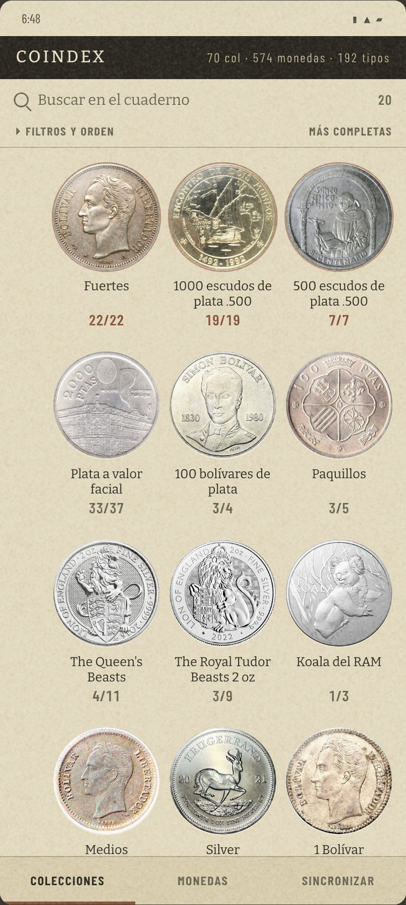
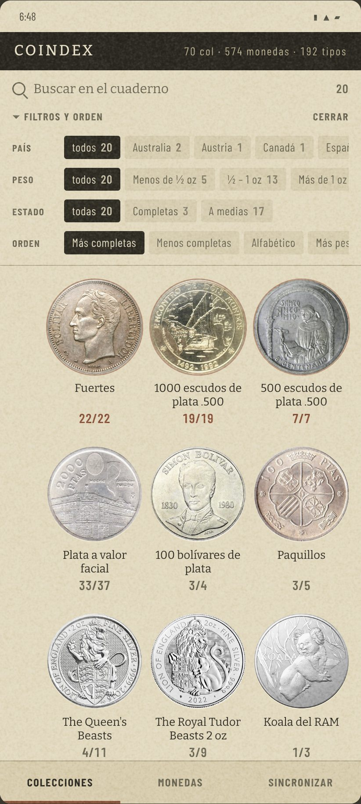
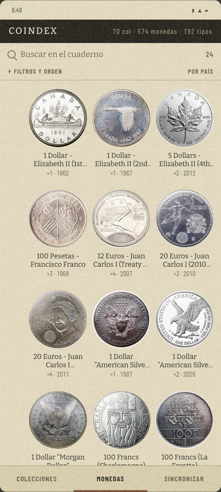
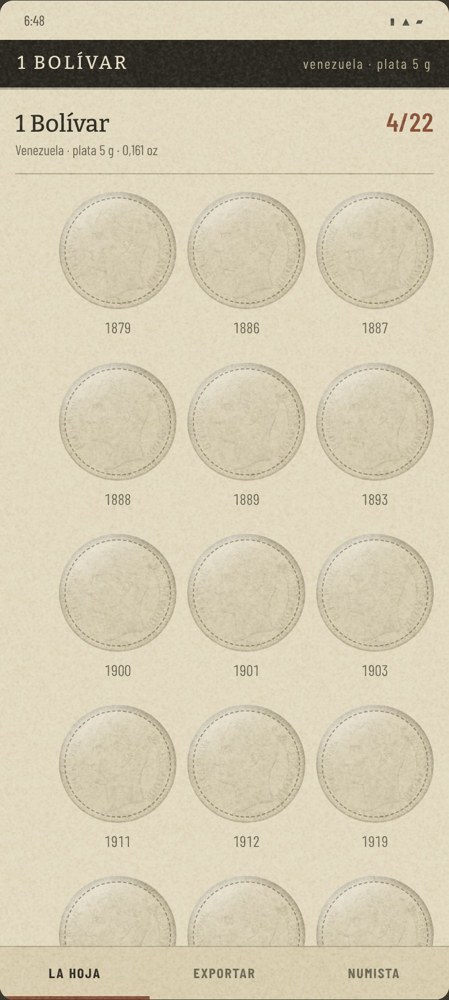
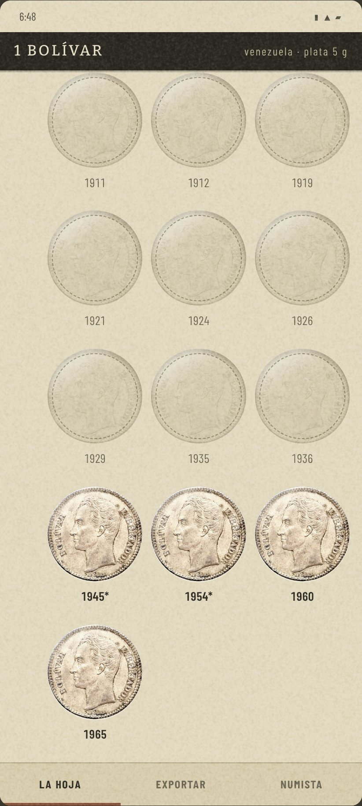

# La hoja: la identidad elegida

Respuesta del [#300](https://github.com/jenarvaezg/coindex/issues/300), decidida el 7 de agosto
de 2026 sobre prototipos en HTML a tamaño de móvil real (411 × 914 dp, los del Pixel 7 del
[#296](https://github.com/jenarvaezg/coindex/issues/296)), con el índice, las monedas y una lámina de
la colección del padre.

Coindex pasa de ser un listado a ser una hoja de álbum de monedas.

## Cómo se decidió

El ticket pedía un prototipo en Compose sobre el emulador. Se hizo en HTML porque cada variante en
Kotlin cuesta una sesión, y hicieron falta siete: tres de papel y letra, descartadas enteras, y
cuatro de estructura. Las fuentes son las dieciséis candidatas que midió el
[#298](https://github.com/jenarvaezg/coindex/issues/298), empaquetadas como woff2; las fotos son las
de la caché de tipos que ya viaja en el APK.

Esta decisión no se ha visto en un teléfono. El grano y el brillo del acetato se ven distinto a
420 dpi, y el mapa pide decidir sobre capturas del emulador. La implementación empieza
confirmándolo en el AVD `coindex-ux`; si el grano no se distingue a 1:1, se retira sin reabrir este
ticket: es un parámetro, no la decisión.

## Lo que se elige

### La estructura: el cartón de álbum

Cada colección es un hueco troquelado con su moneda dentro, en vez de una tarjeta de cuatro líneas.
La lámina es la misma hoja ordenada por años, con el diseño en fantasma donde falta la pieza: el
progreso se ve sin leerlo.

| | tarjeta de hoy | hueco de álbum |
| --- | ---: | ---: |
| Colecciones visibles al entrar | **2,07** | **11,04** |
| Fotos de moneda en el índice | 0 | una por colección |
| Líneas de texto por entrada | 4 | 2 |

La cabecera de 1120 px desaparece. El nombre del cuaderno y los tres recuentos («70 col · 574
monedas · 192 tipos») van juntos en el canto cosido del álbum, lo que de paso resuelve lo que el
#296 llamó *tres números para «cuánto tengo» y ninguno se explica*: en una sola línea se leen como
lo que son.

### La regleta: buscar, filtrar y ordenar, igual en los dos destinos

Bajo el canto, tres líneas y 76 dp en total: el buscador con su recuento vivo, el estante plegado
del ADR 0021 §1 y, al desplegarlo, las pestañitas.

No hay etiquetas nuevas: salen de `IndexShelf.kt`, `CoinsShelf.kt` y `Bands.kt` («Menos de ½ oz»,
«Conjunto o caja», «Más completas», «Por país», «Sin colección»). El estante sigue nombrando el
orden sólo cuando no es el que la pantalla usaría por defecto, como ya hace `shelfSummary`.

La misma regleta sirve para Monedas, cambiando sólo la tercera faceta y la lista de órdenes: la
simetría que el código ya tenía y la interfaz no enseñaba.

### La lámina: el álbum por años

El 1 Bolívar de Venezuela del padre, 4 de 22, con sus años reales: le faltan las dieciocho antiguas
(1879 a 1936) y tiene las cuatro modernas, 1945 (acuñada en 1947), 1954 (1955), 1960 y 1965, con
157 piezas de las que 103 son de 1960. La forma de la colección se ve sin leer una palabra.

### La letra

**Bitter para la prosa y Barlow Condensed para los datos.** 245 KB entre los tres cortes (Bitter
variable, Barlow Regular y SemiBold), un +0,81 % sobre los 30,86 MB del APK.

De las candidatas del #298 es la pareja que gana, y no por el peso: Bitter es la única serif que no
ensancha el párrafo (44,5 contra 44,4 del Noto Serif de entonces) y Barlow Condensed trae
versalitas reales (`smcp`) y cifras tabulares (`tnum`) por 48 KB. Las versalitas sustituyen a las de
`Theme.kt`, que eran mayúsculas en negrita con `letterSpacing`, y sostienen el vocabulario de la
regleta: «país», «peso», «estado», «filtros y orden».

### El papel

**Fibra fina de offset: un mosaico de 256 px en `soft-light`, plano y sin sombra de hoja.**

La sombra sobra: con la entrada hundida en el cartón, el relieve lo pone el troquel (sombra interior
y filo claro abajo), y una segunda sombra encima sólo emborrona. El único brillo es el reflejo fijo
de la funda de acetato sobre cada hueco, un degradado estático que sobrevive al PNG exportado, que
es como el padre enseña sus láminas.

### Las fotos de Numista

Las fotos vienen recortadas sobre fondo claro, y sobre un papel con grano ese cuadrado blanco
parece una pegatina. Dentro de un hueco circular con `object-fit: cover` el fondo del recorte no se
ve; en las variantes planas hubo que pintar la miniatura en `multiply`.

Medido: de los 192 tipos del padre, 188 tienen ficha en la caché sembrada y los 188 traen imagen;
ningún catálogo suyo se queda sin foto. Los otros cuatro no tienen ficha hasta la primera
sincronización, así que el hueco a oscuras es transitorio.

## Lo que se descarta

| | por qué se cae |
| --- | --- |
| **Literata + Archivo (eje `wdth`)** | 748 KB, el triple que la elegida, y Archivo no trae versalitas: la eyebrow seguiría fingida. Su −34 % de ancho sólo compensa en una tabla densa, y la hoja no es una tabla. |
| **Source Serif 4 + Encode Sans Condensed** | 682 KB y un +18 % de ancho de párrafo. |
| **Newsreader** | +27 % de ancho, la más cara en espacio de las serif medidas. |
| **Oswald, Saira Condensed, IBM Plex Sans Condensed** | Descartadas en el #298: las dos primeras tienen dígitos de anchos distintos sin `tnum`, y la tercera apenas condensa (−5 %). |
| **La itálica** | La capa `ui/` no usa ninguna, y duplicaría el coste de la serif. |
| **Sombra de hoja / papel flotante** | Redundante con el troquel, y obligaba a oscurecer el fondo hasta convertirlo en una mesa, lo que adelantaba el modo oscuro del [#301](https://github.com/jenarvaezg/coindex/issues/301). |
| **Luz rasante y viñeta de escáner** | Oscurecen la esquina donde caen las miniaturas, y el hundido de la entrada pisaba el troquel del [#302](https://github.com/jenarvaezg/coindex/issues/302). |
| **El pliego de catálogo** | Llega a 21,8 colecciones por pantalla, el máximo medido, pero con cuerpo de 15 dp y filas de 30 dp. Para el padre eso es el límite, no el punto de partida. |
| **La bandeja oscura** | Rompe `spec.md §0.4` y la coherencia con lo impreso: el PDF y el PNG seguirían siendo papel, y la app dejaría de ser el mismo objeto que el padre enseña. |
| **Pestañas de país en la cabecera** | Eran la faceta *Issuer* con otro aspecto; se quedan en el estante. |
| **Subsetear las fuentes** | Descartado en el #298: ahorra un 0,2–0,7 % y crea una versión modificada con nombre reservado. |

## Los cabos que deja

- **El rótulo del hueco son dos líneas y corta.** En Colecciones vale porque el `short_name` está
  curado, pero en Monedas los títulos de Numista no caben («1 Dollar - Elizabeth II (2nd portrait,
  Confederation)»). Una moneda necesita un nombre corto propio, y eso es una decisión de dominio.
- **La cabecera del índice queda resuelta**; al
  [#305](https://github.com/jenarvaezg/coindex/issues/305) le quedan Ajustes, el alta y el
  mantenimiento de las fichas.
- **El troquel de la lámina ya está**; al [#302](https://github.com/jenarvaezg/coindex/issues/302)
  le queda el giro anverso↔reverso, porque en un hueco sólo se ve una cara.
- **Faltan los avisos de licencia.** La OFL obliga a acompañar el texto y Coindex no tiene pantalla
  de licencias, deuda que ya tenían Coil, OkHttp y Ktor.
