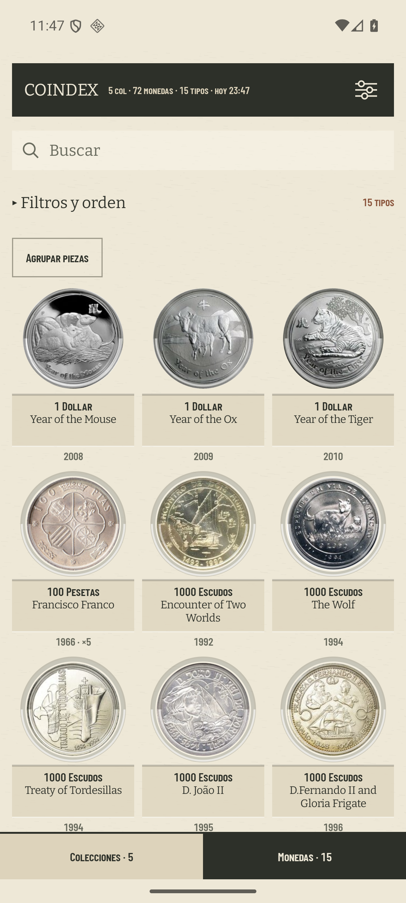
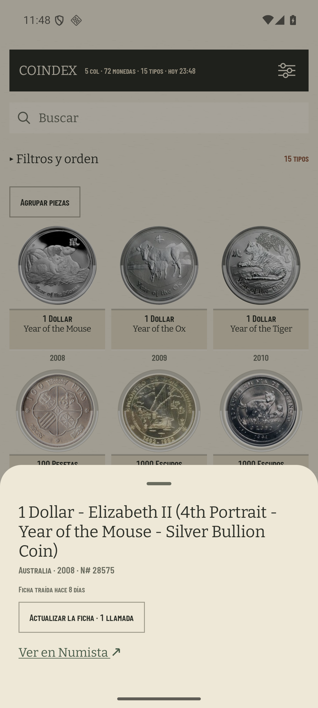

# Monedas como hoja de álbum

Comprobación del bloque 5 del ADR 0026 en el AVD `coindex-ux`, un Pixel 7 de 411 × 914 dp a
420 dpi. La captura se tomó con la colección de calibración que conserva el AVD: 72 piezas,
15 tipos y cinco colecciones.

## Medida de la cartela

`uiautomator dump` sitúa la primera celda en `[32,763][357,1240]` y la siguiente fila en
`[32,1256][357,1733]`. Eso da **181,7 dp de celda** y **187,8 dp de paso de fila**. La captura a
2× de la maqueta del #300 daba aproximadamente 187,5 dp de paso: el coste neto no es el `~+9 dp`
estimado en #319, sino ruido de redondeo. La cartela crece, pero la hoja reutiliza el interlineado
de 6 dp que ya separa las filas del índice, en vez de pagar además otro hueco de cartón.

La denominación ocupa una sola línea con autoajuste de 12 a 8 sp y no usa elipsis. El tema conserva
hasta dos líneas y es el único rango que puede cortarse. En la primera vista entran tres filas de
tres monedas con el control de cajas visible; la tercera queda completa salvo el pie de año pegado
a la barra inferior.

## La ficha dentro de la moneda

La hoja inferior devuelve el título íntegro de Numista, país, año y N#, la antigüedad de la ficha
en palabras, `Actualizar la ficha · 1 llamada`, el enlace a Numista y, cuando existen, los enlaces
a las colecciones. En la rejilla quedan sólo la forma del hueco, el nombre derivado, el año y una
cantidad cuando es mayor que uno.
