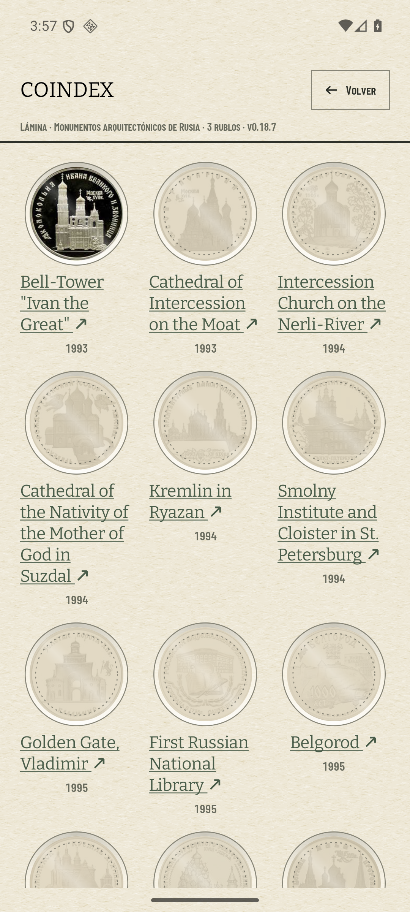
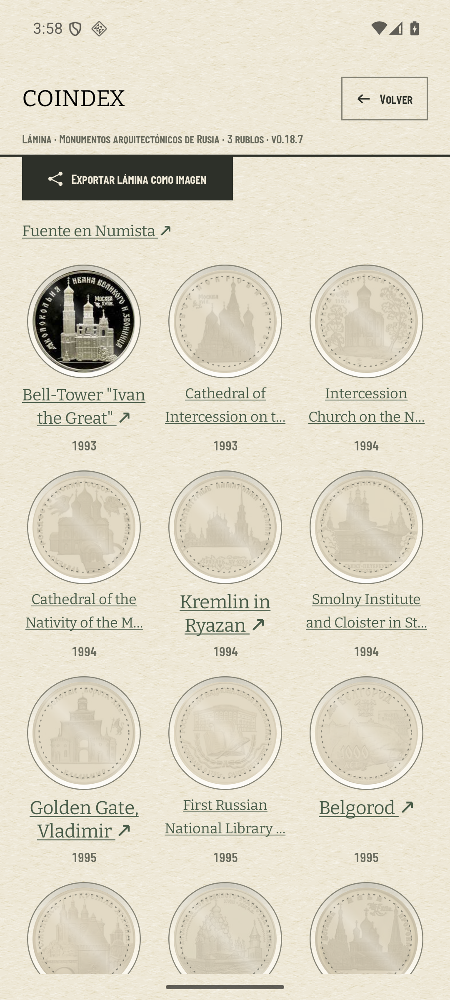
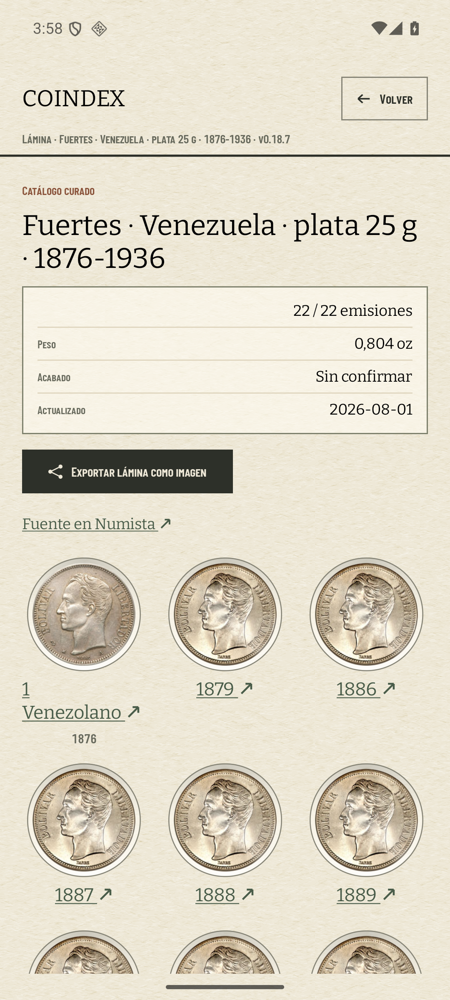
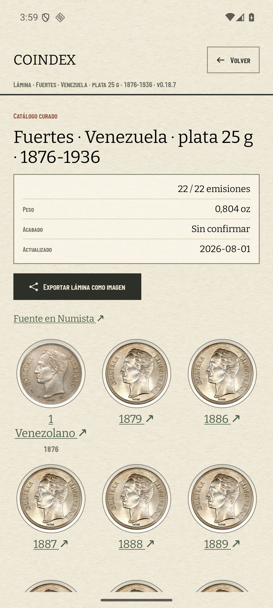
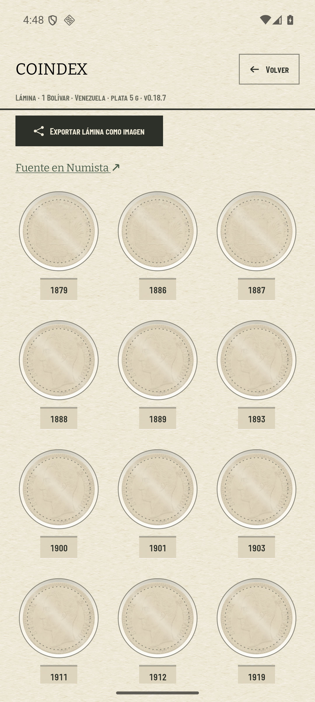
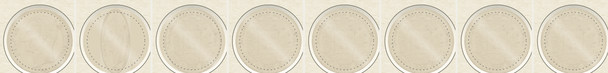
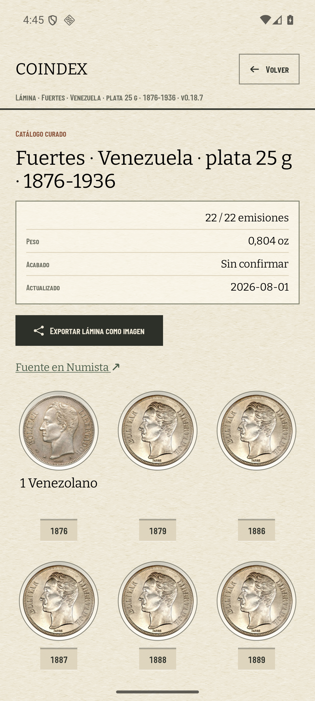
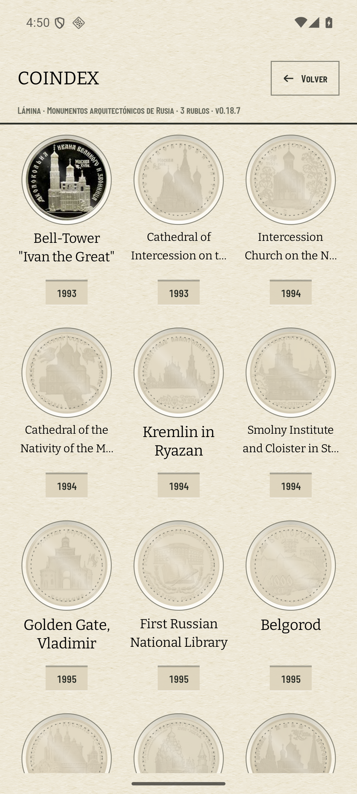
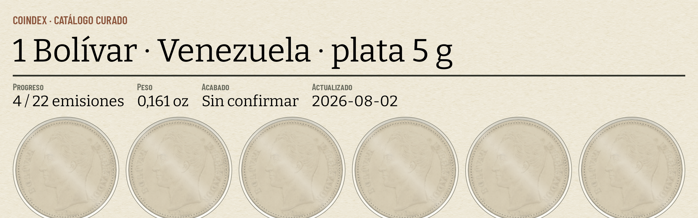

# La casilla de la lámina: el nombre, el giro y la chapa

Los dos PR del bloque 6 del ADR 0026
([#337](https://github.com/jenarvaezg/coindex/issues/337)), en el orden que el
propio ticket manda. Este documento tiene dos partes porque el trabajo tuvo dos:

1. **el nombre de la casilla**, que va antes del banco y que es lo que este
   primer apartado mide;
2. **el giro y la chapa del año**, calibrados en el banco y medidos después
   sobre la app — [más abajo](#el-giro-y-la-chapa-del-año).

## Parte 1 · El nombre de la casilla

El PR que va **antes del banco**: no depende del giro ni de los 420 ms, y la
chapa hundida del año necesita saber cuánto alto se lleva el nombre para
calcular su rebaje.

Medido el 9 de agosto de 2026 en el AVD `coindex-ux` (Pixel 7, Android 36,
1080 × 2400 px, 420 dpi), con las animaciones del sistema desactivadas y la
captura de la colección del padre del 5 de agosto sembrada por SQL —69
colecciones, 575 monedas, 193 tipos— más una moneda rusa añadida a mano, que es
lo que hace visible en el índice la lámina con la que el ticket manda medir.

## Los años de una fila caían en tres líneas distintas

La celda de la lámina era la única de las tres superficies que imprimen un
nombre bajo un hueco sin tratar: `titleMedium` sin autoajuste, sin `maxLines` y
sin altura reservada, así que la altura de la celda la decidía el nombre más
largo de la fila.

Recorriendo entera la lámina de **Monumentos arquitectónicos de Rusia · 3
rublos** —103 casillas, 32 filas completas de tres— y comparando la `y` de los
tres años de cada fila:

| lámina de Rusia, 32 filas de tres | antes | después |
| --- | ---: | ---: |
| filas con los tres años a la misma altura | 7 | **32** |
| filas con desnivel | **25** | **0** |
| peor desnivel de una fila | **224 px · 85 dp** | **0** |

| antes | después |
| --- | --- |
|  |  |

## Lo que se hace, que es lo que ya hacían las otras dos superficies

1. **Altura reservada**: la caja del nombre mide siempre dos líneas de
   `titleMedium` más su aire —21 sp × 2 + 6 dp × 2—, y el nombre se cuelga del
   hueco por arriba. Reservada **en dp y no en `minLines`**: el autoajuste
   descubrió el segundo defecto, porque dos líneas a 13 sp son más bajas que dos
   líneas a 17 sp, y con `minLines = 2` los años de una fila con nombres
   autoajustados y sin autoajustar seguían separándose 13 px.
2. **Autoajuste 17 → 13 sp** antes de truncar, la misma escalera que baja la
   tarjeta del índice ([#348](https://github.com/jenarvaezg/coindex/issues/348)).
3. **Elipsis** cuando ni a 13 sp entra. Con 73 caracteres no hay autoajuste que
   valga, y un corte que se ve es mejor que siete líneas.

| superficie | tratamiento |
| --- | --- |
| tarjeta del índice | autoajuste 17→13 sp, altura fija, elipsis (#348) |
| cartela de Monedas | autoajuste 12→8 sp, elipsis en el tema (#350) |
| celda de la lámina | **las tres cosas, aquí** |

El `label` es del curador y no se toca: 1.086 de los 1.188 miembros de `data/`
no son un año, y muchos son descripciones legítimas de la emisión. Lo que cede
es la tipografía en pantalla. Un nombre cortado **sigue entero en accesibilidad
y en la búsqueda**, y una prueba instrumentada lo fija.

## `1 Venezolano` sigue en dos líneas, y es correcto que siga

 

En `Fuertes` la casilla de 1876 es la única de las 22 cuyo `label` no es un año.
`1 Venezolano ↗` cabe en dos líneas a 17 sp, así que el autoajuste no tiene
motivo para reducirlo y la celda lo parte en `1` / `Venezolano ↗` igual que
antes. Lo que la arregla es el **punto 2 del bloque**, que se lleva el enlace del
título al año: sin el `↗` —un espacio duro más un glifo de `0.85.em`, unos 19 dp
al 17 % de la celda— el nombre entra en una línea **sin lógica de presupuesto de
glifo**, que es exactamente la razón por la que el #361 se fusionó aquí en vez de
escribirse aparte.

Lo que sí cambia en `Fuertes` es que las casillas de una fila ya no miden
distinto por culpa de la primera.

## Lo que no se toca

- **La celda sigue en 104 dp de hueco y tres columnas.** Ensancharla es la
  palanca que el [#338](https://github.com/jenarvaezg/coindex/issues/338)
  prohíbe expresamente para el brillo, y aquí vale lo mismo.
- **El papel se mide aparte**: la celda del PNG y la del PDF tienen otra anchura
  y otro presupuesto, y no pasan por `PlateCellName`.
- **La tarjeta del índice** comparte la forma `minLines` + autoajuste que aquí se
  quedó corta, pero hoy no lo exhibe: en las 68 tarjetas del #348 sólo una
  llegaba a autoajustarse. Queda anotado, no arreglado de paso.

---

# El giro y la chapa del año

Parte 2, el **primero de los cuatro movimientos de la vida de la app**. Mismo
AVD, misma colección sembrada, medido el 9 de agosto de 2026.

## Lo que se calibró en el banco antes de escribir nada

El [#302](https://github.com/jenarvaezg/coindex/issues/302) se decidió sobre un
prototipo en HTML y dejó dicho que los 420 ms y el rebaje se leen distinto a
420 dpi. Así que primero el banco (`CalibrationActivity`, pestaña EFECTOS), a
1:1:

| | valor del banco | medido en el AVD | decisión |
| --- | ---: | --- | --- |
| duración del giro | 420 ms | medio giro ocupa **~24 fotogramas distintos** de un vídeo de 30 fps, y el ciclo completo mide 800 ms sobre los 840 esperados | **se queda en 420 ms** |
| rebaje del rótulo | 3 dp | **−36 niveles** de luminancia en la sombra y **+24** en el filo, sobre un fondo de 211 | **se distingue: no se ajusta** |

El banco, además, **no cargaba sus dos caras**: sus URLs son las del 1 Bolívar
real y Cloudflare responde `403` a quien no se identifica. Funcionan en cuanto
la petición lleva el `User-Agent` de la app, que es el que el `ImageLoader`
único de Coindex ya pone — el banco no tenía nada que arreglar, pero sí hay que
tener red y el AVD despierto para calibrar con él.

Un aviso para la próxima sesión que use el banco: con
`animator_duration_scale 0` —que es lo que se pone para tomar capturas
estables— **el giro no se mueve**, y parece un fallo del efecto cuando es el
ajuste del sistema.

## Los dos objetivos de una casilla

El cuerpo del hueco gira la moneda; el año, debajo, sale a Numista. El título ya
no es un enlace, así que **no queda ni una flecha en la rejilla**: las 22 de una
lámina eran 22 glifos de la tipografía del sistema sobre una hoja de papel, que
es lo que el #298 midió y el #302 descartó.

La tira son ocho capturas consecutivas del mismo hueco con las animaciones del
sistema a 10×, para que un `screencap` quepa dentro del giro. Se lee lo que el
ticket pedía: **el cartón y el reflejo del acetato no se mueven**, y la moneda
pasa del busto al canto y del canto al escudo dentro de su recorte. (Los
`screenrecord` de este AVD salen con un solo fotograma útil, así que el vídeo
del plan de prueba es esta tira.)

Los dos objetivos miden **≥ 48 dp** de área táctil, y eso lo fija una prueba
instrumentada: el hueco los tiene por su propio tamaño y la chapa los compra con
`minimumInteractiveComponentSize`, porque su tinta mide 48,3 × 28 dp y ninguna
de las cuatro variantes del #302 llegaba a 48 de alto.

## La chapa se hunde con la física de la cartela, no con una suya

El bloque 5 dejó `AlbumCartouche` hundida en el cartón. La chapa **usa el mismo
dibujo**, extraído a `Modifier.recessedInBoard`: regla oscura de 2 dp arriba,
filo claro de 1 dp abajo, fondo rebajado. Los cuatro bordes que dibuja el banco
se descartan a propósito — la cartela no tiene lados, y darle cuatro sólo a la
chapa sería la segunda física que el ticket vino a evitar.

Perfil vertical medido sobre la lámina, a 1:1:

| | luminancia |
| --- | ---: |
| cartón de la hoja | 232 |
| regla de sombra (2 dp) | **156** (−76) |
| fondo hundido de la chapa | 213 (−19) |
| filo claro (1 dp) | **245** (+14) |

**La chapa no llega al año de Monedas**, y esa es la pregunta que el #350 dejó
abierta para este bloque: allí el año va justo debajo de una cartela que ya está
hundida, y hundirlo también apilaría dos rebajes en 30 dp. El año de Monedas se
queda como está.

## La reserva del nombre es por fila, no por lámina

Reservar la caja del nombre en toda la lámina —que es como salió a la primera—
cuelga **54 dp de cartón vacío bajo las veinte casillas de un date run** por
culpa de las dos que llevan nombre. Así que la reserva la decide **la fila**: en
`Fuertes` sólo la reserva la primera, la del `1 Venezolano`, y las otras siete
llevan su chapa pegada al hueco.

Para saber qué casillas comparten fila hay que saber cuántas columnas pinta
`GridCells.Adaptive`, y el grid no lo dice hasta que mide: la aritmética se lee
del ancho con `plateColumns`, que es la del propio grid dicha en voz alta y con
su prueba.

| antes de este bloque | después |
| --- | --- |
|  |  |

`1 Venezolano` **entra en una línea**, sin lógica de presupuesto de glifo: sólo
por haberle quitado la flecha, que era el 17 % de la celda.

## El PNG sale entero en `printed_side`

Exportada **con las tres casillas de arriba vueltas al escudo**, y el PNG sale
con las 22 en el busto, que es el `printed_side` del catálogo. No hay código que
lo fuerce: `SheetExport` compone fuera de pantalla y a esa hoja no se le pasa la
otra cara, así que no hay nada que girar. Una prueba instrumentada fija justo
eso — un hueco sin segunda cara no acepta toques.

## Lo que se acepta a sabiendas

La lámina queda en **estados mezclados** —tres vueltas y diecinueve no—, que es
lo que una hoja de cartón no puede estar. Se asume con los ojos abiertos, como
dice el #302: el giro es momentáneo, la hoja vuelve sola a `printed_side` en
cuanto la casilla sale de la rejilla, y el PNG nunca sale así.

**El giro es de la lámina y de ninguna otra pantalla.** El índice, Monedas y la
hoja exportada siguen enseñando una cara quieta: el mapa del #302 decidió sobre
la casilla de la lámina, y llevar el gesto a las demás es un ticket, no un
efecto colateral de este.
