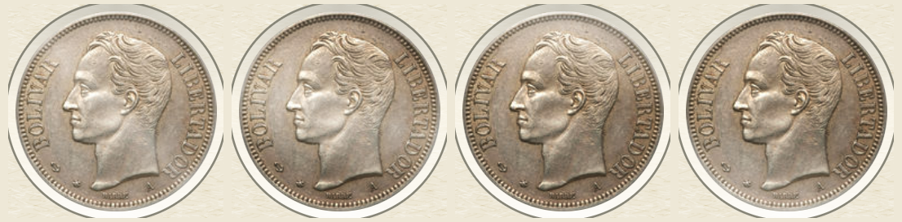
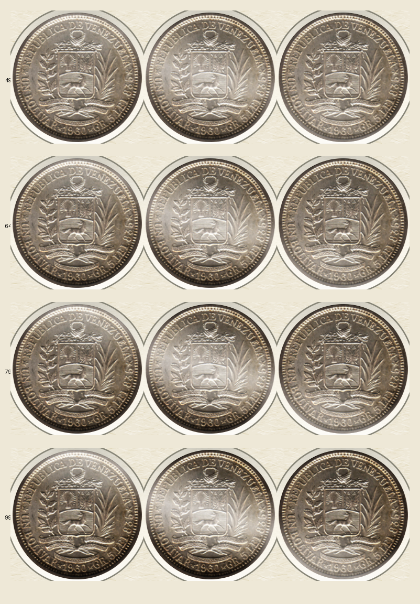
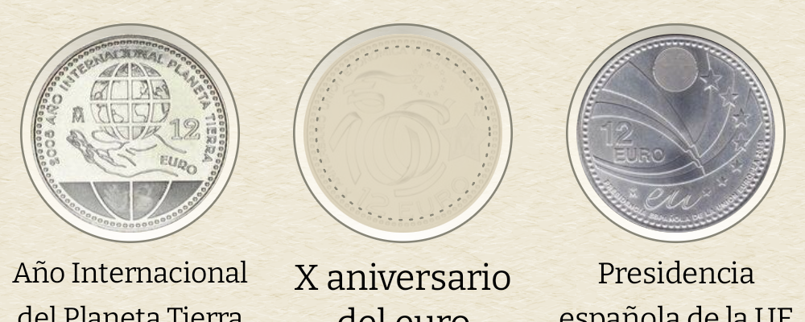
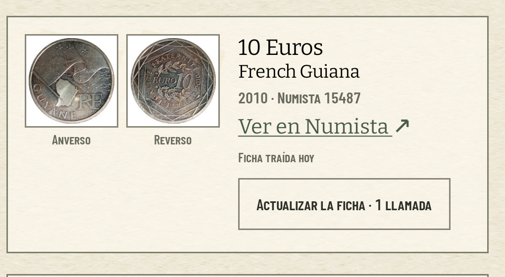

# El brillo de la moneda, calibrado en el AVD

Medido el 9 de agosto de 2026 en el AVD `coindex-ux` (Pixel 7, Android 36,
1080 × 2400 px, 420 dpi), con las animaciones del sistema desactivadas y **la
colección del padre sincronizada** (69 colecciones, 573 monedas, 191 tipos), que
es la única que enseña casillas vacías y monedas que no son de plata. Todos los
números salen de `medir-brillo.py`, que va aquí al lado y se pasa sobre los PNG a
resolución nativa:

```
python3 medir-brillo.py --centro 194 698 --radio 123 \
    --reposo colecciones-reposo.png --izquierda colecciones-izquierda.png \
    --derecha colecciones-despues.png --base colecciones-antes.png
```

El brillo se mueve con `adb emu sensor set acceleration x:y:z`: `0:9.81:0` es el
móvil en la mesa y `±6.94:6.94:0` son los ±45° que saturan el recorrido.



## La intensidad se queda en la mitad del vídeo, y el ticket predecía lo contrario

El [#338](https://github.com/jenarvaezg/coindex/issues/338) avisaba de que el hueco
de producción es un 14 % más pequeño que el que juzgó el #303 —104 dp contra 121—
y que la predicción razonable era que **la variante H se quedara corta**. Medida,
no se queda: la fotografía dentro de la casilla mide 245 × 246 px (93,5 dp) y el
efecto la mueve así.

| casilla «Fuertes» de Colecciones, hueco de 104 dp | niveles de 255 |
| --- | ---: |
| ruido de la propia fotografía por el eje del gradiente | 91,9 |
| **recorrido del brillo entre −45° y +45°, pico a pico** | **104,7** |
| el mismo, en el peor píxel | 60 |
| contra la hoja de hoy · media | 16,0 |
| contra la hoja de hoy · máximo | 50 |

La vara es la del propio ticket: el reflejo fijo del acetato subía **13 niveles**
sobre una foto de plata, «1/12 del ruido de la propia foto». La variante H a la
mitad del vídeo mueve **104,7 contra 91,9**, es decir **1,1 veces** ese ruido — ocho
veces más señal que el acetato. Por eso el valor aprobado entra tal cual:
**intensidad 0,50 y recorrido ±45 % del diámetro**.

Y el diámetro es **el de la fotografía, no el del hueco**: el prototipo del #303 medía
±55 dp sobre una moneda de 121 dp dentro de una ranura de 133, así que la fracción se
aplica a los 94 dp de foto que deja el troquel, no a los 104 dp de casilla. Sobre la
hoja de hoy son **±42,3 dp**, y no los ±47 que estimó el ticket tomando la fracción del
hueco entero.

Y no es veladura, que era el techo que el #303 le puso a la variante B: la
desviación típica dentro del disco **sube** de 29,1 a 34,8 y el detalle de alta
frecuencia sube de 25,0 a 26,2. Lo que baja es la luminancia media, de 163 a 153,
porque la sombra pesa más que la luz — que es exactamente lo que distingue H de las
otras siete: *la superficie se inclina, no se ilumina*.

## El barrido que lo decide, a 1:1 y al tamaño de producción

El banco pinta ahora, además de su ranura de 133 dp, **una tira de tres casillas de
104 dp** con el efecto de producción, porque a 121 dp el #303 ya lo llamaba *sutil* y
las tres pantallas que pintan un hueco usan 104. Cuatro intensidades, tres poses:



Los porcentajes son los que cayó el deslizador, no los pedidos: **49 %** es su paso más
cercano al 0,50 que se envía.

| intensidad | recorrido pico a pico | peor píxel | canto en sombra | detalle (σ alta frecuencia) |
| ---: | ---: | ---: | ---: | ---: |
| **49 %** | **106,4** | **59** | **37,2** | 25,0 |
| 64 % | 139,6 | 78 | 30,3 | 25,4 |
| 79 % | 171,7 | 96 | 23,6 | 25,7 |
| 99 % | 214,9 | 120 | 14,5 | 26,2 |

**El techo no resultó ser la veladura: es el canto.** El detalle no se pierde a
ninguna intensidad —soft-light no aplana una foto—, pero el 5 % más oscuro del
anillo exterior de la moneda cae de 37 a 14 de 255 al llegar al 99 %: la moneda deja
de tener borde contra el hueco y se lee como una viñeta. Subir por encima de la
mitad no compra señal que haga falta y sí se come el canto.

## Brilla la moneda, nunca el cartón



En la lámina «Plata a valor facial» (33/37), entre las dos poses extremas:

| casilla | máxima diferencia | media |
| --- | ---: | ---: |
| 2008 · con moneda | 60 | 9,3 |
| **2009 · vacía** | **0** | **0,0** |
| 2010 · con moneda | 61 | 14,4 |

**Ni un nivel** en la casilla vacía. El fantasma de una emisión que falta es el
diseño del catálogo, no metal, y el modificador no llega a pedirse.

Las cuatro superficies con fotografía de moneda la tienen: la lámina, el índice,
Monedas y las hojas laterales con `PieceCard`. La quinta que el ADR §4 nombra, «Las
cifras», es el bloque 10 y todavía no existe; cuando exista pedirá el mismo modificador. En las sueltas el efecto se detiene
en la moneda y **el paspartú blanco del montaje no se mueve**, porque `Softlight` no
puede mover un blanco puro:



## El PNG exportado no lleva brillo, y ahora tampoco acetato

La lámina de los Fuertes exportada dos veces, con el sensor en las dos poses
extremas, da **el mismo `md5`** (`5a7d43c2118cf18396105cf9ab52fce7`): el sensor no
llega al papel. Es una línea en `OffScreenSheet` —la regla del ADR 0026 §4— y un test
instrumentado, no una condición por efecto.

Frente al PNG que exportaba `main`, el mismo fichero cambia en un **7,3 % de sus
píxeles, con 56 niveles en el peor**: eso no es el brillo, es **el reflejo del acetato
que se ha retirado del recorte**. Lo que el padre enseña sale hoy un poco más limpio
que ayer, y sigue sin llevar metal.

## Lo que cuesta

- **El acelerómetro se registra a `SENSOR_DELAY_UI`** (66.667 µs, leído en
  `dumpsys sensorservice`) y el techo que el #303 dejó sin medir se cumple al pie de
  la letra: **1** conexión activa con la app delante y monedas en pantalla, **0** en
  segundo plano, **0** en Ajustes, que es una pantalla sin una sola moneda. El
  consumo en mA no se mide en un emulador y no se finge; lo que se defiende con un
  número es que nunca está despierto sin motivo.
- **El dibujo cuesta**, y en el emulador cuesta caro: en la misma secuencia de
  dieciséis barridos sobre Colecciones, la mediana de fotograma pasa de **48 a 57 ms**
  y el percentil 90 de 69 a 81. `coindex-ux` rinde por software, donde un `drawRect`
  con `BlendMode` sobre una superficie grande es de lo más caro que hay; **en una GPU
  real esto no se ha medido y no se afirma**.

## Lo que cambió de forma, y quién lo decidió

El reflejo fijo del acetato **se retira de dentro del recorte**. Era la mitad de la
variante **D** del #303 —«dos capas para el resultado de una»— y dejarlo bajo el
brillo la habría reconstruido entera. El #338 pedía explícitamente que esto se
decidiera con el argumento de D delante, y se decidió el 9 de agosto: mover el
reflejo al anillo de cartón se descartó porque el anillo mide 5 dp y ya lleva la
pared del troquel que calibró el #357 — un tercer gradiente ahí no es la funda, es
ruido. La enmienda al ADR 0026 §3 y §15 va con el mismo PR.
