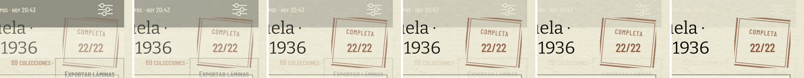
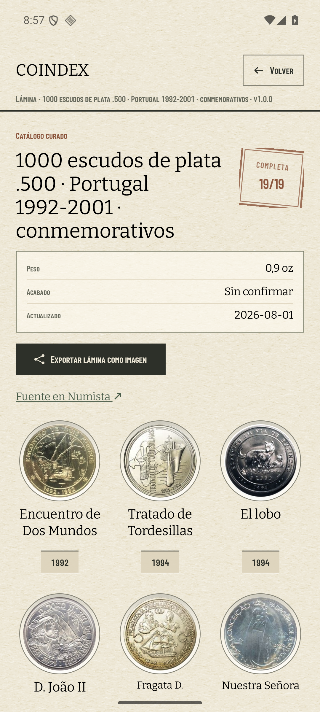
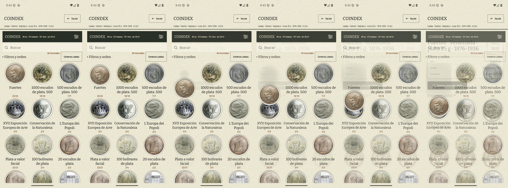
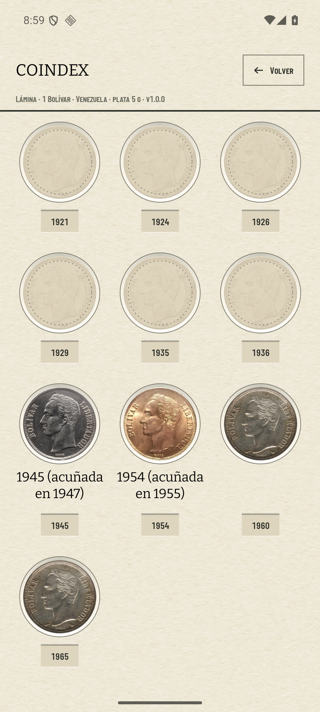
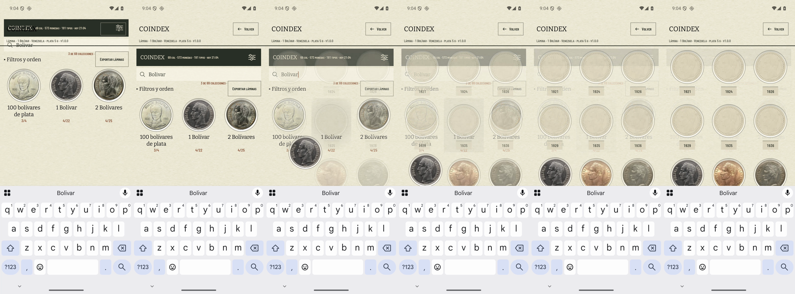
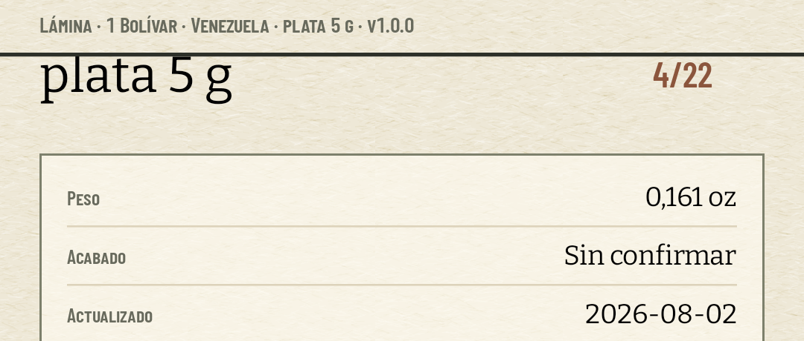
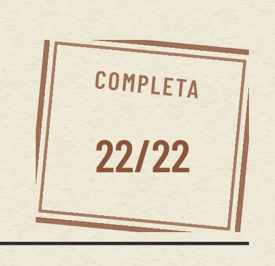

# El sello y el viaje, verificados en el AVD

Medido el 9 de agosto de 2026 en el AVD `coindex-ux` (Pixel 7, Android 36,
1080 × 2400 px, 420 dpi) **con la colección del padre sincronizada** —69 colecciones,
573 monedas, 191 tipos—, que es la única que tiene láminas completas de verdad: las
seis lo están desde el día en que curamos su catálogo, y ninguna la completó él.
Los números salen de `medir-sello.py`, que va aquí al lado y se pasa sobre los PNG a
resolución nativa:

```
python3 medir-sello.py lamina-completa.png --sello 760 430 1070 740 \
    --papel 990 760 1070 900
```

Las secuencias están grabadas con el reloj de animación estirado
(`adb shell settings put global animator_duration_scale 10`): el emulador graba a
2,2 fps y una ceremonia de 300 ms cabe en **medio fotograma**. Lo que se estira es el
reloj, no el valor: la duración que se envía sigue siendo la aprobada.

## El estampado: el sello entra grande y pálido, y la tinta fija el cociente



El sello cae al abrir la hoja, no al sincronizar, y **se come el dato que ya estaba**:
el `22/22` que la cabecera imprimía entra al 45 % de tinta y sube a pleno con la misma
rampa que el caucho, que baja de 1,16 a 1,0 de escala. No añade ni una palabra ni una
cifra a la lámina.

## El `multiply` deja pasar el papel, y eso se mide

Era el primero de los dos cabos que el #304 dejó para el banco: el `multiply` sobre el
papel con grano del #351 «se lee distinto a 420 dpi». Se lee bien, y la prueba es que
**el grano sobrevive debajo de la tinta**:

| sobre `lamina-completa.png` | |
| --- | ---: |
| luminancia del trazo ÷ luminancia del papel | 0,676 |
| grano del papel vacío (σ de alta frecuencia) | 17,12 |
| **grano bajo la tinta, medido** | **11,16** |
| lo que predice multiplicar el papel por 0,676 | 11,58 |
| lo que predice una tinta opaca | 0,00 |

El error contra el modelo multiplicativo es del **3,6 %**, y contra una tinta plana
sería del 100 %: el sello no tapa el papel, lo oscurece. La caja envolvente de la
tinta mide **96,0 × 76,2 dp** sobre los 84 × 76 dp declarados, porque el segundo marco
asoma por dos lados — que es lo que hace que parezca estampado a mano y no impreso.

## El título largo no rompe el sello, y ese era el cabo del #319



El #304 midió 122 dp de holgura con «Fuertes» y avisó de que un título de Numista de
dos líneas se le metería dentro. En producción el título no es `short_name` sino el
nombre largo — «1000 escudos de plata .500 · Portugal 1992-2001 · conmemorativos», que
son **cuatro líneas** — y no se lo come: el cociente y el título comparten una fila
donde el título toma el ancho que sobra. El [#319](https://github.com/jenarvaezg/coindex/issues/319)
puede cerrarse por donde estaba abierto.

## El viaje: la moneda de la tarjeta acaba en su casilla



La moneda de la tarjeta de los Fuertes vuela a la casilla del 1876 y la rejilla entra
detrás. Vuela **sólo donde hay cociente**: las 20 tarjetas del padre que abren `Pieces`
o `Box` no llevan elemento compartido, porque al otro lado no hay una casilla suya sino
filas de inventario con las dos caras a 150 dp.

## La hoja se abre por donde cae la moneda



Los cuatro Bolívares del padre son las casillas 19 a 22 de 22, así que la lámina se abre
ya desplazada hasta el 1945 —el primero que él tiene— en vez de aterrizar la moneda
fuera de pantalla. Sobre una lámina completa no se desplaza nada, y no por suerte: la
primera casilla que tiene *es* la primera, así que el estampado cae donde está el ojo.

Las dos mitades tienen que funcionar **juntas**, que es donde estaba el riesgo: si la
hoja no se hubiera desplazado a tiempo, la casilla de destino no estaría compuesta cuando
arranca la transición y la moneda se apagaría en el aire. No pasa —el desplazamiento
ocurre en el primer trazado, antes del primer fotograma que se ve:





Y el sello cuelga del `n/n`, no de la lámina: el 4/22 entra en óxido pleno, sin tinta
encima y sin esperar ninguna.

## El PNG lleva el sello; el estampado, no



La regla de exportación del ADR 0026 §4 sigue viviendo en una línea de `OffScreenSheet`,
ahora dos: el brillo se anula porque sigue a un sensor, y el estampado porque está vivo
— la hoja fotografiada encuentra la tinta ya seca. El sello sí viaja, porque es un
estado.

El sello del PNG se compone **a su propia densidad** en vez de multiplicar cada dp por
el factor de la cabecera. Escalando dp a dp, las esquinas de 1 dp y los dos filetes
dejaban de ser proporcionales al marco y en una hoja de ocho columnas el sello salía con
el contorno roto. Es el mismo dibujo, a otro tamaño.

## Se estampa cada vez que se abre, y no se guarda ningún hecho

El #304 costó la ceremonia en «un bit por catálogo en `NamedValues`» y su propio plan de
prueba decía lo contrario dos párrafos después. Manda el plan de prueba (ADR 0026 §3,
enmienda del 9 de agosto). Medido sobre una grabación de dos aperturas seguidas, con la
tinta contada por fotograma:

```
...........+#######################+++++...........................++###
            ^ primera caída          ^ vuelta al índice              ^ segunda caída
```

Y lo que el teléfono guarda después de todo eso:

```
$ adb exec-out run-as com.jenarvaezg.coindex ls shared_prefs
coindex-credentials.xml  coindex-sync-log.xml
```

Las credenciales y el registro de sincronización, que son los que ya había. **La 1.0.0 no
añade estado nuevo en su teléfono**, que es justo lo contrario de lo que anunciaba el
comentario del ticket: ADR 0021 §7 dejó la app sin nada guardado por tarjeta y el #276
retiró lo último, y no se reabre esa puerta por una animación.

Sincronizar no estampa nada, y no hace falta un mecanismo para conseguirlo: el sello sólo
se dibuja en la lámina, y el índice —donde una tarjeta no se abre nunca— sigue marcando
las completas con el cociente en óxido del #300.

## Ni al hacer scroll, que es por donde se coló la ceremonia una vez

La cabecera de la lámina es un `item` de una rejilla perezosa: se destruye al bajar y se
vuelve a crear al subir. Con la tinta guardada dentro de ella, **el sello volvía a caer
cada vez que el coleccionista subía** — que es exactamente la ceremonia al hacer scroll
que el #304 rechazó para el índice, colada por la puerta de al lado. La tinta pasa a
vivir donde vive la hoja (`AvailablePlate`), y baja a quien la dibuja. Medido sobre los
Fuertes, bajando dos pantallas y volviendo, con el reloj a ×10 —donde una caída duraría
tres segundos— y cuatro capturas seguidas al llegar arriba:

| captura al volver arriba | píxeles de tinta |
| --- | ---: |
| 1 | 7.914 |
| 2 | 7.677 |
| 3 | 7.677 |
| 4 | 7.677 |

Puesta y quieta. Una caída en curso habría dado una rampa.
