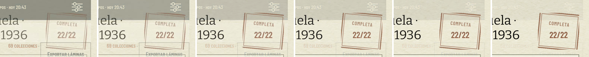
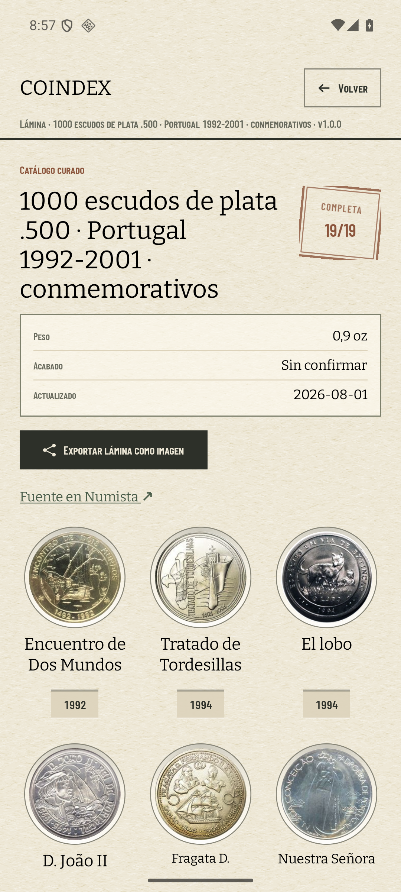
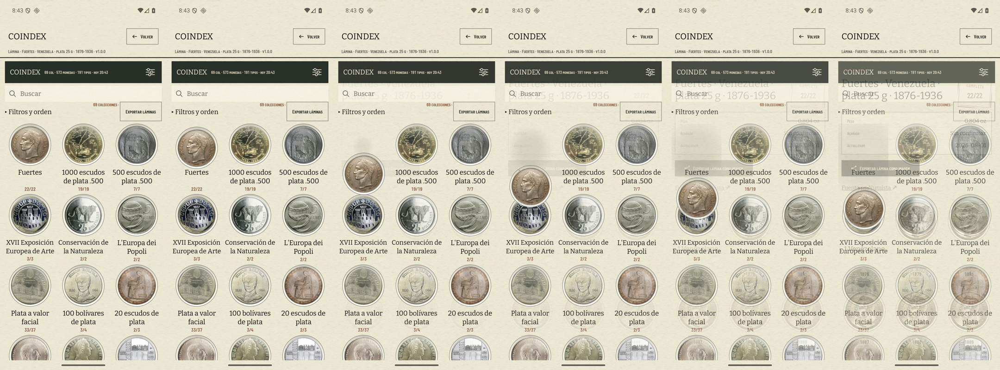
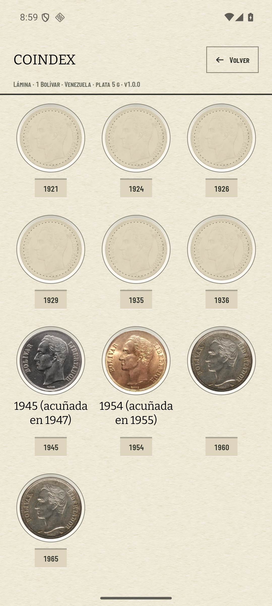
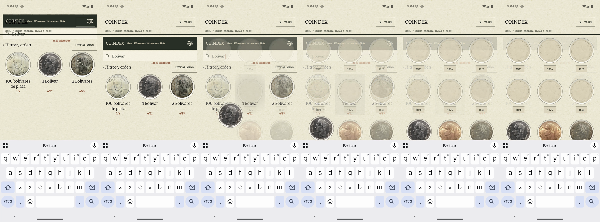
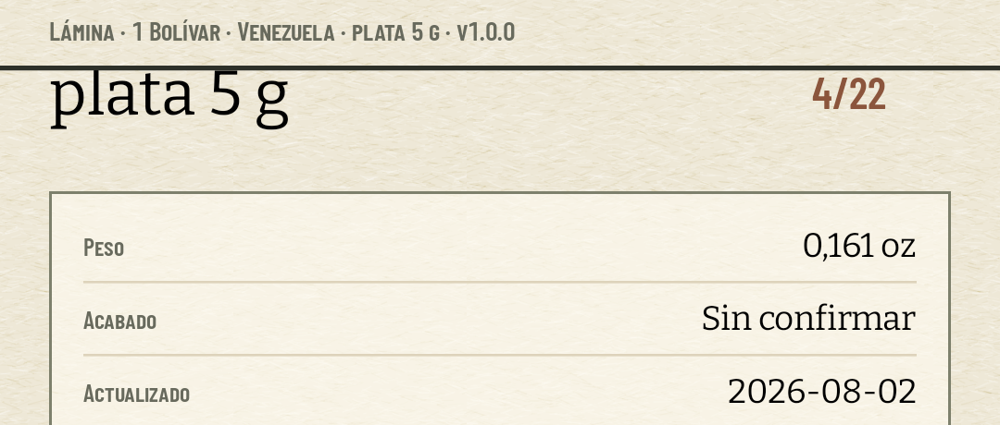
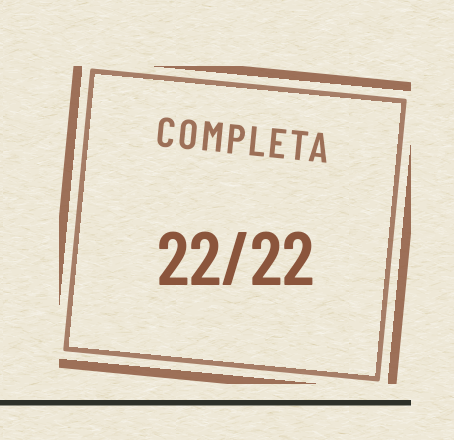

# El sello y el viaje, verificados en el AVD

Medido el 9 de agosto de 2026 en el AVD `coindex-ux` (Pixel 7, Android 36,
1080 × 2400 px, 420 dpi) con la colección del padre sincronizada (69 colecciones, 573
monedas, 191 tipos), la única con láminas completas de verdad: las seis lo estaban ya
cuando se curó su catálogo. Los números salen de `medir-sello.py`, pasado sobre los PNG
a resolución nativa:

```
python3 medir-sello.py lamina-completa.png --sello 760 430 1070 740 \
    --papel 990 760 1070 900
```

Las secuencias están grabadas con el reloj de animación estirado
(`adb shell settings put global animator_duration_scale 10`): el emulador graba a
2,2 fps y una ceremonia de 300 ms cabe en medio fotograma. Se estira el reloj, no el
valor: la duración que se envía sigue siendo la aprobada.

## El estampado: el sello entra grande y pálido, y la tinta fija el cociente



El sello cae al abrir la hoja, no al sincronizar, y se monta sobre el dato que ya
estaba: el `22/22` de la cabecera entra al 45 % de tinta y sube a pleno con la misma
rampa que el caucho, que baja de 1,16 a 1,0 de escala. No añade ninguna palabra ni cifra
a la lámina.

## El `multiply` deja pasar el papel

Era el primero de los dos cabos que el #304 dejó para el banco: el `multiply` sobre el
papel con grano del #351 «se lee distinto a 420 dpi». Se lee bien: el grano sobrevive
debajo de la tinta.

| sobre `lamina-completa.png` | |
| --- | ---: |
| luminancia del trazo ÷ luminancia del papel | 0,676 |
| grano del papel vacío (σ de alta frecuencia) | 17,12 |
| grano bajo la tinta, medido | 11,16 |
| lo que predice multiplicar el papel por 0,676 | 11,58 |
| lo que predice una tinta opaca | 0,00 |

El error contra el modelo multiplicativo es del 3,6 %, y contra una tinta plana sería
del 100 %: el sello oscurece el papel sin taparlo. La caja envolvente de la tinta mide
96,0 × 76,2 dp sobre los 84 × 76 dp declarados, porque el segundo marco asoma por dos
lados; eso es lo que lo hace parecer estampado a mano.

## El título largo no rompe el sello (cabo del #319)



El #304 midió 122 dp de holgura con «Fuertes» y avisó de que un título de Numista de dos
líneas se le metería dentro. En producción el título no es `short_name` sino el nombre
largo («1000 escudos de plata .500 · Portugal 1992-2001 · conmemorativos», cuatro
líneas), y no lo pisa: el cociente y el título comparten una fila donde el título toma
el ancho que sobra. Con esto el [#319](https://github.com/jenarvaezg/coindex/issues/319)
puede cerrarse.

## El viaje: la moneda de la tarjeta acaba en su casilla



La moneda de la tarjeta de los Fuertes vuela a la casilla del 1876 y la rejilla entra
detrás. Sólo vuela donde hay cociente: las 20 tarjetas del padre que abren `Pieces` o
`Box` no llevan elemento compartido, porque al otro lado no hay una casilla suya sino
filas de inventario con las dos caras a 150 dp.

> **Corregido el 10 de agosto de 2026 (#381).** «La rejilla entra detrás» describe un
> defecto que esta tira recoge: en las poses 3 a 6 el `22/22`, «Exportar lámina
> completa» y «Fuente en Numista» se leen sobre las nueve tarjetas del índice, que
> siguen enteras debajo. Era un doble expuesto de las dos pantallas, porque ningún
> destino del `NavHost` pintaba papel propio. La tira buena está en
> `docs/ux/implementacion-381/`; el resto de este documento sigue valiendo.

## La hoja se abre por donde cae la moneda



Los cuatro Bolívares del padre son las casillas 19 a 22 de 22, así que la lámina se abre
ya desplazada hasta el 1945, el primero que tiene, para que la moneda no aterrice fuera
de pantalla. En una lámina completa no se desplaza nada: la primera casilla que tiene es
la primera, así que el estampado cae donde está el ojo.

El riesgo estaba en que las dos mitades funcionaran juntas: si la hoja no se desplazara
a tiempo, la casilla de destino no estaría compuesta cuando arranca la transición y la
moneda se apagaría en el aire. El desplazamiento ocurre en el primer trazado, antes del
primer fotograma visible:





El sello cuelga del `n/n`, no de la lámina: el 4/22 entra en óxido pleno, sin tinta
encima y sin esperar.

## El PNG lleva el sello; el estampado, no



La regla de exportación del ADR 0026 §4 sigue en `OffScreenSheet`, ahora en dos líneas:
el brillo se anula porque sigue a un sensor, y el estampado porque es una animación; la
hoja exportada encuentra la tinta ya seca. El sello sí sale, porque es un estado.

El sello del PNG se compone a su propia densidad en vez de multiplicar cada dp por el
factor de la cabecera. Escalando dp a dp, las esquinas de 1 dp y los dos filetes dejaban
de ser proporcionales al marco, y en una hoja de ocho columnas el sello salía con el
contorno roto.

## Se estampa cada vez que se abre, sin guardar estado

El #304 cifró la ceremonia en «un bit por catálogo en `NamedValues`», y su propio plan
de prueba decía lo contrario dos párrafos después. Manda el plan de prueba (ADR 0026 §3,
enmienda del 9 de agosto). Medido sobre una grabación de dos aperturas seguidas, con la
tinta contada por fotograma:

```
...........+#######################+++++...........................++###
            ^ primera caída          ^ vuelta al índice              ^ segunda caída
```

Lo que el teléfono guarda después:

```
$ adb exec-out run-as com.jenarvaezg.coindex ls shared_prefs
coindex-credentials.xml  coindex-sync-log.xml
```

Las credenciales y el registro de sincronización, que ya estaban. La 1.0.0 no añade
estado nuevo en el teléfono, al contrario de lo que anunciaba el comentario del ticket:
el ADR 0021 §7 dejó la app sin nada guardado por tarjeta, el #276 retiró lo último, y
una animación no justifica volver a guardar.

Sincronizar no estampa nada, sin mecanismo aparte: el sello sólo se dibuja en la lámina,
y el índice, donde la tarjeta no se abre, sigue marcando las completas con el cociente
en óxido del #300.

## Tampoco al hacer scroll

La cabecera de la lámina es un `item` de una rejilla perezosa: se destruye al bajar y se
vuelve a crear al subir. Con la tinta guardada dentro de ella, el sello volvía a caer
cada vez que el coleccionista subía, la ceremonia al hacer scroll que el #304 rechazó
para el índice. La tinta pasa a vivir donde vive la hoja (`AvailablePlate`) y baja a
quien la dibuja. Medido sobre los Fuertes, bajando dos pantallas y volviendo, con el
reloj a ×10 (una caída duraría tres segundos) y cuatro capturas seguidas al llegar
arriba:

| captura al volver arriba | píxeles de tinta |
| --- | ---: |
| 1 | 7.914 |
| 2 | 7.677 |
| 3 | 7.677 |
| 4 | 7.677 |

La tinta está puesta y quieta; una caída en curso habría dado una rampa.
