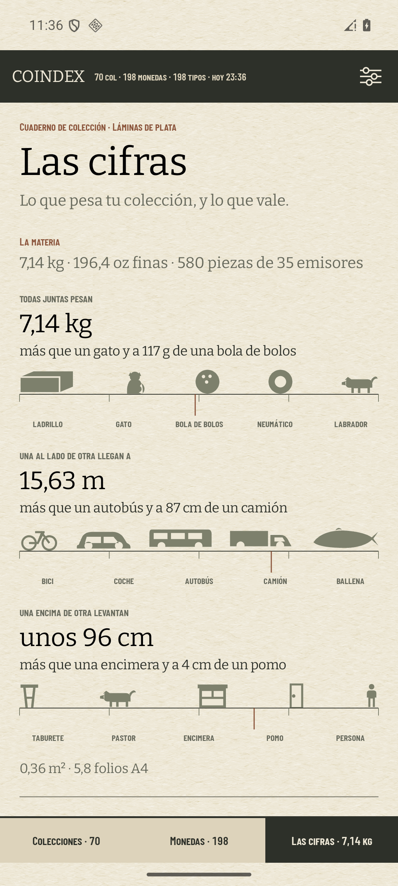
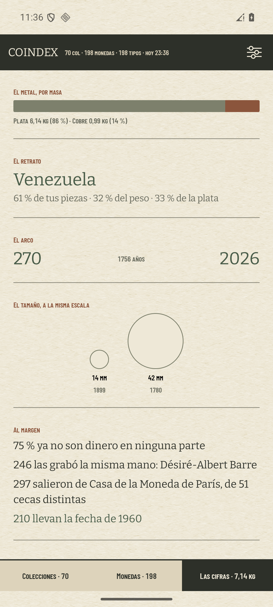

# «Las cifras» en el teléfono: lo que la primera medición corrigió del prototipo

El bloque 10 del [ADR 0026](../adr/0026-the-shape-of-coindex-an-album-sheet.md), construido el 10 de
agosto de 2026 y medido en el AVD `coindex-ux` a 1080 × 2400 con una colección real sincronizada —
**580 piezas, 198 tipos, 35 emisores**. El #326 lo decidió en HTML y dejó dicho que «nada de esto se
ha visto en un teléfono»; esto es haberlo visto.

**Los importes no están en este documento y las capturas llevan el dinero fuera.** El repositorio es
público. La captura con la sección del dinero —sobre precios **inventados**, no de Numista— está en
`/private/tmp/coindex-privado/cifras-326/p-cifras-341-dinero.png`.

## Las cifras salen bordadas del prototipo

Cada figura medida en el móvil contra la que el #326 midió sobre el volcado del dominio. La colección
del AVD tiene ocho piezas más que la del informe, así que los porcentajes se mueven un punto:

| cifra | el #326 (572 piezas) | el teléfono (580) |
| --- | --- | --- |
| peso | 6,91 kg | **7,14 kg** |
| plata fina | 189,7 oz | **196,4 oz** |
| en fila | 15,22 m | **15,63 m** |
| extendidas | 0,35 m² · 5,6 folios | **0,36 m² · 5,8 folios** |
| apiladas | unos 95 cm | **unos 96 cm** |
| metal por masa | plata 86 % · cobre 14 % | **86 % · 14 %** |
| el arco | 270 → 2026, 1.756 años | **idéntico** |
| el tamaño | ½ dirham de 14,5 mm (1899) contra tálero de 42 mm (1780) | **idéntico** |
| desmonetizadas | 75 % | **75 %** |
| la misma mano | 246, Désiré-Albert Barre | **246, Barre** |
| de París | 296 de 51 cecas | **297 de 51 cecas** |
| un solo año | 210 de 1960 | **210 de 1960** |
| el retrato | Venezuela 62 % · 33 % · 34 % | **61 % · 32 % · 33 %** |

Dos de ellas sólo salen si la implementación acierta con una regla que el prototipo dejó escrita:

- **el arco de 1.756 años** necesita que el ½ dirham se coloque por su año **gregoriano** (1899) y no
  por el 1316 hijrí que lleva grabado, y que las 23 piezas sin año hereden el mínimo de su tipo. Sin
  cualquiera de las dos el arco se queda en 246 años (ADR 0026 §9);
- **el tálero de 1780** sólo gana el extremo grande porque el empate a 42 mm —hay cuatro piezas de 42
  mm— lo rompe la **más vieja**. Sin desempate salía el armadillo de 1975, que es la que el
  inventario lista después.

## Lo que la primera pantalla corrigió

**Cuatro de las catorce siluetas no se leían a 26 dp, y se redibujaron con la medida delante.** Son
parte de la identidad y no un asset (#326), así que el arreglo es dibujo y no configuración:

| figura | qué se leía | qué se cambió |
| --- | --- | --- |
| **ladrillo** | dos barras apiladas | la junta de mortero era tan ancha como los tizones que separaba; se dibuja en perspectiva, con una cara frontal y una superior |
| **gato** | un bicho con antenas | dos intentos con comandos de arco daban un muñeco de nieve con dos palos; se rehízo con curvas explícitas: cabeza redonda, dos orejas y cola que se enrosca |
| **perro** | un cerdo | patas cortas, sin cola y con el hocico fundido en el cuerpo. Patas largas, morro que apunta, oreja y cola levantada |
| **ballena** | un pez | la cola era una cuña vertical; una aleta caudal son dos lóbulos horizontales |

El gato y el perro son la lección que se repite: **a este tamaño manda la silueta, no el detalle**, y
lo que dice «perro» son cuatro patas y una cola, nunca una raza.

**La marca de la colección cuelga por debajo de la raya** y no encima, que era la decisión del #326 y
en el teléfono se ve por qué: la colección cae a un dedo de la bola de bolos, que es justo cuando la
escalera está diciendo algo, y encima de la raya la marca se comía el rótulo.

**Y la frase de la escalera es la cifra**: «más que un gato y a 117 g de una bola de bolos». Sin ella
las tres escaleras son tres rayas con bichos, y con ella el siguiente referente tira hacia delante.

## Lo que el segundo pliegue corrigió

- **El tamaño se centra.** Alineado a la izquierda dejaba media hoja en blanco a la derecha, y lo que
  el bloque *es* es una comparación: las dos monedas con el margen de la hoja a los dos lados.
- **Sólo se toca lo que baja.** Venezuela, los dos años del arco y «210 llevan la fecha de 1960» van
  en verde musgo porque llevan a las piezas que las componen; las otras tres notas del margen son
  tinta, porque no tienen dónde bajar. Un número tocable e inerte es peor que uno quieto.
- **La barra del metal crece sola.** Con estas dos colecciones son dos colores, plata contra cobre,
  porque la aleación de una moneda de plata .835 es un 16,5 % de cobre y todo metal base que hay hoy
  es un aleado de cobre. El día que entre un acero, sale una banda más sin tocar nada.

## Las dos comprobaciones que el plan de prueba pedía

- **Sin red y sin un solo precio, la página abre entera y sin sección de dinero.** Medido con el wifi
  y los datos apagados: el peso, las tres escaleras, el metal, el retrato, el arco, el tamaño y las
  cuatro notas salen del APK. No hay número tachado ni total provisional: la sección no está.
- **Tocar «Venezuela» lleva a esas piezas.** Cruza a Monedas con «1 filtro · Eje País» y **23 de 198
  tipos**, que son los venezolanos. «1960» hace lo propio con «1 filtro · Eje Año» y 6 tipos.

## Dónde aparece el dinero, y dónde no

Con precios en el teléfono la sección del valor abre la página, con **de dónde sale** debajo y el
sello de la plata con su fecha —«plata de hoy»—, que es lo que impide leerlo como una cotización. El
valor de una pieza sale además en su ficha, con el origen dicho («precio de catálogo en unc, el grado
vecino» es el que salió en la primera moneda abierta), y el de una lámina sobre su cabecera, al lado
del sello de completada.

**Y no aparece en el papel salvo que se pida**: «El valor» es el séptimo interruptor de la
exportación —el ADR 0026 §10 lo llamó el sexto contando los cinco del #228, y el #275 ya había puesto
la lámina de sueltas de sexta— y nace **apagado**, porque el resto de los defectos nacen como el
cuaderno de hoy.

## Lo que hereda quien siga

- **La escalera se queda corta por arriba** el día que la colección pase del labrador o de la
  ballena: es un dato de la app, y el estado «no queda referente por encima» ya se dice por dentro.
- **El pase de tasación no se ha corrido contra Numista.** Son ~487 llamadas —del 24 al 32 % del mes—
  y se sembraron precios por SQL para ver dibujarse la sección; lo que decide qué se pide, qué se
  guarda y qué caduca está en el ADR 0028 y en sus tests. La primera pasada de verdad la paga el
  teléfono del coleccionista, que es lo que el ADR firmó.
- **La pila es la única cifra extrapolada** y lo dice con una palabra: `thickness` falta en un tercio
  de los tipos, así que se mide sobre las piezas que lo traen y se escala a todas. «unos 96 cm».
