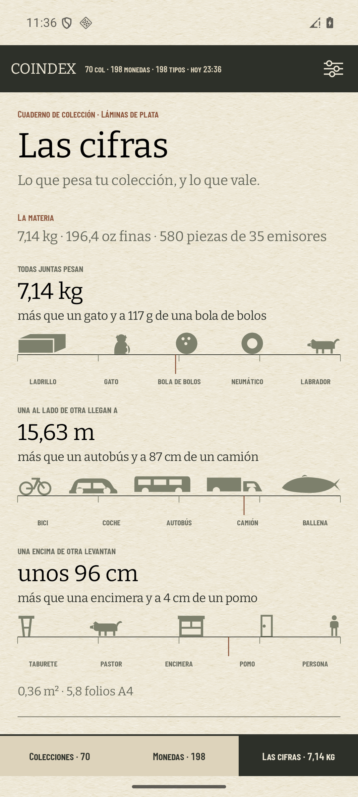
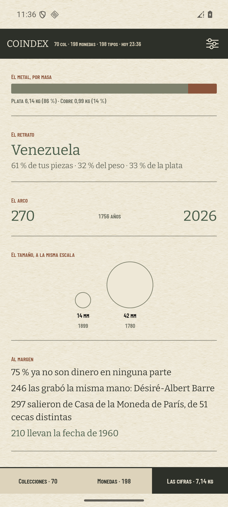

# «Las cifras» en el teléfono: lo que la primera medición corrigió del prototipo

El bloque 10 del [ADR 0026](../adr/0026-the-shape-of-coindex-an-album-sheet.md), construido el 10 de
agosto de 2026 y medido en el AVD `coindex-ux` a 1080 × 2400 con una colección real sincronizada:
580 piezas, 198 tipos, 35 emisores. El #326 se decidió en HTML sin verlo en un teléfono; esta es la
comprobación.

Los importes no están en este documento y las capturas llevan el dinero fuera, porque el
repositorio es público. La captura con la sección del dinero, sobre precios inventados y no de
Numista, está en `/private/tmp/coindex-privado/cifras-326/p-cifras-341-dinero.png`.

## Las cifras coinciden con el prototipo

Cada cifra medida en el móvil contra la que el #326 midió sobre el volcado del dominio. La colección
del AVD tiene ocho piezas más que la del informe, así que los porcentajes se mueven un punto:

| cifra | el #326 (572 piezas) | el teléfono (580) |
| --- | --- | --- |
| peso | 6,91 kg | **7,14 kg** |
| plata fina | 189,7 oz | **196,4 oz** |
| en fila | 15,22 m | **15,63 m** |
| extendidas | 0,35 m² · 5,6 folios | **0,36 m² · 5,8 folios** |
| apiladas | unos 95 cm | **unos 96 cm** |
| metal por masa | plata 86 % · cobre 14 % | **86 % · 14 %** |
| el arco | 270 → 2026, 1.756 años | **idéntico** |
| el tamaño | ½ dirham de 14,5 mm (1899) contra tálero de 42 mm (1780) | **idéntico** |
| desmonetizadas | 75 % | **75 %** |
| la misma mano | 246, Désiré-Albert Barre | **246, Barre** |
| de París | 296 de 51 cecas | **297 de 51 cecas** |
| un solo año | 210 de 1960 | **210 de 1960** |
| el retrato | Venezuela 62 % · 33 % · 34 % | **61 % · 32 % · 33 %** |

Dos sólo salen bien si la implementación aplica reglas que el prototipo dejó escritas:

- **el arco de 1.756 años** necesita colocar el ½ dirham por su año gregoriano (1899) y no por el
  1316 hijrí que lleva grabado, y que las 23 piezas sin año hereden el mínimo de su tipo. Sin
  cualquiera de las dos el arco se queda en 246 años (ADR 0026 §9);
- **el tálero de 1780** gana el extremo grande porque el empate a 42 mm (hay cuatro piezas de 42 mm)
  lo rompe la más vieja. Sin desempate salía el armadillo de 1975, el siguiente en el inventario.

## Lo que corrigió la primera pantalla

Cuatro de las catorce siluetas no se reconocían a 26 dp y se redibujaron. Son parte de la
identidad y no un asset (#326), así que el arreglo es de dibujo y no de configuración:

| figura | qué se leía | qué se cambió |
| --- | --- | --- |
| **ladrillo** | dos barras apiladas | la junta de mortero era tan ancha como los tizones que separaba; se dibuja en perspectiva, con una cara frontal y una superior |
| **gato** | un bicho con antenas | dos intentos con comandos de arco daban un muñeco de nieve con dos palos; se rehízo con curvas explícitas: cabeza redonda, dos orejas y cola que se enrosca |
| **perro** | un cerdo | patas cortas, sin cola y con el hocico fundido en el cuerpo. Patas largas, morro que apunta, oreja y cola levantada |
| **ballena** | un pez | la cola era una cuña vertical; una aleta caudal son dos lóbulos horizontales |

Lo que enseñan el gato y el perro: a este tamaño manda la silueta, no el detalle, y lo que dice
«perro» son cuatro patas y una cola, no una raza.

La marca de la colección cuelga por debajo de la raya, como decidió el #326, y en el teléfono se ve
por qué: la colección cae a un dedo de la bola de bolos, y encima de la raya la marca tapaba el
rótulo.

La frase de la escalera, «más que un gato y a 117 g de una bola de bolos», es la cifra: sin ella
las tres escaleras son tres rayas con bichos.

## Lo que corrigió el segundo pliegue

- **El tamaño va centrado.** Alineado a la izquierda dejaba media hoja en blanco a la derecha, y el
  bloque es una comparación entre dos monedas.
- **Sólo es tocable lo que lleva a algún sitio.** Venezuela, los dos años del arco y «210 llevan la
  fecha de 1960» van en verde musgo porque llevan a sus piezas; las otras tres notas del margen van
  en tinta. Un número que parece tocable y no hace nada es peor que uno quieto.
- **La barra del metal crece sola.** Con estas dos colecciones son dos colores, plata y cobre,
  porque una moneda de plata .835 lleva un 16,5 % de cobre y todo metal base que hay hoy es un
  aleado de cobre. Si entra un acero, sale otra banda sin tocar nada.

## Las dos comprobaciones del plan de prueba

- **Sin red y sin precios, la página abre entera y sin sección de dinero.** Medido con wifi y datos
  apagados: el peso, las tres escaleras, el metal, el retrato, el arco, el tamaño y las cuatro
  notas salen del APK. No hay número tachado ni total provisional: la sección no está.
- **Tocar «Venezuela» lleva a esas piezas.** Cruza a Monedas con «1 filtro · Eje País» y 23 de 198
  tipos, los venezolanos. «1960» hace lo mismo con «1 filtro · Eje Año» y 6 tipos.

## Dónde aparece el dinero, y dónde no

Con precios en el teléfono, la sección del valor abre la página, con su origen debajo y el sello de
la plata con su fecha («plata de hoy»), para que no se lea como una cotización. El valor de una
pieza sale en su ficha con el origen dicho (en la primera moneda abierta: «precio de catálogo en
unc, el grado vecino»), y el de una lámina en su cabecera, junto al sello de completada.

En el papel no aparece salvo que se pida: «El valor» es el séptimo interruptor de la exportación y
nace apagado, porque los valores por defecto reproducen el cuaderno de antes. (El ADR 0026 §10 lo
llamó el sexto contando los cinco del #228; el #275 ya había puesto de sexta la lámina de sueltas.)

## Lo que hereda quien siga

- **La escalera se queda corta por arriba** el día que la colección pase del labrador o de la
  ballena. Los referentes son un dato de la app, y el caso «no queda referente por encima» ya está
  contemplado por dentro.
- **El pase de tasación no se ha corrido contra Numista.** Son ~487 llamadas (del 24 al 32 % del
  mes); para ver dibujarse la sección se sembraron precios por SQL. Qué se pide, qué se guarda y qué
  caduca está en el ADR 0028 y sus tests. La primera pasada real la paga el teléfono del
  coleccionista, como firmó el ADR.
- **La pila es la única cifra extrapolada** y lo dice con «unos»: `thickness` falta en un tercio de
  los tipos, así que se mide sobre las piezas que lo traen y se escala a todas («unos 96 cm»).
