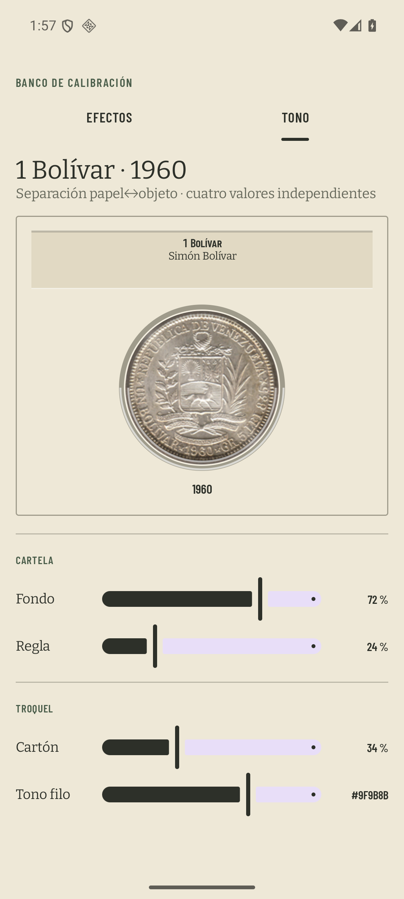
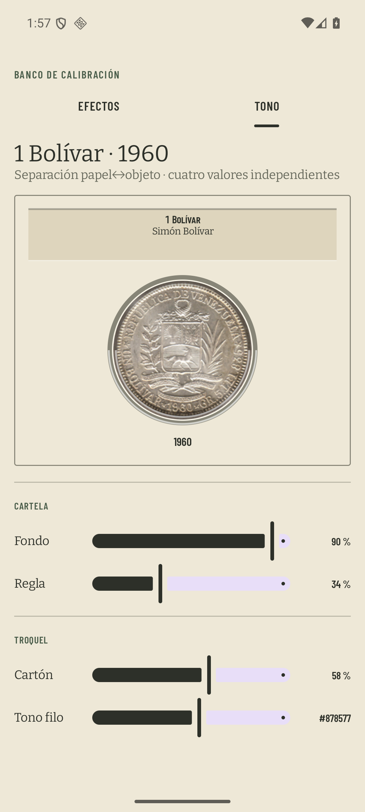

# Calibración tonal de la hoja

Medido el 9 de agosto de 2026 en el AVD `coindex-ux` (Pixel 7, Android 36,
1080 × 2400 px, 420 dpi), con las animaciones del sistema desactivadas y a
escala 1:1. Los colores y ratios de esta página se recontaron sobre los PNG,
no sobre una maqueta ni únicamente sobre las constantes de la paleta.

## Banco tonal

La pestaña `TONO` abre con los cuatro valores que produjeron las capturas del
ticket: cartela al 72 %, cartón al `87/255` (34 %), filo `#9F9B8B` y regla al
24 %. Los cuatro se editan por separado delante del 1 Bolívar de 1960.

El calibrado de producción quedó en cartela al 90 %, cartón al `148/255`
(58 %), filo `#878577` y regla al 34 %. La forma no cambió: son el mismo
rectángulo, sus dos reglas y el mismo círculo troquelado, sin sombra nueva.

## Recuento sobre las capturas

El papel muestreado por el ticket, `#EFE9D9`, vuelve a aparecer como píxel
exacto en ambos PNG finales. En `monedas-despues.png` también aparecen como
píxeles exactos `#686A5D` 3.713 veces y `#878577` 39.490 veces, de modo que el
recuento no depende de inferir el color a partir de Kotlin.

| elemento | antes | después | mínimo |
| --- | ---: | ---: | ---: |
| texto `muted` contra `#EFE9D9` | 4,48 | **4,55** | 4,50 |
| `hairline` contra `#EFE9D9` | 2,28 | **3,07** | 3,00 |
| fondo de cartela contra `#EFE9D9` | 1,16 (`#E1D9C3`) | **1,21** (`#DED5BE`) | visual |
| regla superior de cartela contra `#EFE9D9` | 1,50 (`#C4C0B1`) | **1,94** (`#ACA99C`) | visual |
| cartón contra `#EFE9D9` | 1,06 (`#F4EFE1`) | **1,09** (`#F8F3E6`) | visual |
| borde del cartón contra `#EFE9D9` | 2,28 | **3,07** | visual |

La caja de la cartela se apoya ahora en un fondo algo más separado y, sobre
todo, en dos reglas inequívocas. El cartón sigue siendo blanco cálido, pero su
borde usa el `hairline` calibrado en vez de un velo translúcido independiente.

Las capturas de antes son exactamente las dos que originaron el ticket (el
banco de cinco colecciones, 72 monedas y 15 tipos). Las de después usan la
captura privada local vigente del padre (68 colecciones, 572 monedas y 191
tipos); los ratios anteriores sólo comparan píxeles de papel y forma, no el
contenido variable del inventario.

- [Colecciones antes](colecciones-antes.png) · [Colecciones después](colecciones-despues.png)
- [Monedas antes](monedas-antes.png) · [Monedas después](monedas-despues.png)

## Papel exportado

Se exportó `Fuertes` desde el mismo AVD con el filtro del índice puesto. El
resultado fue un PDF A4 de dos páginas, 1,5 MB, PDF 1.4 y sin cifrar. Ambas
páginas se rasterizaron a 120 dpi y se inspeccionaron: títulos, ficha, años,
escala y fuente siguen legibles; `paperDeep` viaja al papel y no apareció
ninguna inversión de tema. El PDF contiene inventario privado y por eso la
comprobación queda documentada aquí sin versionar el artefacto.
