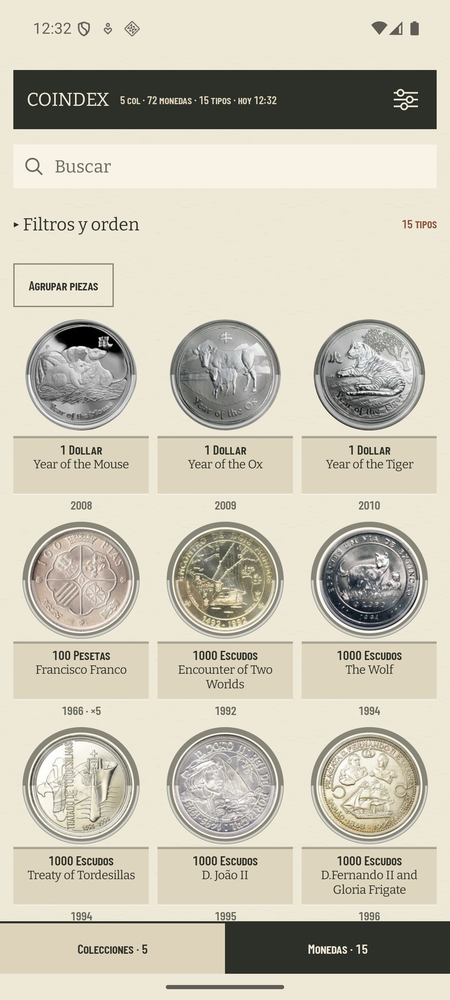

# Cartelas de Monedas con altura fija

Comprobación del #350 en el AVD `coindex-ux` (Pixel 7, Android 36, 1080 × 2400 px,
420 dpi) con su colección de calibración de 72 piezas y 15 tipos.

| antes | después |
| --- | --- |
|  |  |

## Medida de la rejilla

La altura fija es **52 dp**, el peor caso que ya cabía en la rejilla. Convertir el mínimo en
78 dp habría sumado 26 dp a cada fila; no es lo que pinta Compose y habría roto el paso medido en
el bloque 5.

El `uiautomator dump` anterior y posterior deja los años en las mismas coordenadas:

| fila | antes | después |
| --- | ---: | ---: |
| `2008`, `2009`, `2010` | `y = 1194` | `y = 1194` |
| `1966 · ×5`, `1992`, `1994` | `y = 1687` | `y = 1687` |

En la segunda fila, `Encounter of Two Worlds` ocupa dos líneas mientras `Francisco Franco` y
`The Wolf` ocupan una. Los tres años quedan alineados, y el tema corto se centra en el mismo hueco
que el largo sin mover el paso de fila.

## Los tres renderers

Una prueba instrumental compone juntos los tres casos —sin tema, tema de una línea y tema de dos—
y verifica la alineación a través de las superficies públicas que producen cada salida:

- `AlbumCartouche`, para la rejilla de Monedas;
- `PiecesSheet`, para el PNG de una hoja de piezas;
- `NotebookPageSheet`, para el PDF.

El snapshot disponible del AVD conserva los 15 tipos de calibración, no los 62 del inventario del
padre citados en el ticket. La combinación que falta en esa captura queda cubierta de forma
determinista por la prueba instrumental, incluido el caso sin tema.

El año sigue fuera de la cartela. Su cambio de renderizado continúa perteneciendo al bloque 7
(#337).
