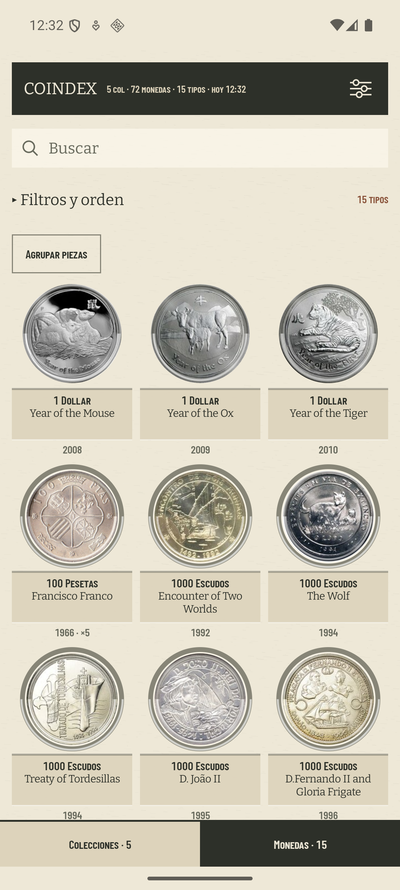

# Cartelas de Monedas con altura fija

Comprobación del #350 en el AVD `coindex-ux` (Pixel 7, Android 36, 1080 × 2400 px, 420 dpi) con su
colección de calibración de 72 piezas y 15 tipos.

| antes | después |
| --- | --- |
|  |  |

## Medida de la rejilla

La altura fija es 52 dp, el peor caso que ya cabía en la rejilla. Un mínimo de 78 dp habría sumado
26 dp a cada fila y roto el paso medido en el bloque 5.

El `uiautomator dump` de antes y después deja los años en las mismas coordenadas:

| fila | antes | después |
| --- | ---: | ---: |
| `2008`, `2009`, `2010` | `y = 1194` | `y = 1194` |
| `1966 · ×5`, `1992`, `1994` | `y = 1687` | `y = 1687` |

En la segunda fila, `Encounter of Two Worlds` ocupa dos líneas y `Francisco Franco` y `The Wolf`,
una. Los tres años quedan alineados, y el tema corto se centra en el mismo hueco que el largo sin
mover el paso de fila.

## Los tres renderers

Una prueba instrumentada compone juntos los tres casos (sin tema, tema de una línea y tema de dos)
y verifica la alineación a través de las superficies públicas que producen cada salida:

- `AlbumCartouche`, para la rejilla de Monedas;
- `PiecesSheet`, para el PNG de una hoja de piezas;
- `NotebookPageSheet`, para el PDF.

El snapshot del AVD tiene los 15 tipos de calibración, no los 62 del inventario del padre que cita
el ticket; la combinación que falta en la captura la cubre la prueba instrumentada, incluido el
caso sin tema.

El año sigue fuera de la cartela; su renderizado es del bloque 7 (#337).
