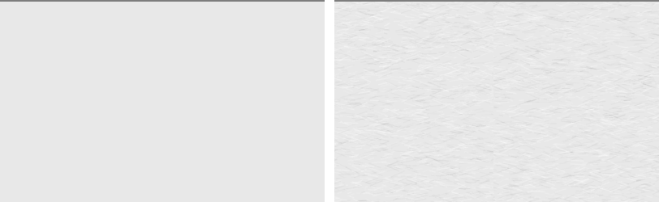

# El grano del papel, medido y subido hasta que se ve

Medido el 9 de agosto de 2026 en el AVD `coindex-ux` (Pixel 7, Android 36,
1080 × 2400 px, 420 dpi), con las animaciones del sistema desactivadas, a escala
1:1 y con la colección del padre sincronizada (69 colecciones, 573 monedas, 191
tipos). Todas las cifras se recontaron sobre los PNG nativos, no sobre las
constantes de Kotlin.

## La medida que abrió el ticket se confirma

Sobre `implementacion-334/despues.png`, en una región de 920 × 600 px de papel
vacío: **4,17 %** de píxeles fuera del tono exacto del papel, **12** niveles de
amplitud, **0,78** de desviación típica y 13 tonos distintos. Y el mosaico
repetía exacto: la diferencia consigo mismo desplazado una tesela era **0 en
todos los píxeles**.

El [#300](https://github.com/jenarvaezg/coindex/issues/300) y el ADR 0026 §15
daban tres salidas. Se eligió **subirlo hasta que se vea**, que es la única que
obliga a pagar las tres facturas que el [#351](https://github.com/jenarvaezg/coindex/issues/351)
puso encima de la mesa.

## Qué se ve ahora

Región de papel vacío, misma en el antes y en el después de cada fila:

| superficie | | antes | después |
| --- | --- | ---: | ---: |
| Monedas (400 × 200 px en `340,540`) | píxeles que el grano toca | 4,12 % | **62,12 %** |
| | amplitud | 12 | **38** |
| | desviación típica | 0,76 | **3,34** |
| Lámina (400 × 200 px en `560,1060`) | píxeles que el grano toca | 0,00 % | **62,04 %** |
| | amplitud | 0 | **41** |
| Franja de la barra de estado (400 × 100 px en `300,0`) | píxeles que el grano toca | 0,00 % | **61,45 %** |
| | amplitud | 0 | **47** |

Las dos filas de ceros no son un error de medida: **la lámina y la franja del
canto eran papel liso**, un tono plano de un solo valor. El grano vivía en
Colecciones y en Monedas y se acababa ahí.

`lamina-antes.png` sirve además de captura de la salida que no se eligió: una
lámina sin grano *es* la opción «retirarlo».

## Las tres facturas

**1. El mosaico ya no repite exacto.** Desplazando una región de papel limpio
una tesela en x, los píxeles que cambian pasan de **0,0 %** a **82,5 %**. El
mosaico horneado son 4 × 4 teselas distintas — 384 dp de periodo, algo más ancho
que la pantalla — en vez de una tesela repetida cincuenta veces.

**2. La tesela y la fibra se miden en dp.** `GRAIN_TILE_DP = 96` y una fibra de
0,5 dp, en vez de 256 px y 1 px crudos. Medido en la misma región a las dos
densidades del plan de prueba:

| | 420 dpi | 320 dpi |
| --- | ---: | ---: |
| píxeles que el grano toca | 61,45 % | 64,45 % |
| desviación típica | 3,35 | 3,06 |

**3. El papel es una superficie, no un adorno de dos pantallas.** La hoja se
pinta una sola vez, en `CoindexTheme`, y por debajo de todo: llega a Colecciones,
Monedas, la lámina, Piezas, Ajustes, Avisos y el alta, y también a la franja del
canto y a la de navegación. Ninguna pantalla vuelve a pintar papel encima.

**El PDF lo lleva también.** Es la decisión que el plan de prueba pedía tomar
explícitamente, y se toma con el coste medido: exportar la lámina de `Fuertes`
como imagen pasa de **3,27 MB a 5,21 MB** (+59 %). Se paga porque la promesa del
`Theme.kt` es que las dos representaciones de Coindex se lean como el mismo
cuaderno, y una lámina exportada sobre papel liso al lado de la misma lámina en
pantalla con fibra son dos cuadernos.

## Lo que cuesta dibujarlo

El grano ya no se dibuja fibra a fibra en cada fotograma. El mosaico se hornea
una vez por densidad y opacidad, y cada fotograma pinta **un rectángulo** con ese
mosaico como shader repetido, con la tonalidad del papel ya dentro de la imagen.

Un primer intento que pintaba una tesela transformada por cada casilla de la
rejilla —unas cincuenta por pantalla y por superficie— dibujaba **peor** que el
efecto al que sustituía (100 % de fotogramas con retraso, p50 de 77 ms); de ahí
el rectángulo único.

Medido con `dumpsys gfxinfo` sobre seis deslizamientos del índice, y con
`am start -W` para el arranque en frío:

| | `main` | esta rama |
| --- | ---: | ---: |
| fotogramas con retraso | 41,5 % | 57,0 % |
| percentil 50 | 44 ms | 53 ms |
| percentil 90 | 65 ms | 81 ms |
| arranque en frío (tres corridas) | 923–1188 ms | 1022–1196 ms |

**Estos números son del emulador, que rinde por software (`swiftshader`), y ahí
un relleno de pantalla con textura es caro y nueve mil líneas cortas son
baratas.** En un teléfono con GPU la comparación se invierte casi con certeza —un
blit de textura frente a 9.000 `drawLine` en `Softlight` dentro de una capa
`Offscreen`—, pero **no está medido en hardware real y no se afirma que lo esté**.
El arranque en frío, que es donde se paga el horneado de las 16 teselas, no se
distingue del de `main`.

## Los valores calibrados

| parámetro | valor |
| --- | ---: |
| tesela del mosaico | 96 dp |
| teselas distintas horneadas | 4 × 4 (periodo de 384 dp) |
| fibras por tesela | 2.600 |
| grosor de la fibra | 0,5 dp |
| inclinación de la fibra | ±0,45 rad |
| opacidad en `Softlight` | 0,75 |

El banco de calibrado conserva su deslizador y ahora **pinta el grano de
producción**, no una copia suya: llama a la misma `Modifier.paperSurface`. Su
deslizador va por pasos de 0,05 porque cada valor distinto hornea un mosaico
nuevo.

- [Lámina antes](lamina-antes.png) · [Lámina después](lamina-despues.png)
- [Papel a 1:1](papel-1a1.png): misma región, antes a la izquierda.
