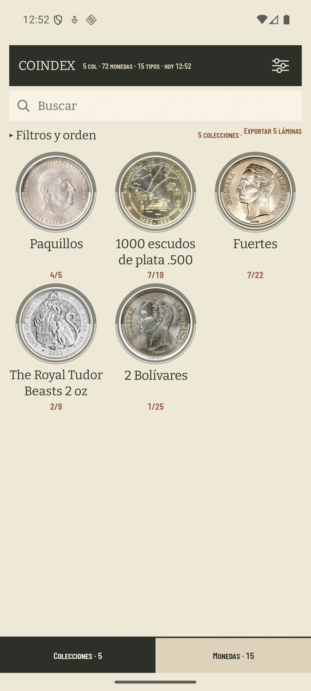
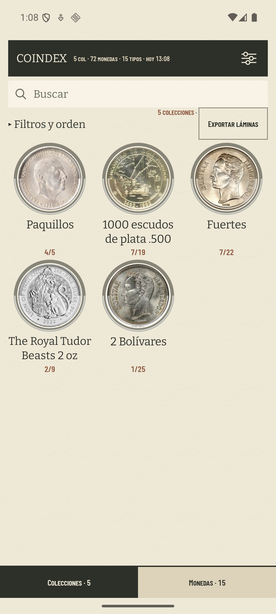

# Una acción de exportar que no promete un recuento falso

Comprobación del [#354](https://github.com/jenarvaezg/coindex/issues/354) el 9 de agosto de 2026 en
el AVD `coindex-ux` (Pixel 7, Android 36, 1080 × 2400 px, 420 dpi), con su colección de calibración
de 72 piezas, 15 tipos y 5 colecciones.

| antes | después |
| --- | --- |
|  |  |

## Un recuento, un dueño

Antes el `5` aparecía cuatro veces: en el canto, en `5 colecciones`, en
`Exportar 5 láminas` y en la barra inferior. Después aparece tres. La acción dice
`Exportar láminas`; el tally conserva el recuento de lo que se ve y la hoja de opciones conserva
el recuento honesto de láminas y páginas, incluido el `+1` de «Sin colección».

La etiqueta ya no recibe `shown.size`, por lo que no puede repetir un número que desconoce las
opciones persistidas. `NotebookLabelsTest` fija ese contrato sin duplicar la fórmula del preview.

## La medida de la regleta

El `uiautomator dump` posterior deja los tres centros verticales a medio píxel como máximo:

| elemento | bounds (px) | centro y (px) |
| --- | --- | ---: |
| `5 colecciones` | `[617,420][759,546]` | 483,0 |
| `·` | `[759,420][777,546]` | 483,0 |
| `Exportar láminas` | `[814,465][1011,502]` | 483,5 |

El nodo pulsable del botón mide `[777,420][1048,546]`: **126 px = 48 dp** a 420 dpi. El test
instrumental `FilterShelfTest` comprueba tanto ese mínimo como los tres centros sobre el renderer
público. El botón reutiliza `CardAction`, el mismo affordance interno de `Agrupar piezas`; no añade
un glifo nuevo ni toma prestado el `↗` reservado a enlaces externos.
