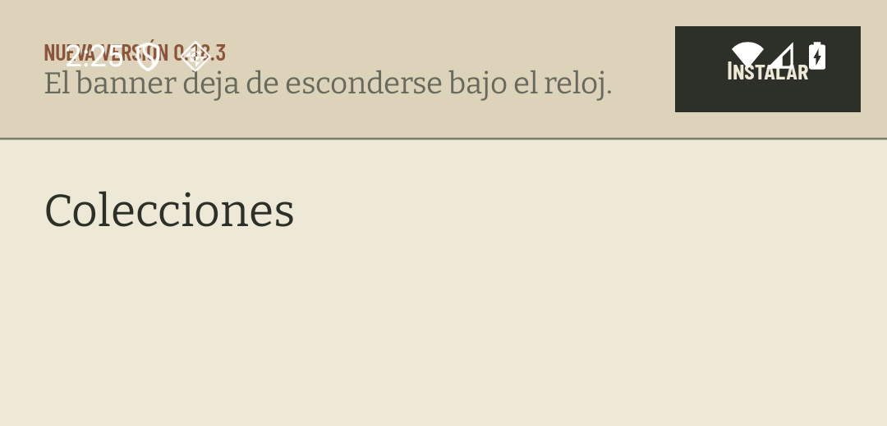
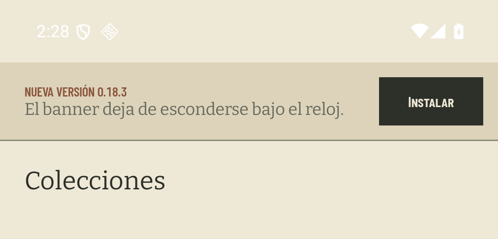

# El banner de actualización, por debajo de la barra de estado

Medido el 9 de agosto de 2026 en el AVD `coindex-ux` (Pixel 7, Android 36,
1080 × 2400 px, 420 dpi). La franja de la barra de estado mide ahí **136 px**.

El [#356](https://github.com/jenarvaezg/coindex/issues/356) no se ve con la
colección del padre cargada: el banner sólo aparece cuando hay una release más
nueva que la instalada. Las dos capturas salen por eso de un arnés instrumentado
que compone el mismo `Scaffold` con el mismo `UpdateBanner` de producción sobre
el emulador —barra de estado del sistema incluida, que es justo lo que hay que
ver—. El arnés no se versiona; lo que queda versionado es
`TopChromeInsetTest`, que mide lo mismo sin depender de mirar un PNG.

## Antes



`paperDeep` arranca en `y = 0`: el banner ocupa la franja del sistema desde el
primer píxel. El reloj cae sobre `NUEVA VERSIÓN 0.18.3`, los iconos de wifi y
batería sobre el botón, y `Instalar` empieza en `y = 32` —dentro de los 136 px
que el sistema se queda—. El divisor inferior del banner queda en `y = 168`.

## Después



Papel hasta `y = 135`, `paperDeep` desde `y = 136` exacto: el banner arranca
donde acaba la franja, y la franja se lee como parte de la página y no como una
banda suelta. El divisor baja a `y = 304`, los mismos 168 px de banner
desplazados enteros.

## La medida, sin PNG

`TopChromeInsetTest` compone `TopChrome { UpdateBanner(...) }` —el banner solo y
primero, que es la situación de las dos raíces desde el ADR 0026 §1— y compara
el borde superior de «Instalar» con `WindowInsets.statusBars`. Con el inset
puesto en el `Masthead`, como estaba, el test falla con el número del ticket:

```
java.lang.AssertionError: «Instalar» arranca en 32.0 px, dentro de la franja de 136.0 px
```

El test afirma además que la franja mide más de 0 px: en un dispositivo sin
barra de estado la comparación pasaría sin comprobar nada.
