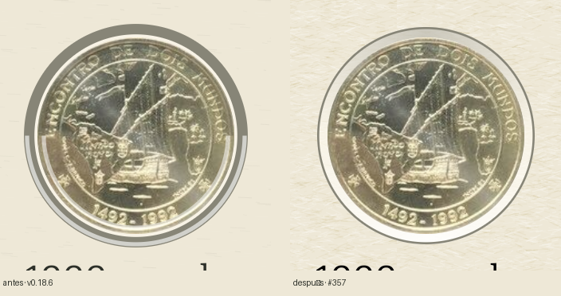
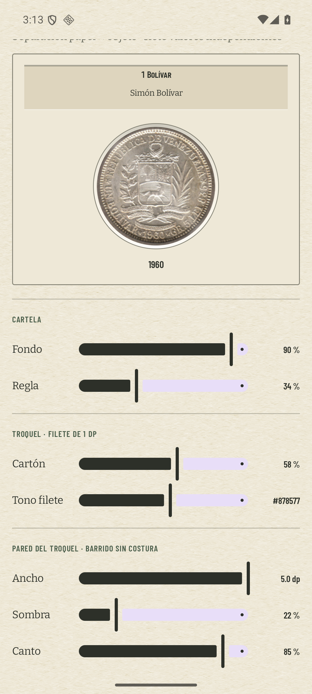

# La pared del troquel, en un barrido

Medido el 9 de agosto de 2026 en el AVD `coindex-ux` (Pixel 7, Android 36,
1080 × 2400 px, 420 dpi), con las animaciones del sistema desactivadas, a escala
1:1 y con la colección del padre sincronizada (69 colecciones, 573 monedas, 191
tipos). Todos los números salen de `medir-anillo.py`, que va aquí al lado y se
pasa sobre los PNG a resolución nativa:

```
python3 medir-anillo.py ../implementacion-349/colecciones-despues.png \
    colecciones-despues.png --centro 540 680
python3 medir-anillo.py banco-tonal.png --centro 540 643 --alcance 240
```

## La costura de fuera medía 76 niveles, no 29

El [#357](https://github.com/jenarvaezg/coindex/issues/357) contó **29 niveles
en 2° de arco** en el par de arcos interior, el que cae sobre la fotografía. El
par de fuera —el del anillo de cartón, el que ningún bloque abierto iba a
tocar— estaba peor.

El script barre toda la banda del anillo en pasos de 0,25 dp y se queda con el
peor salto, porque la geometría cambió entre las dos versiones —el anillo opaco
sobresalía 1,5 dp del borde del cartón y la pared nueva no sobresale nada— y un
radio fijo mediría cosas distintas en cada captura.

| casilla central de la primera fila de Colecciones, hueco de 104 dp | antes (v0.18.6) | después |
| --- | ---: | ---: |
| peor salto de luminancia en 2° a las 3 en punto | **76,2** | **3,5** |
| peor salto de luminancia en 2° a las 9 en punto | **76,2** | **0,2** |
| peor salto entre muestras de 0,5°, en el centro de la pared | 0,6 | 8,1 |

Los 8,1 que aparecen ahora no son costura: son el **grano del papel** asomando
por el cartón translúcido. En los lados del mismo anillo, donde la pared no
aporta nada, la amplitud es de 14,4 niveles, así que el peor paso del barrido
queda por debajo del ruido de la propia superficie. En el banco, cuyo cuadro de
vista tiene fondo opaco y por tanto no lleva grano, el hueco de 166 dp da **0,2
y 0,7 de costura, y 1,0 de peor paso de 0,5°** en todo el barrido.

Y el «antes» de la tercera fila dice lo otro que el ticket denunciaba: en el
centro del anillo viejo la luminancia era **132,4 en los cuatro puntos
cardinales, con 0,2 de amplitud en toda la vuelta**. No era una pared con luz;
era un aro plano de tinta opaca.



## El techo del canto es +12 niveles, y por eso las dos mitades no son simétricas

El anillo vuelve a ser translúcido: un solo trazo de 5 dp con un barrido que va
de tinta arriba a blanco abajo y se apaga a cero en las dos horizontales. El
`hairline` se queda para su trabajo real, un filete de 1 dp en el borde del
cartón, que es lo que mantiene los 3,07 de contraste que ganó el #349.

| tono medido en el centro de la pared | valor |
| --- | ---: |
| cartón en los lados (la pared no aporta) | 242,1 |
| arriba, a las 12 (sombra al 22 %) | **197,8** (−44,3) |
| abajo, a las 6 (canto al 85 %) | **253,5** (+11,4) |

La asimetría no es gusto, es el material: **el cartón ya está a 243 de 255**, así
que el blanco sólo puede subir 12 niveles por mucha alfa que se le ponga,
mientras que la tinta tiene 196 para bajar. El canto se calibró en el banco
hasta pasar de la amplitud del grano (12 niveles, #351) sin llegar a opaco: al
40 % subía 4,8 niveles y se perdía dentro del grano; al 85 % sube 11,4.

## La sombra sale de la moneda

El cuerpo del ticket pedía retirar el par de arcos interior y el comentario del
dueño lo movió al [#338](https://github.com/jenarvaezg/coindex/issues/338) por
construcción. Con el recorte a 1:1 delante se decidió **retirarlo aquí**: era lo
que más se notaba, porque el arco caía 8 dp dentro del borde, íntegramente sobre
la cara de la moneda, contra la luz que la fotografía ya trae cocida
([#303](https://github.com/jenarvaezg/coindex/issues/303)).

Comparando las dos capturas de la misma casilla, ángulo a ángulo y radio a
radio, la diferencia se concentra en dos bandas: **−1 a −2 dp del borde** (el
anillo, hasta 103 niveles de diferencia) y **−6 a −9 dp** (los arcos retirados,
20-30 niveles). Del centro de la moneda hacia dentro la diferencia baja al ruido
de alineación entre dos capturas distintas.

Para el #338 esto cambia el sujeto: la capa que queda dentro del recorte del
hueco es **sólo el reflejo fijo del acetato**. Si la variante H entra ahí, la
variante D del #303 —dos capas para el resultado de una— sigue siendo el riesgo,
pero ya no hay una sombra de troquel de por medio. Y el «no se mueven» del
[#337](https://github.com/jenarvaezg/coindex/issues/337) se queda sin la sombra
interior: sólo le queda el acetato como sujeto. Los dos tickets llevan el aviso
en un comentario.

## El banco crece con la geometría del troquel

`AlbumToneConfig` tenía cuatro campos y los cuatro eran color o alfa. Ahora
lleva además un `DieCutWall` con **ancho, alfa de la sombra y alfa del canto**, y
la pestaña TONO los edita: siete valores independientes delante del 1 Bolívar de
1960.



Dos cosas que el banco hace ahora y antes no:

- **La pestaña TONO abre donde pinta producción.** Abría en los tonos de antes
  del #349, así que lo que enseñaba no era lo que se enviaba; hay un test que
  fija que `CalibrationState().albumToneConfig() == AlbumToneConfig.Default`.
- **La ranura de EFECTOS ya no dibuja el canto sobre la moneda**, que era una
  copia del mismo defecto en el banco.

De los tres deslizadores que el ticket pedía, dos entran y uno no: **«si el
sombreado es trazo o gradiente» no es una palanca**, porque un trazo con
terminaciones es exactamente el defecto que se ha arreglado y un conmutador para
volver a él sólo serviría para reintroducirlo. El `inset` que también pedía ya no
existe: era de la capa retirada. Lo que el banco sigue sin poder calibrar es el
reflejo del acetato y el brillo, y eso es del #338.

## Lo que no se ha tocado

- **`muted`, `hairline` y la cartela siguen pasando sus suelos**: 4,55 y 3,07
  contra el papel, con `SinglePaletteTest` verificándolo en cada suite.
- **Las casillas vacías siguen igual**: fantasma al 14 % y regla punteada; se
  comprobó en la lámina de «20 escudos de plata» (2/3).
- **El cuaderno impreso no lleva pared de troquel.** `NotebookSheet` dibuja sus
  celdas por su cuenta y nunca ha usado `AlbumHole`, así que el PDF sale
  idéntico. Lo que sí lleva el dibujo nuevo es la **lámina exportada como
  imagen**, que comparte `PlateSheet`: se exportó «Fuertes» desde el mismo AVD
  (PNG de 2354 × 2211, 5,3 MB) y la pared viaja al papel sin costura, porque un
  barrido no tiene terminación que recalibrar. El PNG contiene inventario
  privado y por eso la comprobación queda documentada aquí sin versionar el
  archivo.

## Las tres superficies que cambian

`AlbumHole` se dibuja en cuatro sitios y **tres llevan cartón**: la lámina, el
índice de Colecciones y Monedas. En Monedas el cartón depende de la fila
—`backed = row.claims.isNotEmpty()`—, así que **los tipos con piezas sí llevan
pared** y los que sólo están anunciados no. Medido en la casilla de «10 Euros ·
Nebra Sky Disc», el mismo hueco de 104 dp da arriba 197,9, abajo 252,9, lados
241,8 y una costura de 3,9 y 3,3 niveles: los mismos números que Colecciones. Un
hueco sin cartón no tiene ni filete ni pared que dibujar.

## Lo que falta

- [ ] **Que lo vea el padre a 1:1.** La aceptación del #349 era «el ojo a 1:1, no
      un número de la WCAG», y ese criterio es el que abrió este ticket. Los
      números de arriba dicen que la costura no existe; que el hueco parezca un
      hueco lo dice él.
