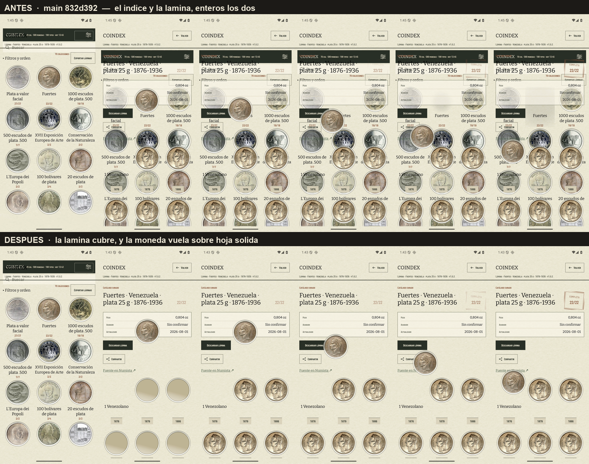

# El viaje, con una hoja debajo

Medido el 10 de agosto de 2026 en el AVD `coindex-ux` (Pixel 7, Android 36,
1080 × 2400 px, 420 dpi) con la colección del padre sincronizada —70 colecciones,
580 monedas, 198 tipos—, y sobre la misma tarjeta que midió el #339: los Fuertes,
22/22, cuya casilla de destino es la primera de la lámina.

Las dos secuencias están grabadas con el reloj de animación estirado veinte veces
(`adb shell settings put global animator_duration_scale 20`), porque el
`screenrecord` de este AVD emite 14 fps cuando hay algo moviéndose y una
transición de 180 ms no cabe en dos fotogramas. Lo que se estira es el reloj, no
el valor: la duración que se envía sigue siendo la aprobada.

## El defecto no era el crossfade, era que la hoja no estaba

Arriba, `main` en 832d392. En las cinco poses se leen **las dos pantallas
enteras**: «Plata a valor facial», «500 escudos de plata .500», «L'Europa dei
Popoli» y sus cocientes, por debajo de la cabecera de los Fuertes, el `0,804 oz`
y el «Descargar lámina». No es un fundido a medias — es un doble expuesto, y dura
lo que dura el vuelo.

Abajo, arreglado: la lámina cubre el índice en el primer fotograma y la moneda
hace su viaje sobre una hoja sólida.

La causa está en un sitio que ninguno de los dos intentos anteriores tocó: **un
destino del `NavHost` no pintaba papel**. El grano lo pinta el tema una sola vez
detrás de todo desde el #351, de modo que dos destinos apilados —y lo están, todo
el tiempo que la moneda está en el aire— eran dos transparencias. Con el
crossfade de Compose el papel se veía a través de las dos y las casillas se
lavaban a mitad de vuelo; con `EnterTransition.None` en las cuatro direcciones
(#377) no se desvanecía nada y se dibujaba la lámina entera sobre el índice
entero. Ninguna transición podía salir bien mientras el destino fuese
transparente.

`page` es el arreglo: cada ruta pasa por un `Modifier.paperSurface()` propio. No
reabre el #351 —el mosaico está anclado a la ventana y no a la superficie, así
que la hoja del destino cae en registro exacto sobre la del tema, mismo tono y
misma fibra—, y ahora la pintan todas en vez de dos de tres, que es el caso para
el que se ancló.

## Sólo se anima la hoja de encima, y cambia con el sentido

El `NavHost` apila por profundidad, y eso decide quién puede cubrir a quién:

| | quién queda encima | qué necesita |
| --- | --- | --- |
| índice → lámina | la lámina, que llega | nada: cubre y basta |
| lámina → índice | la lámina, que se va | un fundido de salida |

La ida no necesita transición ninguna. La vuelta sí, y por la misma razón que la
ida no: la lámina sigue siendo la de encima **mientras se marcha**, así que sin
nada propio se queda opaca durante todo el vuelo de vuelta y desaparece en un
fotograma. Eso es el pop del #370 llegando por el otro lado, y es lo único que
lleva `fadeOut` (180 ms): el índice queda descubierto pronto y la moneda aterriza
sobre una hoja asentada desde bastante antes.

## Lo que corrige del #339

`docs/ux/implementacion-339/viaje.png` está grabada con el crossfade todavía
puesto y **tiene el defecto dentro**: en sus poses 3 a 6 se leen el `22/22`,
«Exportar lámina completa» y «Fuente en Numista» sobre las nueve tarjetas del
índice, que siguen enteras debajo. El doc lo describió como «la rejilla entra
detrás» y lo dio por bueno. Era el doble expuesto de este ticket, once días antes
de que se viera en un vídeo a velocidad real. La tira de aquí arriba la
sustituye.

## Lo que queda fuera

La hoja de ficha de Monedas (#370) usa `AnimatedVisibility` con `fadeIn` +
`slideInVertically`, y el fundido la deja **translúcida sobre la rejilla** a
mitad de entrada, que es el mismo defecto en pequeño: una hoja de papel no se ve
a través. Está medido en este AVD y va aparte, porque no es lo que este ticket
vino a arreglar.
