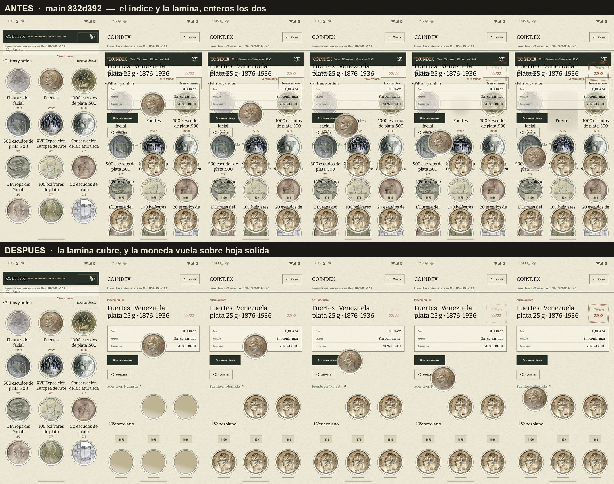

# El viaje, con una hoja debajo

Medido el 10 de agosto de 2026 en el AVD `coindex-ux` (Pixel 7, Android 36,
1080 × 2400 px, 420 dpi) con la colección del padre sincronizada (70 colecciones,
580 monedas, 198 tipos), sobre la misma tarjeta que midió el #339: los Fuertes,
22/22, cuya casilla de destino es la primera de la lámina.

Las dos secuencias están grabadas con el reloj de animación estirado veinte veces
(`adb shell settings put global animator_duration_scale 20`), porque el
`screenrecord` de este AVD emite 14 fps cuando hay movimiento y una transición de
180 ms no cabe en dos fotogramas. Se estira el reloj, no el valor: la duración que
se envía sigue siendo la aprobada.

## El defecto era que la hoja no estaba

Arriba, `main` en 832d392. En las cinco poses se leen las dos pantallas enteras:
«Plata a valor facial», «500 escudos de plata .500», «L'Europa dei Popoli» y sus
cocientes, por debajo de la cabecera de los Fuertes, el `0,804 oz` y el «Descargar
lámina». Es un doble expuesto, no un fundido a medias, y dura lo que dura el
vuelo.

Abajo, arreglado: la lámina cubre el índice en el primer fotograma y la moneda
viaja sobre una hoja sólida.

La causa, que ninguno de los dos intentos anteriores tocó: un destino del
`NavHost` no pintaba papel. Desde el #351 el tema pinta el grano una sola vez
detrás de todo, así que dos destinos apilados (y lo están mientras la moneda está
en el aire) eran dos transparencias. Con el crossfade de Compose el papel se veía
a través de las dos y las casillas se lavaban a mitad de vuelo; con
`EnterTransition.None` en las cuatro direcciones (#377) no se desvanecía nada y se
dibujaba la lámina entera sobre el índice entero. Ninguna transición podía salir
bien con el destino transparente.

El arreglo es `page`: cada ruta pasa por su propio `Modifier.paperSurface()`. No
reabre el #351: el mosaico está anclado a la ventana y no a la superficie, así que
la hoja del destino cae en registro exacto sobre la del tema, con el mismo tono y
la misma fibra. Ahora la pintan todas las rutas en vez de dos de tres, que es el
caso para el que se ancló.

## Sólo se anima la hoja de encima, y depende del sentido

El `NavHost` apila por profundidad, y eso decide quién puede cubrir a quién:

| | quién queda encima | qué necesita |
| --- | --- | --- |
| índice → lámina | la lámina, que llega | nada: cubre y basta |
| lámina → índice | la lámina, que se va | un fundido de salida |

La ida no necesita transición. La vuelta sí: la lámina sigue encima mientras se
marcha, así que sin transición propia se queda opaca durante todo el vuelo de
vuelta y desaparece en un fotograma (el pop del #370, por el otro lado). Por eso
sólo la vuelta lleva `fadeOut` (180 ms): el índice queda descubierto pronto y la
moneda aterriza sobre una hoja ya asentada.

## Lo que corrige del #339

`docs/ux/implementacion-339/viaje.png` está grabada con el crossfade todavía
puesto y tiene el defecto: en sus poses 3 a 6 se leen el `22/22`, «Exportar lámina
completa» y «Fuente en Numista» sobre las nueve tarjetas del índice, que siguen
enteras debajo. Aquel documento lo describió como «la rejilla entra detrás» y lo
dio por bueno. La tira de arriba la sustituye.

## Lo que queda fuera

La hoja de ficha de Monedas (#370) usa `AnimatedVisibility` con `fadeIn` +
`slideInVertically`, y el fundido la deja translúcida sobre la rejilla a mitad de
entrada: el mismo defecto en pequeño. Está medido en este AVD y va aparte.
