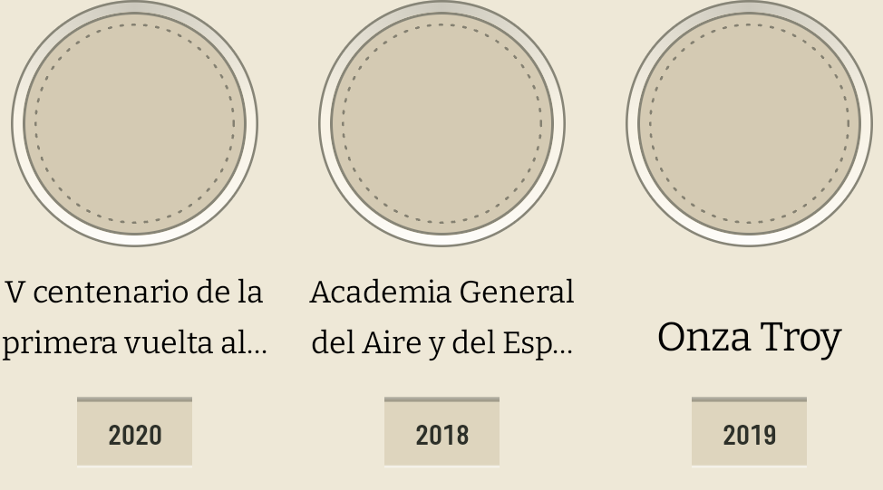
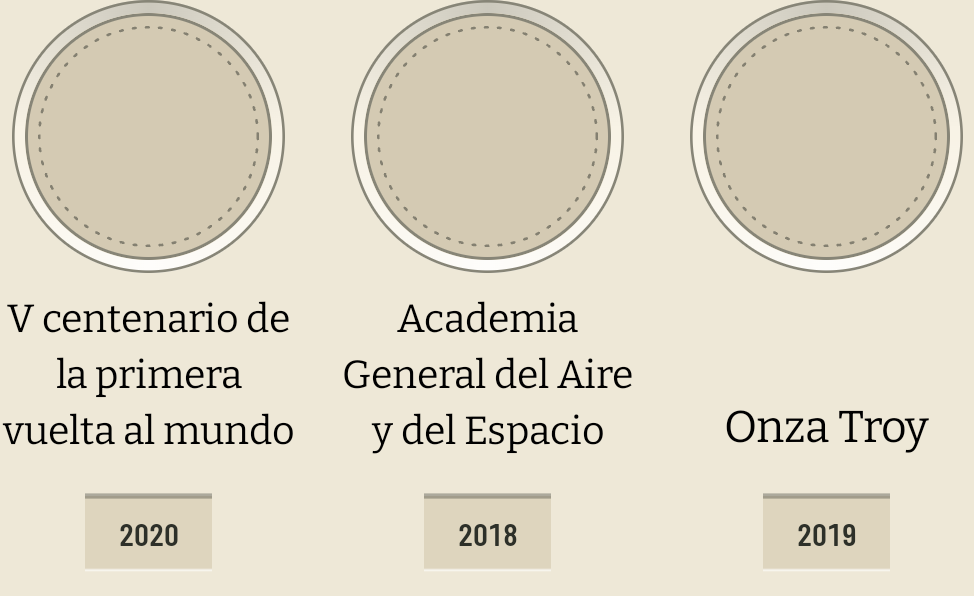

# La casilla reserva las líneas que su fila necesita (#412)

La auditoría del 11 de agosto de 2026 midió sobre la v1.2.2 que en la lámina los nombres largos
mueren en «…» y que ningún gesto abre el nombre entero: el toque del hueco voltea la moneda y la
chapa del año va a Numista (#302). El ticket dejaba la decisión abierta entre tres sitios donde
podría vivir el nombre completo —pulsación larga, la otra cara del volteo, sólo el PNG exportado— y
preguntaba además si la cola «· N g» merece imprimirse cuando le quita espacio al nombre.

Medido el 12 de agosto de 2026 con el mismo `TextMeasurer` que la lámina usa, sobre los 75 catálogos
de `data/`: **Bitter a 13 sp** —el tamaño al que el autosize de #348 ya hacía caer un nombre largo—
**en la columna de 113 dp** de un teléfono de 411 dp a tres columnas.

## Ninguna de las tres salidas del ticket estaba construida

- **No hay pulsación larga ni tooltip en ninguna pantalla de la app.** Sería un patrón nuevo, y la
  casilla ya gastó sus dos objetivos en el #302.
- **El papel trunca igual**: dos líneas con elipsis en el cartucho de la casilla —9,1 mm fijos— y una
  sola línea en la fila del modo lista. «El nombre completo sólo en el PNG» no era elegir lo que ya
  hay: había que construirlo también.

Así que la salida elegida es la cuarta: **darle sitio al nombre donde ya se lee**.

## Lo que cambia

La reserva del nombre era una constante de toda la app —dos líneas— y pasa a ser la respuesta de cada
**fila**, que es donde ya vivía la decisión de reservar box o no (#337). Las casillas de una fila
comparten el alto del box, y por eso sus chapas comparten baseline; ahora comparten también cuántas
líneas, y la fila que no tiene ningún nombre largo no paga nada.

| | antes | después |
| --- | --- | --- |
| fila con nombre largo |  |  |

Las dos capturas son la fila del informe —«V centenario de la primera vuelta al mundo» y «Academia
General del Aire y del Espacio», los dos nombres que el ticket citó— a 420 dpi, con una casilla de
nombre corto al lado para que se vea el precio.

## El censo, medido y no estimado

De los 1.184 miembros de `data/`, 1.082 imprimen nombre (los demás se titulan con su año y no
reservan box). Líneas que cada uno necesita:

| líneas | miembros |
| --- | --- |
| 1 | 636 |
| 2 | 349 |
| 3 | **79** |
| 4 | 16 |
| 5 | 2 |

**Cortaban 97 casillas y ahora cortan 18.** Por catálogo, contando el nombre más largo de cada uno:
54 no tienen ninguno por encima de dos líneas y se dibujan exactamente como antes, 14 quedan enteros
gracias a la tercera, y 7 conservan puntos suspensivos.

> El KDoc anterior de `PlateCellName` hablaba de «235 de los 1.188 miembros pasados de dos líneas».
> Esa cifra es del #361, estimada a ~12 caracteres por línea y antes de que el autosize de #348
> bajara el tipo hasta 13 sp. No es comparable con las de esta tabla, y el 97 la sustituye.

## Por qué la tercera línea es la última

No por el nombre de 73 caracteres —«Iglesia de la Guarnición de Potsdam, con marca de ceca debajo
(1934-1935)», que necesita cinco—: ése sólo explica 2 de los 7 catálogos que siguen cortando. Los
otros 5 necesitan exactamente cuatro líneas, así que una cuarta salvaría 16 casillas más.

El tope lo decide el **cartón que cuelga sobre los vecinos cortos de la fila**, que es el blanco que
`PlateSpacing.reservedNameLine` documenta y el que el #473 tiene abierto. Con el nombre pegado abajo
de su box (#411), una casilla de una línea en una fila que reservó más deja arriba:

| reserva de la fila | blanco sobre un nombre de una línea |
| --- | --- |
| 2 líneas | 27 dp |
| 3 líneas | 48 dp |
| 4 líneas | 69 dp |

Los 32 dp de `rowGap` más los 10 de la chapa hacen 42 dp entre dos filas. La tercera línea ya pone
ese blanco por encima de esa cifra —se ve en la captura, bajo «Onza Troy»— y cae debajo del hueco,
donde la moneda de arriba es lo único a lo que puede pertenecer. La cuarta lo llevaría a 69 dp, dos
tercios del hueco de cartón vacío, para rescatar el 1,5 % de las casillas. La curva de coste por
casilla salvada se rompe entre la tercera y la cuarta: 79 casillas por los primeros 21 dp, 16 por los
segundos.

Las cinco filas de `data/` que mezclan casillas tituladas con su año y casillas con nombre tienen
todas nombres cortos, así que ninguna pide la tercera línea: el #473 no empeora con este cambio en
ningún catálogo de hoy.

Pasadas las tres líneas el nombre sigue cortándose en pantalla, y sigue entero en la semántica, que
es lo que leen la búsqueda y el lector de pantalla (#348). **Para esas 18 casillas el nombre completo
sigue sin vivir en ninguna parte visible**, que es la mitad del ticket que esta implementación no
cierra.

## La cola de variante era del curador, no de la app

«Muerte del Libertador **· 22 g** …» no lo pegaba la lámina: está escrito en el rótulo del miembro en
`data/`, y son 13 rótulos de 1.184. Se parten en dos clases:

- **Identidad, y se queda.** En los conjuntos el peso es lo que distingue una casilla de otra: sin él,
  `italia-2003-europa-dei-popoli` tendría dos casillas llamadas «euros», y lo mismo en
  `portugal-1983-exposicion-europea-de-arte` y `venezuela-1975-conservacion-plata`.
- **Repetición, y se va.** En `venezuela-100-bolivares-plata` la lámina ya declara arriba la onza de
  plata, así que «Bicentenario del natalicio del Libertador · 31,1 g de plata .900» y el Vargas de
  1986 gastaban media casilla en decir dos veces lo mismo. Los otros dos rótulos la conservan porque
  **contradicen** esa declaración —22 g en el de 1980, plata .835 en el de 1981—, que es lo único que
  un rótulo tiene que añadir. Su `variant_note` sigue siendo la prosa con la fuente, y sigue sin
  imprimirse en ninguna superficie: es del curador y de los cruces de metal y clase de objeto.

## Lo que este cambio deja abierto

1. **El papel no se ha tocado**, así que ahora hay divergencia: los dos nombres del informe salen
   enteros en pantalla y cortados en el PNG y en el PDF, donde antes cortaban en las dos. La
   geometría del cartucho está calibrada en milímetros y pide su propia medición.
2. **Las 18 casillas de cuatro y cinco líneas** siguen sin sitio donde leerse enteras.
3. **El #473** —la casilla sin nombre de una fila con nombre— sigue abierto, y la tercera línea le
   sube el techo del blanco de 48 a 69 dp el día que alguna fila mixta tenga un nombre largo.
