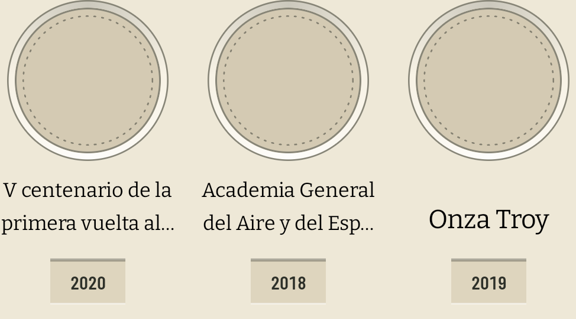
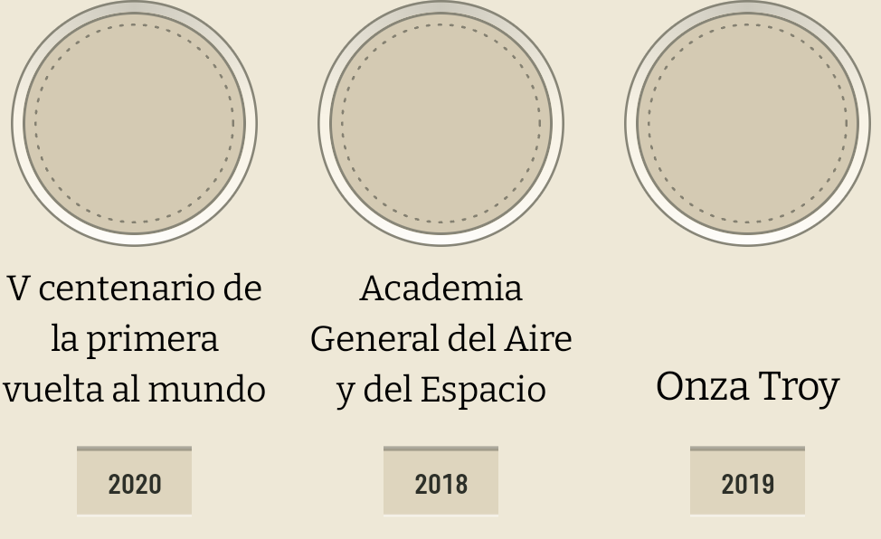

# La casilla reserva las líneas que su fila necesita (#412)

La auditoría del 11 de agosto de 2026 midió sobre la v1.2.2 que en la lámina los nombres largos
acaban en «…» y que ningún gesto abre el nombre entero: el toque del hueco voltea la moneda y la
chapa del año va a Numista (#302). El ticket dejaba abiertos tres sitios para el nombre completo
(pulsación larga, la otra cara del volteo, sólo el PNG exportado) y preguntaba si la cola «· N g»
merece imprimirse cuando le quita espacio al nombre.

Medido el 12 de agosto de 2026 con el mismo `TextMeasurer` que usa la lámina, sobre los 75 catálogos
de `data/`: Bitter a 13 sp (el tamaño al que el autosize del #348 ya bajaba un nombre largo) en la
columna de 113 dp de un teléfono de 411 dp a tres columnas.

## Ninguna de las tres salidas del ticket estaba construida

- No hay pulsación larga ni tooltip en ninguna pantalla de la app. Sería un patrón nuevo, y la
  casilla ya gastó sus dos objetivos en el #302.
- El papel trunca igual: dos líneas con elipsis en el cartucho de la casilla (9,1 mm fijos) y una
  sola línea en la fila del modo lista. «El nombre completo sólo en el PNG» también había que
  construirlo.

Se eligió una cuarta salida: darle sitio al nombre donde ya se lee.

## Lo que cambia

La reserva del nombre era una constante de toda la app (dos líneas) y pasa a decidirla cada fila,
que ya decidía si reservar box o no (#337). Las casillas de una fila comparten el alto del box, y
por eso sus chapas comparten baseline; ahora comparten también el número de líneas, y una fila sin
nombres largos no paga nada.

| | antes | después |
| --- | --- | --- |
| fila con nombre largo |  |  |

Las dos capturas son la fila del informe («V centenario de la primera vuelta al mundo» y «Academia
General del Aire y del Espacio», los dos nombres que citaba el ticket) a 420 dpi, con una casilla de
nombre corto al lado para que se vea el coste.

## El nombre va centrado en su caja, y eso revisa media decisión del #411

El #411 pegó el nombre al fondo de su caja para que toda casilla dejara a su año los mismos 16 dp:
alineado arriba, la línea que un nombre corto no usaba caía entre el nombre y el año, y el año
quedaba más lejos de su nombre que de las monedas de la fila siguiente. Con la reserva de tres
líneas ese fondo se notaba: «Onza Troy» aparecía pegado a su año con dos líneas de cartón encima, y
la fila se leía en tres alturas distintas.

Centrado, un nombre de una, dos o tres líneas se lee en la misma banda de la casilla. A cambio, la
mitad del hueco sobrante vuelve a caer entre el nombre y su año, así que lo que el #411 defendía se
comprueba ahora como una comparación y no como una constante:

| caso | aire nombre → año | aire entre dos casillas |
| --- | --- | --- |
| nombre que llena su caja | 16 dp | 42 dp |
| dos líneas reservadas, nombre de una | 26,5 dp | 42 dp |
| tres líneas reservadas, nombre de una | 37 dp | 42 dp |

El peor caso queda dentro por 5 dp porque `plateNameLinesCeiling` sólo concede la tercera línea
mientras el aire aguanta. La caja crece con la escala de tipo del coleccionista y el hueco entre
filas no, así que a partir de una línea de 26 dp (tipo un cuarto más grande) la reserva vuelve a dos
y los nombres largos vuelven a cortarse.

Medido en el AVD, no modelado: el autosize encoge también la línea, así que un nombre de dos líneas
a 13 sp no llena una caja reservada para dos líneas altas. Los tests comparan contra el peor caso
teórico (líneas a altura completa), que es el que acota la aritmética de `PlateSpacing`.

## El censo

De los 1.184 miembros de `data/`, 1.082 imprimen nombre (los demás se titulan con su año y no
reservan box). Líneas que necesita cada uno:

| líneas | miembros |
| --- | --- |
| 1 | 636 |
| 2 | 349 |
| 3 | 79 |
| 4 | 16 |
| 5 | 2 |

Cortaban 97 casillas y ahora cortan 18. Por catálogo, contando su nombre más largo: 54 no pasan de
dos líneas y se dibujan como antes, 14 quedan enteros gracias a la tercera y 7 conservan puntos
suspensivos.

> El KDoc anterior de `PlateCellName` hablaba de «235 de los 1.188 miembros pasados de dos líneas».
> Esa cifra es del #361, estimada a ~12 caracteres por línea y antes de que el autosize del #348
> bajara el tipo hasta 13 sp; no es comparable con esta tabla.

## Por qué la tercera línea es la última

El nombre de 73 caracteres («Iglesia de la Guarnición de Potsdam, con marca de ceca debajo
(1934-1935)», que necesita cinco) sólo explica 2 de los 7 catálogos que siguen cortando. Los otros 5
necesitan exactamente cuatro líneas, así que una cuarta salvaría 16 casillas más.

El tope lo pone el cartón que cuelga sobre los vecinos cortos de la fila, el blanco que documenta
`PlateSpacing.reservedNameLine` y que el #473 tiene abierto. Con el nombre pegado al fondo de su box
(#411), una casilla de una línea en una fila que reservó más deja arriba:

| reserva de la fila | blanco sobre un nombre de una línea |
| --- | --- |
| 2 líneas | 27 dp |
| 3 líneas | 48 dp |
| 4 líneas | 69 dp |

Los 32 dp de `rowGap` más los 10 de la chapa hacen 42 dp entre dos filas. La tercera línea ya pone
ese blanco por encima de esa cifra (se ve en la captura, bajo «Onza Troy»), y el blanco cae debajo
del hueco, donde sólo puede pertenecer a la moneda de arriba. La cuarta lo llevaría a 69 dp, dos
tercios del hueco de cartón vacío, para rescatar el 1,5 % de las casillas. El coste por casilla
salvada se dispara entre la tercera y la cuarta: 79 casillas por los primeros 21 dp, 16 por los
segundos.

Las cinco filas de `data/` que mezclan casillas tituladas con su año y casillas con nombre tienen
nombres cortos, así que ninguna pide la tercera línea: el #473 no empeora en ningún catálogo de hoy.

Pasadas las tres líneas el nombre sigue cortándose en pantalla y sigue entero en la semántica, que
es lo que leen la búsqueda y el lector de pantalla (#348). Para esas 18 casillas el nombre completo
sigue sin verse en ninguna parte: esa mitad del ticket queda sin cerrar.

## La cola de variante era del curador, no de la app

«Muerte del Libertador · 22 g …» no lo añadía la lámina: está escrito en el rótulo del miembro en
`data/`, y son 13 rótulos de 1.184. Hay dos clases:

- **Identidad, y se queda.** En los conjuntos el peso distingue una casilla de otra: sin él,
  `italia-2003-europa-dei-popoli` tendría dos casillas llamadas «euros», y lo mismo en
  `portugal-1983-exposicion-europea-de-arte` y `venezuela-1975-conservacion-plata`.
- **Repetición, y se va.** En `venezuela-100-bolivares-plata` la lámina ya declara arriba la onza de
  plata, así que «Bicentenario del natalicio del Libertador · 31,1 g de plata .900» y el Vargas de
  1986 gastaban media casilla en repetirlo. Los otros dos rótulos la conservan porque contradicen
  esa declaración (22 g en el de 1980, plata .835 en el de 1981), que es lo único que un rótulo
  tiene que añadir. Su `variant_note` sigue siendo la prosa con la fuente y no se imprime en ninguna
  superficie: es para el curador y para los cruces de metal y clase de objeto.

## El papel encoge antes de cortar

Dejar el papel como estaba abría una divergencia nueva: los dos nombres del informe salían enteros
en pantalla y con elipsis en el PNG y en el PDF, donde antes cortaban en los dos. La regla es la
paridad: ningún nombre que la pantalla imprima entero puede salir con elipsis en el papel.

Al papel no se le puede dar una tercera línea: los 16 mm de `PrintGeometry.captionMm` son los que
midió el recuento de folios, y un pie más alto es un cuaderno más largo. Lo que el papel tiene y la
pantalla no es resolución: 2,9 mm de serif son un pie cómodo a 300 dpi y hay margen por debajo,
mientras que los 13 sp de la pantalla ya eran su suelo. Así que en papel la escalera del #348 hace
el trabajo de la tercera línea, y la celda conserva su altura: la paginación no cambia.

Medido sobre los 1.082 miembros con nombre en la celda más estrecha que dibuja el cuaderno (28 mm,
el mínimo al que cae un 2 euros de 25,75 mm, que es la moneda del catálogo del informe):

| tamaño del rótulo | nombres que entran en dos líneas | de los que la pantalla imprime enteros, cuántos corta el papel |
| --- | --- | --- |
| 2,9 mm (fijo, como estaba) | 1.025 | 40 |
| 2,6 mm | 1.064 | 5 |
| 2,2 mm | 1.076 | 1 |
| 1,8 mm | 1.082 | 0 |

La escalera va de 2,9 a 1,8 mm en pasos de 0,1. El suelo es pequeño (1,8 mm son unos 5 pt) y sólo se
alcanza cuando la alternativa es no leer el nombre; el pie y el estado del mismo cartucho se
imprimen a 2,3 mm. Sólo 7 nombres llegan al fondo de la escalera, y el último en ceder es «Saint
Trinity Seraphim-Diveyevsky Monastery», cuya palabra con guion de 19 letras no se parte.

La misma escalera se aplica a la fila del modo lista (`ListedCell`), que imprimía una sola línea con
elipsis; en una línea de 80 mm llega más lejos que en una celda de 28.

`PrintedCaptionTest` fija la paridad en las cuatro formas de página que existen (la normal, con «QR
de Numista», sin fotos y con «tamaño real» apagado) y también en el otro sentido: el nombre de 73
caracteres se corta en el papel igual que en la pantalla.

## Lo que queda abierto

1. Las 18 casillas de cuatro y cinco líneas siguen sin sitio donde leerse enteras en pantalla, y el
   papel también las corta, por paridad.
2. El #473 (la casilla sin nombre en una fila con nombre) sigue abierto, y la tercera línea le sube
   el techo del blanco de 48 a 69 dp el día que alguna fila mixta tenga un nombre largo.
3. El cartucho de las piezas (denominación y tema, la casilla de una colección sin lista de
   emisiones) mantiene su elipsis a dos líneas: es la superficie del #350, no la del #412.
