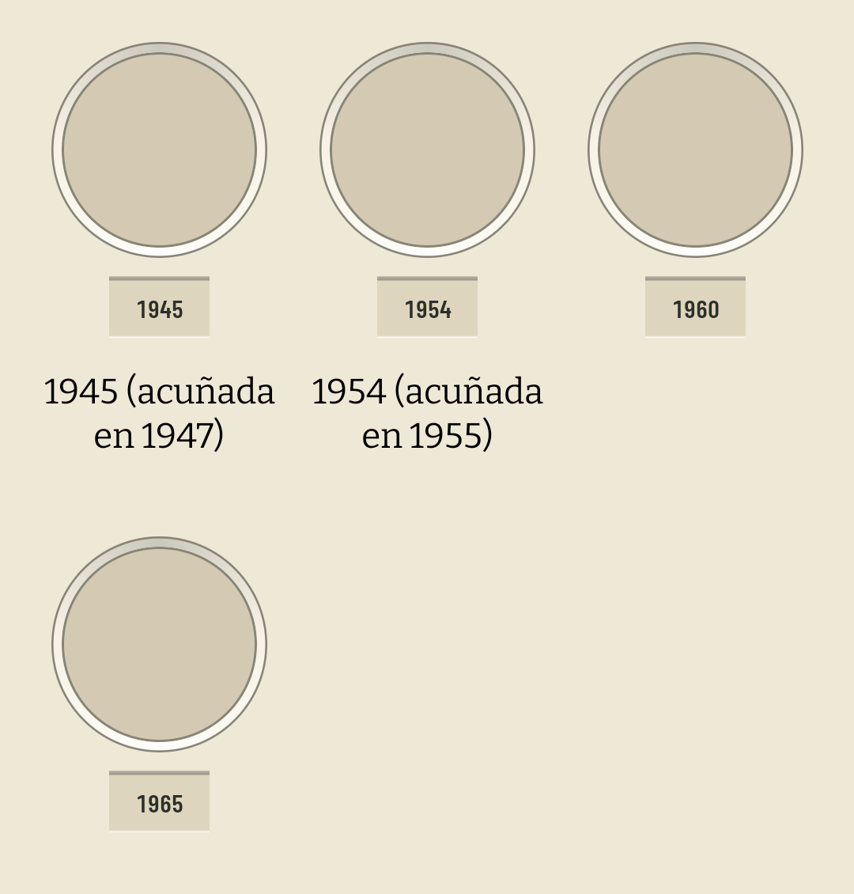

# La chapa cuelga del hueco y el nombre va debajo (#473)

El [#473](https://github.com/jenarvaezg/coindex/issues/473) salía de la revisión del #411 y no era un
arreglo mecánico: pedía **elegir** entre la línea base compartida del #337 y la proximidad del #411,
en la única casilla donde las dos no cabían juntas.

Se maquetaron las dos salidas a dp real sobre la fila que el ticket cita —`docs/ux/prototipo-473/`—
y se eligió **invertir el orden de la casilla**: hueco → chapa del año → nombre. Decidido el 12 de
agosto de 2026 con la maqueta delante.

## Qué estaba roto, en números

La fila 6 del 1 Bolívar tiene dos casillas tituladas y una que se titula con su año. Esa última
reservaba **la caja de nombre entera de su fila, vacía**:

| | dentro del miembro | entre miembros |
| --- | ---: | ---: |
| antes | **64 dp** | 42 dp |
| antes, con la letra a ×1,3 | **77 dp** | 42 dp |
| ahora | 10 dp | 96 dp |
| ahora, con la letra a ×1,3 | 10 dp | 109 dp |

Son nueve casillas en `data/`, en cinco catálogos, todos venezolanos: las cinco filas que mezclan
casillas tituladas con casillas que se titulan con su año.

La fila del 1 Bolívar dibujada por la casilla de producción y capturada en el AVD a 420 dpi —sin
fotos, porque el emulador no tiene red y lo que se mira aquí es la vertical—. Medido sobre el PNG a
1080: **9,1 dp del cartón a la chapa, iguales en la casilla con nombre y en la que no lo tiene.**
Antes eran 9,1 y 64.

## Por qué no se arregló con más aire entre filas

Era la otra salida maquetada, y **no cierra el ticket: lo aplaza.** La caja del nombre se mide contra
la densidad y crece con la escala de tipo del coleccionista; `rowGap` está en dp y no. Subirlo a
56 dp deja la comparación ganando por 2 dp a escala 1 y **vuelve a perderla a ×1,3** —77 contra 66—,
después de haber costado un 10 % de casillas por pantalla en las 75 láminas para arreglar nueve.

No hay valor de `rowGap` que cierre esto, porque hay una escala de letra que se lo come. Es el mismo
fleco que el #412 dejó escrito en `PlateSpacing.reservedNameLine`.

## Qué cambia

La casilla se lee **hueco → chapa → nombre**, que es donde una hoja de álbum pone su etiqueta y la
alternativa que el propio #411 nombró y no tomó: «o el año pegado al hueco, que es su sitio en un
álbum físico: la etiqueta bajo la moneda, y separación franca entre filas».

Con ese orden, las tres cosas que costaban trabajo salen gratis:

1. **Las chapas de una fila comparten línea base por construcción.** Cada una cuelga de su propio
   hueco por los mismos 10 dp, y no hay nada entre medias que pueda medir distinto.
2. **El blanco de un nombre corto cae al pie de la casilla**, donde la rejilla lo suma a los 32 dp
   que separan dos filas en vez de restárselos. La casilla sin nombre es simplemente más corta.
3. **Nada dentro de una casilla se mide ya en `sp`**, así que la proximidad no depende de la escala
   de tipo. Es la mitad del ticket que ninguna constante podía comprar.

## Lo que se cae con ello

La reserva por fila existía para sostener una línea base que ahora es geometría:

| | qué hacía |
| --- | --- |
| `plateRowNameLines` | cuántas líneas reservaba cada fila |
| `plateNameLinesCeiling` | hasta dónde podía crecer esa reserva sin romper la proximidad |
| `rememberPlateNameLines` | medir Bitter por fila y por ancho, en cada lámina |
| `plateCellWidth` | el ancho contra el que se medía |
| `PLATE_CELL_NAME_MIN_LINES` | el suelo de dos líneas de toda la app |

`plateColumns` se queda: sigue haciendo falta para saber en qué casilla abre la hoja (#396).

Y aparece una reserva nueva, de una línea y sin medir nada: **la casilla guarda el alto de la chapa
la haya o no**. Un miembro anunciado no tiene año, y uno con año pero sin ficha de Numista no compra
los 48 dp que `minimumInteractiveComponentSize` da a los demás; cualquiera de los dos subiría su
nombre contra el hueco mientras el de sus vecinas se queda abajo.

## Lo que no cambia

- **Tres líneas siguen siendo el corte**, pero por otra razón. Ya no cuesta cartón a los vecinos de
  la fila: cuesta **papel**, porque el #412 fijó que ningún nombre que la pantalla imprima entero
  puede ser una elipsis en el cuaderno, y el cartucho impreso tiene los 16 mm con los que se contaron
  los folios (#350). Las 18 casillas de cuatro y cinco líneas se cortan en las dos superficies.
- **El cuaderno impreso no hereda nada de esto**: su cartucho es otro dibujo (denominación y tema) y
  el párrafo del papel del #473 sigue abierto, atado a `PRINT_CARTOUCHE_MM` y al recuento de páginas.
- **El PNG exportado sí**, porque es la misma rejilla.
- El giro, la chapa como puerta a Numista y los dos objetivos de la casilla (#302) están intactos.

## Cómo se comprobó

- `PlateSpacingTest` (JVM) compara las tres distancias del descenso contra la única que no está
  dentro de un miembro. Sigue siendo una comparación y nunca un valor.
- `PlateCellNameTest`, en el AVD `coindex-chrome` y sobre la casilla de producción y no sobre una
  maqueta del test: las chapas de la fila del 1 Bolívar comparten línea base con nombres de dos y de
  tres líneas y una casilla sin nombre; el año de la casilla sin nombre cae a los 10 dp de su moneda
  igual que el de sus vecinas; **y las dos cosas siguen siendo verdad con `fontScale = 2`**, que es
  el caso que la salida descartada no aguantaba.
- La geometría, a dp real y con las fotos del catálogo, en `docs/ux/prototipo-473/`.
