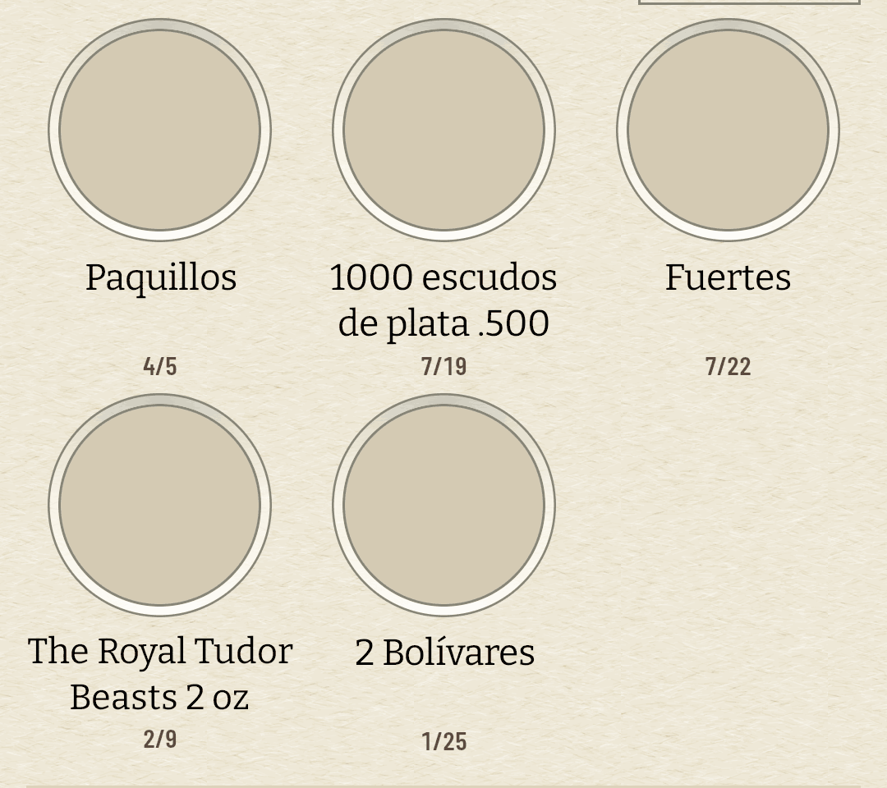

# «Sin foto aún» y «cargando» dejan de ser el mismo disco (#510)

La auditoría del 14 de agosto de 2026 miró la app con el prefetch pendiente y encontró rejillas
enteras de discos mudos. El ticket lo escribió como tres retóricas que conviven —el círculo
punteado, el fantasma en relieve, el disco de gradiente— y como que la tercera, que es el
placeholder de carga, es indistinguible de un fallo cuando la foto no va a llegar.

**No eran tres retóricas para tres estados: eran tres dibujos para cuatro estados.** El disco
estaba haciendo dos trabajos a la vez, y son trabajos opuestos:

| lo que pasa | lo que se veía | lo que dura |
| --- | --- | --- |
| la foto viene de camino | el disco, con el brillo del metal encima | segundos |
| la foto se pidió y no llegó | **el disco, con el mismo brillo** | hasta que haya wifi |
| Numista no tiene foto de este tipo | el disco | siempre |
| la moneda no está en la colección | el punteado, encima de lo anterior | — |

El punteado no es de esta familia y no se toca: dice algo de la colección y se dibuja sobre lo que
la fotografía haya resultado ser. Lo que había que partir eran las dos primeras filas — y el brillo
que las dos llevaban encima resultó ser el «disco de gradiente brillante» del título.

## Lo que cambia

`holeSilence(candidates, settled, painted)` nombra los tres silencios, y el que separa «esperando»
de «cargando» es `settled`: la carga ha contestado. Es un dato que la casilla **ya tenía** desde el
#67 —`onImageSettled` lo publica para que una exportación sepa cuándo capturar— y que hasta ahora
sólo se leía en la cara volteada del #509.

Nada de esto consulta la red ni el `PrefetchRefusal`. Una foto que no llegó no llegó, sea por
datos móviles, por un `404` o por un aeropuerto sin cobertura, y el porqué tiene su propia frase en
Ajustes desde el #191. La casilla dice el hecho, no el motivo.

**El estado de espera se dibuja y no se escribe**, al revés que en el #509. Allí la frase contesta
a un gesto sobre una casilla; aquí cae sobre todas a la vez, y «Esta foto no ha bajado todavía»
treinta veces es una pared de prosa donde el coleccionista quería su álbum — y en los 34 dp de los
ejes del cuaderno no cabría. La marca es una flecha sobre una repisa, en tinta apagada, y como todo
en el hueco es fracción del diámetro y nunca dp: la misma marca se lee en la casilla de 104 dp y en
la celda de 34. Los lectores de pantalla sí reciben la frase, como `contentDescription`.

**Y está quieta**, que es lo que el primer criterio del ticket pedía. Un latido aquí sería
exactamente el shimmer que se rechaza: lo que este estado significa es que no está pasando nada.

**Y viaja al papel**, que es lo que ADR 0026 §4 decide tal y como lo lee ADR 0029 §7: «vivo» es lo
que sigue al dedo, al sensor o a la navegación, y una marca quieta no es ninguna de las tres —igual
que la marca de deseo, que también viaja—. Una lámina exportada sin sus fotos dice por qué está
vacía en vez de enseñar once discos mudos. La primera versión de este cambio la apagaba con un
`CompositionLocal`; se retiró en la revisión, porque la excepción no estaba en ningún ADR y el
argumento a favor no se sostenía.

## El disco brillante del título era el brillo del metal

Y no el placeholder. `coinGloss` es la banda de luz de #303 y se mezcla en `Softlight` **contra lo
que tenga debajo**, así que en un hueco cuya fotografía nunca llegó estaba iluminando el disco de
espera —y siguiéndole el acelerómetro—. De ahí «el disco de gradiente brillante» del ticket, y de
ahí que el criterio hable de un *shimmer*: se movía de verdad.

La regla que lo apaga estaba escrita desde el #303, en el KDoc del propio `coinGloss`: «*empty
cardboard never glosses, for the direct reason that there is no coin there*». Lo que faltaba era la
otra mitad de «no hay moneda»: un hueco con una foto **prometida** y no pintada tampoco tiene
metal. `isCoin = !missing && painted`, y con ello el hueco vacío deja además de registrar el
sensor, que es batería que se estaba gastando en una casilla sin moneda.

## Lo medido

`coindex-ux` (pixel_7), colección restaurada con `scripts/avd-db.sh restore`, caché de fotos
borrada y **modo avión**, que es el caso del ticket llevado al extremo.

| antes | después · cargando | después · no ha bajado |
| --- | --- | --- |
|  |  |  |

Tres columnas y no dos, porque el estado del medio es el que no existía: antes, esas cinco casillas
eran el mismo dibujo estuvieran cargando o llevaran así media hora.

**El disco ya no es un degradado.** Dentro del hueco de Paquillos, contando niveles de gris:

| | recorrido del disco | tonos |
| --- | ---: | ---: |
| antes | **33 niveles** | 34 |
| después | **0** | **1** |

Ése era el «disco de gradiente brillante» del título, medido: un degradado de 33 niveles que además
se desplazaba con el acelerómetro. Ahora el hueco vacío es un tono plano y quieto.

**Cuánto dura.** Capturas seguidas desde el arranque, contando píxeles de tinta en la misma casilla:

| t | qué hay en el hueco |
| ---: | --- |
| 4,8 s | el disco: la petición está en vuelo |
| 6,9 s | el disco todavía |
| **7,6 s** | **la marca**, y ya no se mueve |

Es decir: **2,7 segundos de disco y no para siempre.** Antes de esto la tercera fila de la tabla no
existía —el disco de las 4,8 s era también el de los cinco minutos— y ésa es la queja entera del
ticket.

**Cuánto se lee.** Sobre el PNG a 1080, el trazo de la marca contra el disco que tiene debajo:

| | contraste |
| --- | ---: |
| la marca sobre el disco | **3,6:1** |
| el aro del troquel sobre el disco | 2,4:1 |

Por encima del 3:1 que el #349 fijó para la línea que separa cartón de papel, y mejor que el propio
aro del hueco.

## Las tres rejillas

| | |
| --- | --- |
|  |  |

Monedas, Explorar y la lámina pasan las tres por `AlbumHole`, así que no hay tres cambios sino uno.
En la lámina se ve además la convivencia con el punteado: la casilla de la Estrella 69 dice a la vez
«esta moneda no la tienes» —el aro— y «y su foto tampoco está aquí» —la flecha—, que son dos hechos
distintos y ninguno estaba de más.

## Lo que se queda fuera a sabiendas

**Un `404` de Numista cae también en «no ha bajado»**, porque desde la casilla no se distingue de
una foto que no llegó por falta de red. `GonePhotographs` sí lo sabe, y llevarlo hasta el hueco
sería cablear el estado del prefetch a cada celda para arreglar un caso que el catálogo ya considera
un error a corregir aguas arriba: los 848 tipos llevan sus dos caras.

**Con datos móviles no hay marca, y es correcto.** El prefetch es lo que la tarifa detiene (ADR
0024); la casilla que el coleccionista está mirando pide su foto igual y la trae. Lo que este cambio
nombra es la casilla que preguntó y volvió con las manos vacías, que es «sin cobertura» —el caso del
ticket— y no «sin wifi».

**Cuando vuelva el wifi, la marca no se cae sola.** `painted` y `settled` se recuerdan por juego de
candidatos, así que una casilla marcada sigue marcada hasta que salga de la composición y vuelva —
que es lo que pasa al hojear. Es el mismo comportamiento que la frase del #509 y no se toca aquí:
hacer que una casilla reintente por su cuenta es volver a poner la red dentro del hueco, que es
justamente lo que `holeSilence` no hace.
