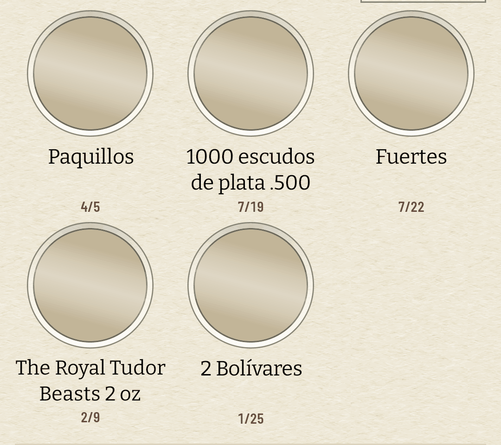
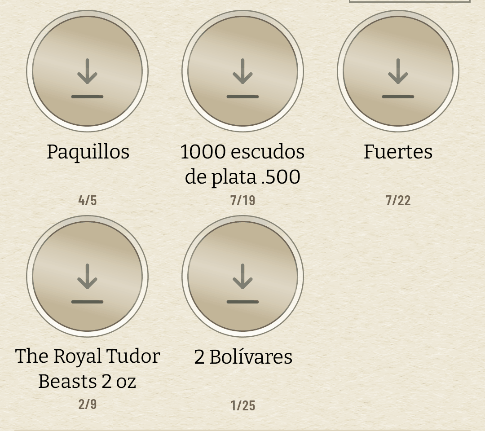
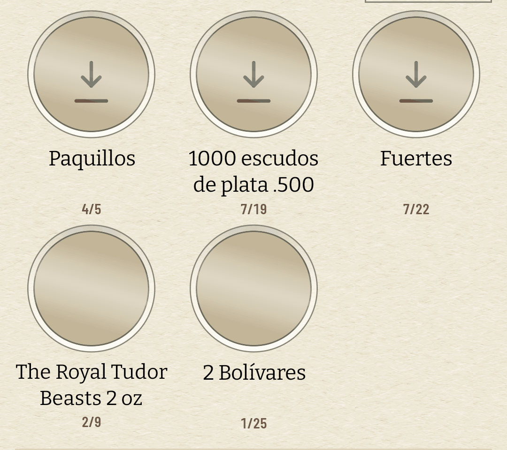
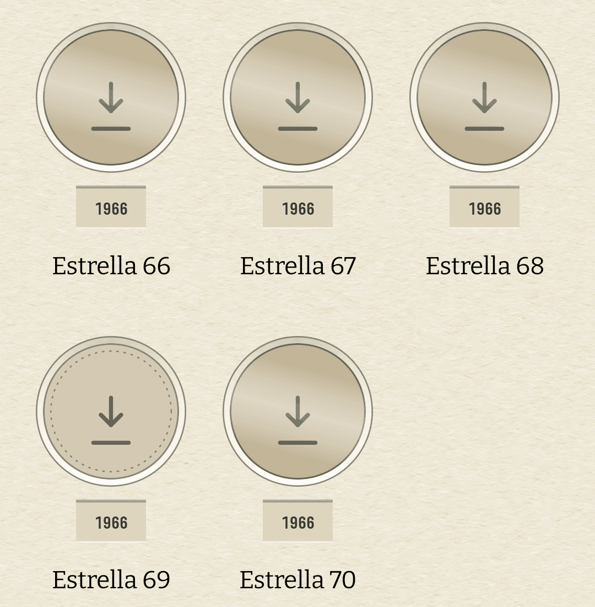
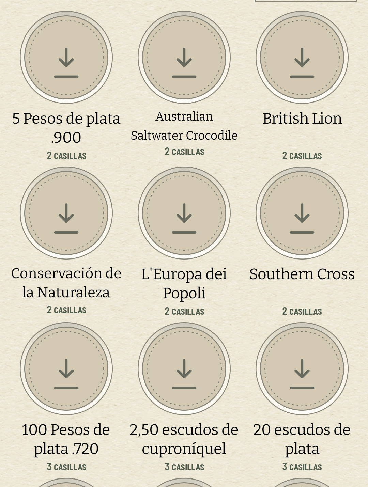

# «Sin foto aún» y «cargando» dejan de ser el mismo disco (#510)

La auditoría del 14 de agosto de 2026 miró la app con el prefetch pendiente y encontró rejillas
enteras de discos mudos. El ticket lo escribió como tres retóricas que conviven —el círculo
punteado, el fantasma en relieve, el disco de gradiente— y como que la tercera, que es el
placeholder de carga, es indistinguible de un fallo cuando la foto no va a llegar.

**No eran tres retóricas para tres estados: eran tres dibujos para cuatro estados.** El disco
estaba haciendo dos trabajos a la vez, y son trabajos opuestos:

| lo que pasa | lo que se veía | lo que dura |
| --- | --- | --- |
| la foto viene de camino | el disco | segundos |
| la foto se pidió y no llegó | **el disco** | hasta que haya wifi |
| Numista no tiene foto de este tipo | el disco | siempre |
| la moneda no está en la colección | el punteado, encima de lo anterior | — |

El punteado no es de esta familia y no se toca: dice algo de la colección y se dibuja sobre lo que
la fotografía haya resultado ser. Lo que había que partir eran las dos primeras filas.

## Lo que cambia

`holeSilence(candidates, settled, painted)` nombra los tres silencios, y el que separa «esperando»
de «cargando» es `settled`: la carga ha contestado. Es un dato que la casilla **ya tenía** desde el
#67 —`onImageSettled` lo publica para que una exportación sepa cuándo capturar— y que hasta ahora
sólo se leía en la cara volteada del #509.

Nada de esto consulta la red ni el `PrefetchRefusal`. Una foto que no llegó no llegó, sea por
datos móviles, por un `404` o por un aeropuerto sin cobertura, y el porqué tiene su propia frase en
Ajustes desde el #191. La casilla dice el hecho, no el motivo.

**El estado de espera se dibuja y no se escribe**, al revés que en el #509. Allí la frase contesta
a un gesto sobre una casilla; aquí cae sobre todas a la vez, y «Esta foto no ha bajado todavía»
treinta veces es una pared de prosa donde el coleccionista quería su álbum — y en los 34 dp de los
ejes del cuaderno no cabría. La marca es una flecha sobre una repisa, en tinta apagada, y como todo
en el hueco es fracción del diámetro y nunca dp: la misma marca se lee en la casilla de 104 dp y en
la celda de 34. Los lectores de pantalla sí reciben la frase, como `contentDescription`.

**Y está quieta**, que es lo que el primer criterio del ticket pedía. Un latido aquí sería
exactamente el shimmer que se rechaza: lo que este estado significa es que no está pasando nada.

**No viaja al papel.** `LocalPhotoNotices` es la regla de exportación de ADR 0026 §4 leída para un
aviso en vez de para un movimiento, y `OffScreenSheet` la apaga junto al brillo y al estampado: un
PNG que el padre manda a otra persona no puede pedirle **a su** teléfono que busque un wifi. En el
papel el hueco se queda con el disco de siempre.

## Lo medido

`coindex-ux` (pixel_7), colección restaurada con `scripts/avd-db.sh restore`, caché de fotos
borrada y **modo avión**, que es el caso del ticket llevado al extremo.

| antes | después |
| --- | --- |
|  |  |

**Cuánto dura el disco.** Capturas seguidas desde el arranque, contando píxeles de tinta dentro de
la casilla de Paquillos:

| t | qué hay en el hueco |
| ---: | --- |
| 4,8 s | el disco: la petición está en vuelo |
| 6,9 s | el disco todavía |
| **7,6 s** | **la marca**, y ya no se mueve |

Es decir: **2,7 segundos de disco y no para siempre.** Antes de esto la tercera fila de la tabla no
existía —el disco de las 4,8 s era también el de los cinco minutos— y ésa es la queja entera del
ticket.

**Cuánto se lee.** Sobre el PNG a 1080, el trazo de la marca contra el disco que tiene debajo:

| | contraste |
| --- | ---: |
| la marca sobre el disco | **3,8:1** |
| el aro del troquel sobre el disco | 2,4:1 |

Por encima del 3:1 que el #349 fijó para la línea que separa cartón de papel, y mejor que el propio
aro del hueco.

Ésta es la captura que lo dice todo: el mismo segundo, la misma rejilla, y las tres primeras
láminas ya declarando que su foto no está mientras las dos de abajo siguen cargando. Antes las
cinco eran el mismo disco.

## Las tres rejillas

| | |
| --- | --- |
|  |  |

Monedas, Explorar y la lámina pasan las tres por `AlbumHole`, así que no hay tres cambios sino uno.
En la lámina se ve además la convivencia con el punteado: la casilla de la Estrella 69 dice a la vez
«esta moneda no la tienes» —el aro— y «y su foto tampoco está aquí» —la flecha—, que son dos hechos
distintos y ninguno estaba de más.

## Lo que se queda fuera a sabiendas

Una foto que Numista contesta con `404` cae también en «no ha bajado», porque desde la casilla no se
distingue de una que no llegó por falta de red. `GonePhotographs` sí lo sabe, y llevarlo hasta el
hueco sería cablear el estado del prefetch a cada celda para arreglar un caso que el catálogo ya
considera un error a corregir aguas arriba: los 848 tipos llevan sus dos caras.
