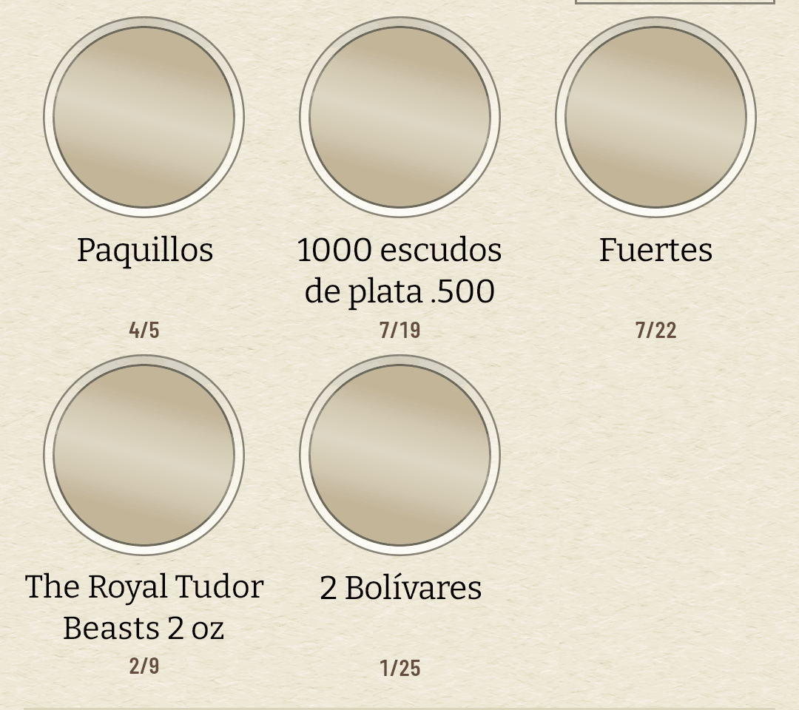
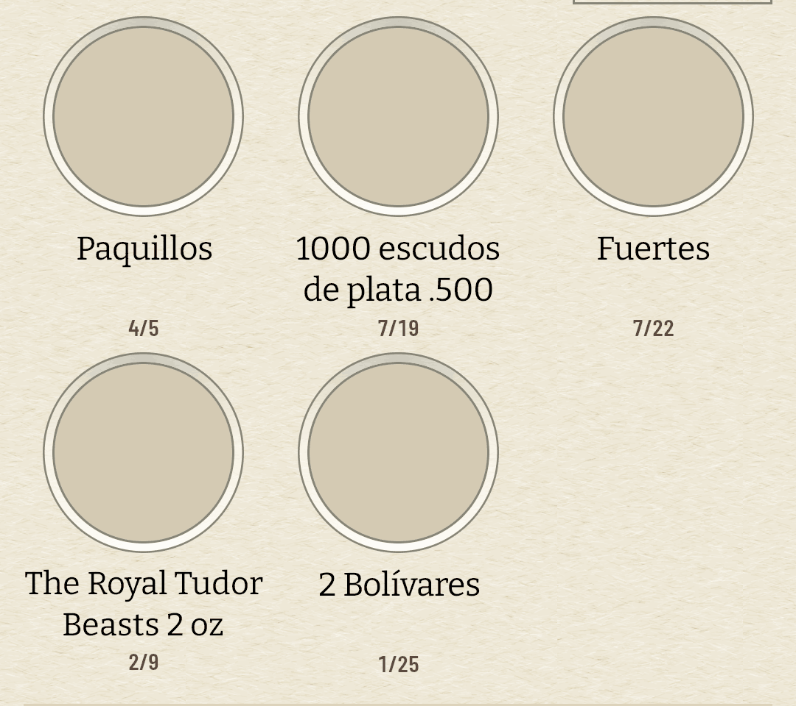
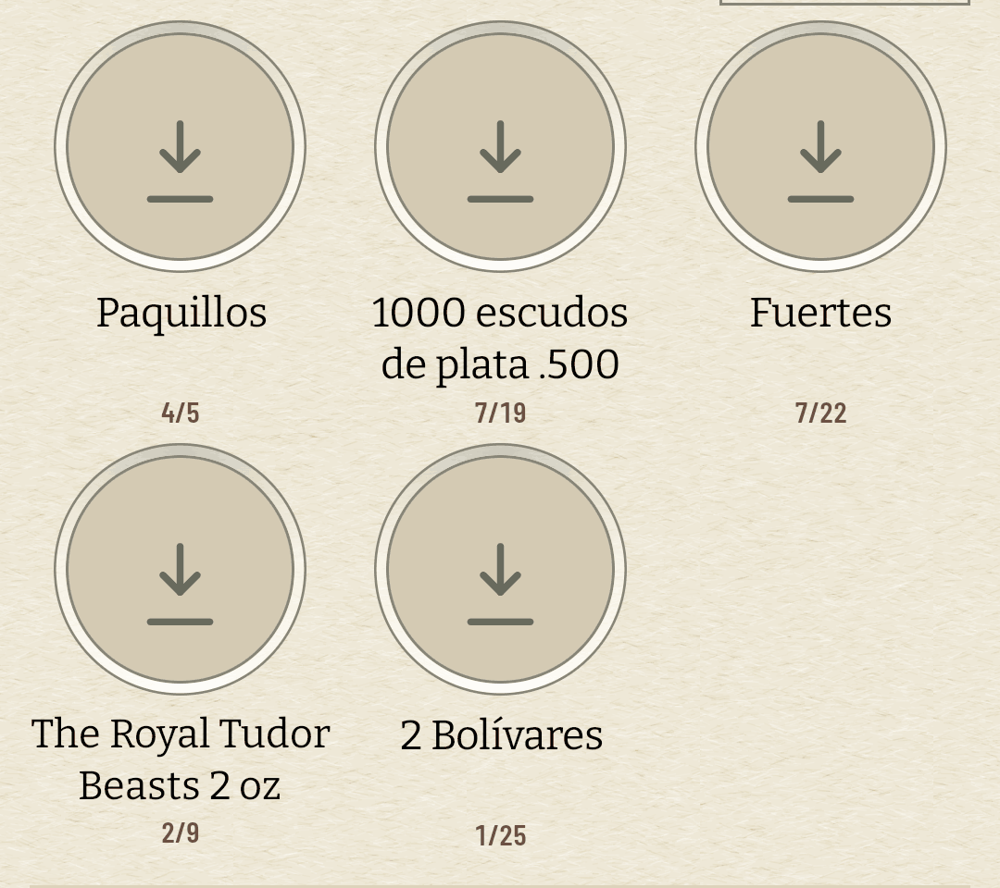
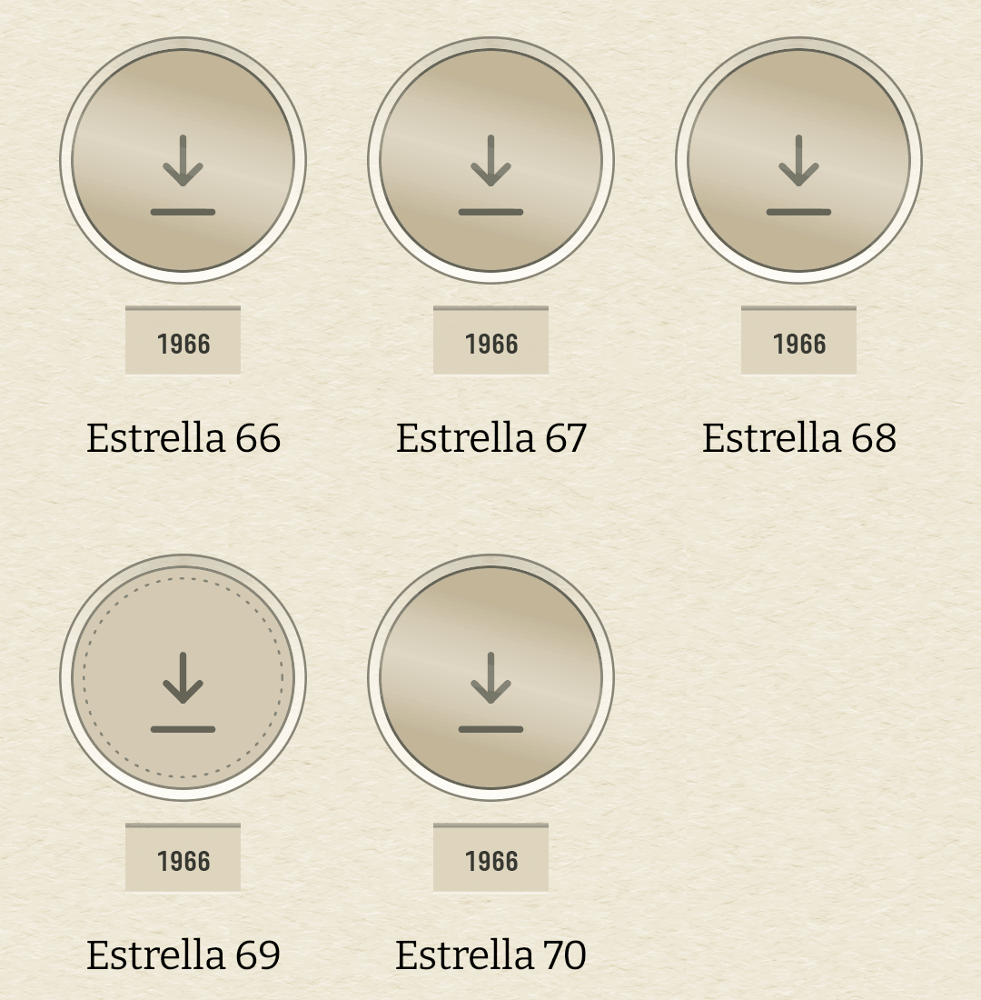
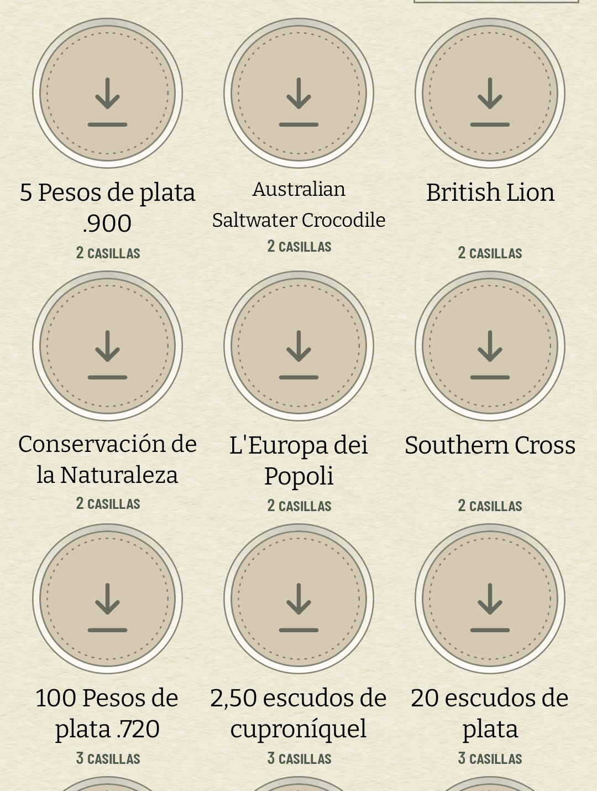

# «Sin foto aún» y «cargando» dejan de ser el mismo disco (#510)

La auditoría del 14 de agosto de 2026 miró la app con el prefetch pendiente y encontró rejillas
enteras de discos mudos. El ticket lo describía como tres retóricas que conviven (el círculo
punteado, el fantasma en relieve, el disco de gradiente) y señalaba que la tercera, el placeholder
de carga, no se distingue de un fallo cuando la foto no va a llegar.

En realidad eran tres dibujos para cuatro estados. El disco hacía a la vez dos trabajos opuestos:

| lo que pasa | lo que se veía | lo que dura |
| --- | --- | --- |
| la foto viene de camino | el disco, con el brillo del metal encima | segundos |
| la foto se pidió y no llegó | el disco, con el mismo brillo | hasta que haya wifi |
| Numista no tiene foto de este tipo | el disco | siempre |
| la moneda no está en la colección | el punteado, encima de lo anterior | — |

El punteado es de otra familia y no se toca: dice algo de la colección y se dibuja sobre lo que la
fotografía haya resultado ser. Había que separar las dos primeras filas.

## Lo que cambia

`holeSilence(candidates, settled, painted)` nombra los tres silencios, y lo que separa «esperando»
de «cargando» es `settled`: la carga ha contestado. La casilla ya tenía ese dato desde el #67
(`onImageSettled` lo publica para que una exportación sepa cuándo capturar), pero hasta ahora sólo
lo leía la cara volteada del #509.

Nada de esto consulta la red ni el `PrefetchRefusal`. Una foto que no llegó no llegó, sea por datos
móviles, por un `404` o por falta de cobertura, y el porqué tiene su propia frase en Ajustes desde
el #191. La casilla dice el hecho, no el motivo.

El estado de espera se dibuja y no se escribe, al revés que en el #509. Allí la frase contesta a un
gesto sobre una casilla; aquí cae sobre todas a la vez, y «Esta foto no ha bajado todavía» treinta
veces sería una pared de prosa que además no cabría en los 34 dp de los ejes del cuaderno. La marca
es una flecha sobre una repisa, en tinta apagada, y como todo en el hueco se mide en fracción del
diámetro y nunca en dp: la misma marca se lee en la casilla de 104 dp y en la celda de 34. Los
lectores de pantalla reciben la frase como `contentDescription`.

La marca está quieta, como pedía el primer criterio del ticket: un latido sería el shimmer que se
rechaza, y este estado significa que no está pasando nada.

Y llega al papel, según el ADR 0026 §4 tal y como lo lee el ADR 0029 §7: «vivo» es lo que sigue al
dedo, al sensor o a la navegación, y una marca quieta no es ninguna de las tres, igual que la marca
de deseo, que también llega al papel. Una lámina exportada sin sus fotos dice por qué está vacía en
vez de enseñar once discos mudos. Una primera versión la apagaba en el papel con un
`CompositionLocal`; se retiró en la revisión porque esa excepción no estaba en ningún ADR.

## El disco brillante del título era el brillo del metal

`coinGloss` es la banda de luz del #303 y se mezcla en `Softlight` contra lo que tenga debajo, así
que en un hueco cuya fotografía nunca llegó iluminaba el disco de espera y lo movía con el
acelerómetro. De ahí el «disco de gradiente brillante» del ticket, y que el criterio hable de un
shimmer: se movía de verdad.

La regla que lo apaga estaba escrita desde el #303 en el KDoc de `coinGloss`: «*empty cardboard
never glosses, for the direct reason that there is no coin there*». Faltaba la otra mitad de «no hay
moneda»: un hueco con una foto prometida y no pintada tampoco tiene metal.
`isCoin = !missing && painted`, y con ello el hueco vacío deja además de registrar el sensor, que
gastaba batería en una casilla sin moneda.

## Lo medido

`coindex-ux` (pixel_7), colección restaurada con `scripts/avd-db.sh restore`, caché de fotos borrada
y modo avión, el caso del ticket llevado al extremo.

| antes | después · cargando | después · no ha bajado |
| --- | --- | --- |
|  |  |  |

Tres columnas porque el estado del medio no existía: antes, esas cinco casillas eran el mismo dibujo
tanto si cargaban como si llevaban así media hora.

### El disco ya no es un degradado

Dentro del hueco de Paquillos, contando niveles de gris:

| | recorrido del disco | tonos |
| --- | ---: | ---: |
| antes | 33 niveles | 34 |
| después | 0 | 1 |

Ahora el hueco vacío es un tono plano y quieto.

### Cuánto dura

Capturas seguidas desde el arranque, contando píxeles de tinta en la misma casilla:

| t | qué hay en el hueco |
| ---: | --- |
| 4,8 s | el disco: la petición está en vuelo |
| 6,9 s | el disco todavía |
| 7,6 s | la marca, ya quieta |

2,7 segundos de disco, no para siempre. Antes la tercera fila no existía: el disco de los 4,8 s era
también el de los cinco minutos, que es la queja del ticket.

### Cuánto se lee

Sobre el PNG a 1080, el trazo de la marca contra el disco que tiene debajo:

| | contraste |
| --- | ---: |
| la marca sobre el disco | 3,6:1 |
| el aro del troquel sobre el disco | 2,4:1 |

Por encima del 3:1 que el #349 fijó para la línea que separa cartón de papel, y más que el propio
aro del hueco.

## Las tres rejillas

| | |
| --- | --- |
|  |  |

Monedas, Explorar y la lámina pasan por `AlbumHole`, así que es un solo cambio. En la lámina se ve
además la convivencia con el punteado: la casilla de la Estrella 69 dice a la vez «esta moneda no la
tienes» (el aro) y «su foto tampoco está aquí» (la flecha), dos hechos distintos.

## Lo que se queda fuera

- Un `404` de Numista también cae en «no ha bajado», porque desde la casilla no se distingue de una
  foto que no llegó por falta de red. `GonePhotographs` sí lo sabe, pero llevarlo hasta el hueco
  sería cablear el estado del prefetch a cada celda para un caso que el catálogo ya trata como error
  a corregir aguas arriba: los 848 tipos llevan sus dos caras.
- Con datos móviles no hay marca. El prefetch es lo que la tarifa detiene (ADR 0024); la casilla que
  el coleccionista está mirando pide su foto igual y la trae. La marca es para la casilla que
  preguntó y volvió sin foto, que es «sin cobertura» (el caso del ticket), no «sin wifi».
- Cuando vuelve el wifi, la marca no se quita sola. `painted` y `settled` se recuerdan por juego de
  candidatos, así que una casilla marcada sigue así hasta que sale de la composición y vuelve, que
  es lo que pasa al hojear. Es el mismo comportamiento que la frase del #509: que una casilla
  reintentara por su cuenta metería la red dentro del hueco, justo lo que `holeSilence` evita.
