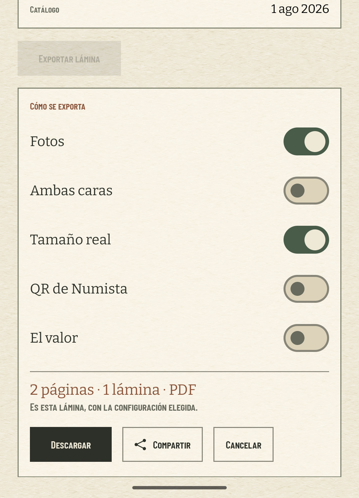
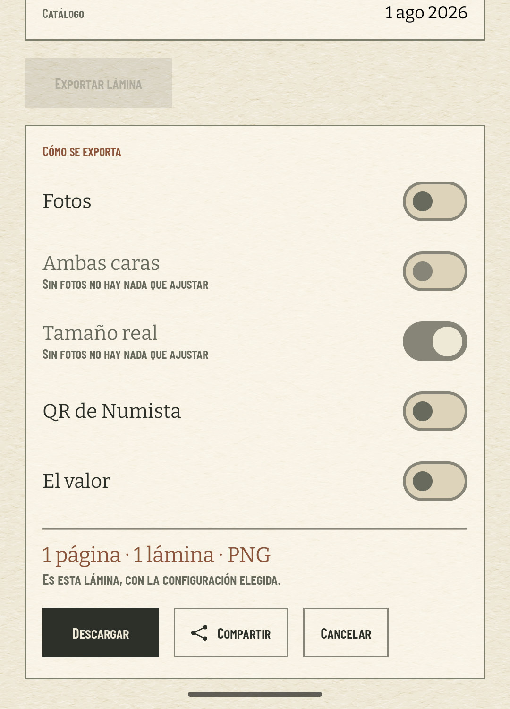
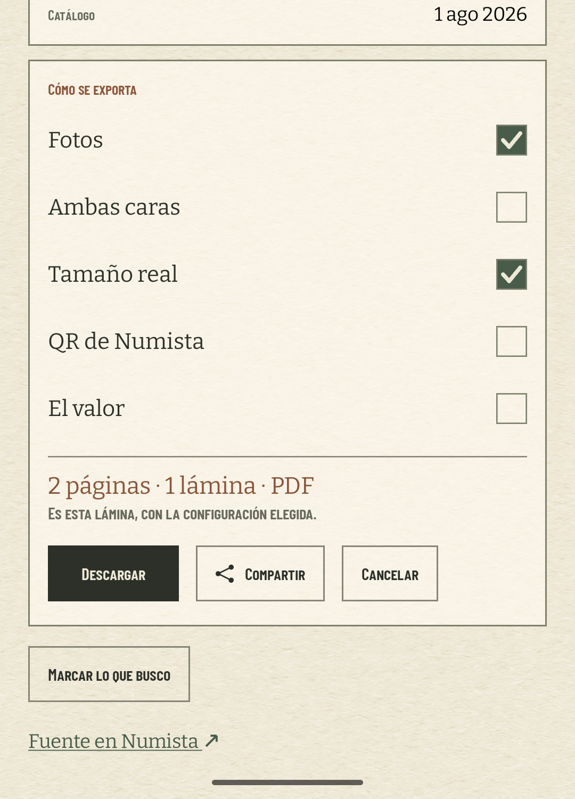
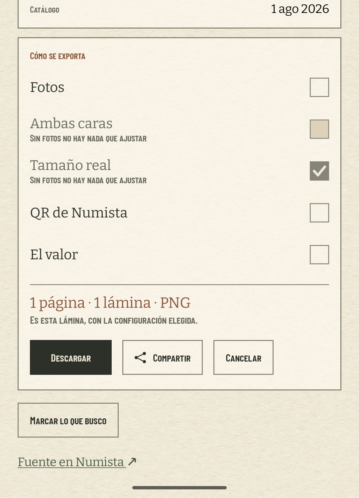
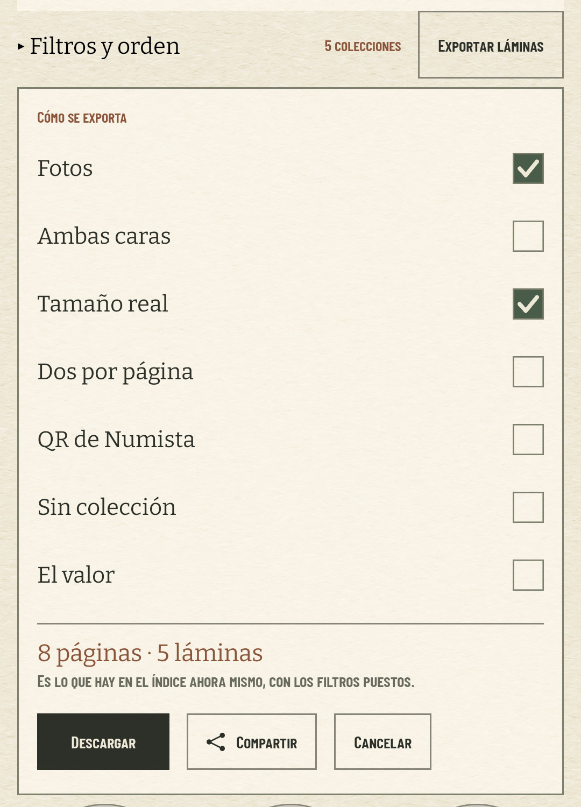

# El panel marca sus casillas a mano (#512)

«Cómo se exporta» era la única pieza de Material crudo que quedaba en la app: cinco `Switch` con la
pista redondeada, el pulgar con sombra y su ripple, en una hoja hecha de rectángulos, pelos de un
punto y glifos dibujados con dos trazos. Y al abrirse el panel, el botón «Exportar lámina» que lo
había abierto se quedaba encima, gris, repitiendo una pregunta que ya estaba contestándose dos
dedos más abajo: parecía averiado en vez de sustituido.

## Lo medido

`coindex-chrome` (Pixel 7, 1080 × 2400 a 420 dpi, software), colección restaurada con
`scripts/avd-db.sh restore`, misma navegación en las dos versiones: lámina «Fuertes · Venezuela ·
plata 25 g» (7/22, tasada), «Exportar lámina» y, en la segunda captura, «Fotos» apagado para que
dos filas queden grises con su nota.

| | panel recién abierto | con «Fotos» apagado |
| --- | --- | --- |
| antes (1.5.0) |  |  |
| después |  |  |

Medido sobre las capturas a 1080 —los PNG que da `screencap`, antes de comprimirlas a JPEG para el
repositorio—, con el borde de la tarjeta como referencia:

| | antes | después |
| --- | ---: | ---: |
| cabecera del panel | y = 1164 | y = 1012 |
| pie del panel | y = 2335 | y = 2073 |
| alto del panel | 1171 px · 446 dp | 1061 px · 404 dp |
| paso de una fila | 148 px · 56 dp | 126 px · 48 dp |

El panel sube 152 px porque los 40 dp del botón gris y los 10 dp que lo separaban de la tarjeta ya
no están, y adelgaza otros 110 px porque la marca ocupa lo que ocupa una marca. Sumados, el pie del
panel queda 262 px más arriba: antes la tarjeta terminaba a 65 px del borde inferior y «Marcar lo
que busco» caía fuera de la pantalla; ahora la conversación entera y el botón de después caben en
la hoja sin desplazarla.

**48 dp y no menos.** Es lo único que el `Switch` traía de serie y que había que devolver a mano: la
fila entra en un `heightIn(min = 48.dp)` y es ella la que se lleva el toque —un `toggleable` con
`Role.Checkbox`—, así que el blanco pasa de los 20 dp de la pista a los 48 dp de la línea. Es lo que
el KDoc de `ToggleRow` llevaba prometiendo desde que se escribió y el switch no cumplía: sólo se
podía tocar el interruptor.

## Lo que cambia

- **La marca** (`TickBox`, en `ToggleRow.kt`): el cuadrado de un formulario, reglado con el mismo
  pelo de las tarjetas, y la palomita dibujada en `Canvas` a la manera de `ShareGlyph` y
  `ForwardGlyph`. Marcada es musgo con la palomita en papel; vacía es papel con el pelo alrededor.
  Nada importado y nada redondeado. Se queda privada en su fichero mientras esta fila sea su única
  clienta; el muestrario compartido es `FieldGuide`, y allí irá el día que otra tarjeta pida una.
- **El gris sigue informando.** Una casilla deshabilitada no pierde la palomita: baja el relleno al
  pelo y conserva la marca, porque una fila que no se puede mover sigue teniendo que decir cómo está
  —y la nota de al lado dice por qué no se mueve—. Vacía y deshabilitada se rellena de papel hondo,
  que es la casilla fuera de juego.
- **La puerta cede su sitio** (`SheetExportDoor`): `SheetExportSurface` parte el botón en una pieza
  aparte y la deja nula mientras el panel ocupa su hueco. Puerta y panel no coexisten; el camino de
  vuelta es «Cancelar», que el panel ya tenía desde el #434. Las tres pantallas que cuelgan la puerta
  de su cabecera —lámina, hoja y «Lo que busco»— dibujan el botón sólo cuando lo hay.

El botón sí se queda, gris, mientras una exportación está en marcha: ahí no repite ninguna pregunta
—dice «Preparando la lámina…»— y para un PNG de una página es el único sitio donde se dice.

**El índice se queda como está.** Su «Exportar láminas» no vive en el hueco del panel sino dentro
del listón de filtros, nunca se pone gris —`actionEnabled` sólo mira si hay algo que exportar— y
sacarlo de ahí mientras la tarjeta está abierta movería el listón entero. Lo que sí cambia allí es
la marca, porque el panel es el mismo `ExportOptions`: las siete filas del índice, «Sin colección»
incluida, se marcan con la misma casilla.

El flujo Descargar / Compartir / Cancelar no se toca: el #434 sigue cerrado, y su test instrumentado
comprueba ahora también que la puerta se va al abrirse el panel y vuelve con «Cancelar».
