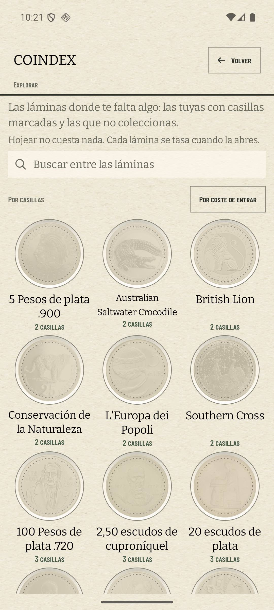
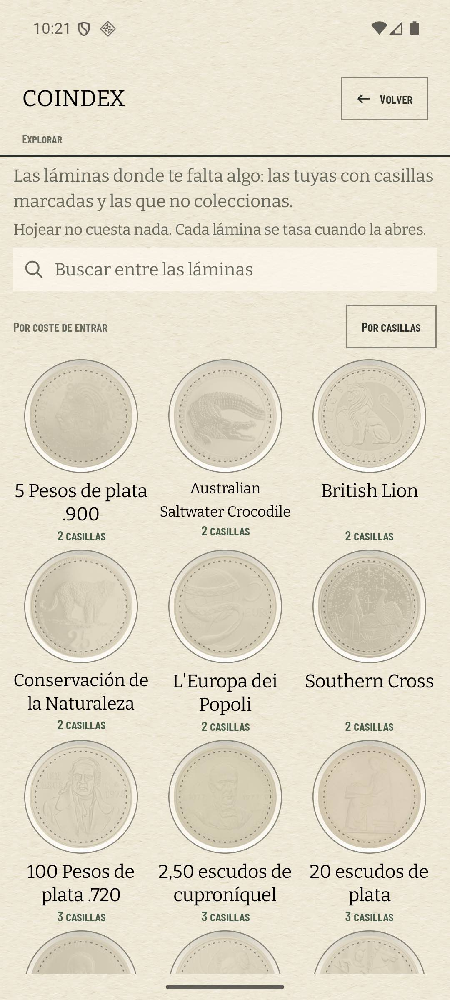
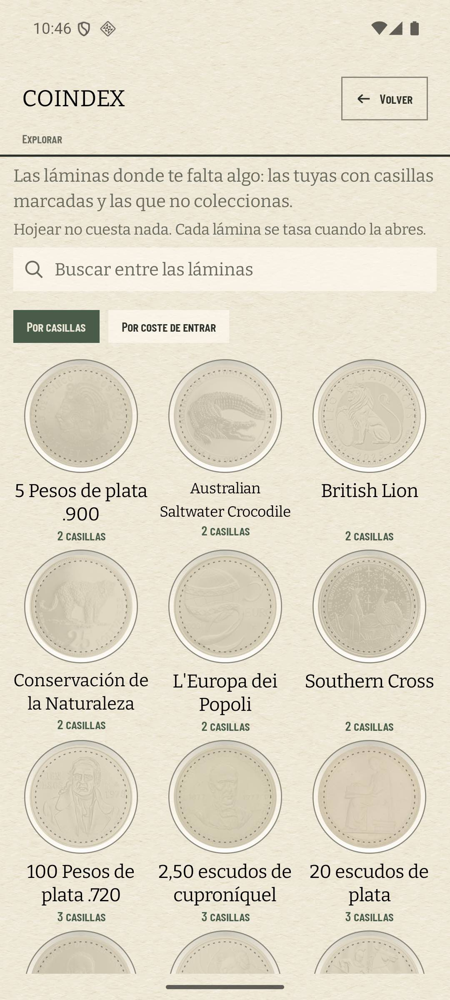
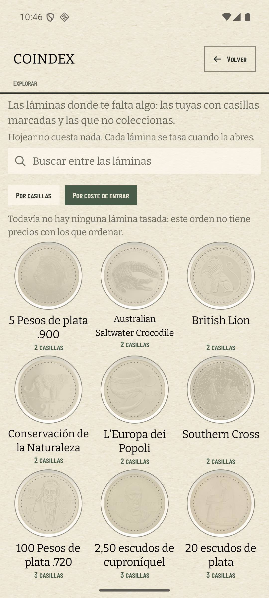

# El orden de «Explorar» se ve, y dice lo que no puede colocar (#513)

La fila de orden del estante enseñaba el criterio en vigor como texto plano y el otro dentro de un
botón enmarcado: la convención de la casa del revés, porque lo que lleva borde es lo que parece
elegido. Sobre un estante ordenado por casillas se leía «Por coste de entrar» en una caja, que es
justo lo que un control de esa forma no puede decir.

Y al pulsarlo no pasaba nada visible. «Por coste de entrar» sólo ordena lo tasado y deja detrás lo
que no tiene importe (ADR 0030 §8, punto 3); el estante nace sin un solo importe, así que en la
colección de calibración el orden coloca cero láminas y devuelve la misma rejilla. Las dos capturas
de la fila «antes» son la misma pantalla con las dos etiquetas intercambiadas.

## Lo medido

`coindex-chrome` (Pixel 7, 1080 × 2400 a 420 dpi), base restaurada con `scripts/avd-db.sh restore`
—5 colecciones, 55 láminas en el escaparate, ninguna tasada—, misma navegación en las dos
versiones: «Y otras 55 láminas que no coleccionas» y, en la segunda captura, «Por coste de entrar».

| | orden por defecto | pulsando «Por coste de entrar» |
| --- | --- | --- |
| antes (1.5.0) |  |  |
| después |  |  |

Medido sobre los PNG a 1080 que da `screencap`, antes de comprimirlos a JPEG para el repositorio:

| | antes | después |
| --- | --- | --- |
| criterio en vigor | texto en `Paper.muted`, sin caja | relleno en `Paper.moss` sobre papel |
| criterio en oferta | `CardAction` con borde de 1 dp | `Paper.card`, la tinta del álbum |
| tinta del elegido | — | 484 × 78 px · 184 × 30 dp |
| blanco del toque | 30 dp de alto | 48 dp |
| al pasar a «por coste» | nada | dos líneas: qué se ordenó y qué no |

El relleno es el de `FilterChip`, que es el **único** dibujo de «elegido» que tiene el álbum: las
facetas del índice llevan años pintando así lo que está en vigor, y una segunda forma para el mismo
estado sería una segunda cosa que aprender. Que este estante no tenga facetas (ADR 0030 §8, punto 4)
no le quita el par de órdenes, que es lo que se está pintando aquí; la nota de forma queda escrita
también junto a esa cláusula del ADR, que es donde la buscará quien grepee «no chips».

Los 48 dp los compra `minimumInteractiveComponentSize`, como los compran el aspa de la caja de
búsqueda y la chapa del año: el blanco crece sin que crezca la tinta. La fila es uno de los dos
controles de toda la pantalla y se lee con un pulgar.

## La línea que faltaba

«Todavía no hay ninguna lámina tasada: este orden no tiene precios con los que ordenar.» Es el patrón
de transparencia que Ajustes ya usa bajo el pase (ADR 0028 §6) y va en el mismo cuerpo, `bodyMedium`
en `Paper.muted`, no en las versalitas del álbum: es una frase que explica lo que hizo la aplicación,
y en versalitas se leía como rótulo del control de encima.

Tiene dos formas y sólo dos, porque son dos preguntas distintas:

- con algo tasado, cuenta lo que se quedó fuera: «3 láminas sin tasar, al final: este orden sólo
  coloca las tasadas»;
- sin nada tasado, no cuenta nada. «55 láminas sin tasar, al final» sobre una rejilla donde *todo*
  está al final describe un orden que no colocó nada como si hubiera colocado algo.

**Habla de los precios y no de la pantalla.** La primera redacción decía «así que este orden no
cambia nada», y es falsa en cuanto hay una casilla marcada: el orden por defecto lleva delante las
láminas del coleccionista (`showcaseShelf`) y éste no, así que la rejilla sí se mueve —las suyas caen
al final— mientras nada tiene precio. Lo que es cierto siempre es lo que el coleccionista necesita
saber: no hay importes con los que ordenar.

**Y cuenta las del escaparate, nunca las suyas.** Una lámina propia no lleva `entryEur` ni lo llevará:
entrar en una lámina que ya coleccionas no es algo que cueste, así que no tiene «Coste de entrar» ni
gesto que lo pida (ADR 0030 §3, §6). Contarla entre «las que faltan por tasar» mandaría al
coleccionista a buscar dentro un botón que no existe.

Calla en «Por casillas» —que ordena por un dato que toda lámina tiene— y calla también cuando no hay
ninguna lámina de escaparate sin tasar. Y cuenta lo que se ve: una búsqueda reducida a tres láminas
sin tasar dice tres, no cincuenta y cinco.

## Lo que queda fuera

La segunda forma de la línea —la que cuenta— no aparece en ninguna captura porque tasar una lámina
gasta cuota de Numista, y la del padre es la que mueve su móvil. Está medida en
`ShelfOrderTest.theCostOrderSaysWhatItCouldNotPlace`, sobre un estante de dos láminas con una sola
tasada.

Y el #494 —las dos edades del coste de entrar— sigue abierto: esta línea dice cuántas láminas no
tienen importe, no cuándo se tasaron las que sí.
