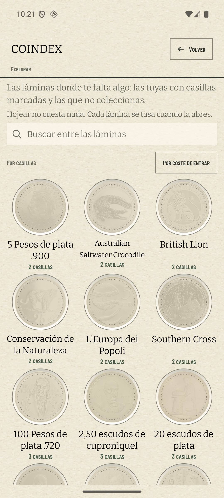
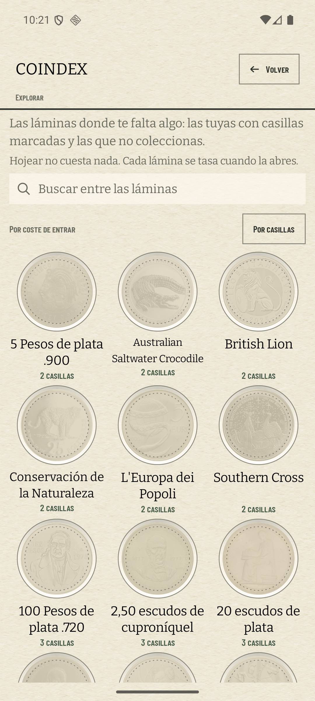
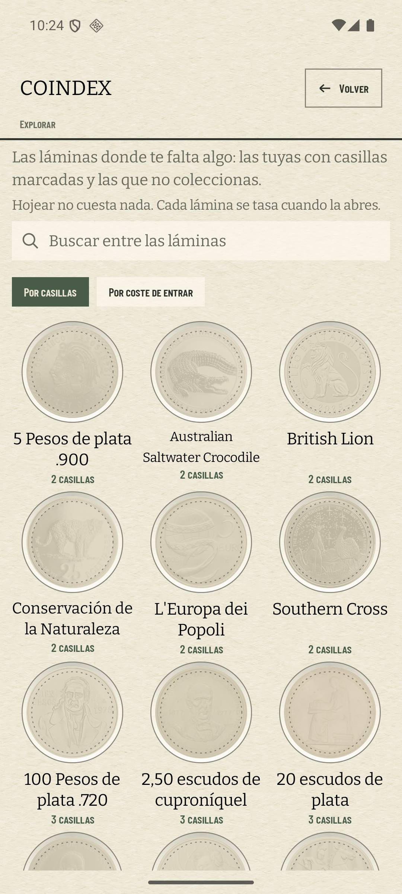
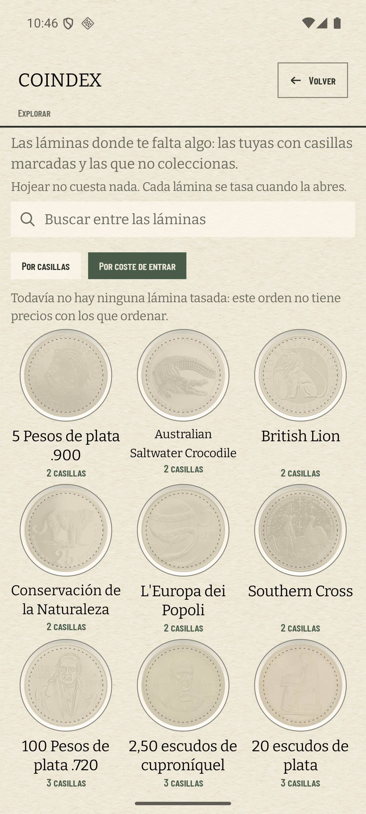

# El orden de «Explorar» se ve, y dice lo que no puede colocar (#513)

La fila de orden del estante enseñaba el criterio en vigor como texto plano y el otro dentro de un
botón enmarcado, la convención de la casa al revés: lo que lleva borde parece lo elegido. En un
estante ordenado por casillas se leía «Por coste de entrar» en una caja.

Y al pulsarlo no pasaba nada visible. «Por coste de entrar» sólo ordena lo tasado y deja detrás lo
que no tiene importe (ADR 0030 §8, punto 3); el estante nace sin ningún importe, así que en la
colección de calibración el orden no coloca ninguna lámina y devuelve la misma rejilla. Las dos
capturas de la fila «antes» son la misma pantalla con las dos etiquetas intercambiadas.

## Lo medido

`coindex-chrome` (Pixel 7, 1080 × 2400 a 420 dpi), base restaurada con `scripts/avd-db.sh restore`
(5 colecciones, 55 láminas en el escaparate, ninguna tasada), misma navegación en las dos versiones:
«Y otras 55 láminas que no coleccionas» y, en la segunda captura, «Por coste de entrar».

| | orden por defecto | pulsando «Por coste de entrar» |
| --- | --- | --- |
| antes (1.5.0) |  |  |
| después |  |  |

Medido sobre los PNG a 1080 de `screencap`, antes de comprimirlos a JPEG para el repositorio:

| | antes | después |
| --- | --- | --- |
| criterio en vigor | texto en `Paper.muted`, sin caja | relleno en `Paper.moss` sobre papel |
| criterio en oferta | `CardAction` con borde de 1 dp | `Paper.card`, la tinta del álbum |
| tinta del elegido | — | 484 × 78 px · 184 × 30 dp |
| blanco del toque | 30 dp de alto | 48 dp |
| al pasar a «por coste» | nada | dos líneas: qué se ordenó y qué no |

El relleno es el de `FilterChip`, el único dibujo de «elegido» que tiene el álbum: las facetas del
índice ya pintan así lo que está en vigor, y una segunda forma para el mismo estado sería otra cosa
que aprender. Que este estante no tenga facetas (ADR 0030 §8, punto 4) no le quita el par de
órdenes; la nota de forma está también junto a esa cláusula del ADR, donde la buscará quien haga
grep de «no chips».

Los 48 dp los da `minimumInteractiveComponentSize`, como al aspa de la caja de búsqueda y a la chapa
del año: el blanco crece sin que crezca la tinta. La fila es uno de los dos controles de la pantalla
y se usa con el pulgar.

## La línea que faltaba

«Todavía no hay ninguna lámina tasada: este orden no tiene precios con los que ordenar.» Sigue el
patrón de transparencia que Ajustes ya usa bajo el pase (ADR 0028 §6) y va en el mismo cuerpo,
`bodyMedium` en `Paper.muted`, no en las versalitas del álbum: explica lo que hizo la aplicación, y
en versalitas se leía como rótulo del control de encima.

Tiene dos formas, una por pregunta:

- con algo tasado, cuenta lo que se quedó fuera: «3 láminas sin tasar, al final: este orden sólo
  coloca las tasadas»;
- sin nada tasado, no cuenta nada: «55 láminas sin tasar, al final», sobre una rejilla donde todo
  está al final, describiría un orden que no colocó nada como si hubiera colocado algo.

Habla de los precios y no de la pantalla. La primera redacción decía «así que este orden no cambia
nada», y es falsa en cuanto hay una casilla marcada: el orden por defecto pone delante las láminas
del coleccionista (`showcaseShelf`) y éste no, así que la rejilla sí se mueve (las suyas caen al
final) aunque nada tenga precio. Lo que siempre es cierto es lo que el coleccionista necesita saber:
no hay importes con los que ordenar.

Cuenta sólo las del escaparate, nunca las suyas. Una lámina propia no lleva `entryEur` ni lo
llevará: entrar en una lámina que ya coleccionas no cuesta nada, así que no tiene «Coste de entrar»
ni gesto que lo pida (ADR 0030 §3, §6). Contarla entre las pendientes de tasar mandaría al
coleccionista a buscar un botón que no existe.

Calla en «Por casillas», que ordena por un dato que toda lámina tiene, y también cuando no queda
ninguna lámina de escaparate sin tasar. Y cuenta lo que se ve: una búsqueda reducida a tres láminas
sin tasar dice tres, no cincuenta y cinco.

## Lo que queda fuera

La forma que cuenta no aparece en ninguna captura porque tasar una lámina gasta cuota de Numista, y
la del padre es la que usa su móvil. La cubre `ShelfOrderTest.theCostOrderSaysWhatItCouldNotPlace`,
sobre un estante de dos láminas con una sola tasada.

El #494 (las dos edades del coste de entrar) sigue abierto: esta línea dice cuántas láminas no
tienen importe, no cuándo se tasaron las que sí.
