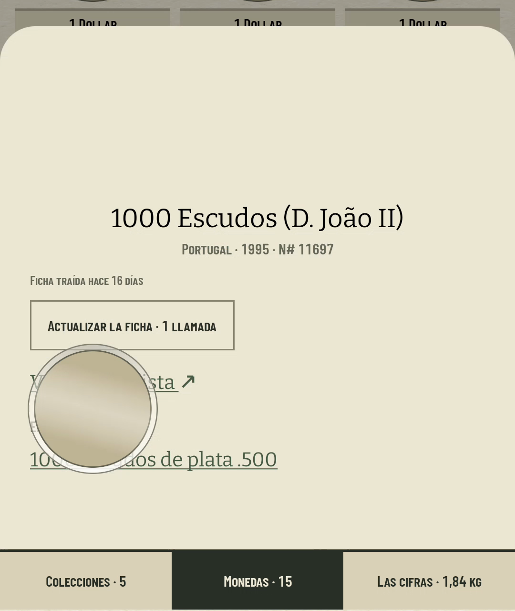
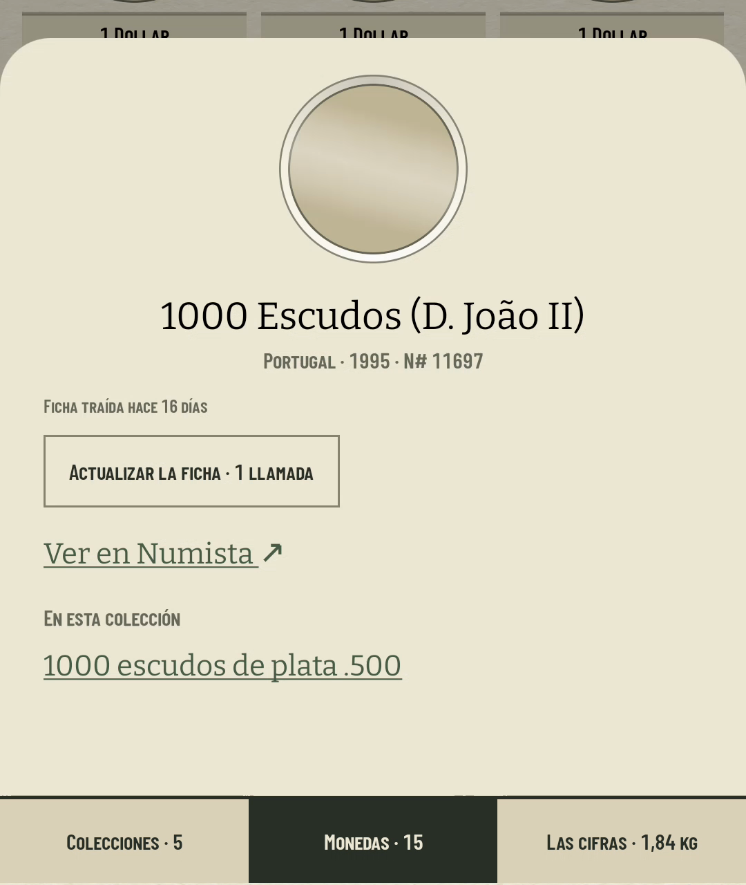
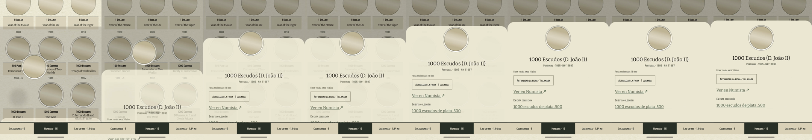

# A cero, la hoja aparece ya asentada (#514)

La auditoría del 14 de agosto de 2026 dejó una captura tomada un segundo después del toque, con
`animator_duration_scale 0`, en la que la ficha de la moneda estaba a medio camino: la foto encima
de «Ver en Numista». El ticket lo leyó como que las animaciones de la app ignoran la escala del
sistema.

**No la ignoran, y la medición de esta sesión dice exactamente qué sí y qué no.** Compose divide por
esa escala toda duración que él gobierna, así que a cero un `tween` termina en el mismo fotograma en
que arranca —el giro del #337 ya no se movía, y está escrito en su propio README— y el `fadeIn` +
`slideInVertically` de la hoja llega asentado. Lo que no se puede dividir por una escala es un
**fotograma**: un elemento compartido coloca su foto donde despegó antes de colocarla donde
aterriza, porque su sitio sale de una pasada de lookahead que llega después. Un fotograma no es una
duración, y a cero seguía habiendo uno con una moneda en un sitio que no es ninguno de los dos.

## Lo medido

`coindex-ux` (pixel_7, software), colección restaurada con `scripts/avd-db.sh restore`,
`adb shell settings put global animator_duration_scale 0`, y `screenrecord` a 30 fps sobre el mismo
gesto: abrir la ficha de «1000 Escudos (D. João II)», que es la casilla de la tercera fila de
Monedas —la que está **debajo** de donde acaba el hueco de la hoja, así que su foto tiene que subir
y pasa por encima de los enlaces—. De cada vídeo se cuentan los fotogramas que cambian algo,
comparando cada uno con el anterior.

| | fotogramas con cambio | qué se ve en el intermedio |
| --- | ---: | --- |
| antes, escala 0 | 3 | la hoja entera y quieta, el hueco **vacío**, y la foto sobre los enlaces |
| después, escala 0 | 1 | nada: la rejilla, y en el siguiente la hoja completa |
| después, escala 1 | 11 | la ceremonia entera, la de siempre |

| antes (escala 0) | después (escala 0) |
| --- | --- |
|  |  |

Los dos son el mismo fotograma del mismo gesto: el primero después de que la hoja se asiente. El de
la izquierda es la captura de la auditoría reproducida —el hueco de la ficha vacío y la moneda a
mitad de camino, tapando «Ver en Numista» y el nombre de la colección que la reclama— y el de la
derecha es que no hay tal fotograma.

Y a escala 1 no cambia **nada**: ocho fotogramas consecutivos del mismo toque, con la hoja subiendo
y la moneda pasando de su casilla al hueco de la ficha. Lo que se apaga se apaga sólo cuando el
sistema lo pide.

## Lo que cambia

Una pregunta —«¿hay alguien pidiendo quietud?»— leída del ajuste que Compose ya lee
(`Settings.Global.ANIMATOR_DURATION_SCALE`), **observada** y no leída una vez, porque el interruptor
de accesibilidad se acciona en Ajustes con Coindex vivo detrás y el coleccionista vuelve a la app
que dejó. De ahí sale `LocalMotion`, que vale `true` en todo árbol al que nadie se lo provea: una
preview, un test y la hoja que se compone fuera de pantalla no tienen sistema al que preguntar.

La regla es **tirar de todos los interruptores que la app ya tiene**, que son cuatro y ninguno
cuesta nada:

- **Ningún vuelo.** `travellingCoin` y `travellingTypeCoin` devuelven el modificador tal cual, así
  que no hay elemento compartido ni superposición que lo dibuje. En Monedas eso significa además que
  la casilla **no cede su foto**: nadie se la ha llevado, y una rejilla detrás del velo es un dibujo
  y no un agujero.
- **Ninguna entrada.** La hoja recibe `EnterTransition.None` y `ExitTransition.None` en vez de un
  `fadeIn` + `slideInVertically` de duración cero, que es lo mismo pero sin objeto que pueda filtrar
  un fotograma de hoja a medio subir.
- **La tinta ya seca.** `rememberInkFall` anula su `Stamping` por la misma razón por la que lo anula
  una exportación (ADR 0026 §4): lo que se rechaza no es el sello, es el estampado, y ese camino ya
  estaba construido.
- **El brillo en reposo.** El sensor no se registra, y `CoinTilt.Still` es el teléfono sobre la
  mesa: una pose definida (#303) y no un efecto apagado a medias.

Tirar de los cuatro no es defensivo por gusto. A escala cero Compose ya deja el estampado en un
fotograma y el brillo no es suyo en absoluto; la diferencia entre «lo colapsa» y «no empieza» es que
lo segundo es una garantía y lo primero depende de cómo caigan los fotogramas.

## El brillo es el que ninguna escala alcanza

`ANIMATOR_DURATION_SCALE` divide duraciones, y el brillo no tiene ninguna: sigue al acelerómetro y
se lee en la fase de dibujo. Es, por tanto, el único movimiento de los aprobados en ADR 0026 §3 por
el que la app tiene que responder ella — y es el que más se parece a lo que el ticket llama «quien
se marea», porque es metal moviéndose bajo la mano. Con la quietud pedida no se ralentiza: no se
registra, que además no gasta batería.

## Las dos ceremonias que se quedan como estaban, y por qué

El giro de la casilla (#337) y el `fadeOut` de la vuelta al índice (#381) **no tienen interruptor**
que no haya que inventar, así que se quedan en manos de Compose. Que eso sea seguro es una segunda
razón, y es la que decide el caso: **lo que dibuja el fotograma que pueden filtrar**.

- El giro filtra la cara que ya estaba arriba, que es «todavía no ha girado».
- El `fadeOut` filtra la lámina todavía tapando el índice, que es «todavía no se ha ido».

Ninguno de los dos dibuja nada en un sitio donde no va. El elemento compartido sí lo dibujaba —una
moneda ni en su casilla ni en su hueco— y por eso es el que había que apagar en vez de confiarlo.
