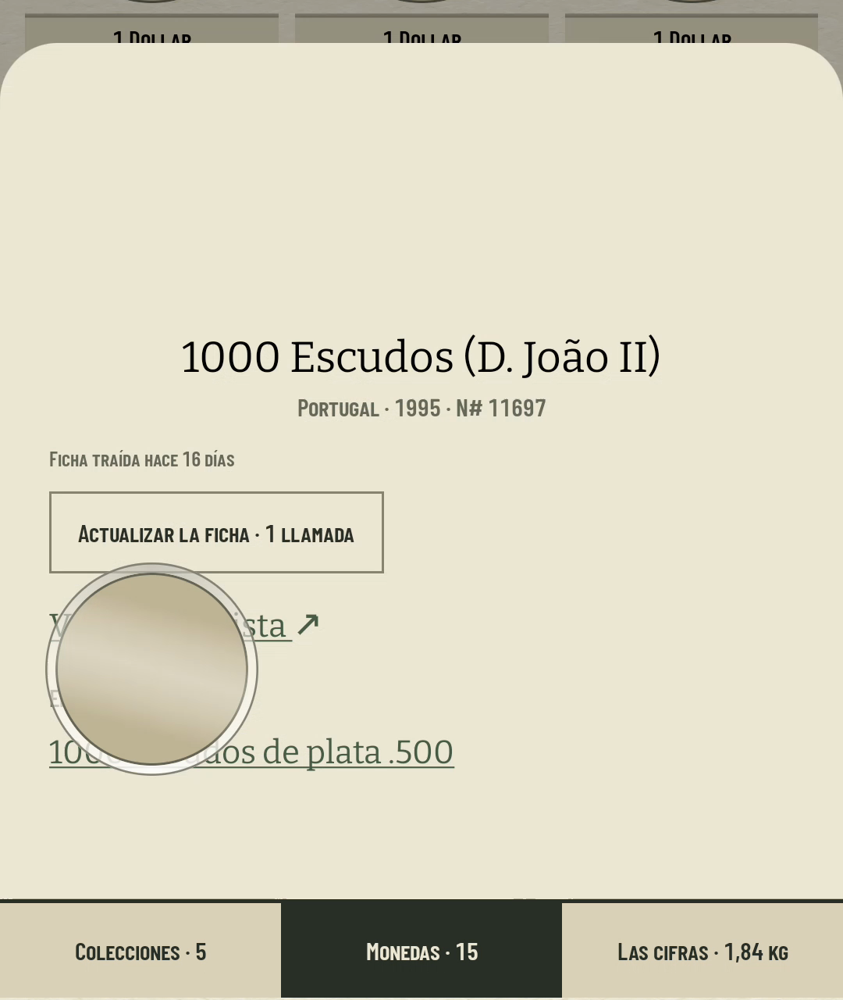
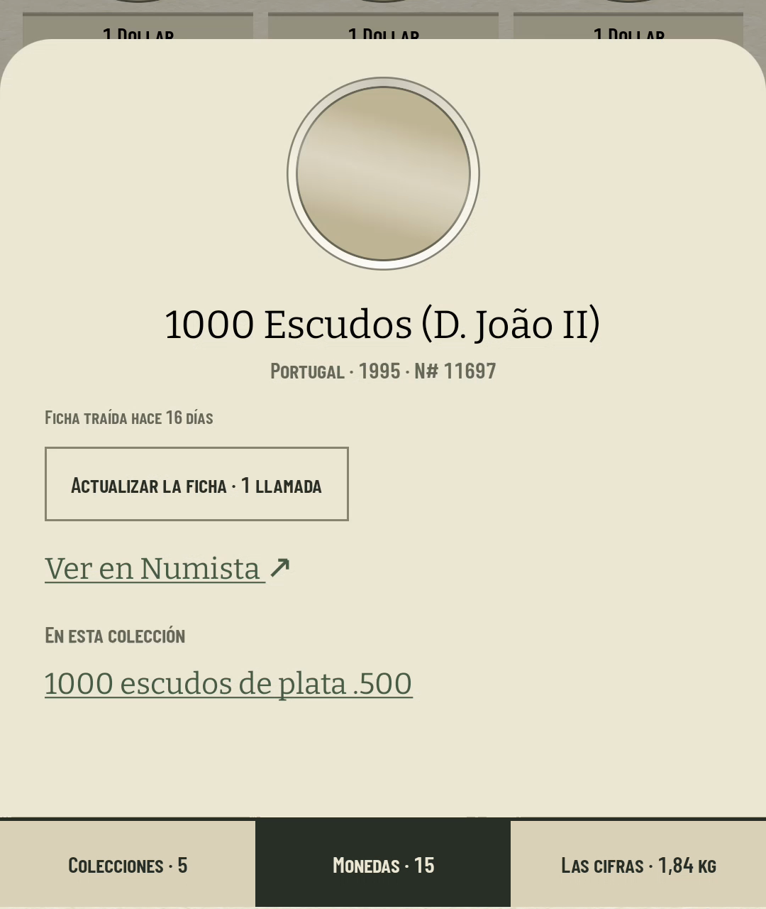
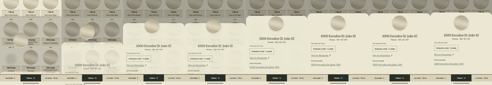

# A cero, la hoja aparece ya asentada (#514)

La auditoría del 14 de agosto de 2026 dejó una captura tomada un segundo después del toque, con
`animator_duration_scale 0`, en la que la ficha de la moneda estaba a medio camino: la foto encima
de «Ver en Numista». El ticket lo interpretó como que las animaciones de la app ignoran la escala
del sistema.

No la ignoran, salvo en un caso. Compose divide por esa escala toda duración que gobierna, así que a
cero un `tween` termina en el mismo fotograma en que arranca (el giro del #337 ya no se movía, como
recoge su README) y el `fadeIn` + `slideInVertically` de la hoja llega asentado. Lo que no se puede
dividir por una escala es un fotograma: un elemento compartido coloca su foto donde despegó antes de
colocarla donde aterriza, porque su sitio sale de una pasada de lookahead posterior. A cero seguía
habiendo un fotograma con la moneda en un sitio que no es ninguno de los dos.

## Lo medido

`coindex-ux` (pixel_7, software), colección restaurada con `scripts/avd-db.sh restore`,
`adb shell settings put global animator_duration_scale 0`, y `screenrecord` a 30 fps sobre el mismo
gesto: abrir la ficha de «1000 Escudos (D. João II)», la casilla de la tercera fila de Monedas, que
está debajo de donde acaba el hueco de la hoja, así que su foto sube y pasa por encima de los
enlaces. De cada vídeo se cuentan los fotogramas que cambian algo respecto al anterior.

| | fotogramas con cambio | qué se ve en el intermedio |
| --- | ---: | --- |
| antes, escala 0 | 3 | la hoja entera y quieta, el hueco vacío, y la foto sobre los enlaces |
| después, escala 0 | 1 | nada: la rejilla, y en el siguiente la hoja completa |
| después, escala 1 | 11 | la ceremonia entera, la de siempre |

| antes (escala 0) | después (escala 0) |
| --- | --- |
|  |  |

Los dos son el mismo fotograma del mismo gesto, el primero después de que la hoja se asiente. A la
izquierda, la captura de la auditoría reproducida: el hueco de la ficha vacío y la moneda a mitad de
camino, tapando «Ver en Numista» y el nombre de la colección que la reclama. A la derecha, ese
fotograma ya no existe.

A escala 1 no cambia nada: ocho fotogramas consecutivos del mismo toque, con la hoja subiendo y la
moneda pasando de su casilla al hueco de la ficha. Sólo se apaga lo que el sistema pide apagar.

## Lo que cambia

La app pregunta si alguien pide quietud leyendo el ajuste que ya lee Compose
(`Settings.Global.ANIMATOR_DURATION_SCALE`), y lo observa en vez de leerlo una vez, porque el
interruptor de accesibilidad se acciona en Ajustes con Coindex vivo detrás y el coleccionista vuelve
a la app que dejó. De ahí sale `LocalMotion`, que vale `true` en todo árbol que no lo provea: una
preview, un test y la hoja que se compone fuera de pantalla no tienen sistema al que preguntar.

La regla es accionar los cuatro interruptores que la app ya tiene, ninguno con coste:

- **Ningún vuelo.** `travellingCoin` y `travellingTypeCoin` devuelven el modificador tal cual, así
  que no hay elemento compartido ni superposición que lo dibuje. En Monedas, además, la casilla no
  cede su foto: nadie se la ha llevado, y la rejilla detrás del velo se ve entera.
- **Ninguna entrada.** La hoja recibe `EnterTransition.None` y `ExitTransition.None` en vez de un
  `fadeIn` + `slideInVertically` de duración cero: el resultado es el mismo, pero sin objeto que
  pueda filtrar un fotograma de hoja a medio subir.
- **La tinta ya seca.** `rememberInkFall` anula su `Stamping` por la misma razón que lo anula una
  exportación (ADR 0026 §4): se rechaza el estampado, no el sello, y ese camino ya estaba
  construido.
- **El brillo en reposo.** El sensor no se registra, y `CoinTilt.Still` es el teléfono sobre la
  mesa: una pose definida (#303), no un efecto apagado a medias.

Se accionan los cuatro aunque a escala cero Compose ya deje el estampado en un fotograma (el brillo
no es suyo en absoluto): que no empiece es una garantía, y que se colapse depende de cómo caigan los
fotogramas.

## El brillo no lo alcanza ninguna escala

`ANIMATOR_DURATION_SCALE` divide duraciones, y el brillo no tiene ninguna: sigue al acelerómetro y
se lee en la fase de dibujo. Es el único movimiento de los aprobados en el ADR 0026 §3 del que la
app tiene que encargarse por sí misma, y el que más se parece a lo que el ticket llama «quien se
marea», porque es metal moviéndose bajo la mano. Con la quietud pedida no se ralentiza: no se
registra, lo que además ahorra batería.

## Las dos ceremonias que se quedan como estaban

El giro de la casilla (#337) y el `fadeOut` de la vuelta al índice (#381) no tienen un interruptor
que no haya que inventar, así que se quedan en manos de Compose. Es seguro por lo que dibuja el
fotograma que pueden filtrar:

- El giro filtra la cara que ya estaba arriba: «todavía no ha girado».
- El `fadeOut` filtra la lámina todavía tapando el índice: «todavía no se ha ido».

Ninguno de los dos dibuja nada donde no va. El elemento compartido sí lo hacía (una moneda ni en su
casilla ni en su hueco), y por eso había que apagarlo.
