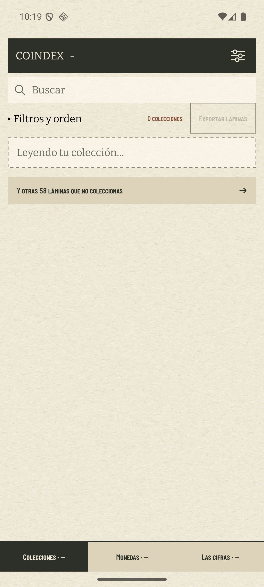
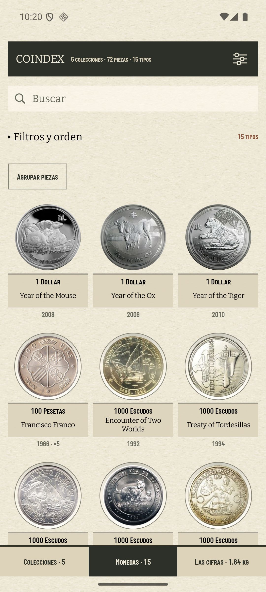
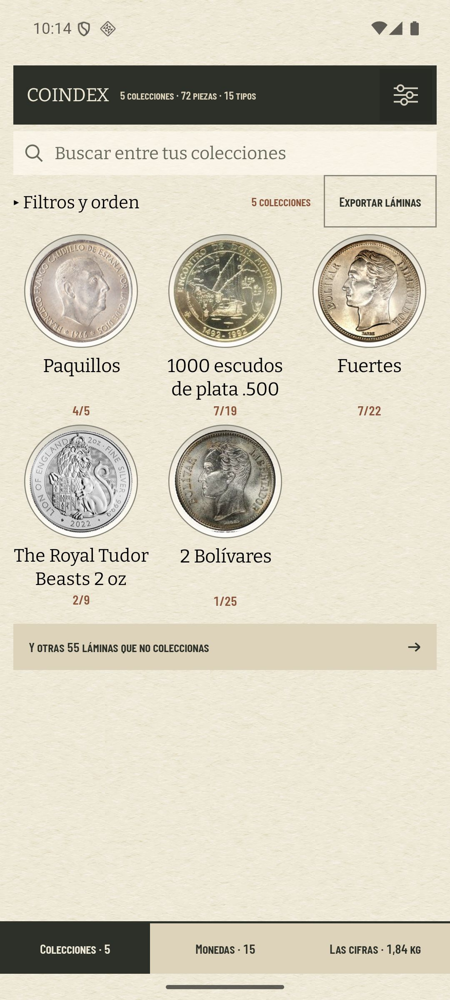
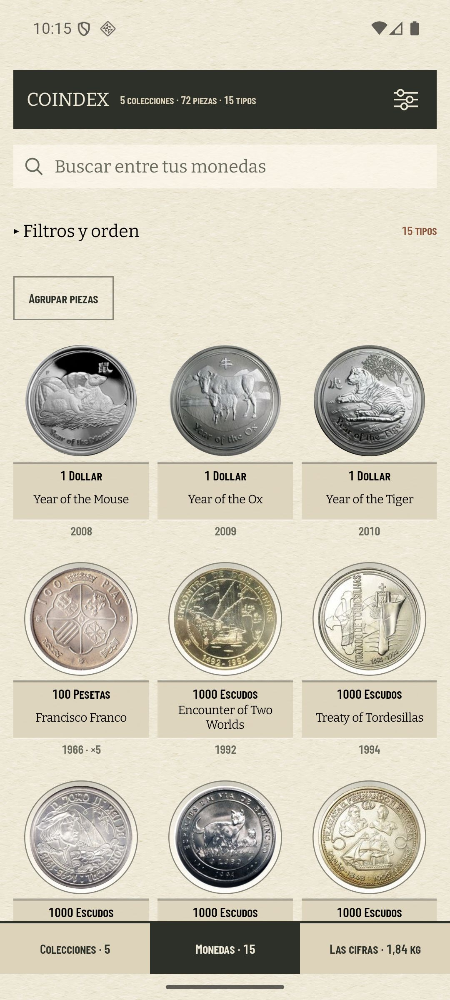
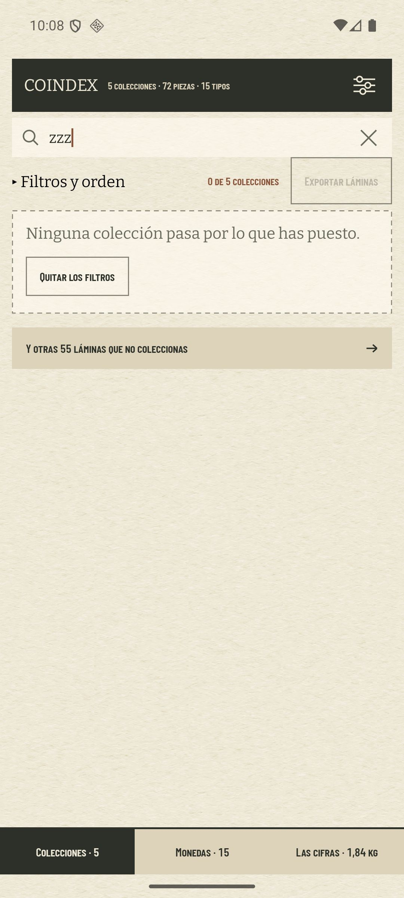
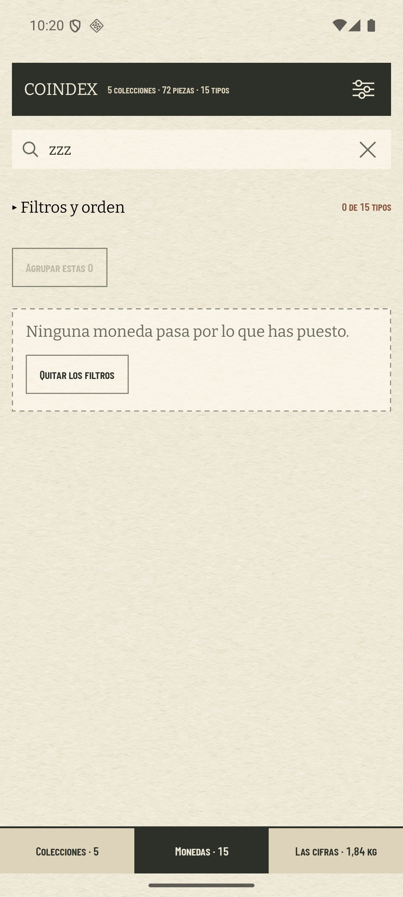
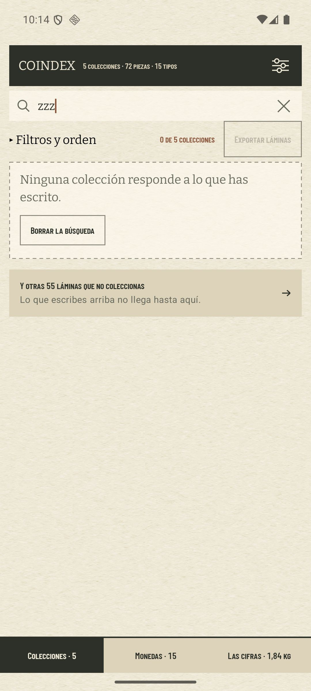
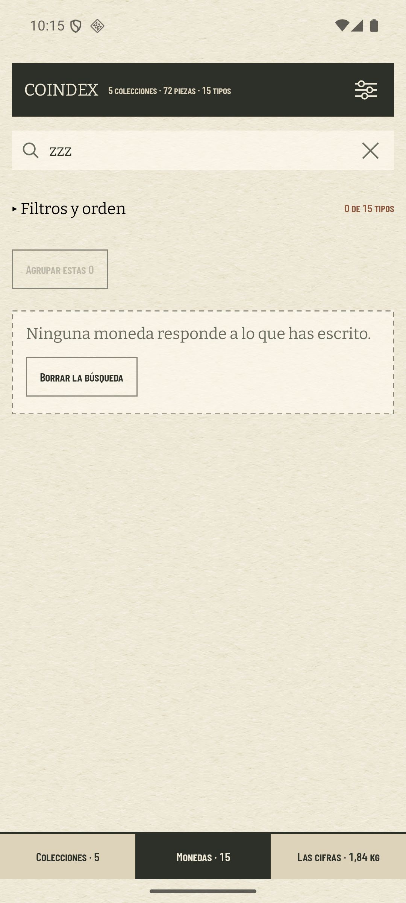

# Cada «Buscar» dice dónde busca, y el vacío responde a lo que se puso (#515)

Tres pantallas dibujaban la misma caja con la misma palabra sobre tres poblaciones distintas: las
tarjetas del índice, los tipos del inventario y las láminas curadas que el coleccionista no tiene.
Sólo «Explorar» decía cuál era la suya. Debajo, una tarjeta vacía respondía «Ninguna colección pasa
por lo que has puesto» a quien sólo había escrito, y ofrecía «Quitar los filtros» —que además
vaciaba la caja, bajo un nombre que decía que no lo haría—. Y al pie, la puerta del anexo seguía
diciendo 55 láminas sobre un índice que la búsqueda había dejado en cero.

## Lo medido

`coindex-chrome` (Pixel 7, 1080 × 2400 a 420 dpi), base restaurada con `scripts/avd-db.sh restore`
—5 colecciones, 15 tipos, 55 láminas en el escaparate—, misma navegación en las dos versiones:
teclear `zzz` en la caja de cada jerarquía.

| | Colecciones | Monedas |
| --- | --- | --- |
| antes (1.5.0) |  |  |
| después |  |  |

Y lo que las tres cosas del issue ocurren a la vez: la caja, el vacío y la puerta, en una pantalla.

| | Colecciones | Monedas |
| --- | --- | --- |
| antes (1.5.0) |  |  |
| después |  |  |

Medido sobre los PNG a 1080 que da `screencap`, antes de comprimirlos a JPEG para el repositorio:

| | antes | después |
| --- | --- | --- |
| tinta del *placeholder* del índice | 61 → 265 px | 61 → 684 px |
| blanco que le queda en la caja | 756 px · 288 dp | 337 px · 128 dp |
| frase del vacío | una, para tres casos | tres, una por caso |
| botón del vacío | «Quitar los filtros», siempre | el del estrechamiento, o ninguno |
| alto de la puerta del anexo | 111 px · 42 dp | 164 px · 62 dp mientras se escribe |

## El posesivo es lo que distingue

«Buscar entre tus colecciones», «Buscar entre tus monedas», «Buscar entre las láminas». La tercera
no lleva posesivo y no es un descuido: el estante de «Explorar» está hecho de lo que el
coleccionista **no** tiene (ADR 0030 §1), así que un «tus» ahí sería falso. Una palabra dice de qué
lado del álbum está cada caja.

El parámetro `placeholder` de `SearchField` **perdió su valor por defecto**. Era el mecanismo por el
que dos de las tres cajas podían no declararse: quien dibuje esa caja tiene ahora que decir sobre
qué. Cuesta un argumento y ahorra la siguiente pantalla que la copie.

## Y de paso, las tres buscan igual

La caja de «Explorar» no usaba `matchesQuery` sino un `contains` pelado: sensible a acentos y ciega
a dos palabras en cualquier orden. «aguila» no encontraba «Águila» y «plata aguila» no encontraba
nada, mientras las otras dos sí. Es la mitad invisible del título del issue —tres «Buscar» idénticos
que no buscaban lo mismo— y ninguna declaración de alcance la habría hecho visible: se arregla en
`showcaseShelf`, que ahora dobla el nombre con `fold` como todo lo demás.

## Tres estrechamientos y no uno

`ShelfNarrowing` es lo que se ha puesto: los chips, la palabra, las dos o ninguna. No son una sola
cosa —los filtros sobreviven a un lanzamiento y se esconden tras un estante plegado; la palabra se
escribe en una caja siempre a la vista y se va con la aplicación (ADR 0021 §1)—, y el vacío las
distingue:

- filtros: «Ninguna colección pasa por los filtros.» → «Quitar los filtros»
- búsqueda: «Ninguna colección responde a lo que has escrito.» → «Borrar la búsqueda»
- las dos: «Ninguna colección pasa por lo que has puesto.» → «Quitar los filtros y la búsqueda»

La frase de antes sobrevive **sólo donde era cierta**. «Lo que has puesto» es exactamente lo que
engloba un chip y una palabra a la vez, y ahí la vaguedad es la virtud: el botón de debajo nombra
las dos. El verbo cambia con el sujeto porque son actos distintos —una tarjeta *pasa* por un chip y
*responde* a una palabra escrita.

El botón se llama como el acto que deshace: «Borrar la búsqueda» es el nombre que el aspa de la caja
ya tenía (`SEARCH_CLEAR_LABEL`), no un segundo nombre para lo mismo. Y deshace exactamente eso:
`withoutFilters()` quita los chips **sin llevarse el eje y el orden**, que no estrechan nada y que el
`IndexShelf()` de antes tiraba de paso —quien leía la hoja por país y pulsaba un botón sobre filtros
volvía al eje por lámina.

**Y hay un cuarto caso que no es un estrechamiento.** Los ejes de país y año pueden quedarse vacíos
con el estante limpio; ahí se leía «pasa por lo que has puesto» sobre un botón que ofrecía quitar
nada. Ahora dice «Ninguna colección aparece en este eje.» y no ofrece salida, porque no hay ninguna
que dar.

## La puerta declara que la caja no llega hasta ella

Su recuento se mide sobre la colección entera y nunca sobre el estrechamiento, y eso está bien: lo
que hay detrás no está en la lista de arriba —el escaparate son láminas de las que no se tiene nada,
y las marcas son casillas y no tarjetas—. Lo que no puede es *parecer* un número que nadie recalculó.
Así que lo dice: «Lo que escribes arriba no llega hasta aquí.»

**«Lo que escribes» y no «tu búsqueda»**, porque una puerta más adentro hay una habitación llamada
«Lo que busco» y una línea sobre buscar junto a ella se leería como si hablara de ella.

**Sólo mientras hay algo escrito.** Los filtros tampoco llegan al escaparate, pero sobreviven a un
lanzamiento: nombrarlos aquí imprimiría esta línea en cada pantalla de cada sesión de quien dejó
puesto el chip de país, que es justo la frecuencia que ADR 0026 §5 tarifa. La búsqueda es lo que se
está haciendo ahora, en una caja a la vista, sobre una lista que puede haberse quedado en cero
debajo.

La nota va en `bodySmall` y no en el cuerpo del #513: allí la línea contestaba al control que tenía
encima, y aquí vive **debajo del nombre de la puerta**, que tiene que seguir siendo lo más alto de la
fila. Dentro del área táctil, porque es la fila hablando de sí misma.

## Lo que queda fuera

**No hay captura del vacío por filtros solos**, y no por descuido: en esta colección no se puede
llegar. Cada faceta cuenta sus chips con su propia elección descartada (`indexFacetCounts`), así que
el estante nunca ofrece una combinación que devuelva cero —elegido «España · 1», la faceta de año
sólo ofrece 1966—. Se alcanza cuando un filtro sobrevive a un lanzamiento y la colección cambia
debajo. Está medido en `ShelfLabelsTest.an empty shelf names the narrowing that emptied it`.

**«Explorar» no cambia de vacío.** Ya decía «Ninguna lámina se llama así», que responde exactamente a
lo que se puso, y no tiene chips que ofrecer quitar (ADR 0030 §8): la caja con su aspa está encima y
es toda la salida que hay. Lo que sí cambió es cómo compara.
