# Un solo diccionario: la caja, las consultas, y lo que cuenta la pestaña central (#516)

Tres desajustes de vocabulario, ninguno de dibujo. El gesto de la caja tenía **tres** nombres para una
cosa: la puerta agrupaba, el modo llenaba «la caja» y el snackbar anunciaba una colección. El gasto de
la API tenía **dos** unidades a un toque de distancia: «Tasar esta lámina · 3 consultas» en la lámina y
«Actualizar la ficha · 1 llamada» en la ficha, sobre el mismo presupuesto de la misma clave. Y la celda
del medio de la barra decía «Monedas · 15» sobre un teléfono con 72 monedas, porque ese 15 siempre fue
el recuento de tipos.

## Lo medido

`coindex-chrome` (Pixel 7, 1080 × 2400 a 420 dpi, 411 dp de ancho), base restaurada —5 colecciones, 72
piezas, 15 tipos, 55 láminas en el escaparate—, misma navegación en las dos versiones: Monedas → puerta
→ tocar dos monedas → «Nombrar…» → cancelar → abrir la ficha de la primera.

### 1. La caja se llama colección

| | la puerta, en Monedas | el modo, en la banda | el bautizo |
| --- | --- | --- | --- |
| antes (1.5.0) | 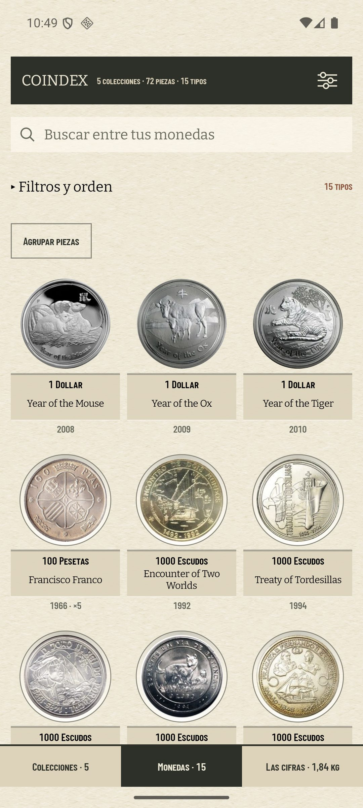 | 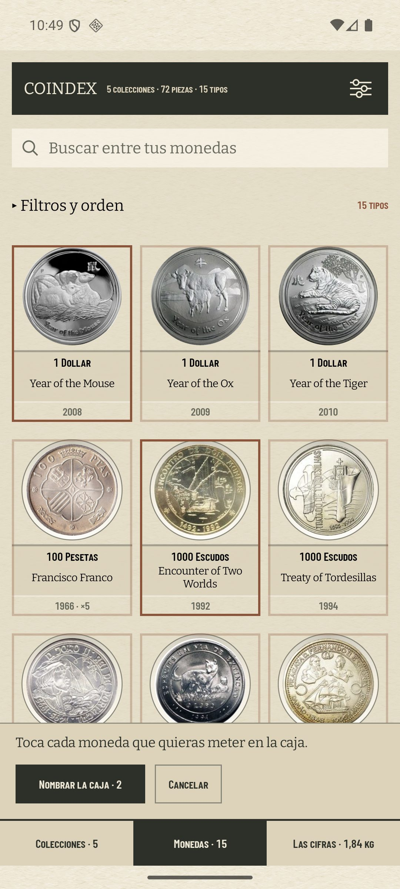 | 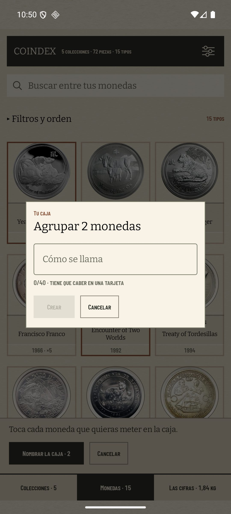 |
| después | 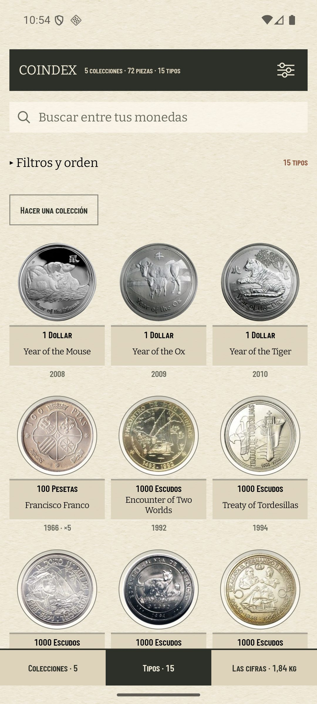 | 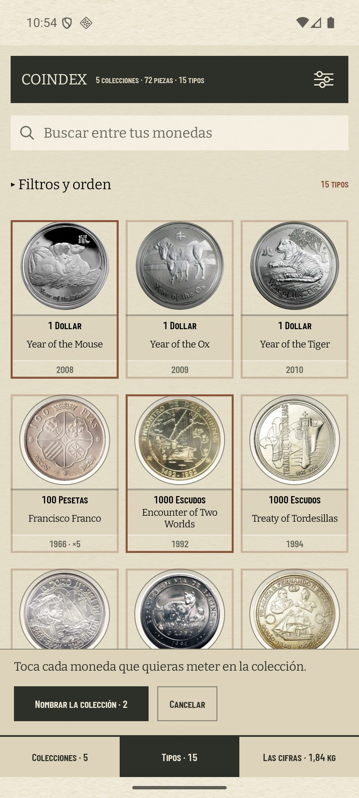 | 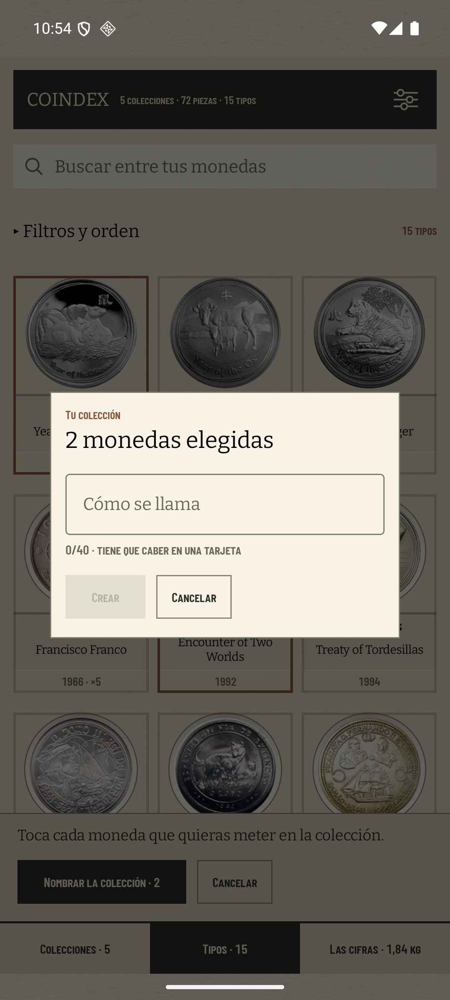 |

Seis cadenas y tres palabras, antes: `Agrupar piezas` / `Agrupar estas N` en la puerta, `meter en la
caja` en la frase del modo, `Nombrar la caja · N` en su botón, `Tu caja` y `Agrupar N monedas` en el
bautizo. La que sobrevive es la del ADR 0021 §2 —hay una especie de colección y ninguna palabra de
procedencia que la distinga— que es además la que el propio gesto ya usaba al terminar: «Colección «…»
creada.». El código se queda con `own_groupings` y `OwnGrouping`: lo que el §2 prohíbe es un rótulo.

**La cuarta superficie estaba fuera del gesto**: el chip de onzas del índice, `OunceBand.Spanning`, decía
`Conjunto o caja`. Dice `Varias onzas`. Ahí la palabra hacía algo peor que envejecer el vocabulario
—cambiaba la pregunta de la faceta: los otros tres chips de «Peso» contestan cuánto pesa la tarjeta
(`Menos de ½ oz`, `½ – 1 oz`, `Más de 1 oz`) y ése contestaba de qué clase era. La etiqueta nueva no
traduce la vieja: contesta lo que la faceta pregunta, y sigue siendo cierta para las dos clases que caen
en ese chip, porque el conjunto y la caja abarcan varias onzas a propósito.

| | la faceta «Peso» del índice |
| --- | --- |
| antes |  |
| después | 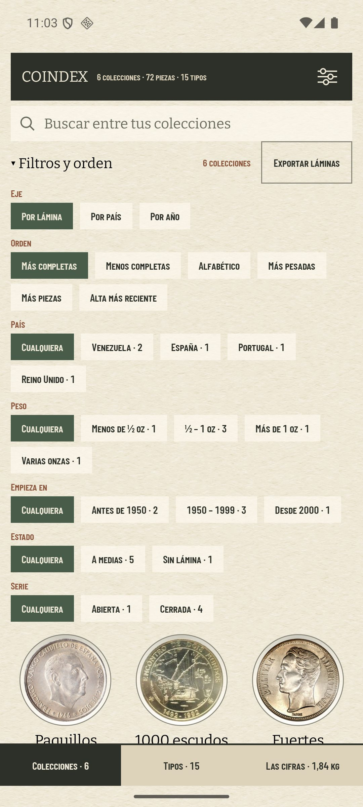 |

Este par **no** es 1.5.0 contra la rama: el chip sólo se dibuja cuando alguna tarjeta abarca varias
variantes, y la base de medición no tenía ninguna. Se hizo una con el propio gesto —«Las de dos pesos»,
una onza australiana y una peseta— y las dos capturas salen del mismo APK con esa única etiqueta
revertida, así que el frame difiere en exactamente lo medido. De paso deja el gesto probado de punta a
punta: `6 colecciones` en el canto cosido, `Sin lámina · 1` en la faceta de estado, y la tarjeta nueva
sin ninguna palabra que la separe de las otras cinco.

| tinta del chip | antes | después |
| --- | ---: | ---: |
| ancho de `Conjunto o caja · 1` → `Varias onzas · 1` | 214 px · 82 dp | 173 px · 66 dp |

El bautizo dice la palabra **una** vez: rótulo `Tu colección` y titular `2 monedas elegidas`, porque
«Una colección de 2 monedas» debajo de «Tu colección» sería la misma palabra dos veces en una tarjeta de
tres líneas (ADR 0026 §5). El verbo del titular es el de la negativa que hay bajo el campo, «elige al
menos una moneda».

Medido sobre los PNG a 1080, antes de comprimirlos a JPEG:

| tinta | antes | después |
| --- | ---: | ---: |
| caja del botón de la puerta | 241 px · 92 dp | 303 px · 115 dp |
| fila de la banda (`Nombrar…` + `Cancelar`) | 557 px · 212 dp | 612 px · 233 dp |

Los 233 dp de la banda son la medida que decidía si la frase larga cabía: caben en los 411 dp del ancho
con 178 de sobra, así que ni el botón parte en dos líneas ni «Cancelar» se cae de la fila.

### 2. Una sola unidad para el gasto

| | la ficha | la lámina (sin cambios) |
| --- | --- | --- |
| antes (1.5.0) | 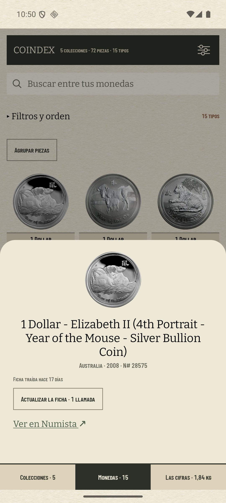 | 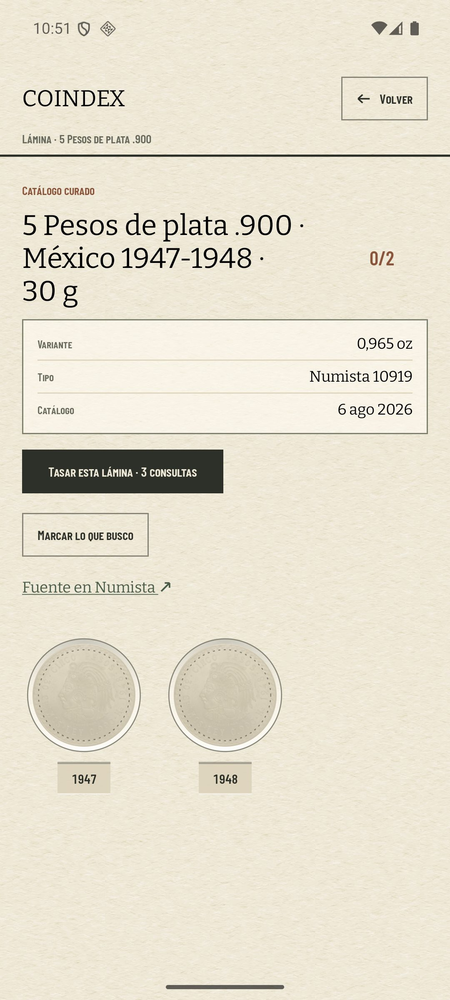 |
| después | 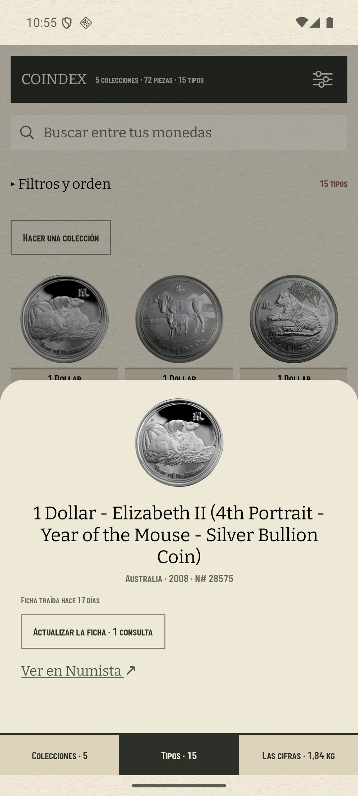 | |

`consultas` gana y `llamadas` desaparece de la interfaz. No lo decide la ficha: lo decidió el ADR 0030
§3 al escribir «Tasar esta lámina · 34 consultas» sobre el mismo presupuesto, y mientras hubo dos
funciones —`callsLabel` en `Labels.kt` y `queriesLabel` en `ShowcaseLabels.kt`— hubo dos palabras que
nadie podía comparar porque nunca se ven juntas. Es también la unidad en la que el modo de marcar
promete el mes entero: «+2 consultas al mes» por casilla (ADR 0029 §5).

Cambian con ella las cuatro superficies que la imprimen y las tres frases que la nombran:

| | antes | después |
| --- | --- | --- |
| informe del sincronizado | `22 piezas · 3 fichas nuevas · 5 llamadas` | `… · 5 consultas` |
| línea bajo «Sincronizar» | `Última sincronización: hoy 15:30 · 22 piezas · 5 llamadas` | `… · 5 consultas` |
| la ficha | `Actualizar la ficha · 1 llamada` | `Actualizar la ficha · 1 consulta` |
| sin cambios, tras gastarla | `Has gastado 1 llamada.` | `Has gastado 1 consulta.` |
| presupuesto agotado (Las cifras) | `Se acabó el presupuesto de llamadas de este mes…` | `… de consultas …` |
| presupuesto agotado (tasar) | `…se acabó el presupuesto de llamadas de este mes.` | `… de consultas …` |
| HTTP 429 | `Numista está limitando las peticiones.` | `… las consultas.` |

El 429 entra porque «peticiones» era una tercera palabra para el objeto que cuenta el presupuesto: que
Numista frene no lo convierte en otra cosa.

### 3. La pestaña central cuenta lo que dice

| | la barra, sobre Colecciones |
| --- | --- |
| antes (1.5.0) | 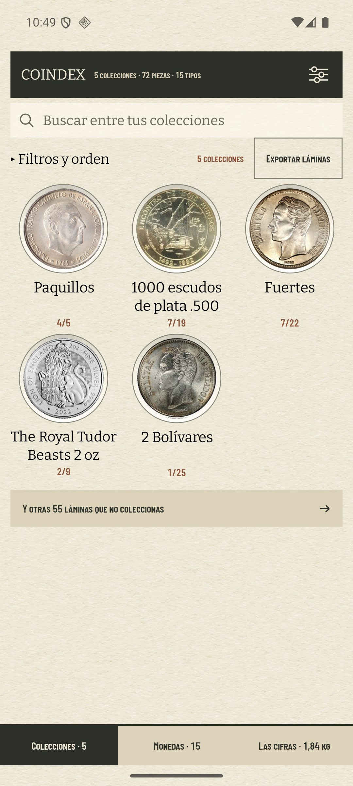 |
| después | 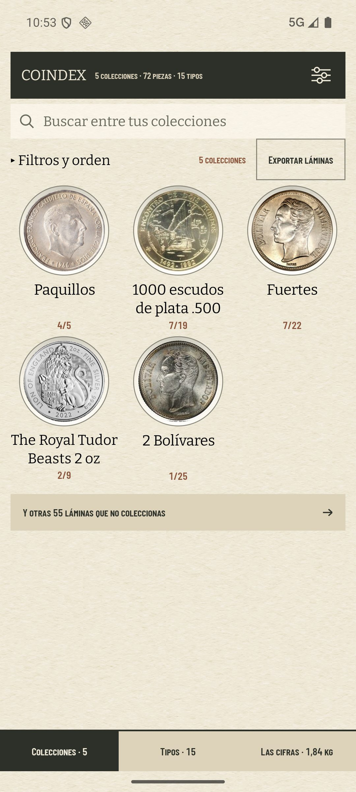 |

El canto cosido de la cabecera y la celda de la barra caben en la misma pantalla —el uno arriba, la otra
al pie— y decían el mismo 15 con dos nombres: `5 colecciones · 72 piezas · 15 tipos` arriba,
`Monedas · 15` abajo. Cambia el rótulo y **no** el número, porque el número es lo que el destino está
hecho de —una
tarjeta por tipo— y es también lo que cuenta el recuento del estante de esa pantalla, `15 tipos`, dos
filas por debajo de la caja de búsqueda.

Contar piezas fue el otro candidato del issue y cuesta más: `Monedas · 72` sobre un canto que lee
`72 piezas` es un número bajo dos palabras, que es exactamente el choque que el #400 deshizo.

| tinta de la celda central | antes | después |
| --- | ---: | ---: |
| ancho del rótulo | 141 px · 54 dp | 106 px · 40 dp |

## Lo que no se toca

**El nombre de la jerarquía en el resto de la app.** «Monedas» sigue nombrando la pantalla en su caja de
búsqueda («Buscar entre tus monedas»), en la frase del modo («Toca cada moneda…»), en el recuento de
cada tarjeta («4 monedas · 3 tipos») y en la prosa del repositorio: lo que el issue pide es que la celda
no llame monedas a un recuento de tipos, no jubilar la palabra. La
pregunta de fondo —si Colecciones y Monedas son dos jerarquías o una leída de dos maneras— es el #496 y
sigue fuera de aquí.

**Las tablas.** `own_groupings`, `own_grouping_members` y `OwnGroupingView` se llaman como se llamaban.
Renombrar una tabla no le enseña nada al coleccionista, y el §2 habla de rótulos.

## Dónde queda escrito

- ADR 0021 §11 — nota de forma: el botón, las tres palabras del gesto y el chip de onzas del índice.
- ADR 0025 — nota de forma: la unidad del gasto, y por qué la elige el ADR 0030 §3 y no esta cláusula.
- ADR 0026 §8 cláusula 3 — nota de forma: `Tipos · 192`, y por qué el número no se mueve.
- `CONTEXT.md` — entrada nueva **Consulta**; «Collector's own box» dice que la interfaz nunca dice
  «box»; «Grain of a cell» dice que la celda **nombra** su grano además de contarlo.
- `PrunedVocabularyTest` — las tres promesas, una por desajuste, en el fichero donde ya viven las del
  #342: cada una es una frase que alguien podría reintroducir.
