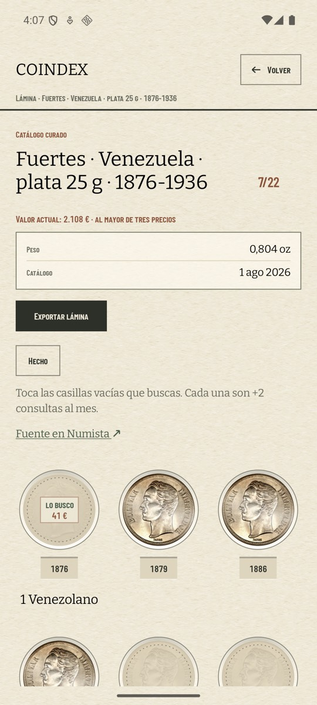
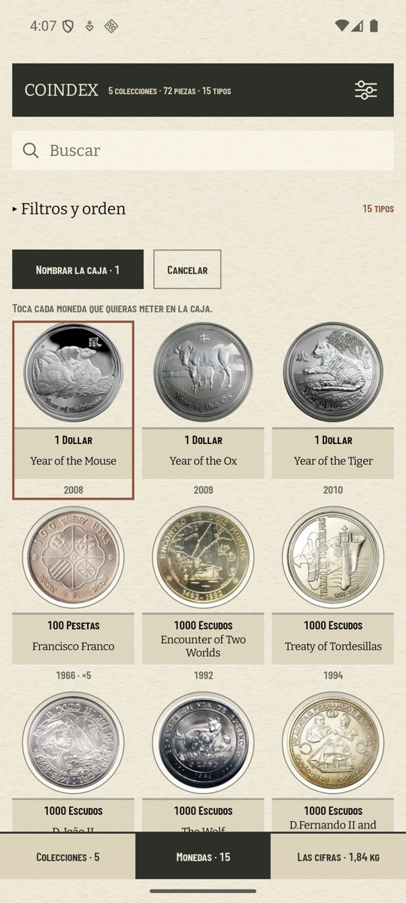
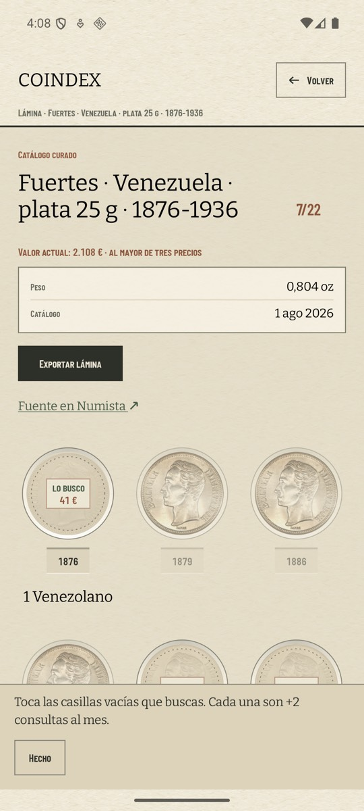
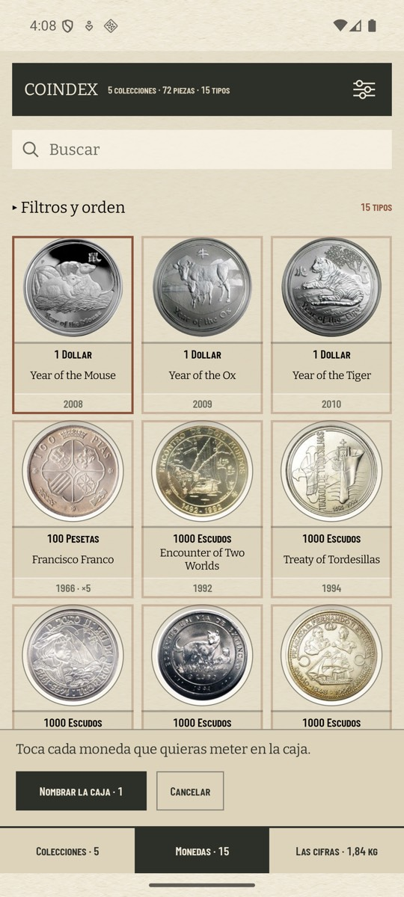

# Un modo abierto se ve en toda la hoja (#517)

«Marcar lo que busco» y «Agrupar piezas» cambian lo que significa tocar una casilla o una tarjeta, y
hasta ahora lo decían con **una línea de letra pequeña en una cabecera que se va con el scroll**. Dos
filas de monedas más abajo no había fotograma de esas pantallas que dijera en cuál de los dos modos
estabas — el mismo fondo del problema de las dianas invisibles (#508) — y la casilla llena seguía
volteando su moneda como si no hubiera nada abierto.

## Lo medido

`coindex-chrome` (pixel 7, 1080 × 2400 a 420 dpi, software), colección restaurada con
`scripts/avd-db.sh restore`, misma navegación en las dos versiones: lámina «Fuertes · Venezuela»
(7/22, con la casilla de 1876 ya marcada) y Monedas con la primera tarjeta elegida.

| | lámina, modo abierto | Monedas, modo abierto |
| --- | --- | --- |
| antes (1.4.6) |  |  |
| después (1.4.7) |  |  |

El papel desnudo del margen derecho de la lámina, medido sobre el PNG a 1080 antes de reescalar:

| | R | G | B |
| --- | ---: | ---: | ---: |
| antes | 238,0 | 232,0 | 215,0 |
| después | 228,2 | 220,8 | 200,0 |

Diez niveles de 255 en el gris y quince en el azul. **Hacia abajo y no hacia arriba**, que es la
lección del #509: el papel de la app está a 238 y no tiene recorrido para aclararse, así que un
efecto que se apoye en subir la luz se ve en el navegador y no se ve en el teléfono.

## Lo que cambia

Tres cosas, y las tres en materiales que el álbum ya tenía:

- **El listón** (`ModeBand`): una tira de cartón más hondo al pie de la hoja, con la regla del mismo
  pelo con que está reglado todo lo demás, la frase del modo y su salida. Es **una fila del layout y
  no una barra flotante**: le quita altura a la rejilla, así que la última fila de casillas nunca
  queda debajo y no hay márgenes ni insets que mantener a raya.
- **El papel** (`sheetUnderMode`): la hoja entera baja un tono mientras el modo está abierto, como
  una lámina sacada del álbum y puesta sobre la mesa de trabajo. Es un rectángulo dibujado **por
  detrás**, así que ninguna fotografía se apaga y ninguna palabra pierde contraste.
- **El paso atrás** (`outsideTheMode`): lo que el modo no alcanza deja de pedir el ojo. La casilla
  llena se dibuja al 45 % y —esto es la otra mitad— **no responde a nada**: ni voltea la moneda ni su
  año abre la ficha. La hoja significa una cosa cada vez, y algo tenue que sigue contestando a un
  toque es peor que cualquiera de las dos mitades por separado.

Y lo marcable lleva **su marca en fantasma**: el chip del hueco dice «lo busco» a un 30 % antes de
que la marca exista, y tocarlo la entinta en el mismo sitio. En Monedas es el mismo recurso con el
marco de la tarjeta: todas llevan el marco que están a punto de recibir, la elegida lo lleva en
firme, y la cabecera —que no responde al modo— no lleva ninguno.

## Lo que se movió de sitio

En las dos pantallas la puerta se queda en la cabecera y **el trabajo del modo baja al pie**. En la
lámina eso es la frase que nombra el gasto («+2 consultas al mes», ADR 0029 §5) y «Hecho»; en Monedas
la frase de la que se parte, «Nombrar la caja · N» y «Cancelar». `SelectionControls` se parte en
`SelectionDoor` y `SelectionBand`, y `naming` sube a `PieceSelection` porque es lo único que las dos
mitades tienen que compartir.

La puerta **no se imprime mientras el modo está abierto**: sería el mismo gesto en dos sitios, y uno
de los dos casi siempre fuera de pantalla.

## Lo que no se ha hecho

El año de una casilla marcable tampoco marca — el blanco es el cuerpo del hueco, sus 104 dp — así que
dentro de una casilla que sí responde queda una etiqueta que no hace nada. Es lo que la frase del
listón dice («toca las casillas vacías»), y repartir el gesto a la etiqueta sería volver a poner dos
blancos en una casilla, que es justo lo que el modo quita.
