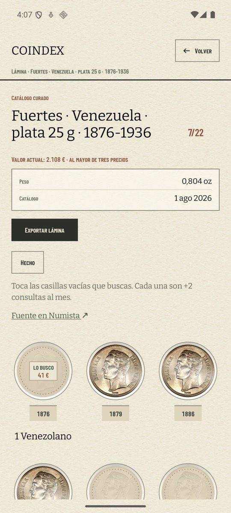
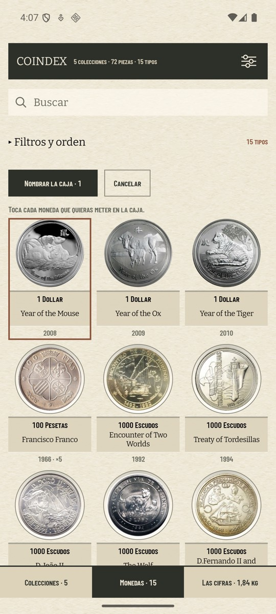
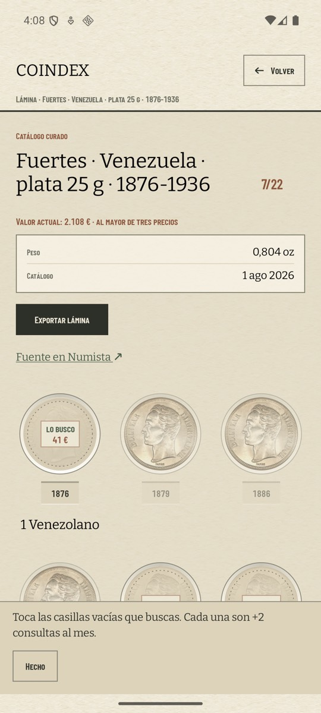
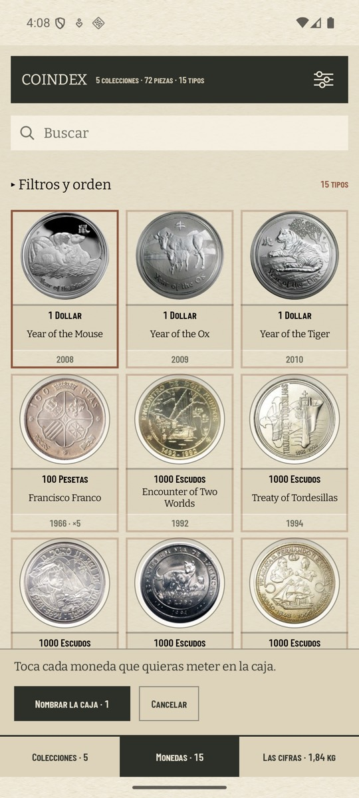

# Un modo abierto se ve en toda la hoja (#517)

«Marcar lo que busco» y «Agrupar piezas» cambian lo que significa tocar una casilla o una tarjeta, y
hasta ahora lo decían con una línea de letra pequeña en una cabecera que se va con el scroll. Dos
filas de monedas más abajo, nada en esas pantallas decía en cuál de los dos modos estabas (el mismo
problema de fondo que las dianas invisibles del #508), y la casilla llena seguía volteando su moneda
como si no hubiera nada abierto.

## Lo medido

`coindex-chrome` (pixel 7, 1080 × 2400 a 420 dpi, software), colección restaurada con
`scripts/avd-db.sh restore`, misma navegación en las dos versiones: lámina «Fuertes · Venezuela»
(7/22, con la casilla de 1876 ya marcada) y Monedas con la primera tarjeta elegida.

| | lámina, modo abierto | Monedas, modo abierto |
| --- | --- | --- |
| antes (1.4.6) |  |  |
| después (1.4.7) |  |  |

El papel desnudo del margen derecho de la lámina, medido sobre el PNG a 1080 antes de reescalar:

| | R | G | B |
| --- | ---: | ---: | ---: |
| antes | 238,0 | 232,0 | 215,0 |
| después | 228,2 | 220,8 | 200,0 |

Diez niveles de 255 en el gris y quince en el azul, hacia abajo y no hacia arriba (la lección del
#509): el papel de la app está a 238 y no tiene recorrido para aclararse, así que un efecto que suba
la luz se ve en el navegador y no en el teléfono.

## Lo que cambia

Tres cosas, todas con materiales que el álbum ya tenía:

- **El listón** (`ModeBand`): una tira de cartón más hondo al pie de la hoja, con la regla del mismo
  pelo que el resto, la frase del modo y su salida. Es una fila del layout y no una barra flotante:
  le quita altura a la rejilla, así que la última fila de casillas nunca queda debajo y no hay
  márgenes ni insets que mantener.
- **El papel** (`sheetUnderMode`): la hoja entera baja un tono mientras el modo está abierto, como
  una lámina sacada del álbum y puesta sobre la mesa de trabajo. Es un rectángulo dibujado por
  detrás, así que ninguna fotografía se apaga y ninguna palabra pierde contraste.
- **El paso atrás** (`outsideTheMode`): lo que el modo no alcanza deja de llamar la atención. La
  casilla llena se dibuja al 45 % y no responde a nada: ni voltea la moneda ni su año abre la ficha.
  Algo tenue que sigue respondiendo a un toque sería peor que cualquiera de las dos cosas por
  separado.

Lo marcable lleva su marca en fantasma: el chip del hueco dice «lo busco» al 30 % antes de que la
marca exista, y tocarlo la entinta en el mismo sitio. En Monedas es el mismo recurso con el marco de
la tarjeta: todas llevan en fantasma el marco que recibirían, la elegida lo lleva en firme, y la
cabecera, que no responde al modo, no lleva ninguno.

## Lo que se movió de sitio

En las dos pantallas la puerta se queda en la cabecera y el trabajo del modo baja al pie: en la
lámina, la frase que nombra el gasto («+2 consultas al mes», ADR 0029 §5) y «Hecho»; en Monedas, la
frase, «Nombrar la caja · N» y «Cancelar». `SelectionControls` se parte en `SelectionDoor` y
`SelectionBand`, y `naming` sube a `PieceSelection` porque es lo único que las dos mitades
comparten.

La puerta no se imprime mientras el modo está abierto: sería el mismo gesto en dos sitios, y uno de
los dos casi siempre fuera de pantalla.

## Lo que no se ha hecho

El año de una casilla marcable tampoco marca (el blanco es el cuerpo del hueco, sus 104 dp), así que
dentro de una casilla que sí responde queda una etiqueta que no hace nada. Es lo que dice la frase
del listón («toca las casillas vacías»), y dar el gesto también a la etiqueta volvería a poner dos
blancos en una casilla, que es lo que el modo quita.
