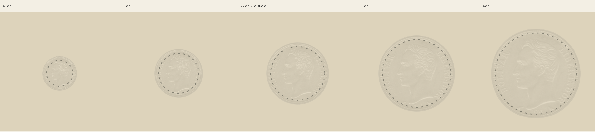
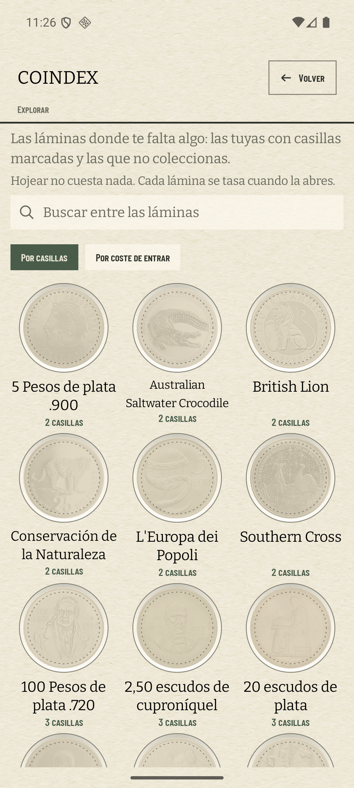
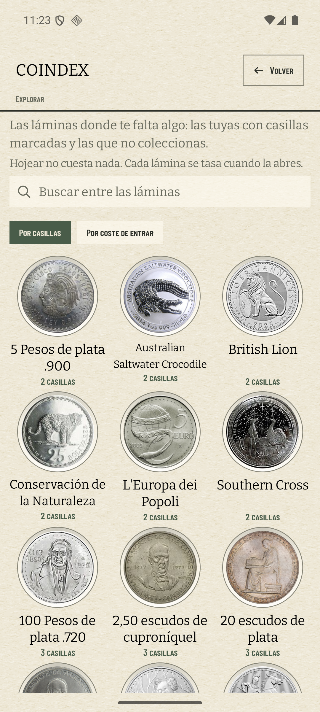

# El idioma del fantasma, y dónde se habla (#556)

Medido en el AVD `coindex-chrome` (1080 × 2400, 420 dpi) sobre la rama del [#556], con la v1.6.1 de
listón. Lo que se decide aquí es **el suelo de diámetro de la penumbra** y **qué dice el estante de
Explorar**; el resto del censo salió más pequeño de lo que el ticket suponía.

## El censo, leído en el código y no en la lista

El ticket enumera seis superficies con `missing = true`. Dos no dibujan el fantasma:

| superficie | qué dibuja hoy | diámetro |
| --- | --- | ---: |
| la lámina · `PlateScreen.kt` | penumbra al 14 % | 104 dp |
| la hoja de la moneda · `CoinSheet.kt` | penumbra al 14 % | 104 dp |
| el escaparate · `ExploreScreen.kt` | penumbra al 14 % → **cambia** | 104 dp |
| el eje de países · `NotebookAxisViews.kt:240` | penumbra al 14 % → **cambia por el suelo** | 34 dp |
| el eje de años · `NotebookAxisViews.kt:363` | **nada**: pasa `photo = null`, así que no hay diseño que hundir | ~30 dp |
| el papel impreso · `NotebookSheet.kt:721` | **desatura** (`GRAYSCALE_ON_PAPER`), no baja la luz | tinta |

Las dos últimas no son decisiones de idioma pendientes: una es una rama sin efecto y la otra es un
idioma distinto con el mismo nombre. Y «Lo que busco» ya había salido de la penumbra con el #520, que
además estrenó una séptima superficie —la fila del índice— a plena luz.

## El suelo, en el banco

El banco de ADR 0026 §15 tenía opacidad y no tenía diámetro, que es justo el parámetro que este ticket
necesita. Se le añade («FANTASMA · Diámetro», 24–104 dp) y su ranura dibuja el 1 Bolívar de 1960 al
tamaño que se le pida.

- **40 dp** — un borrón con un filete. Hay algo, no se sabe qué. Es la medida del #520, y la razón por
  la que aquella fila se dibujó a plena luz.
- **56 dp** — asoma un perfil. Se adivina que es una cabeza; no cuál.
- **72 dp** — el busto se lee: pelo, nariz, mentón, y el anillo de leyenda como anillo. Frase completa.
- **88** y **104 dp** — cómodo.

`GHOST_MIN_DP = 72f`. Las dos clases de tamaño del álbum (34 y 104 dp) caen a los dos lados con margen,
y el suelo se elige donde el dibujo **se lee**, no donde deja de leerse del todo.

## El estante: lo que se gana y lo que no se pierde

Con la colección vacía —las 59 láminas de la ventana, ninguna del coleccionista— el mismo pliegue:

| antes · v1.6.1 | después |
| --- | --- |
|  |  |

El filete de puntos es la marca que las dos ausencias comparten, y la duda razonable era si sobre una
fotografía a plena luz sigue diciendo algo. **Sigue.** Medido sobre el British Lion, que tiene el canto
liso y no confunde su denticulado con el filete: la componente periódica del punteado, 52 ciclos por
vuelta a r = 109 px, mide

| | amplitud | fondo local | contraste |
| --- | ---: | ---: | ---: |
| antes, sobre el fantasma | 27,4 niveles | 191,8 | 14,3 % |
| después, sobre la moneda entera | 26,0 niveles | 184,9 | 14,0 % |

O sea: el filete se dibuja igual y contrasta igual. Lo que cambia es que ahora compite con una moneda
que tiene contenido, y a ojo desnudo se nota menos aunque esté. Sobre monedas con denticulado —los 5
Pesos de plata .900, por ejemplo— la medida a 52 ciclos no distingue el filete del canto de la moneda,
y ésa es la que queda como pregunta abierta del ticket: **cuál es el idioma de «no es tuya» a plena
luz**, si el filete no basta. Las candidatas que el ticket lista siguen en pie y ninguna se ha probado
aquí.

## Lo que no se ha medido

- **El eje de países a 34 dp con fotografías reales**: hace falta una colección sembrada, y la del
  padre no está en este árbol. Lo que defiende el cambio ahí es `GhostFloorTest`, que mide el píxel: a
  104 dp la casilla queda en penumbra y a 34 dp la moneda se pinta entera.
- **El 34 dp en el banco**: la tira va de 40 arriba. A 34 el diseño está por debajo del 40 que ya
  falla, así que la tira no añadiría nada que la primera columna no diga.
