# La medida base: qué enseña Coindex hoy en un móvil

El **antes** del mapa
[#278 · Forma y densidad](https://github.com/jenarvaezg/coindex/issues/278), medido el 7 de agosto
de 2026 sobre la v0.16.0 y la colección real del padre. No propone recortes ni efectos: deja el
listón puesto para que el después se pueda comparar con algo.

## Cómo se midió

- **AVD `coindex-ux`** (pixel_7, android-36, 1080 × 2400 px, 420 dpi), sin ventana, con las tres
  escalas de animación a cero.
- **APK de depuración de la v0.16.0** compilado desde `main` (`08d387f`).
- **La colección del padre, sincronizada en el móvil**, no la captura de `.local`: alta con su API
  key y su identificador, y un «Sincronizar» que trajo **231 piezas en 6 llamadas**. Se mide en el
  móvil, no en el asset.
- Las palabras se cuentan del **volcado de accesibilidad** (`uiautomator dump`) de cada pantalla,
  no del `.kt`: es lo que hay delante de los ojos, con sus interpolaciones ya resueltas. La barra
  de estado del sistema (hora, wifi, batería) no cuenta.
- El identificador de usuario está tapado en las capturas de Ajustes; este repositorio es público.

Una advertencia sobre el vocabulario de este informe: **«mobiliario»** son las palabras que dice la
app de sí misma —rótulos, prosa, botones, recuentos, cabeceras—, y **«contenido»** las que dicen
algo de la colección: un país, un nombre, un peso, un año, un progreso. La poda del
[#305](https://github.com/jenarvaezg/coindex/issues/305) se juega en la primera columna.

## El número

**Caben dos tarjetas en la pantalla del índice.** Dos, de setenta.

La primera tarjeta empieza en el píxel 1420 de 2400. Entre el borde superior y ella hay 1120 px de
cabecera —masthead, eyebrow, título, subtítulo, dos botones, dos líneas de sincronización, el
buscador y la línea de filtros—, y por debajo, la barra de destinos ocupa desde el 2214. Quedan
794 px de columna para tarjetas de 290 px con 78 de aire: **2,16 tarjetas**.

En cuanto la cabecera se va con el scroll, la misma pantalla enseña **5,2**. La cabecera del índice
cuesta, ella sola, **tres tarjetas**.

| | tarjetas visibles | palabras | de ellas, mobiliario |
| --- | ---: | ---: | ---: |
| Índice al entrar | **2,16** | 81 | **56 (69 %)** |
| Índice con la cabecera fuera | **5,2** | 101 | 12 (12 %) |

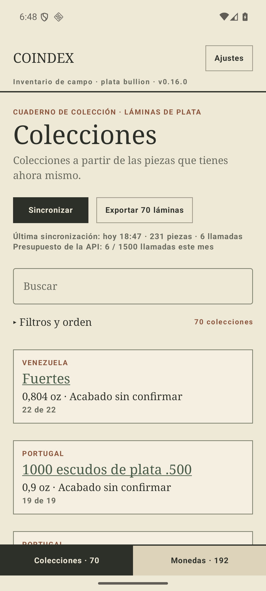
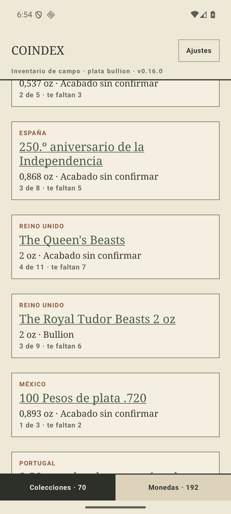

## Las cinco pantallas, una a una

Palabras del primer pliegue —lo que se ve sin tocar nada— y su reparto.

| pantalla | palabras | nodos | mobiliario | contenido |
| --- | ---: | ---: | ---: | ---: |
| **Colecciones** | 81 | 24 | 56 (69 %) | 25 · 2 tarjetas |
| **Monedas** | 68 | 24 | 31 (46 %) | 37 · 2 tarjetas |
| **Lámina** (Fuertes, 22/22) | 71 | 33 | 53 antes de la rejilla (75 %) | 18 · 2 casillas |
| **Piezas** (French regions) | 79 | 28 | 11 (14 %) | 68 · 2,5 piezas |
| **Ajustes** | 107 | 17 | 107 (100 %) | 0 |

Y la sexta, que el mapa da por inexistente: **el alta existe**, es la primera pantalla de un
teléfono nuevo, y son **73 palabras** en 9 nodos, 52 de ellas en dos párrafos.

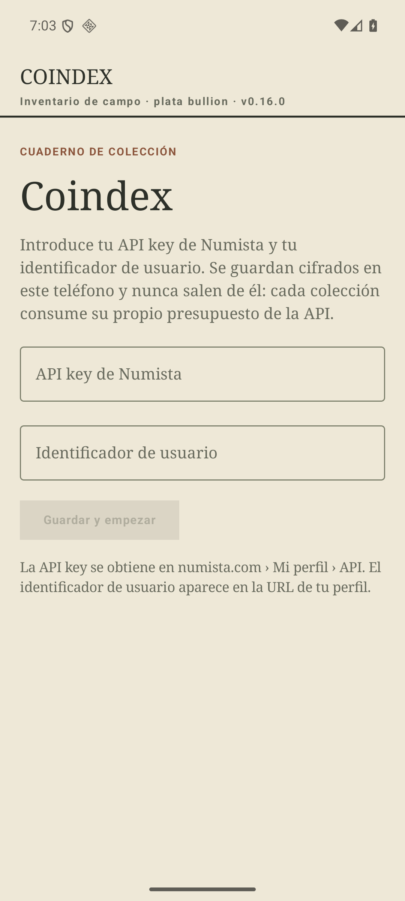

### Colecciones

56 de las 81 palabras son mobiliario. El desglose exacto, porque la poda va a discutir línea a
línea:

| línea | palabras | ¿siempre? |
| --- | ---: | --- |
| `COINDEX` + `Ajustes` + `Inventario de campo · plata bullion · v0.16.0` | 8 | sí |
| `CUADERNO DE COLECCIÓN · LÁMINAS DE PLATA` | 6 | sí |
| `Colecciones` | 1 | sí |
| `Colecciones a partir de las piezas que tienes ahora mismo.` | 10 | sí |
| `Sincronizar` + `Exportar 70 láminas` | 4 | sí |
| `Última sincronización: hoy 18:47 · 231 piezas · 6 llamadas` | 8 | sí |
| `Presupuesto de la API: 6 / 1500 llamadas este mes` | 9 | sí |
| `Buscar` | 1 | sí |
| `▸ Filtros y orden` + `70 colecciones` | 5 | sí |
| `Colecciones · 70` + `Monedas · 192` | 4 | sí |

Las dos tarjetas que sobreviven aportan 25 palabras entre las dos.

**Tres números distintos para «cuánto tengo», los tres a la vista a la vez**: `231 piezas` en la
línea de sincronización (filas de Numista), `70 colecciones` sobre el índice, y `Monedas · 192`
(tipos) en la barra. En la pantalla de al lado hay un cuarto: `574 monedas`. Ninguno miente;
ninguno se explica.

### Monedas

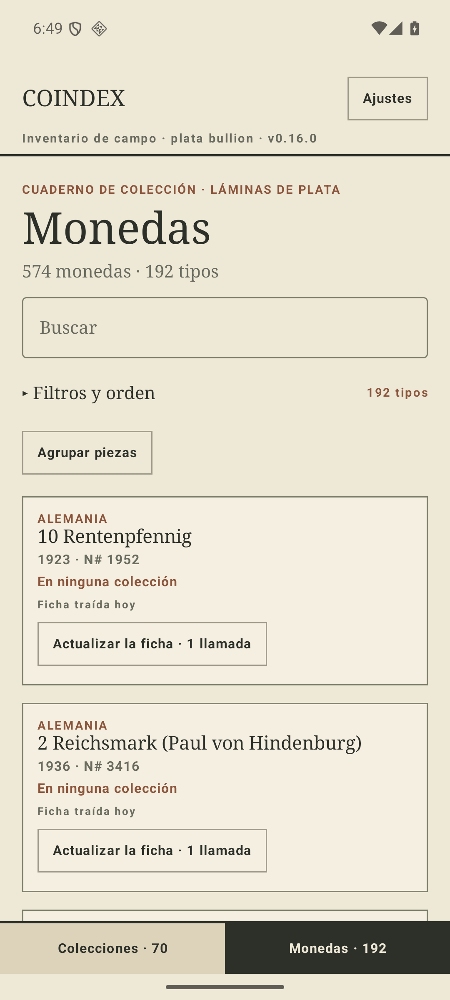

También dos tarjetas. Pero aquí la tarjeta **no tiene cuatro líneas, tiene seis**, y las dos
últimas no hablan de la moneda:

```
ALEMANIA
10 Rentenpfennig
1923 · N# 1952
En ninguna colección
Ficha traída hoy                       ← mantenimiento
Actualizar la ficha · 1 llamada        ← mantenimiento
```

**16 de las 37 palabras de contenido (43 %) son el mecanismo de actualización de la ficha**,
repetido íntegro en cada moneda de las 192.

### Lámina

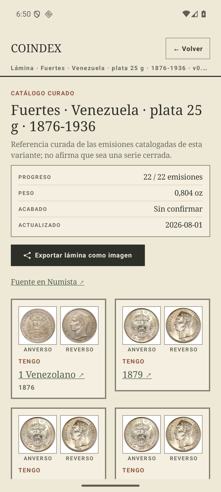

La única pantalla que se diseñó, y aun así se entra por 53 palabras antes de ver la primera
moneda. La primera casilla arranca en el píxel 1650: **el 64 % de la pantalla de llegada es
cabecera** —eyebrow, título, la coletilla de 16 palabras, la ficha de cuatro filas, el botón de
exportar y el enlace a la fuente—, y de la rejilla asoman dos casillas.

Con la cabecera fuera caben **8 casillas** (4 filas × 2), y ahí aparece la repetición:

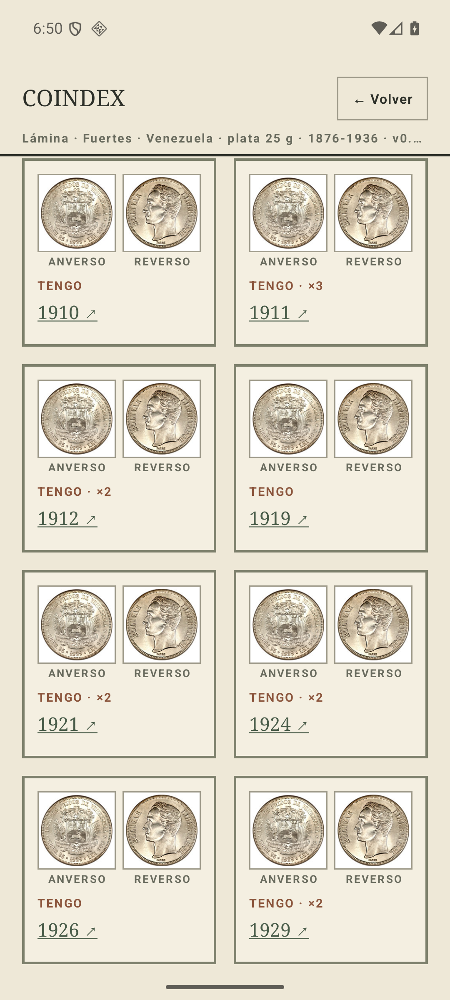

De las **47 palabras** de una pantalla llena de rejilla, **24 son `ANVERSO`, `REVERSO` y
`TENGO`** —tres palabras que no distinguen ninguna casilla de ninguna otra, repetidas ocho veces—
y sólo 8 son años. En la lámina entera de los Fuertes son **66 palabras de rótulo para 22 años**.

### Piezas

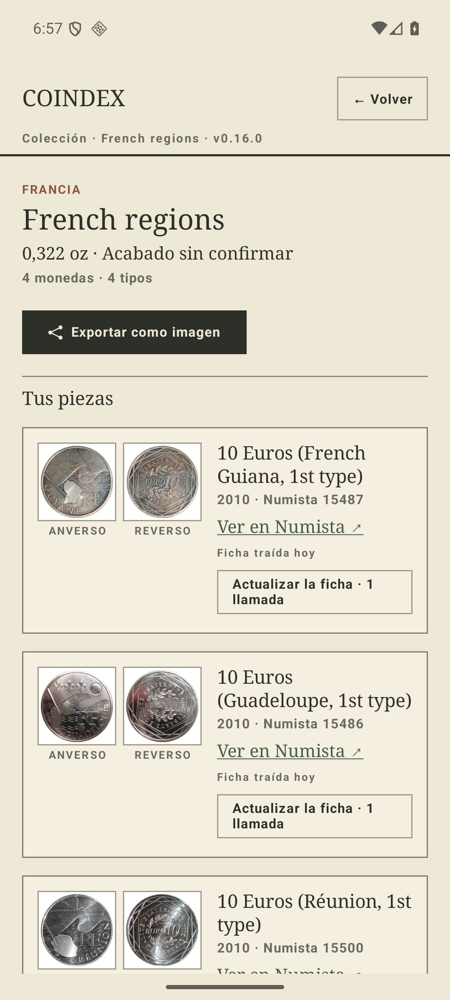

Dos piezas y media. El mismo peaje que en Monedas: `Ver en Numista`, `Ficha traída hoy` y
`Actualizar la ficha · 1 llamada` en **cada fila**, más el par `ANVERSO`/`REVERSO` bajo cada
miniatura. 25 de las 56 palabras de las filas (45 %) son mantenimiento y rótulos de miniatura.

### Ajustes

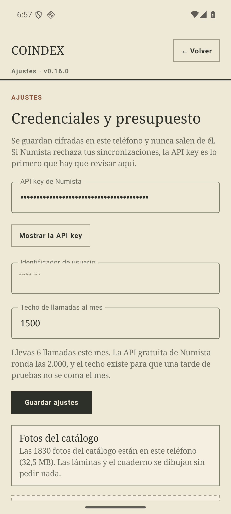
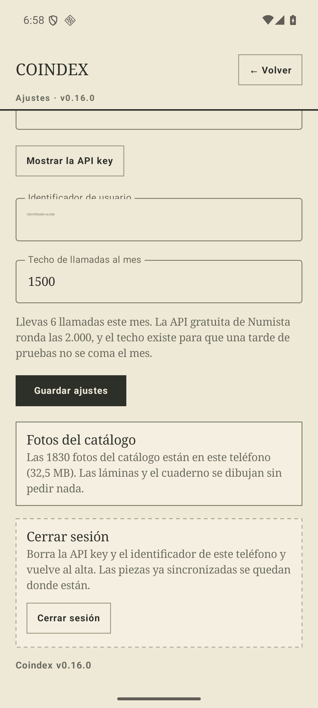

La pantalla más densa en prosa de la app y la única que **no contiene un solo dato de la
colección**. 107 palabras en el primer pliegue, **133 en toda la pantalla**, de las cuales **98 son
cuatro párrafos explicativos**. Cabe entera en pantalla y media.

## Palabras y líneas por tarjeta

Medido sobre las 68 tarjetas del índice del padre (`FieldReportTest` con su captura):

| | |
| --- | ---: |
| Líneas por tarjeta | **4**, en las 68 sin excepción |
| Palabras por tarjeta | media **14,6** · mediana 14 · mínimo 10 · máximo 21 |
| Palabras en el índice entero | **994** |

Las cuatro líneas son las que manda `spec.md §0.4`: eyebrow de país, `short_name`, línea de
variante (`peso · acabado`) y línea de capacidad. La tercera es la que más engorda sin decir nada
nuevo: `Acabado sin confirmar` aparece en **49 de las 68** tarjetas, siempre con las mismas tres
palabras.

## Dónde cae hoy la prosa larga

Todo párrafo de 12 palabras o más que la capa de interfaz puede poner en pantalla, con su fichero.
La columna **siempre** distingue la prosa que ocupa sitio en cada visita de la que sólo aparece
cuando algo pasa —un error, un tope, una lista vacía—: la poda del
[#305](https://github.com/jenarvaezg/coindex/issues/305) no cuesta lo mismo en una que en otra.

| palabras | fichero | pantalla | ¿siempre? | párrafo |
| ---: | --- | --- | --- | --- |
| 32 | `ui/CoindexApp.kt` | cualquiera | no | «Esta colección ya no existe: o has dejado de tener piezas…» |
| 31 | `ui/screens/OnboardingScreen.kt` | alta | **sí** | «Introduce tu API key de Numista y tu identificador de usuario…» |
| 27 | `ui/screens/SettingsScreen.kt` | Ajustes | **sí** | «Se guardan cifradas en este teléfono y nunca salen de él…» |
| 27 | `ui/screens/SettingsScreen.kt` | Ajustes | **sí** | «Llevas N llamadas este mes. La API gratuita de Numista ronda las 2.000…» |
| 23 | `ui/CoindexApp.kt` | cualquiera | no | «Los datos curados que viajan con la app no son válidos…» |
| 22 | `ui/screens/SettingsScreen.kt` | Ajustes | **sí** | «Borra la API key y el identificador de este teléfono y vuelve al alta…» |
| 21 | `ui/screens/OnboardingScreen.kt` | alta | **sí** | «La API key se obtiene en numista.com › Mi perfil › API…» |
| 20 | `ui/PhotoCacheLabels.kt` | Ajustes | **sí** | «Las N fotos del catálogo están en este teléfono (X MB)…» |
| 19 | `ui/SyncMessages.kt` | Colecciones | no | «Presupuesto de la API agotado este mes (N/M)…» |
| 18 | `ui/screens/IndexScreen.kt` | Colecciones | no | «La última sincronización no terminó, así que puede faltar alguna pieza…» |
| 18 | `ui/InstallMessages.kt` | Colecciones | no | «Este dispositivo no permite conceder el permiso de instalación…» |
| 16 | `ui/screens/PlateScreen.kt` | **Lámina** | **sí** | «Referencia curada de las emisiones catalogadas de esta variante; no afirma que sea una serie cerrada.» |
| 16 | `ui/screens/PiecesScreen.kt` | Piezas | no | «Ya no tienes piezas de esta variante, así que esta colección no existe…» |
| 16 | `ui/screens/PiecesScreen.kt` | Piezas | no | «Ahora mismo no tienes ninguna de las piezas de esta colección…» |
| 16 | `ui/screens/IndexScreen.kt` | Colecciones | no | «Numista no guarda fecha de compra, así que este orden es el del alta…» |
| 16 | `ui/NotebookLabels.kt` | Colecciones | no | «Exportación cancelada al descargar las fotos (N de M)…» |
| 15 | `ui/SettingsEntry.kt` | Ajustes | no | «El identificador de usuario es el número de la URL de tu perfil…» |
| 15 | `ui/FichaLabels.kt` | Lámina / Piezas | no | «Numista ya no publica el tipo N. La ficha que tenías sigue en el móvil.» |
| 14 | `ui/SettingsEntry.kt` | Ajustes | no | «El techo de presupuesto tiene que ser un número de llamadas mayor que cero.» |
| 14 | `ui/PhotoCacheLabels.kt` | Ajustes | no | «Todavía no hay fichas en este teléfono, así que no hay fotos que traer.» |
| 14 | `ui/BoxNaming.kt` | Piezas | no | «Son N caracteres y el límite son M: tiene que caber en una tarjeta.» |
| 13 | `ui/screens/ExportOptions.kt` | Colecciones | no | «Es lo que hay en el índice ahora mismo, con los filtros puestos.» |
| 13 | `ui/NotebookLabels.kt` | Colecciones | no | «Exportación cancelada en la página N de M. No se ha compartido nada.» |
| 13 | `ui/Labels.kt` | Colecciones | no | «Ya no tienes piezas de esta variante, así que esa colección no existe.» |
| 13 | `ui/InstallMessages.kt` | Colecciones | no | «No hay instalador de paquetes en este dispositivo…» |
| 12 | `ui/components/PieceSelection.kt` | Piezas | no | «Vienen elegidas las N que enseñaba el filtro. Quita las que no.» |
| 12 | `ui/SyncMessages.kt` | Colecciones | no | «Numista respondió algo que Coindex no entiende…» |
| 12 | `ui/SyncMessages.kt` | Colecciones | no | «Numista está limitando las peticiones…» |
| 12 | `ui/InstallMessages.kt` | Colecciones | no | «Concede a Coindex permiso para instalar aplicaciones…» |
| 12 | `ui/CoindexApp.kt` | cualquiera | no | «Ese enlace no describe ninguna variante de tu colección…» |
| 12 | `ui/BoxNaming.kt` | Piezas | no | «Ponle un nombre a la colección y elige al menos una moneda.» |

**El sospechoso conocido está confirmado y localizado**: el párrafo del techo de presupuesto son 27
palabras y vive en `ui/screens/SettingsScreen.kt`, no en un fichero de copy. Y no está solo — **el
tres cuartas partes de la prosa siempre visible están en dos pantallas que no son el
cuaderno**: Ajustes (98 palabras) y el alta (52), frente a las 47 de las tres pantallas del
cuaderno juntas.

Los demás que el informe encontró, por orden de daño:

1. **La coletilla de la lámina** (16 palabras, `PlateScreen.kt`): es la **única prosa larga
   siempre visible dentro del cuaderno**, y está en la pantalla que el padre exporta.
2. **El subtítulo del índice + las dos líneas de sincronización** (27 palabras): no son un párrafo,
   pero suman más que cualquiera de los de arriba y se llevan 480 px de la cabecera que cuesta tres
   tarjetas.
3. **Los rótulos repetidos de la rejilla** (`ANVERSO`/`REVERSO`/`TENGO`): no es prosa, es la
   repetición más cara de la app — 66 palabras en una lámina de 22 casillas.
4. **El mantenimiento de la ficha** en cada tarjeta de Monedas y en cada fila de Piezas: 8 palabras
   por unidad, 43-45 % de sus palabras de contenido.

Contexto de tamaño: la capa `ui/` tiene **1636 palabras de copy en 452 literales repartidos en 46
ficheros**, de los cuales trece son sólo copy (949 líneas). Lo de arriba es el 20 % de esas
palabras.

## La lámina incompleta y la completa

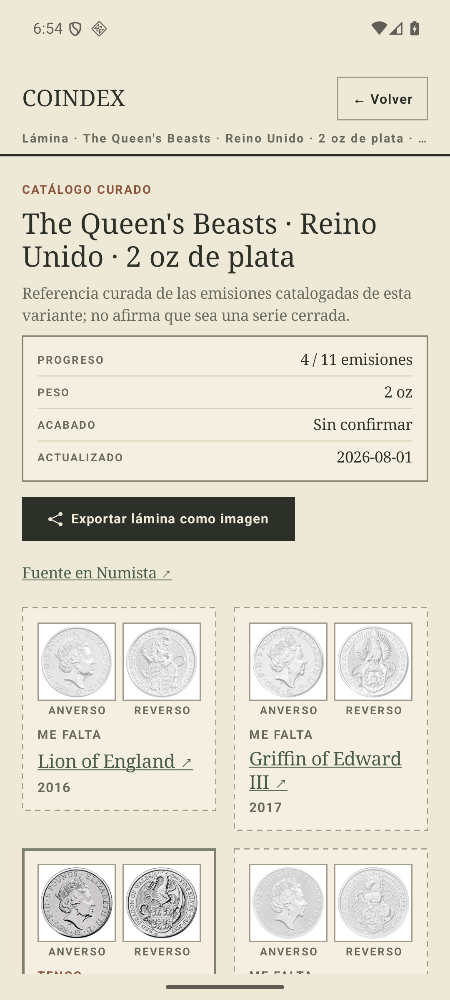
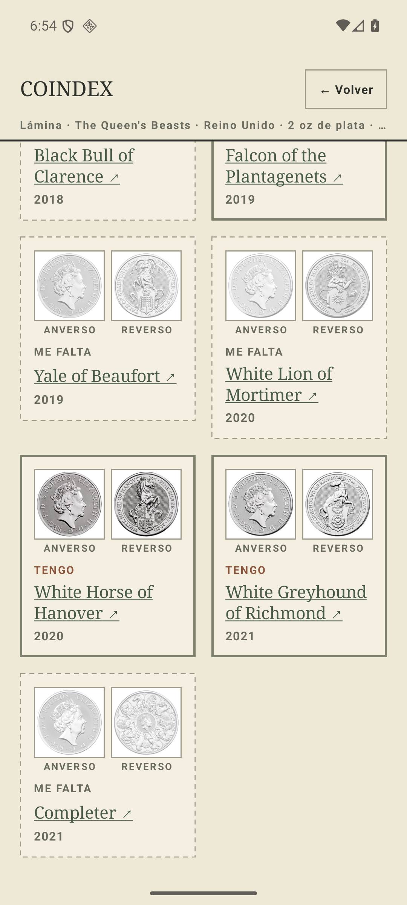

Las casillas que faltan llevan tres marcas: borde discontinuo, rótulo `ME FALTA`, y el diseño en
escala de grises al 45 % de opacidad que manda `spec.md §0.4`. **Sobre una colección de plata, la
tercera casi no hace nada.** Medido sobre el centro del anverso de cuatro casillas de The Queen's
Beasts:

| casilla | saturación | luminancia |
| --- | ---: | ---: |
| `ME FALTA` · Yale of Beaufort | 0,0 % | 219 |
| `TENGO` · White Horse of Hanover | 2,9 % | 173 |
| `ME FALTA` · White Lion of Mortimer | 0,0 % | 229 |
| `TENGO` · White Greyhound of Richmond | 0,5 % | 195 |

La moneda que sí tienes ya era gris: **de 0,5 a 2,9 puntos de saturación es todo lo que el
grayscale tiene que quitar**. Lo que separa una casilla de otra no es el color, es que la que falta
está **34-47 puntos de luminancia más lavada** por la opacidad, más el borde discontinuo y el
rótulo. En una lámina de bronce o de cobre el reparto sería otro; en las láminas de este cuaderno,
que son de plata, la marca de «me falta» es el borde.

Y la completa:


**En 22/22 no ocurre absolutamente nada.** La ficha dice `22 / 22 emisiones` con la misma
tipografía, el mismo color y el mismo peso con que la otra dice `4 / 11`; la tarjeta del índice
dice `22 de 22` en vez de `4 de 11 · te faltan 7` —una palabra menos—, y ahí acaba la diferencia.
Ni marca, ni sello, ni cambio de borde, ni una línea que lo diga. Seis de las setenta tarjetas del
padre están en ese estado y la app no lo celebra en ningún píxel.

## Lo que ha cambiado desde el #17

El mapa parte de «58 tarjetas, 4 láminas completas», que es la medida del 3 de agosto. Cuatro días
después:

| | 3 ago 2026 (#17) | 7 ago 2026 (este informe) |
| --- | ---: | ---: |
| Tarjetas del índice | 58 | **70** |
| Láminas completas | 4 | **6** |
| Piezas sincronizadas | — | 231 filas · 574 monedas · 192 tipos |
| Páginas del cuaderno impreso | — | 90 A4 |

Los prototipos y la poda deben dimensionarse contra **70**, no contra 58. (La corrida offline sobre
la captura de `.local/padre`, que es del 2 de agosto, da 68 tarjetas y 6 láminas completas: la
diferencia con el móvil son dos piezas que el padre dio de alta entre una fecha y otra. El número
del móvil es el que manda.)

## Lo que este informe no dice

- **No propone recortes.** Qué se va, qué se muda y qué se convierte en forma es el
  [#305](https://github.com/jenarvaezg/coindex/issues/305).
- **No mide el apaisado ni las tabletas.** Todo es vertical a 1080 × 2400 y 420 dpi. El índice en
  apaisado ya es una rejilla de dos columnas desde el #26.
- **No mide el modo oscuro**, que hoy no existe como decisión ([#301](https://github.com/jenarvaezg/coindex/issues/301)).
- **No mide el PNG exportado ni el PDF.** El cuaderno impreso del padre son 90 páginas A4 y sale de
  `FieldReportTest`, no de una captura.
- **No mide tiempos.** Ninguna de las cifras de aquí es de rendimiento.

## Cómo se reproduce

```bash
export JAVA_HOME="/Applications/Android Studio.app/Contents/jbr/Contents/Home"
export ANDROID_HOME=/opt/homebrew/share/android-commandlinetools
export PATH="$ANDROID_HOME/platform-tools:$ANDROID_HOME/emulator:$PATH"

nohup caffeinate -dims emulator -avd coindex-ux -no-window -no-audio \
  -no-boot-anim -no-snapshot -gpu swiftshader_indirect &
adb shell settings put global window_animation_scale 0     # y transition_ y animator_
./gradlew :app:assembleDebug
adb install -r app/build/outputs/apk/debug/app-debug.apk
scripts/avd-db.sh restore                # la colección entera, sin una sola llamada

# el alta guarda la clave y el id, y no toca la red: NO pulsar «Sincronizar»
adb exec-out screencap -p > pantalla.png
adb exec-out uiautomator dump /dev/tty > pantalla.xml    # de aquí salen las palabras

# la composición del índice, sin gastar API:
COINDEX_FIELD_SNAPSHOT=$PWD/.local/padre \
  ./gradlew :app:testDebugUnitTest --tests '*FieldReportTest*' --rerun
```

### Una sesión de medición cuesta cero llamadas

Hasta el #452 costaba **446**, y salían de la clave del padre: esta receta decía
`NUMISTA_API_KEY_PADRE`, el AVD abría la app con la base vacía, se sincronizaba, y a los tres
segundos la tasación pedía sus 223 emisiones, 102 listados y 121 huecos. Cuatro sesiones de UX y su
mes estaba gastado — en agosto de 2026 llegó a 1.999 de 2.000 y su móvil se quedó sin presupuesto
para bajar las fichas que le faltaban (#448). Cambiar de clave no arregla eso: sólo cambia a quién
se le apaga la app.

Lo que lo arregla es no volver a pedir nada. `coindex.db` lleva la colección, las fichas, los
precios y —desde el #452— los listados de emisiones, así que restaurada tiene ya todo lo que una
pasada le pediría a Numista:

```bash
scripts/avd-db.sh save        # una vez, con el AVD poblado
scripts/avd-db.sh restore     # en cada sesión, después de instalar
```

El volcado es privado y vive en `/private/tmp/coindex-privado/avd/`, porque es la colección. El
alta sigue haciendo falta —la clave se cifra contra la Keystore del dispositivo y no viaja en la
base de datos— pero es gratis: el formulario valida el formato y guarda, sin tocar la red. Lo que
cuesta es «Sincronizar», y con la base restaurada no hay nada que sincronizar.

Dos cosas que vigilar. Los precios caducan a los treinta días y los listados a los noventa: pasado
ese plazo la pasada vuelve a pedirlos, así que un volcado viejo hay que refrescarlo a propósito y
con una clave elegida a conciencia, no de rebote en una sesión de capturas. Y si el AVD se resiembra
desde cero, el volcado es lo primero que se restaura, antes de que a nadie se le ocurra sincronizar.

Dos trampas del emulador que cuestan media hora cada una: el teclado virtual **se traga los
gestos** —un `input swipe` sobre él escribe palabras por deslizamiento en el buscador— y un
`input tap` sobre la franja de sugerencias inserta texto en vez de pulsar la tarjeta que hay
debajo. Cerrar el teclado con `input keyevent 4` antes de tocar o deslizar; y ese mismo `4`, con el
teclado ya cerrado, sale de la app.
