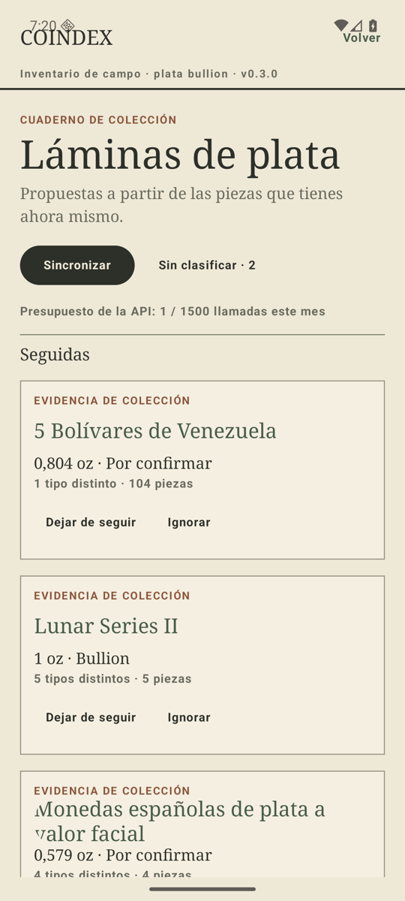
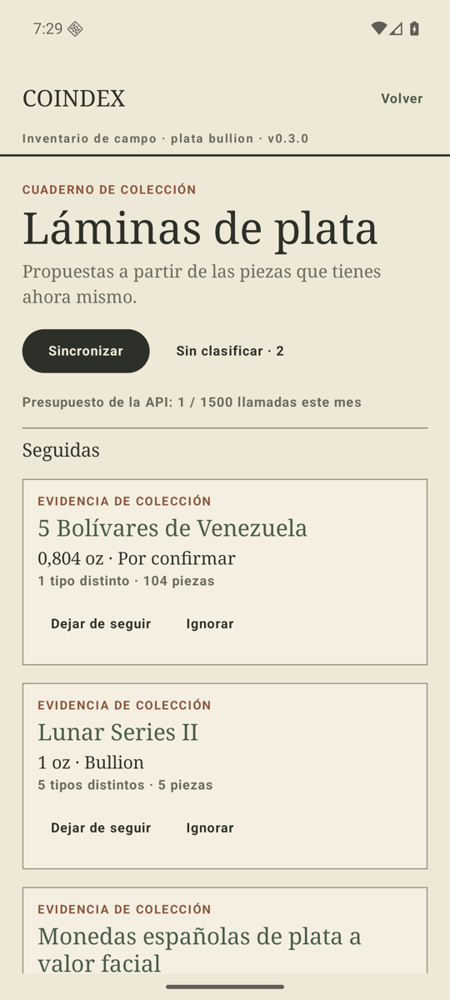
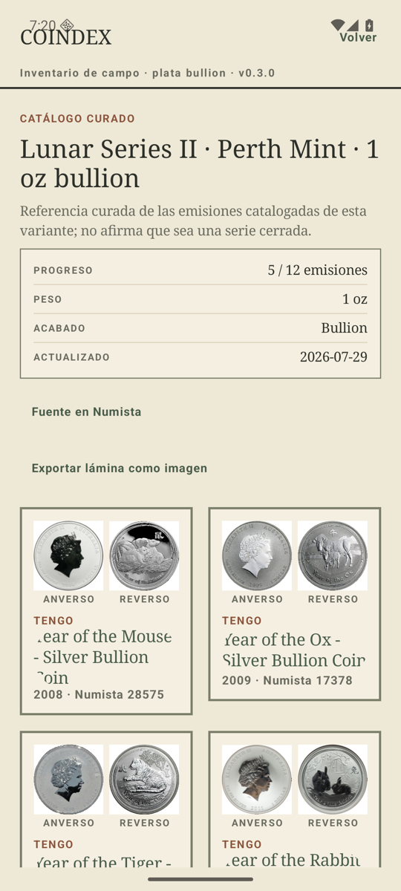
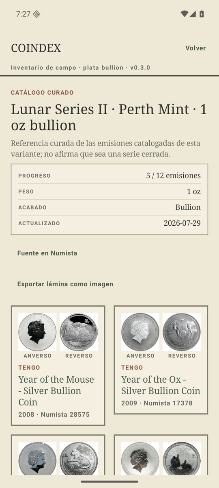
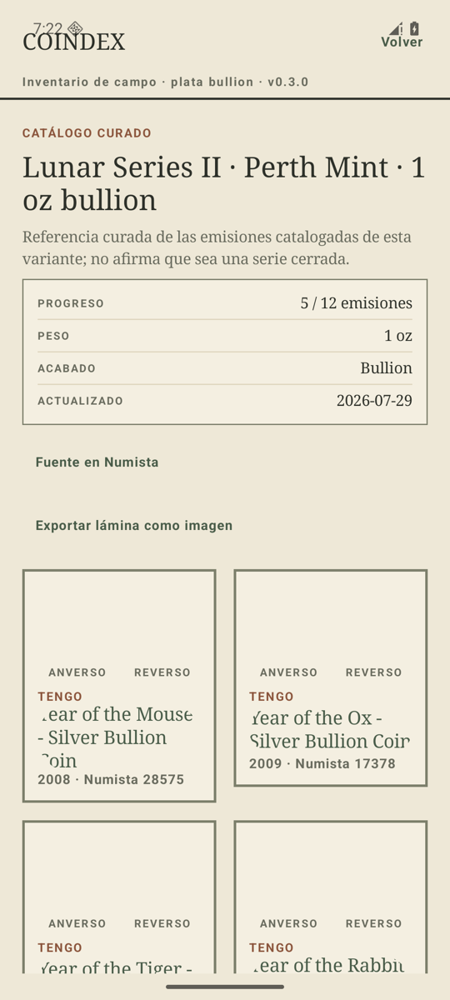
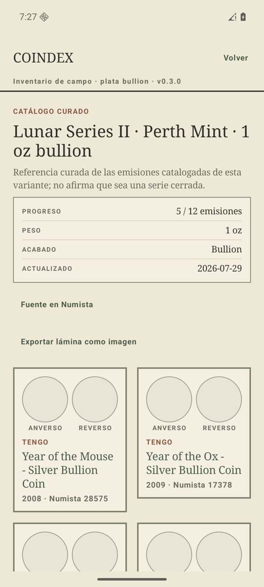
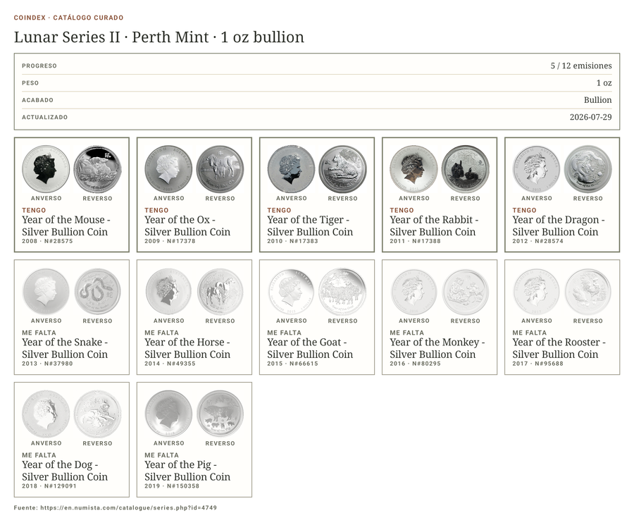
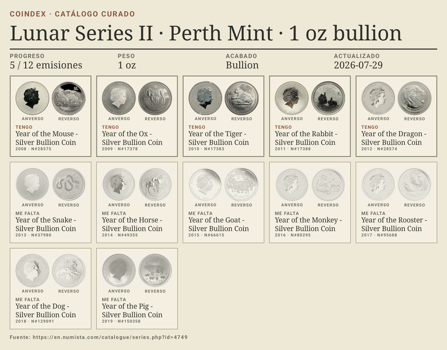
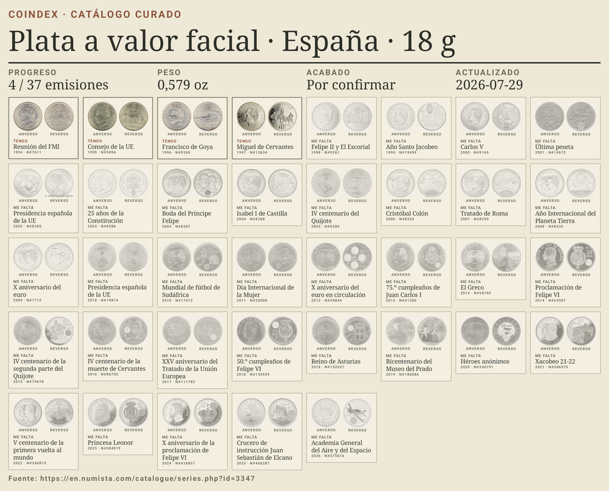

# Arreglos P0 de la revisión UX de julio de 2026

Los tres hallazgos bloqueantes de la revisión de la v0.3.0 —más un cuarto que salió al mirar la
lámina exportada—, con la evidencia de antes y después. Todas las capturas son del AVD
`coindex-ux` (pixel_7, android-36), con el mismo inventario sembrado y las animaciones
desactivadas.

## 1. El masthead vivía debajo de la barra de estado

Con `targetSdk 36` la ventana es edge-to-edge sin posibilidad de renunciar a ello, así que
«COINDEX» quedaba bajo el reloj y la barra de sistema se comía los taps dirigidos a «Volver»:
el botón se veía y no respondía. El `Masthead` aplica ahora `statusBarsPadding()`, pintando el
fondo de papel **antes** del padding para que la franja del inset siga leyéndose como página.

| Antes | Después |
| --- | --- |
|  |  |

## 2. Los títulos se recortaban dentro de los `TextButton`

Un `TextButton` con `contentPadding = 0` centra su etiqueta en una altura mínima fija y la
recorta a la forma del botón: los títulos en serifa perdían la primera y la última letra, y los
que ocupaban varias líneas perdían líneas enteras («Year of the Mouse - Silver Bullion Coin»
aparecía como dos líneas y media). Ahora hay un componente `LinkText`: el texto conserva sus
propias métricas y recibe el clic él mismo, con el área de toque ampliada por el padding.

Sustituido en las tarjetas del índice, en las celdas de lámina y en «Ver en Numista» de la
pantalla de sin clasificar.

| Antes | Después |
| --- | --- |
|  |  |

## 3. Una imagen que no llegaba dejaba la celda en blanco

`AsyncImage` no tenía `placeholder` ni `error`, así que sin red — o con una URL muerta — la
celda quedaba vacía y la lámina dejaba de leerse como una colección. La silueta que ya existía
para los tipos sin imágenes cacheadas espera ahora detrás de la imagen y se queda para siempre
si la imagen no llega; se retira al cargar, para que un PNG con transparencia no acabe sentado
sobre un círculo.

Las capturas son con la wifi y los datos apagados y la caché de disco de Coil borrada.

| Antes | Después |
| --- | --- |
|  |  |

La exportación sigue esperando a cada imagen y la lámina completa sale con las doce emisiones,
incluidas Perro y Cerdo, que era donde la revisión vio los huecos.

## 4. La lámina exportada no tenía página

Al mirar la lámina exportada apareció un cuarto problema, no listado en la revisión: el PNG
**salía sin fondo**. `PlateSheetExport` aplicaba `background(Paper.paper)` *antes* de
`recordInto`, y `recordInto` graba `drawContent()`, es decir solo lo que viene después en la
cadena: el papel se pintaba en pantalla y nunca entraba en el `Picture`. Cada visor rellenaba
la transparencia con lo que quisiera —blanco, negro— y las tarjetas, que son blanco translúcido,
quedaban flotando en grises que no eran de nadie. El papel se pinta ahora dentro de `PlateSheet`,
donde `recordInto` lo alcanza.

Con la página resuelta quedaban dos cosas propias de una hoja impresa y no de una pantalla:

- **La cabecera era letra pequeña.** El tipo estaba dimensionado para un móvil de 411dp y la
  hoja mide varias veces eso, así que el título y la ficha se leían como notas al pie. `SheetLayout`
  expone ahora un `headerScale` proporcional al número de columnas, y la ficha dejó de ser la
  tarjeta de filas a todo lo ancho —que separaba cada etiqueta de su valor por media hoja— para
  ser una tira de columnas donde cada par sigue junto.
- **El blanco de estudio de cada foto.** Un rectángulo blanco sobre papel crema es lo único que
  delata que la lámina es una captura y no una página. Cada foto se multiplica ahora por el color
  sobre el que está montada, que mapea ese blanco exactamente al de la tarjeta y deja la moneda
  donde estaba. Solo en la lámina exportada: en pantalla no se ha tocado.

| Antes | Después |
| --- | --- |
|  |  |

La cabecera escala con la hoja, así que un catálogo de 37 emisiones a ocho columnas sigue
teniendo un título proporcionado:

## Lo que queda fuera

Los P1 de la revisión siguen abiertos: no hay sistema de botones (casi todo son enlaces de
texto sin affordance), «Volver» se muestra también en la raíz, no existe pantalla de ajustes
—`signOut`/`setBudgetCap` no tienen UI, así que tras un 401 no hay salida— y el resultado del
sync solo vive en un snackbar efímero.

La verificación de estos tres arreglos es visual: el proyecto no tiene arnés de test de Compose
(la suite es JVM pura, sin Robolectric ni `androidTest`), y el recorte de texto y los insets no
son observables desde la semántica. Montar ese arnés es trabajo aparte.
