# Arreglos P1 de la revisión UX de julio de 2026

Los cuatro hallazgos P1 de la revisión de la v0.3.0, con la evidencia de antes y después. Todas
las capturas son del AVD `coindex-ux` (pixel_7, android-36), con el mismo inventario sembrado
—Lunar Series II seguida, Koala y Tudor Beasts disponibles, dos piezas sin ficha— y las
animaciones desactivadas. Los P0 están en [`p0-jul-2026.md`](p0-jul-2026.md).

## 1. Las acciones no parecían accionables (#4)

Toda acción secundaria era un `TextButton` sin borde ni fondo, y como el tema fuerza
`primary = ink` el texto del botón tenía exactamente el color del texto normal: la única pista
era la negrita sans. Hay ahora tres niveles, en `FieldGuide.kt`:

1. `PrimaryAction` — relleno tinta, rectangular. Una por pantalla.
2. `CardAction` — `OutlinedButton` compacto con borde `hairline`, para las acciones de tarjeta.
3. `LinkText` / `ExternalLink` — moss **subrayado**; el subrayado es lo que separa el enlace de
   la prosa ahora que el color no puede, y la «↗» de `ExternalLink` avisa de que eso abre el
   navegador y no otra página del cuaderno. El espacio anterior a la flecha es duro, para que un
   título que se parte no deje la flecha sola.

El hueco entre tarjetas apiladas sube de 16 a 26 dp (`PlateMetrics.cardStack`): con las
acciones pegadas al borde inferior de una tarjeta y el título de la siguiente justo debajo, un
pulgar que iba a «Ignorar» podía caer en la tarjeta de abajo —le pasó a la propia revisión.

| Antes | Después |
| --- | --- |
| 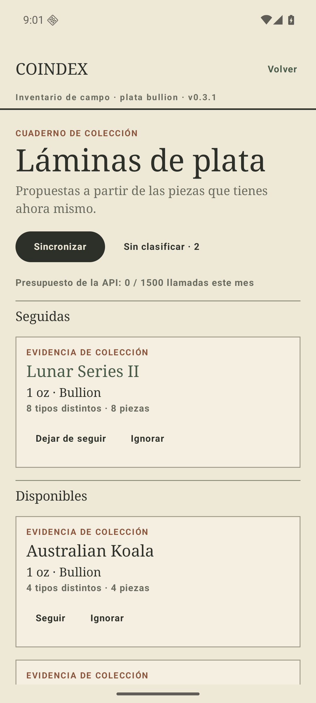 | 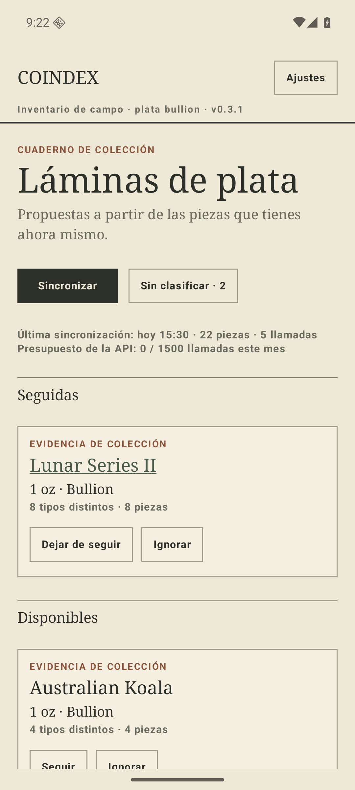 |

«Exportar lámina como imagen» —la acción estrella según la spec— era un texto verde que se leía
como un rótulo de sección. Sube a acción principal, con la marca de compartir dibujada a mano
(`ShareGlyph`) en lugar de importar el pack de iconos de Material, que sería la única pieza de
iconografía Material en un cuaderno hecho de reglas y círculos.

| Antes | Después |
| --- | --- |
| 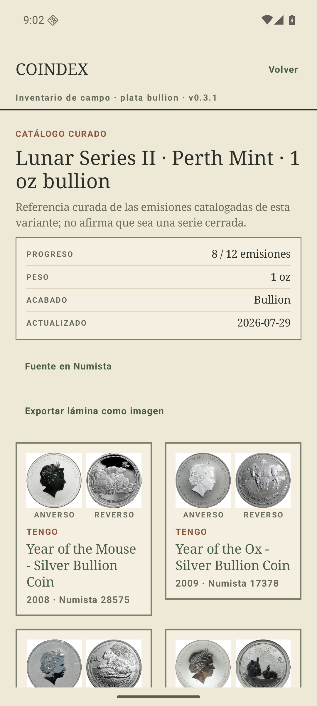 | 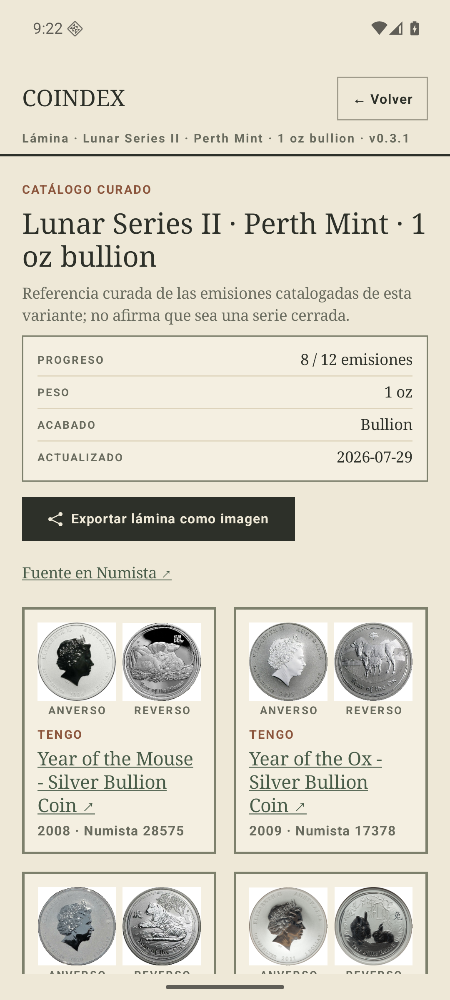 |

## 2. «Volver» en la raíz y masthead sin contexto (#5)

El masthead pintaba «Volver» siempre, también en el índice, donde `popBackStack()` es un no-op:
un botón permanente que a veces no hace nada enseña a ignorarlo. Ahora el masthead observa
`currentBackStackEntryAsState()` y solo pinta «← Volver» donde hay algo debajo; en la raíz ese
hueco lo ocupa el acceso a **Ajustes**. El subtítulo nombra la pantalla actual (`screenTitle`),
y la lámina dice cuál es.

| Antes | Después |
| --- | --- |
|  |  |
|  | 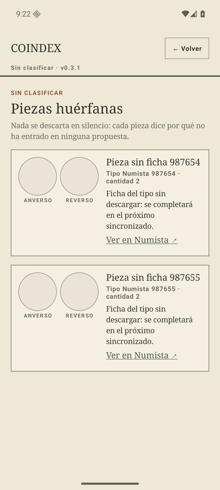 |

## 3. Credenciales y presupuesto atrapados tras el onboarding (#6)

`signOut()` y `setBudgetCap()` existían en el ViewModel y ninguna UI los llamaba: si la API key
caducaba o se tecleaba mal, la única salida era borrar los datos de la app —y con ellos la
colección ya sincronizada. Hay una pantalla de ajustes con API key (enmascarada, con
interruptor de visibilidad, porque el copy del alta promete que se guarda cifrada),
identificador, techo de presupuesto, versión instalada y cierre de sesión.

| Ajustes | API key visible |
| --- | --- |
| 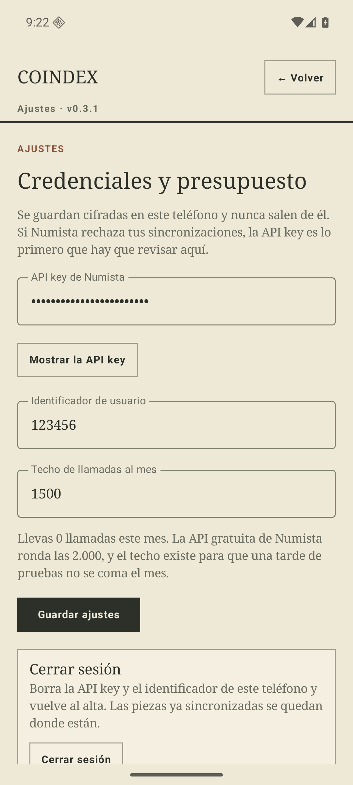 | 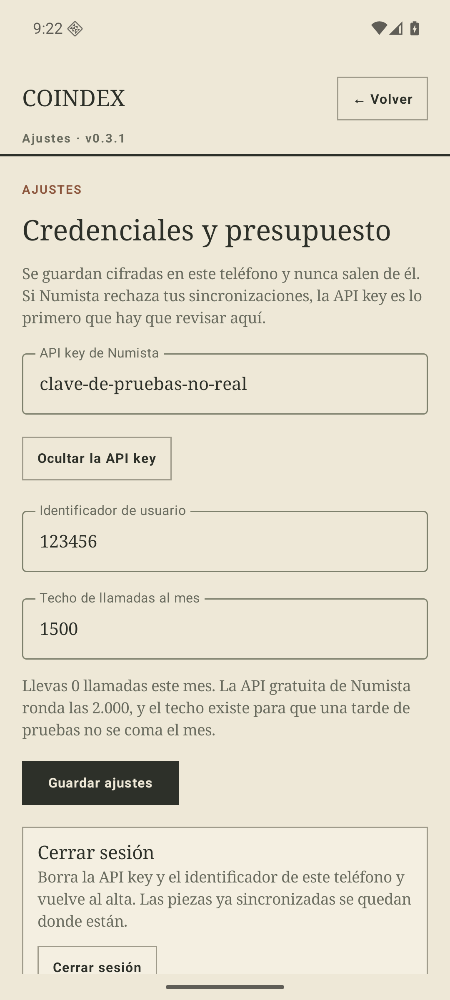 |

Los errores de sincronización se traducen a lo que el coleccionista puede hacer
(`syncErrorLabel`). «Numista devolvió HTTP 401 en /oauth_token» es cierto e inútil: el problema
es una key que ya no vale y la salida es la pantalla de ajustes. Lo genuinamente inesperado
conserva su texto original en vez de aplanarse en una amabilidad vacía.

| Antes | Después |
| --- | --- |
| 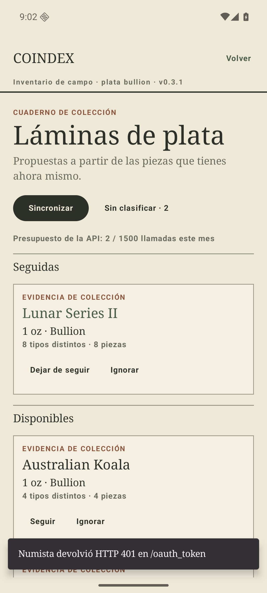 | 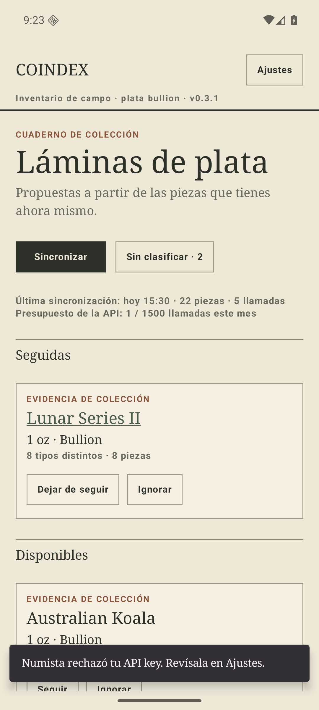 |

## 4. El resultado del sync se evaporaba (#7)

El informe vivía solo en un snackbar de cuatro segundos: no quedaba constancia de cuándo fue la
última sincronización ni de si quedó incompleta. `SyncRecord` se persiste en preferencias
—`SyncLog`— y el índice lo muestra bajo el botón; el día se nombra («hoy», «ayer») solo mientras
es obvio, y se data a partir de ahí.

| Antes | Después |
| --- | --- |
|  |  |

Un sync incompleto deja una tarjeta persistente en vez de un aviso fugaz: lo que quedó a medias
es una propiedad de la colección que estás mirando, no una noticia de hace cuatro segundos.

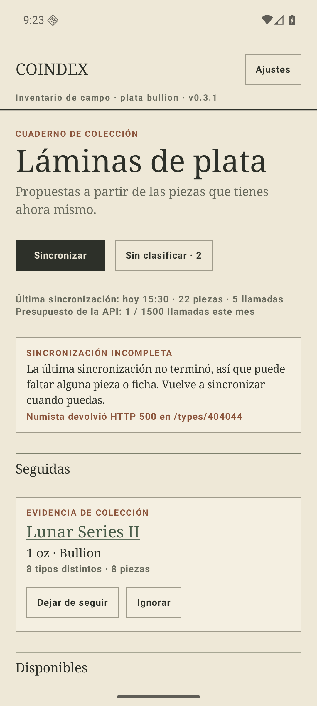

En el alta, `state.message` se pintaba a la vez inline y en snackbar, y al descartarse el
snackbar el texto inline desaparecía también. Son dos canales distintos: `validation` es del
formulario y se queda hasta el siguiente envío, `message` es del snackbar y se consume al
mostrarse. Las dos capturas son **seis segundos** después de pulsar «Guardar y empezar» con los
campos vacíos.

| Antes | Después |
| --- | --- |
| 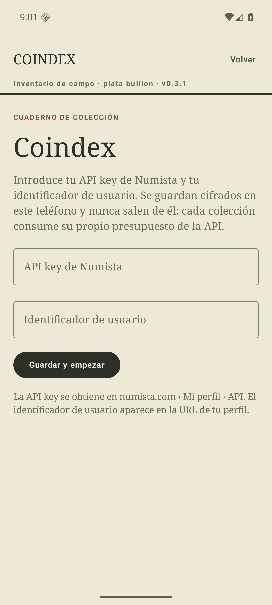 | 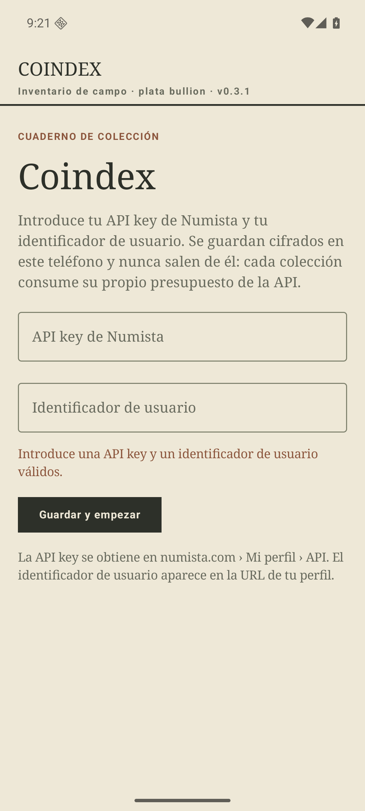 |

## Qué queda

El P2 (#8): eyebrows repetidos, `dashed` que no es dashed, date runs redundantes y el grid en
apaisado.
